# 評価的専門性を渡す（ギルド知識のダウンロード）

> 教師の専門性は「子どもの作品を評価できること」ではなく、「評価する力を子どもへ渡す方法を知っていること」にある。質を見る目そのものを、学習者の手に移す。

## 背景（Context）

熟練した教師は、子どもの作文やノートや発表を見た瞬間に「これはいい」「ここが惜しい」と分かる。この判断はかなり安定していて、同僚と作品を交換しても、共同で見取りをしても、おおむね一致する。サドラー（1989）はこれを **ギルド知識（guild knowledge）** ——同業組合の中で共有されている、腕のある者だけが持つ知識——と呼んだ。

ところがこの知識は、教師の頭の中にほとんど言語化されないまま置かれている。サドラーの表現では「largely in unarticulated form, inside their heads as tacit knowledge（ほとんど言語化されない形で、暗黙知として頭の中に）」ある。だから教師は「何を見ているのか正確に述べるのは難しいが、目の前に良い作品が現れれば見分けるのに苦労はしない」という状態になる。

形成的評価が最終的に目指すのは、学習者が自分で自分の作品の質を判断できるようになること（[[パタン/自己内フィードバック]]）である。そのためには、まず「質とは何か」という概念を学習者が持たなければならない。持っているのは教師だ。ならば、それを渡す経路がいる。

## 問題（Problem）

**教師がどれだけ妥当で正確なフィードバックを返しても、学習者の改善が起きないことがある。** 判断が正しいことと、その判断が学習者に伝わり使われることは別だからだ。

質の概念が教師の頭の中だけにあるとき、二つのことが起こる。

第一に、教師は自分の判断を「他と比べて」下すことになる。サドラーは、教師が作品の束を見渡してから成績をつける実践を指摘する。この見渡しが「ここではこれくらいが可、これくらいが優」というゆるやかな基準線をつくる。しかしこのやり方は、順位づけと比較を正当化してしまう。**順位や比較を強調するあらゆる評定法は、形成的な目的には無関係である。** 学習者一人ひとりの目的は「他の子を上回ること」ではなく「ある絶対的な意味での熟達を得ること」だからだ。

第二に、ギルド知識は質の概念を学習者の手の届かないところに置き続け、**作品の良し悪しについての判断を教師に依存する状態を維持してしまう。** 子どもは「先生に見てもらわないと、これがいいのか分からない」と言う。教師の判断が唯一の情報源であり続ける。この状態では、教師がいない場面では学習が止まる。

問いはこうなる——教師の頭の中にある卓越性（excellence）の概念を、どうやって外に取り出し、何らかの形を与え、学習者が使えるところに置くか。サドラーはこれを「a nontrivial problem（決してささいでない問題）」と書いている。

## 力のかたち（Forces）

- **判断の正確さ vs 判断の伝達可能性**：教師の評価が正確であるほど「自分が見てやればよい」という構えになりやすい。しかし正確な判断は、それ自体では学習者の中に何も残さない
- **暗黙知の効率 vs 明示化のコスト**：言語化されていないからこそ、教師の判断は速く、多くの規準を同時に扱える。言葉にしようとすると痩せる。しかし言葉にしなければ渡せない
- **定義して渡す vs 例で渡す**：規準を定義すれば伝達は速いが、定義できる部分しか渡らない。実例を浴びせれば豊かに伝わるが、時間がかかる
- **教師の権威 vs 学習者への委譲**：評価は教師の専門職性の中核であり、教師を子どもや保護者から区別するものでもある。評価を手放すことは、権威を手放すことのように感じられる
- **「評価は高度だ」という思い込み vs 子どもの実際**：ブルーム（1956）のタキソノミーで評価が認知的技能の最上位に置かれていることから、「評価は大人や専門家だけの営みだ」という印象が生まれている。しかし実際には、子どもは学校の外で日常的に評価活動をしており、求めれば素朴ではあるが筋の通った判断理由を述べられる
- **時間の制約 vs 遠回りの価値**：評価的専門性を渡す活動は単元の進度を食う。しかし渡しきれば、その後のフィードバックのコストが下がる

## 解決（Solution）

**教師のギルド知識を学習者へ「ダウンロード」する経路を、指導システムの中に明示的に設計する。教師の専門性の定義そのものを、「学習者の作品を評価できること」から「評価的な知識を学習者へ渡す方法を知っていること」へ移す。**

サドラーの最も強い一文は、論文の終盤に置かれている。

> If anything, the guild knowledge of teachers should consist less in knowing how to evaluate student work and more in knowing ways to download evaluative knowledge to students.
> （むしろ教師のギルド知識は、学習者の作品をどう評価するかを知ることよりも、評価的知識を学習者へどう渡すかを知ることに存するべきである。）

ここで「渡す」は「定義して教える」ではない。サドラーは、評価的知識は **caught（うつるもの）** であって **defined（定義されるもの）** ではない、という立場をとる。すでに目利きである人の指導のもとで、評価活動そのものに長く直接関わることによって、帰納的に育っていく。ポランニーの徒弟論が引かれている。

> the apprentice unconsciously picks up the rules of the art... Connoisseurship can be communicated only by example, not by precept.
> （徒弟は無意識のうちに技の規則を身につける……目利きは教訓によってではなく、例によってのみ伝えられる。）

したがって設計の要点は三つになる。**(1) 質の実例を学習者の前に置くこと**、**(2) 学習者自身に評価をやらせること**、**(3) 目利きである教師がその隣にいること**。この三つが揃った活動を、単元のどこに何回置くかを決める。

渡し方の主な経路は次のとおり。

- **記述文（descriptive statements）で外に出す**——「ある水準の作品はどんな性質を持つか」を言葉で書く。ただし記述文だけでは足りない
- **実例（exemplars）で外に出す**——同じ水準の作品を **複数** 見せる。一つでは「これを真似ればいい」になるが、複数あれば「表面は違うのに、どちらも良いとされる」ことに気づかざるを得ない。ここから学習者は、表面の違いを越えて働いている質を抽象する（[[パタン/実例を比べて分析する]]）
- **規準を出し入れして意識化する**——今この作品で何に注意を向けるかを操作する（[[パタン/潜在規準と顕在規準（規準の浮き沈み）]]）
- **仲間の作品を評価する経験を積ませる**——他人の作品への判断は、自分の作品への判断より先に育つ（[[パタン/ピアフィードバック]]）

そして学習者の立場を、作品を提出して評価を受け取る **消費者（consumers）** から、質の基準がどう働いているかを内側から知る **内部者（insiders）** へと移す。

---

### 具体例1：作文の「良さ」を、定義せずに三本の実例から取り出す

四年生の「読んで考えたことを書く」の単元。教師は最初の時間に、めあてを板書する前に、過去の児童作品（匿名にし、本人の許可を得たもの）を三本配る。三本とも教師が「良い」と考えている作品だが、書きぶりはまるで違う。一本は本文からの引用が多く、一本は自分の体験と結びつけ、一本は疑問で終わっている。

教師は「どれがいちばん良いですか」とは聞かない。聞くのは **「この三本に共通して良いところは何ですか」** である。

子どもたちは最初「くわしい」「長い」と表面をなぞる。教師はそこで評価せず、「三本とも当てはまる？」とだけ返す。二本にしか当てはまらない意見は自然に落ちていく。二十分ほどで、「自分がどう思ったかが書いてある」「なぜそう思ったかが本文から言える」という二つが残った。

教師はこれを板書し、「今日からこの二つを、みんなが原稿を見るときの目にします」と告げる。教師が最初から示せば三十秒で済んだ規準である。しかし三十秒で渡された規準は、子どもにとって「先生が言ったこと」でしかない。四十分かけて自分たちで取り出した規準は、次の時間から子ども自身の目になる。

---

### 具体例2：教師の判断を先に言わない——自己評価を先、教師評価を後に

六年生の算数。説明の記述問題を返却する場面で、教師はいつも赤ペンのコメントを先に書いていた。子どもはコメントだけ見て、直して、また出す。半年やっても、コメントなしでは何も判断できないままだった。

やり方を変えた。返却時、教師の判定は伏せておく。まず子どもが自分の答案を見て、**「自分の説明は、読んだ人が同じ手順で解けるか」** の一点だけで A・B・C を自分でつける。理由も一行書く。それから教師の判定を開く。

A児は自分を A とし、教師は B としていた。ずれた理由を確かめると、A児は「式が全部書いてあるから」と考え、教師は「なぜその式にしたかが書かれていないと、読んだ人は同じ手順にたどり着けない」と考えていた。ここで教師が伝えているのは、答案の直し方ではなく **判断の仕方** である。判定のずれは失敗ではなく、ギルド知識が受け渡される最良の場面になる。

数か月後、自己評価と教師評価の一致率は上がっていった。一致するようになったということは、教師の頭の中にあった目盛りが、子どもの中に写ったということだ。

---

### 具体例3：「評価するのは先生の仕事」という思い込みを外す

サドラーは、自己モニタリングが育たない理由のひとつに、教師の側の懸念を挙げている。評価は自分たちが専門職として獲得してきた特別な知識と技能の一部であり、それを子どもに開いてしまうと教師の権威が損なわれるのではないか、という不安である。

一方で、子どもは学校の外では絶えず評価している。「今日の給食はいまいちだった」「この動画はここが面白い」「あのチームのパスはうまい」。理由を聞けば、素朴ではあるが筋の通った理由を返す。評価が高度な認知的技能の頂点にあるという分類は、この事実を見えなくしてしまう。

学期はじめの学級開きで、教師が扱う題材を教科から外してみる。「先週見たテレビ番組で、面白かったものとそうでもなかったものを一つずつ。理由は『どこが』まで言うこと」。子どもは平気で言う。そこで教師はこう言う——「今、みんなは評価をした。同じことを、自分たちの作文や算数の説明でもやります」。

評価を学習者に渡すことは、教師の専門性を手放すことではない。サドラーが言うように、教師の責任の一部は、まさにその評価的知識をダウンロードして、学習者が最終的に教師から独立し、自分の成長に自ら関わり監視できるようにすることにある。

---

### 特別支援の視点：ギルド知識は「見えない期待」として最も強く働く

暗黙のままの規準は、暗黙の社会的文脈を読み取ることに困難がある子どもに、最も重くのしかかる。「もっとくわしく」「もう少していねいに」という言葉は、教師の頭の中の基準を共有している子には十分な指示になるが、共有していない子には何の情報にもならない。「くわしい」がどの程度なのかが、どこにも書かれていないからである。

したがって、実例を複数示すこと、規準を一つに絞って言葉と実物の両方で示すこと、判断の理由を口に出すことは、特別支援の観点では **合理的配慮そのもの** である。ただし注意点がある。実例を一本だけ示すと、その一本を丸ごと再現しようとする子がいる。サドラーが「単一の実例はそもそも基準を伝えるのに不十分だ」と述べている理由は、ここでも当てはまる。**必ず複数示し、「どちらも良い」と言い切る**ことが、模倣を質の抽象へ変える。

また、模倣そのものを恐れる必要はない。サドラーは、たとえ子どもが実際に写したとしても、その過程で価値あるものを学ぶことがあり、模倣（emulation）は古くからのほぼ普遍的な学習方法だと書いている。教師の仕事は、写すことを禁じることではなく、写すことから得られるものを得きったところで **そこから引き離す（wean them away）** ことである。

## 結果（Consequences）

**利点**

- **フィードバックが効き始める**——質の概念を持たない学習者にとって、教師のコメントは解読できない記号である。概念が渡された後は、同じコメントが情報として働き出す
- **教師依存から抜ける**——「先生に見てもらわないと分からない」が「自分で見当がつく、迷ったら聞く」に変わる。[[パタン/自己内フィードバック]] への移行の前提条件が満たされる
- **比較ではなく絶対的な熟達へ向かう**——質の概念が学習者の手にあれば、判断の基準は「他の子より上か」ではなく「この作品はこの規準を満たすか」になる
- **教師の負荷が中長期で下がる**——最初は時間を食うが、学習者が自分で第一次の判断をするようになると、教師が引き受ける判断の量そのものが減る
- **教師の専門性が明確になる**——「評価が上手い」から「評価の仕方を渡すのが上手い」へ。後者は同僚と共有・継承できる技術になる

**注意点・リスク**

- **定義して渡そうとすると痩せる**——規準を言葉に落とし込むほど、扱いやすくなるかわりに、判断の生きた部分が抜ける。言葉は必ず実例とセットで渡す
- **実例が一本だと模倣になる**——上の特別支援の段落のとおり。単一の実例は「基準」ではなく「型」として受け取られる
- **公開の同意が要る**——子どもの作品を実例として使うときは、本人の同意と匿名化を必ず取る。良い例としての使用であっても、本人が特定される形で提示されることを望まない場合がある
- **評価を渡すことと放任は違う**——「自分たちで決めなさい」だけでは何も渡らない。目利きが隣にいて、判断を口に出し、ずれを扱う場面が要る
- **教師自身がギルド知識を持っていない領域がある**——自分がその領域の目利きでないとき、渡すべきものがない。まず教師が実例を集めるところから始める（[[パタン/エクセレンスの収集家]]）
- **成績評価との緊張**——自己評価を成績に直結させると、子どもは判断を戦略的に歪める。渡すための評価と、認定のための評価は場面を分ける

## 関連パタン

- [[パタン/潜在規準と顕在規準（規準の浮き沈み）]] — ギルド知識を渡す具体的な機構。どの規準を今この場で意識させるかを設計する
- [[パタン/制作しながら質を判断する（産出中のモニタリング）]] — 渡された評価的専門性が実際に働く場面。作っている最中に自分で質を見る
- [[概念/質的判断（曖昧な規準とメタ規準）]] — 渡そうとしている知識の中身。公式に還元できない判断とは何か
- [[パタン/形成的評価]] — 上位。評価を学習を育てるために使う営み全体の中で、本パタンは「評価する力そのものを渡す」部分を担う
- [[パタン/到達レベルの自己評価]] — 渡した専門性を学習者が実際に行使する場面。自己評価を先、教師評価を後にする手順
- [[パタン/自己内フィードバック]] — 目的地。外からのフィードバックが要らなくなる状態
- [[パタン/実例を比べて分析する]] — ギルド知識を渡す最も具体的な手段。言葉で定義せず実例の比較から基準を引き出す
- [[パタン/エクセレンスの収集家]] — 質の感覚を育てる素材の蓄積。渡すべきものを教師自身が集める
- [[パタン/思考や表現のよさを問う]] — 「この考えのよさはどこか」という問いが評価的な語彙を育てる
- [[パタン/ピアフィードバック]] — 仲間の作品を評価する経験が、自分の評価的専門性を育てる主要な経路になる
- [[パタン/非可視の教師]] — 教師が唯一の判断者でなくなること。本パタンは「消えた教師のかわりに何を学習者へ渡しておくか」を扱う
- [[パタン/段階的手放し]] — 手放しの対象を「作業の遂行」でなく「質の判断」に取ったもの
- [[概念/教育評価論]] — アイスナーの教育的鑑識眼（connoisseurship）とサドラーのギルド知識論の接続点
- [[パタン/フィードバック]] — 上位のハブ。本パタンは、フィードバックが最終的に不要になる状態へ向けて何を渡すかを扱う
- [[パタン/最適なギャップ（願望水準の交渉）]] — 距離を測るには質の概念が要る。本パタンがその測る力を渡し、あちらが測った距離の使い方を扱う
- [[パタン/評定（成績評価）]] — 成績という暗号のかわりに、判断の根拠そのものを学習者へ渡す

- [[パタン/理解のしるしを読む（fit と match）]] — 教師の質の概念を子どもへ渡す方向に対し、子どもの概念を教師が読む逆方向。同じズレの両側
- [[パタン/聴き方を変える（評価的・解釈的・解釈学的）]] — 子どもが教師のヴィジョンを共有する前に、教師が子どものヴィジョンを聴けている必要がある。順序として先に来る
- [[パタン/評点なしで返す（コメントだけの一巡）]] — 暗号としての評点を外した後、その場所に判断の根拠を置く
- [[パタン/見取ったあとの手を決めておく（データ利用のルール化）]] — 同型の操作を教師どうしの間で行うもの。閾値と手立てを書くことは自分の暗黙知を渡せる形にすることでもある

## クラスター図

```mermaid
flowchart LR
    ne8a995e4bea1e79a84e5b082e99680e680a7e38292e6b8a1e38199efbc88e382aee383abe38389e79fa5e8ad98e381aee38380e382a6e383b3e383ade383bce38389efbc89["評価的専門性を渡す（ギルド知識のダウンロード）"]
    ne6bd9ce59ca8e8a68fe6ba96e381a8e9a195e59ca8e8a68fe6ba96efbc88e8a68fe6ba96e381aee6b5aee3818de6b288e381bfefbc89["潜在規準と顕在規準（規準の浮き沈み）"]
    ne588b6e4bd9ce38197e381aae3818ce38289e8b3aae38292e588a4e696ade38199e3828befbc88e794a3e587bae4b8ade381aee383a2e3838be382bfe383aae383b3e382b0efbc89["制作しながら質を判断する（産出中のモニタリング）"]
    ne5bda2e68890e79a84e8a995e4bea1["形成的評価"]
    ne588b0e98194e383ace38399e383abe381aee887aae5b7b1e8a995e4bea1["到達レベルの自己評価"]
    ne887aae5b7b1e58685e38395e382a3e383bce38389e38390e38383e382af["自己内フィードバック"]
    ne5ae9fe4be8be38292e6af94e381b9e381a6e58886e69e90e38199e3828b["実例を比べて分析する"]
    ne382a8e382afe382bbe383ace383b3e382b9e381aee58f8ee99b86e5aeb6["エクセレンスの収集家"]
    ne6809de88083e38284e8a1a8e78fbee381aee38288e38195e38292e5958fe38186["思考や表現のよさを問う"]
    ne38394e382a2e38395e382a3e383bce38389e38390e38383e382af["ピアフィードバック"]
    ne99d9ee58fafe8a696e381aee69599e5b8ab["非可視の教師"]
    ne6aeb5e99a8ee79a84e6898be694bee38197["段階的手放し"]
    ne38395e382a3e383bce38389e38390e38383e382af["フィードバック"]
    ne69c80e981a9e381aae382aee383a3e38383e38397efbc88e9a198e69c9be6b0b4e6ba96e381aee4baa4e6b889efbc89["最適なギャップ（願望水準の交渉）"]
    ne8a995e5ae9aefbc88e68890e7b8bee8a995e4bea1efbc89["評定（成績評価）"]

    ne8a995e4bea1e79a84e5b082e99680e680a7e38292e6b8a1e38199efbc88e382aee383abe38389e79fa5e8ad98e381aee38380e382a6e383b3e383ade383bce38389efbc89 --- ne6bd9ce59ca8e8a68fe6ba96e381a8e9a195e59ca8e8a68fe6ba96efbc88e8a68fe6ba96e381aee6b5aee3818de6b288e381bfefbc89
    ne8a995e4bea1e79a84e5b082e99680e680a7e38292e6b8a1e38199efbc88e382aee383abe38389e79fa5e8ad98e381aee38380e382a6e383b3e383ade383bce38389efbc89 --- ne588b6e4bd9ce38197e381aae3818ce38289e8b3aae38292e588a4e696ade38199e3828befbc88e794a3e587bae4b8ade381aee383a2e3838be382bfe383aae383b3e382b0efbc89
    ne8a995e4bea1e79a84e5b082e99680e680a7e38292e6b8a1e38199efbc88e382aee383abe38389e79fa5e8ad98e381aee38380e382a6e383b3e383ade383bce38389efbc89 --- ne5bda2e68890e79a84e8a995e4bea1
    ne8a995e4bea1e79a84e5b082e99680e680a7e38292e6b8a1e38199efbc88e382aee383abe38389e79fa5e8ad98e381aee38380e382a6e383b3e383ade383bce38389efbc89 --- ne588b0e98194e383ace38399e383abe381aee887aae5b7b1e8a995e4bea1
    ne8a995e4bea1e79a84e5b082e99680e680a7e38292e6b8a1e38199efbc88e382aee383abe38389e79fa5e8ad98e381aee38380e382a6e383b3e383ade383bce38389efbc89 --- ne887aae5b7b1e58685e38395e382a3e383bce38389e38390e38383e382af
    ne8a995e4bea1e79a84e5b082e99680e680a7e38292e6b8a1e38199efbc88e382aee383abe38389e79fa5e8ad98e381aee38380e382a6e383b3e383ade383bce38389efbc89 --- ne5ae9fe4be8be38292e6af94e381b9e381a6e58886e69e90e38199e3828b
    ne8a995e4bea1e79a84e5b082e99680e680a7e38292e6b8a1e38199efbc88e382aee383abe38389e79fa5e8ad98e381aee38380e382a6e383b3e383ade383bce38389efbc89 --- ne382a8e382afe382bbe383ace383b3e382b9e381aee58f8ee99b86e5aeb6
    ne8a995e4bea1e79a84e5b082e99680e680a7e38292e6b8a1e38199efbc88e382aee383abe38389e79fa5e8ad98e381aee38380e382a6e383b3e383ade383bce38389efbc89 --- ne6809de88083e38284e8a1a8e78fbee381aee38288e38195e38292e5958fe38186
    ne8a995e4bea1e79a84e5b082e99680e680a7e38292e6b8a1e38199efbc88e382aee383abe38389e79fa5e8ad98e381aee38380e382a6e383b3e383ade383bce38389efbc89 --- ne38394e382a2e38395e382a3e383bce38389e38390e38383e382af
    ne8a995e4bea1e79a84e5b082e99680e680a7e38292e6b8a1e38199efbc88e382aee383abe38389e79fa5e8ad98e381aee38380e382a6e383b3e383ade383bce38389efbc89 --- ne99d9ee58fafe8a696e381aee69599e5b8ab
    ne8a995e4bea1e79a84e5b082e99680e680a7e38292e6b8a1e38199efbc88e382aee383abe38389e79fa5e8ad98e381aee38380e382a6e383b3e383ade383bce38389efbc89 --- ne6aeb5e99a8ee79a84e6898be694bee38197
    ne8a995e4bea1e79a84e5b082e99680e680a7e38292e6b8a1e38199efbc88e382aee383abe38389e79fa5e8ad98e381aee38380e382a6e383b3e383ade383bce38389efbc89 --- ne38395e382a3e383bce38389e38390e38383e382af
    ne8a995e4bea1e79a84e5b082e99680e680a7e38292e6b8a1e38199efbc88e382aee383abe38389e79fa5e8ad98e381aee38380e382a6e383b3e383ade383bce38389efbc89 --- ne69c80e981a9e381aae382aee383a3e38383e38397efbc88e9a198e69c9be6b0b4e6ba96e381aee4baa4e6b889efbc89
    ne8a995e4bea1e79a84e5b082e99680e680a7e38292e6b8a1e38199efbc88e382aee383abe38389e79fa5e8ad98e381aee38380e382a6e383b3e383ade383bce38389efbc89 --- ne8a995e5ae9aefbc88e68890e7b8bee8a995e4bea1efbc89

    classDef hub fill:#f0f0f0,stroke:#555,color:#000,font-weight:bold
    class ne8a995e4bea1e79a84e5b082e99680e680a7e38292e6b8a1e38199efbc88e382aee383abe38389e79fa5e8ad98e381aee38380e382a6e383b3e383ade383bce38389efbc89 hub
```

## Actionable Insight

- **次の単元の第1時に、良い実例を「三本」配る**——一本ではなく三本。書きぶりの違う三本を選び、「どれが一番いいか」ではなく「三本に共通して良いところは何か」を問う。子どもの言葉で出た二つを板書し、その単元の目にする
- **返却の順序を入れ替える**——教師の判定・コメントを伏せたまま返し、子どもが自分で判定と理由を書いてから、教師の判定を開く。ずれた子と「なぜずれたか」を一分話す。直し方ではなく判断の仕方を話す
- **自分のコメントを一週間分読み返し、「判断の理由」が書かれている割合を数える**——「よく書けています」「もう少しくわしく」は判断であって理由ではない。理由の書かれていないコメントを一つ選び、「なぜそう思ったか」を一文足して返してみる

## 出典

Sadler, D. R. (1989). Formative assessment and the design of instructional systems. *Instructional Science, 18*(2), 119–144.

> Teachers' conceptions of quality are typically held, largely in unarticulated form, inside their heads as tacit knowledge. （p.126）
> — 教師が持つ質の概念は、たいていほとんど言語化されない形で、暗黙知として頭の中に保持されている。

> Guild knowledge keeps the concept of the standard relatively inaccessible to the learner, and tends to maintain the learner's dependence on the teacher for judgments about the quality of performance. （p.127）
> — ギルド知識は基準の概念を学習者にとって比較的手の届かないものにしておき、作品の質についての判断を教師に依存する状態を維持しやすい。

> If anything, the guild knowledge of teachers should consist less in knowing how to evaluate student work and more in knowing ways to download evaluative knowledge to students. （p.141）
> — むしろ教師のギルド知識は、学習者の作品をどう評価するかを知ることよりも、評価的知識を学習者へどう渡すかを知ることに存するべきである。

> ...it ignores the fact that even young children (certainly in their hours out of school) continually engage in evaluative activity and, if asked, can often produce rudimentary but reasonably sound rationales for their judgments. （p.141）
> — （評価を大人や専門家だけの営みとみなす見方は）幼い子どもでさえ、少なくとも学校の外の時間には絶えず評価活動に関わっており、求めれば素朴ではあるが十分に筋の通った判断の理由を述べられるという事実を見落としている。

Polanyi, M. (1962). *Personal Knowledge: Towards a Post-Critical Philosophy*. Routledge & Kegan Paul.（Sadler, 1989, p.135 に引用）

> the apprentice unconsciously picks up the rules of the art... Connoisseurship can be communicated only by example, not by precept.
> — 徒弟は無意識のうちに技の規則を身につける……目利きは教訓によってではなく、例によってのみ伝えられる。

Bloom, B. S. (Ed.) (1956). *Taxonomy of Educational Objectives, Handbook I: Cognitive Domain*. David McKay.（Sadler, 1989, p.141 に言及）

Sadler, D. R. (1987). Specifying and promulgating achievement standards. *Oxford Review of Education, 13*(2), 191–209.（Sadler, 1989 が基準の外在化の詳細として参照）
