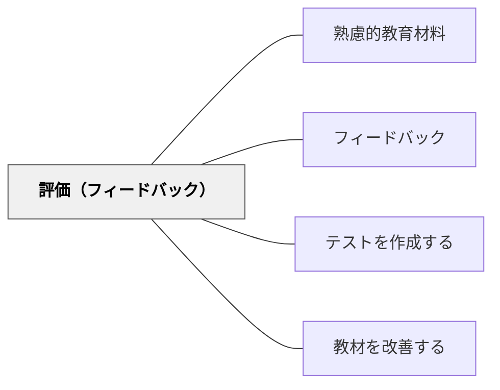

# 評価（フィードバック）

> 学習者の理解・パフォーマンスに対する適切なフィードバックが、学習の改善を促す。

## 背景（Context）

教材の内容要素としての「評価とフィードバック」。テストや課題への回答だけでなく、学習プロセス全体への情報提供（フィードバック）が学習の質を高める。形成的評価（学習中の改善）と総括的評価（学習後の判定）を区別し、形成的フィードバックを重視する。

## 問題（Problem）

フィードバックがなければ学習者は自分の理解が正しいか分からず、誤概念が定着してしまう。

## 力のかたち（Forces）

- 即時フィードバックが学習効果を高める
- 結果だけでなくプロセスへのフィードバックが深い学びを促す
- 過度な評価プレッシャーは動機を損なう

## 解決（Solution）

**学習の節目に形成的フィードバックを組み込む。正誤だけでなく「なぜ」「どう改善するか」を示すフィードバックを設計する。**

## 結果（Consequences）

- 学習者が自分の理解を調整できる
- 誤概念の早期発見・修正が可能になる

## 関連パタン

- [[パタン/熟慮的教材教具]] — 親パタン
- [[パタン/フィードバック]] — フィードバック設計全般
- [[パタン/テストを作成する]] — 評価の設計
- [[パタン/教材を改善する]] — フィードバックに基づく改善

## クラスター図

## Actionable Insight

- 正誤の結果だけでなく「なぜそうなるか」「どう改善するか」を示すフィードバックを設計する——プロセスへのフィードバックが深い概念理解と誤概念の早期修正を促す
- 学習プロセスの節目（課題提出前・中・後）に形成的フィードバックを組み込む——総括的評価の前に改善の機会があることが学習者の成長を支える
- 授業中に「自分の理解を確認できる」問いを1〜2問設け、その場で答え合わせをする——即時フィードバックが誤概念の定着を防ぐ最も効果的な手段になる

## 出典

- 鈴木克明（2002）『教材設計マニュアル――独学を支援するために』北大路書房
