# 評定（成績評価）

> AやBや1〜5という数値・記号で学習の到達度を表すことは、認定や序列化には便利だが、学習改善の情報としては乏しい。

## 背景（Context）

学校教育において、学習者の到達度を外部に示す必要がある。進級・進学・採用など、教育の外の文脈で「この学習者はどの程度の水準か」を伝える手段として評定が使われてきた。多くの教育制度がA〜E、1〜5などの記号・数値による成績評価の仕組みを持っている。

評定は教師・学習者・保護者・社会のあいだの共通言語として機能し、簡潔に情報を伝える利点がある。しかし同時に、その簡潔さゆえに多くの情報が失われる。

## 問題（Problem）

評定は学習の最終結果を一つの記号に圧縮するため、「何ができているか」「何がうまくいっていないか」「次にどうすればよいか」という学習改善に必要な情報をほとんど含まない。学習者は「Bだった」という結果を受け取っても、どう改善すればよいかを知ることができない。

また、評定は比較・序列化の道具として機能しやすく、学習者が学びそのものよりも「点数を取ること」「高い評定を得ること」に動機づけられてしまうリスクがある。これは深い学びを妨げ、失敗を恐れる文化を生む要因になりうる。

## 力のかたち（Forces）

- 外部への説明責任や進学・認定のために評定は社会的に求められている
- 評定の数値・記号は比較や序列化を促し、競争的な動機づけを生みやすい
- 評定だけでは何を改善すればよいかが伝わらず、形成的評価としての機能が低い

## 解決（Solution）

評定（成績評価）を使う際は、その目的を「認定・証明」に限定し、学習改善のためのフィードバックとしては使わないよう設計する。評定は総括的評価（Summative Assessment）として位置づけ、単元・学期末など一定のまとまりの終わりに用いる。

日常の学習プロセスには、評定を与えるのではなく[[パタン/記述式フィードバック]]や[[パタン/誤りフィードバック]]など具体的で行動可能な情報を返すことを優先する。「評定なしのフィードバック」の時間を意図的に設けることで、学習者は改善に集中できる。教師も評定と形成的フィードバックを明確に区別して運用することが重要である。

---

### 成績が形成的評価を殺す4つの経路——サドラーの分析

サドラー（1989）は、評定が形成的な目的に対してむしろ逆効果になりうる経路を具体的に挙げている。日本の小学校の通知表・単元テスト運用にもそのまま当てはまる。

**1. 成績は一方向の暗号になる**

評定は判断の結果だけを残し、その判断がどの規準にもとづいて下されたのかを消してしまう。学習者から見れば解読できない暗号であり、注意は根本的な判断とその規準から逸らされる。

> In any area of the curriculum where a grade or score assigned by a teacher constitutes a one-way cipher for students, attention is diverted away from fundamental judgments and the criteria for making them. A grade therefore may actually be counterproductive for formative purposes.
>
> （教師のつけた成績や点数が学習者にとって一方向の暗号となっているどの領域においても、注意は根本的な判断とその判断を下すための規準から逸らされる。したがって成績は、形成的な目的にとってはむしろ逆効果でありうる）——p.121

**2. 使われない情報はフィードバックではない**

ラマプラサド（1983）の定義をサドラーは重視する。ギャップに関する情報は、**そのギャップを変えるために使われたときにだけ**フィードバックと呼べる。単に記録されるだけ、あるいは変える力のない相手に渡されるだけなら、それは「宙ぶらりんのデータ（dangling data）」であって、制御のループは閉じていない。返却して終わりのテストは、この意味でフィードバックではない。

**3. 継続的評価が「累積的」になると形成的に働かない**

学期を通じて何度も評価する方式そのものは、一発勝負の不安を減らす利点がある。しかし、提出したもの一つひとつに点をつけて最後に合算する運用にすると、学習者には「点にならない作業はやる価値がない」という構えが育つ。作り直しは「損な選択」になり、長期的な卓越の追求が目先の得点の積み上げに置き換わる。

**4. 相対評価は絶対的な改善を見えなくする**

あらかじめ決めた分布に沿って成績を配分すると、実力が上がっても他者の位置次第で評定は動かない。改善そのものが記録されず、ゼロサムの競争と化して、全員の伸びという目標と相容れなくなる。

つまり、評定を形成的に使おうとするのではなく、**評定の目的を認定と証明に限定し、学習の途上ではそもそも成績を返さない時間を確保する**ことが、サドラーの分析から導かれる実践的な帰結になる。

### 実験的な裏づけ——「コメントに点数を添えると、コメントが消える」

サドラーの分析は理論的なものだが、ブラックとウィリアム（1998）がレビューした Butler の一連の実験は、それを数値で裏づけている。ここが評定というパタンにとって最も重い証拠である。

**Butler（1988）**——11歳の子ども48名に、同じ課題を3セッション行わせ、**コメントのみ／評点のみ／評点＋コメント**のいずれかを返した。

| 返し方 | 結果 |
| --- | --- |
| コメントのみ | 得点が**約3分の1上昇**し、その水準を維持した |
| 評点＋コメント | 3セッションを通じて**有意に低下** |
| 評点のみ | 低下 |

**Butler（1987）**——コメント／評点／称賛／フィードバックなしの4条件で、**コメント群だけが他の3群より1標準偏差高い**得点を示した。他の3群のあいだには有意差がなかった。

ここから読み取るべきことは二つある。

第一に、**「評点＋コメント」は「評点のみ」とほぼ同じ結果になる**。丁寧に書いたコメントが効かないのは、書き方が悪いからでも子どもがやる気を欠いているからでもない。同じ紙面に点数があると、注意はそちらへ行き、コメントは読まれないまま返却袋に入る。サドラーの言う「一方向の暗号」が、実測されたということである。

第二に、**低達成の子どもでは、評点を含むどの条件でも興味そのものが損なわれた**。高達成の子どもは3条件すべてで高い興味を保った。つまり評定の害は全員に等しく及ぶのではなく、**もともと苦しい子に集中する**。日本の通知表・単元テスト運用を点検するとき、まず見るべきはこの層である。

実務的な帰結は単純で、コストもかからない。**評点と質のことばを、時間的にも紙面的にも分ける**。まず評点なしでコメントを返し、直す機会を与え、評点は後から別の機会に渡す。詳しくは [[パタン/評点なしで返す（コメントだけの一巡）]]。

## 結果（Consequences）

- 評定の目的が明確になり、形成的評価との混同が減る
- 学習者が評定に過度に依存せず、プロセスに目を向けやすくなる
- 総括的評価として使う場面を絞ることで、評定の信頼性・妥当性が高まる

## 関連パタン

- [[パタン/フィードバック]] — 親パタン
- [[パタン/記述式フィードバック]] — 評定より豊かな情報を伝える手段
- [[パタン/意味のある具体的なフィードバック]] — 学習改善に直結するフィードバック
- [[パタン/フィードバック（進み具合はどうか）]] — 形成的フィードバックの設計
- [[パタン/評価的専門性を渡す（ギルド知識のダウンロード）]] — 成績という暗号のかわりに、判断の根拠そのものを学習者へ渡す（Sadler, 1989）
- [[文献/Formative Assessment and the Design of Instructional Systems（Sadler）]] — 成績が形成的目的に対して持つ逆効果を論じた原典（Sadler, 1989）
- [[文献/Assessment and Classroom Learning（Black & Wiliam）]] — Butler の実験によって「評点がコメントを消す」ことを実測した系統的レビュー（Black & Wiliam, 1998）
- [[パタン/評点なしで返す（コメントだけの一巡）]] — 本パタンの実践的帰結。評点と質のことばを時間的・紙面的に分ける
- [[概念/自我関与と課題関与（フィードバックが向ける先）]] — 評点が注意を「自分は賢いか」へ向けてしまう機序
- [[パタン/形成的評価]] — 対比となる評価の機能。診断としての比較のときだけ形成的に働く

- [[概念/教授学的契約（やり過ごしの均衡）]] — 累積的評定構造が「点にならない作業はやる価値がない」という構えを育てる
- [[パタン/四つの問いで作品を判断する]] — 評点をつけずに質を語る場面をつくる。認定の評価と分けて運用する
- [[概念/妥当性（スコアの意味についての評価判断）]] — 評定という「スコア」の意味と、それに基づく行為が妥当かを問う枠組み
- [[概念/帰結的妥当性（評価がもたらす結果まで問う）]] — 評定が子どもにもたらす結果まで含めて評価の質を問う。ただし悪い結果＝無効ではない
- [[パタン/採点の形を中身の形に合わせる（構造的忠実性）]] — 観点をどう合成して評定にするか。合計点方式が置いている暗黙の構造仮定
- [[パタン/一回できたことと続いていることを分ける（記録の列）]] — 成績表を書く前に「いま手にしているのは記録であって能力ではない」を確認する（岩井, 2026・第2巻）
- [[パタン/学級の文化と書く前に三つを揃える]] — 要録の「学級の実態」欄を書く前に揃える三つ
- [[パタン/余計な難しさを外す（構成概念に無関係な分散）]] — 評定が測りたい力以外のものを含んでいないか。低い評定の原因を切り分ける
- [[パタン/返したことと届いたことを分ける（返却の五段）]] — 評定を返した後、それがその子の中で何になったか。深く符号化された評点は五段の途中で止まりやすい
- [[パタン/検査質問を一つだけ持って教室に入る]] — 成績表に水準の言葉を書こうとして手が止まったときの問い
- [[パタン/隠れた前提を掘り出す（測る前に、測らない道を並べる）]] — 評定もまた測って分ける判断であり、書かれていない仮定の上に立っている（Kane, 1990）。記号に圧縮する前に、その判断が何と比べて選ばれたかを掘る

## クラスター図

```mermaid
flowchart LR
    ne8a995e5ae9aefbc88e68890e7b8bee8a995e4bea1efbc89["評定（成績評価）"]
    ne38395e382a3e383bce38389e38390e38383e382af["フィードバック"]
    ne8a898e8bfb0e5bc8fe38395e382a3e383bce38389e38390e38383e382af["記述式フィードバック"]
    ne6848fe591b3e381aee38182e3828be585b7e4bd93e79a84e381aae38395e382a3e383bce38389e38390e38383e382af["意味のある具体的なフィードバック"]
    ne38395e382a3e383bce38389e38390e38383e382afefbc88e980b2e381bfe585b7e59088e381afe381a9e38186e3818befbc89["フィードバック（進み具合はどうか）"]
    ne8a995e4bea1e79a84e5b082e99680e680a7e38292e6b8a1e38199efbc88e382aee383abe38389e79fa5e8ad98e381aee38380e382a6e383b3e383ade383bce38389efbc89["評価的専門性を渡す（ギルド知識のダウンロード）"]
    ne8a995e782b9e381aae38197e381a7e8bf94e38199efbc88e382b3e383a1e383b3e38388e381a0e38191e381aee4b880e5b7a1efbc89["評点なしで返す（コメントだけの一巡）"]
    ne5bda2e68890e79a84e8a995e4bea1["形成的評価"]
    ne59b9be381a4e381aee5958fe38184e381a7e4bd9ce59381e38292e588a4e696ade38199e3828b["四つの問いで作品を判断する"]
    ne68ea1e782b9e381aee5bda2e38292e4b8ade8baabe381aee5bda2e381abe59088e3828fe3819be3828befbc88e6a78be980a0e79a84e5bfa0e5ae9fe680a7efbc89["採点の形を中身の形に合わせる（構造的忠実性）"]
    ne4b880e59b9ee381a7e3818de3819fe38193e381a8e381a8e7b69ae38184e381a6e38184e3828be38193e381a8e38292e58886e38191e3828befbc88e8a898e98cb2e381aee58897efbc89["一回できたことと続いていることを分ける（記録の列）"]
    ne5ada6e7b49ae381aee69687e58c96e381a8e69bb8e3818fe5898de381abe4b889e381a4e38292e68f83e38188e3828b["学級の文化と書く前に三つを揃える"]
    ne4bd99e8a888e381aae99ba3e38197e38195e38292e5a496e38199efbc88e6a78be68890e6a682e5bfb5e381abe784a1e996a2e4bf82e381aae58886e695a3efbc89["余計な難しさを外す（構成概念に無関係な分散）"]
    ne8bf94e38197e3819fe38193e381a8e381a8e5b18ae38184e3819fe38193e381a8e38292e58886e38191e3828befbc88e8bf94e58db4e381aee4ba94e6aeb5efbc89["返したことと届いたことを分ける（返却の五段）"]
    ne6a49ce69fbbe8b3aae5958fe38292e4b880e381a4e381a0e38191e68c81e381a3e381a6e69599e5aea4e381abe585a5e3828b["検査質問を一つだけ持って教室に入る"]

    ne8a995e5ae9aefbc88e68890e7b8bee8a995e4bea1efbc89 --- ne38395e382a3e383bce38389e38390e38383e382af
    ne8a995e5ae9aefbc88e68890e7b8bee8a995e4bea1efbc89 --- ne8a898e8bfb0e5bc8fe38395e382a3e383bce38389e38390e38383e382af
    ne8a995e5ae9aefbc88e68890e7b8bee8a995e4bea1efbc89 --- ne6848fe591b3e381aee38182e3828be585b7e4bd93e79a84e381aae38395e382a3e383bce38389e38390e38383e382af
    ne8a995e5ae9aefbc88e68890e7b8bee8a995e4bea1efbc89 --- ne38395e382a3e383bce38389e38390e38383e382afefbc88e980b2e381bfe585b7e59088e381afe381a9e38186e3818befbc89
    ne8a995e5ae9aefbc88e68890e7b8bee8a995e4bea1efbc89 --- ne8a995e4bea1e79a84e5b082e99680e680a7e38292e6b8a1e38199efbc88e382aee383abe38389e79fa5e8ad98e381aee38380e382a6e383b3e383ade383bce38389efbc89
    ne8a995e5ae9aefbc88e68890e7b8bee8a995e4bea1efbc89 --- ne8a995e782b9e381aae38197e381a7e8bf94e38199efbc88e382b3e383a1e383b3e38388e381a0e38191e381aee4b880e5b7a1efbc89
    ne8a995e5ae9aefbc88e68890e7b8bee8a995e4bea1efbc89 --- ne5bda2e68890e79a84e8a995e4bea1
    ne8a995e5ae9aefbc88e68890e7b8bee8a995e4bea1efbc89 --- ne59b9be381a4e381aee5958fe38184e381a7e4bd9ce59381e38292e588a4e696ade38199e3828b
    ne8a995e5ae9aefbc88e68890e7b8bee8a995e4bea1efbc89 --- ne68ea1e782b9e381aee5bda2e38292e4b8ade8baabe381aee5bda2e381abe59088e3828fe3819be3828befbc88e6a78be980a0e79a84e5bfa0e5ae9fe680a7efbc89
    ne8a995e5ae9aefbc88e68890e7b8bee8a995e4bea1efbc89 --- ne4b880e59b9ee381a7e3818de3819fe38193e381a8e381a8e7b69ae38184e381a6e38184e3828be38193e381a8e38292e58886e38191e3828befbc88e8a898e98cb2e381aee58897efbc89
    ne8a995e5ae9aefbc88e68890e7b8bee8a995e4bea1efbc89 --- ne5ada6e7b49ae381aee69687e58c96e381a8e69bb8e3818fe5898de381abe4b889e381a4e38292e68f83e38188e3828b
    ne8a995e5ae9aefbc88e68890e7b8bee8a995e4bea1efbc89 --- ne4bd99e8a888e381aae99ba3e38197e38195e38292e5a496e38199efbc88e6a78be68890e6a682e5bfb5e381abe784a1e996a2e4bf82e381aae58886e695a3efbc89
    ne8a995e5ae9aefbc88e68890e7b8bee8a995e4bea1efbc89 --- ne8bf94e38197e3819fe38193e381a8e381a8e5b18ae38184e3819fe38193e381a8e38292e58886e38191e3828befbc88e8bf94e58db4e381aee4ba94e6aeb5efbc89
    ne8a995e5ae9aefbc88e68890e7b8bee8a995e4bea1efbc89 --- ne6a49ce69fbbe8b3aae5958fe38292e4b880e381a4e381a0e38191e68c81e381a3e381a6e69599e5aea4e381abe585a5e3828b

    classDef hub fill:#f0f0f0,stroke:#555,color:#000,font-weight:bold
    class ne8a995e5ae9aefbc88e68890e7b8bee8a995e4bea1efbc89 hub
```

## Actionable Insight

- 日常の学習プロセスでは評定を使わず「次に何をすればいいか」を記述式で返す時間を週1回設ける——形成的フィードバックと評定を混同しない設計が学習者の改善志向を育てる
- 評定を渡すときに「この記号は何を意味するか」を一言添える——評定の意味が共有されることで学習者が結果を学習改善に使いやすくなる
- 単元末の評定を次の単元の設計情報として使う——「Cが多かった領域」を翌単元の最初に取り上げることで総括的評価が次のサイクルの起点になる

## 出典

Hattie, J. & Timperley, H. (2007). The Power of Feedback. *Review of Educational Research*, 77(1), 81–112.
Black, P., & Wiliam, D. (1998). Assessment and classroom learning. *Assessment in Education: Principles, Policy & Practice, 5*(1), 7–74.
Black, P., & Wiliam, D. (1998). Inside the black box: Raising standards through classroom assessment. *Phi Delta Kappan*, 80(2), 139–148.
Butler, R. (1988). Enhancing and undermining intrinsic motivation. *British Journal of Educational Psychology, 58*, 1–14.
Sadler, D. R. (1989). Formative assessment and the design of instructional systems. *Instructional Science, 18*, 119–144.
