# 評点なしで返す（コメントだけの一巡）

> 丁寧に書いたコメントは、同じ紙に点数が載っていると効果が消える。まず評点なしでコメントだけを返し、直す時間を確保し、評点は後から別の機会に渡す。

## [Pattern Connection]

このWikiには、成績が形成的な目的を損なうという主張がすでに二つの形で置かれている。[[パタン/評定（成績評価）]] にはサドラーの「一方向の暗号（one-way cipher）」の分析があり、[[パタン/記述式フィードバック]] には「評定なしでコメントのみを返す機会を単元に1回作る」という一行がある。ただしどちらも、**なぜそうすべきかの実証的な根拠**を持っていなかった。本パタンはその欠けていた部分を埋める。Butler（1987, 1988）の統制実験は、「評点＋コメント」が「評点のみ」とほぼ同じ結果に落ちること、つまり**コメントが点数によって無効化される**ことを直接示している。

接続の要点は三つある。

第一に、これは**フィードバックの書き方の問題ではない**。[[パタン/記述式フィードバック]] や [[パタン/誤りフィードバック]] は「何を書くか」を扱うが、本パタンが扱うのは「何を**同じ紙に載せないか**」であり、書く技術ではなく**紙面と時間の分離**という設計の問題である。良いコメントを書く努力は、この分離が成立していない限り回収されない。

第二に、効果が消える機構は動機づけの側にある。評点は注意を「この作業をどう良くするか」から「自分は賢いか」へ移す手がかりとして働く（[[概念/自我関与と課題関与（フィードバックが向ける先）]]）。したがって本パタンは、[[パタン/自己レベルのフィードバックとパフォーマンスレベルのフィードバックを混ぜない]] と同じ軸の上にあり、**評点は最も凝縮された自己レベルのフィードバックである**と読み替えられる。同じ理由で、称賛だけを増やしても代わりにはならない（[[パタン/ポジティブフィードバック]] の反対証拠）。

第三に、本パタンは単独では成立しない。コメントを読んで**直す時間**が時間割になければ、評点を外しただけの空白が残る。この点で [[パタン/再提出を許す（リトライ・サイクル）]] は前提条件であり、[[パタン/形成的評価]] の定義——情報が実際に使われて教授と学習が変わること——がそのまま成立条件になっている。

## 背景（Context）

返却の場面は、日本の小学校のどの教室にもある。単元テストが戻ってくる。作文が朱書きされて戻ってくる。ノートに丸と一言が入って戻ってくる。学期末には通知表の所見が返る。

このとき教師が最も時間をかけているのは、たいていコメントのほうである。単元テストの採点自体は機械的だが、答案の余白に「式の意味が書けるといいね」と書き添えるには考える時間がいる。作文の朱書きに至っては、一クラス分で数時間かかる。教師の実感としては、**点数は事務、コメントが指導**である。

そして多くの教師は、点数とコメントの両方を返すことを「丁寧な返却」と考えている。点数だけでは冷たいから一言添える。コメントだけでは評価が伝わらないから点数も入れる。両方あるほうが情報が多いのだから、子どものためになるはずだ——この推論は自然であり、ほとんど疑われない。

Butler（1987, 1988）が調べたのは、まさにこの推論が正しいかどうかである。

## 問題（Problem）

**点数はコメントを殺す。** 同じ紙にどちらも載っているとき、子どもに効くのは点数のほうであり、コメントは読まれるが働かない。

Butler（1988）はイスラエルの11歳48名を対象に、同じ課題に対して三通りのフィードバックを返す実験を行った。**コメントのみ／評点のみ／評点＋コメント**の三条件である。結果は次のとおりだった。

- **コメントのみ**の群は、得点が**約3分の1上昇**し、その水準を維持した
- **評点＋コメント**の群は、**有意に低下**した
- **評点のみ**の群も低下した

つまり評点＋コメントは、評点のみとほぼ同じ結果になった。**コメントを足したことによる上積みはゼロだった。** 丁寧に書いた朱書きは、同じ紙に点数がある限り、なかったのと変わらない。

さらに Butler（1987）は、条件を四つに増やして同じ現象を確かめている。**コメント／評点／称賛／フィードバックなし**の四条件で、**コメント群だけが他の三群より1標準偏差高かった**。注目すべきは称賛群である。称賛群は「自分はうまくいった」という感覚が最も高かったが、実際の成績は伴っていなかった。よい気分と学習の伸びは別物である。

そして最も重い知見がある。**低達成の子どもでは、評点を含むどの条件でも、その課題への興味そのものが損なわれた。** 点数を返すことは、伸びない子にとって「今回も伸びなかった」の確認になるだけでなく、その教科を嫌いにさせる働きを持つ。

Black & Wiliam（1998）はレビュー全体の結論としてこう書いている——「証拠が示すのは、そうした実践のもとでは**フィードバックの効果が、より弱い児童生徒に『自分には能力が欠けている』と教えること**であり、その結果、彼らは動機を失い、自分自身の学ぶ力への自信を失う、ということである」（p.18）。

問題の形はこうなる。教師は限られた時間をコメントに投じている。しかしその投資は、同じ紙に載っている数字によって、返却の瞬間に無効化されている。

## 力のかたち（Forces）

- **情報量を増やしたい vs 注意を一箇所に向けたい**：点数もコメントも情報である。両方渡せば情報量は増える。しかし子どもの注意は増えない。増えた情報のうち、**最も早く読めて最も強く自分を語るもの**——すなわち点数——に注意が集まる
- **評点は事実、コメントは意見という非対称**：子どもにとって点数は動かせない事実に見え、コメントは「先生の感想」に見える。同じ紙に並ぶと、前者が後者を上書きする
- **説明責任 vs 学習**：保護者は点数を見たがる。学校は評価の根拠を残さねばならない。評点をつけないことは「評価していない」と誤読されうる
- **教師の労力の回収**：コメントを書く時間は大きい。その労力を無駄にしないためにこそ評点を外す必要があるのに、外すことは「せっかく採点したのに」と感じられる
- **短期の安心 vs 長期の伸び**：点数は子どもにも教師にも保護者にも、その場の位置を知らせて安心させる。コメントは行動を要求する。安心のほうが受け入れられやすい
- **低達成の子への配慮の逆説**：「点数だけでは可哀想だから一言添える」という配慮が、最も守りたい子に最も効かない形になっている。低達成の子は、添えられた一言ではなく数字を読む
- **直す時間の不在**：評点を外しても、直す機会が時間割になければ、コメントは行動につながらない。外すことと時間を作ることはセットでしか意味を持たない

## 解決（Solution）

**評点とコメントを、同じ紙・同じ時間に載せない。まず評点なしでコメントだけを返し、そのコメントに応じて直す時間を確保し、評点はその一巡が終わってから別の機会に渡す。**

要点は「評点をやめる」ではなく「**評点を後ろへずらす**」である。認定と証明のための評価は学校教育に不可欠であり、なくすことはできない。できるのは、学習の途中に置かれている評点を、学習の一巡が終わったところまで移動させることである。サドラー（1989）の言葉を借りれば、**質のことばと評点を時間的にも紙面的にも分ける**。

具体的な手順は次の三つに整理できる。

1. **返す紙から数字と記号を外す**——点数、A・B・C、◎○△、花丸の数。子どもが「自分の位置」を一秒で読み取れるものを、その紙から取り除く
2. **コメントに応じて動く時間を、返却とセットで時間割に入れる**——返却した次の五分でも、翌日の一時間でもよい。ただし「あとで直しておいてね」は時間ではない
3. **評点は別の日、別の紙で渡す**——直した後の状態に対して、あるいは単元末にまとめて。渡すときは「これは認定のための記号で、直す材料ではない」と言い添える

---

### 具体例1：算数の単元テストを、点数を伏せて返す

五年生「割合」の単元テスト。従来は採点して点数を書き、翌日に返して答え合わせをしていた。子どもは点数を見て、隣と見せ合い、しまう。

やり方を変えた。採点はする（教師の記録として点数は残す）が、**答案に点数は書かない**。代わりに、誤答のうち**一問だけ**を選んで「ここは、くらべる量ともとにする量が入れかわっています」と書き、その下に線を一本引いておく。線の下は空欄で返す。

返却した時間の残り十五分を「直しの時間」にする。子どもは線の下に、指摘された一問だけをやり直す。全問直しはさせない。終わった子は、同じ間違いをしそうな問題を自分で一問作る。

点数は、その週の終わりに一覧表で本人にだけ渡す。渡すときに「この数字は直したあとの力を表していません。直す前の記録です」と言う。

変化として最初に現れるのは、**答案を見せ合わなくなる**ことである。見せ合う対象がないからだ。次に現れるのは、質問の質が変わることである。「何点だった？」が「ここ、どういうこと？」に置き換わる。

---

### 具体例2：作文の朱書きから評価語を抜く

四年生の作文指導。従来の朱書きには、「よく書けています」「もう少しくわしく」といった評価語と、末尾のA・B・Cが入っていた。

これを二段階に分ける。**一巡目**は朱書きに評価語も記号も入れない。書くのは**次の行動に翻訳できる一点**だけである。

- ×「もう少しくわしく」 → ○「三行目の『楽しかった』を、そのとき何が見えていたかに書きかえてみて」
- ×「よく書けています」 → ○「二段落目で理由を先に書いたから、読む人が迷わなかった」

そして返却の翌日、**書き直しの一時間を必ず取る**。全文を書き直させる必要はない。指摘された箇所だけを別の紙に書いて、元の原稿に貼る。

**二巡目**——書き直しが終わった原稿に対して、単元末に評価をつける。このとき子どもは、評価が「最初に書いたもの」ではなく「直したもの」に対して下されることを知っている。直すことが得になる構造がここで初めて成立する（[[パタン/再提出を許す（リトライ・サイクル）]]）。

半年続けると、朱書きの読まれ方が変わる。以前は返却時に一瞥して折りたたまれていた原稿が、翌日の書き直しの時間に机上で開かれたままになる。コメントが**資料として使われる**状態になる。

---

### 具体例3：ノートの丸つけから「花丸の数」を外す

低学年の計算ノート。毎日集めて丸をつけ、全問正解には花丸を描いていた。子どもは花丸の数を数え、友達と比べる。この時点で、ノートは学習の場ではなく**日々の小さな成績表**になっている。

変更点は小さい。花丸をやめ、代わりに**その日のノートで一番よかった一手**に下線を引き、余白に一言だけ書く。「くり上がりの1を、消さずに残していたのがいい」。正解にも不正解にも引く。正解に引くときは「合っていたから」ではなく「**そのやり方がいいから**」という理由を書く。

これは花丸の廃止ではなく、**花丸が担っていた承認の機能を、作業への言及に置き換える**操作である。承認そのものは残す。向ける先を、子ども自身から作業へ移す（[[パタン/自己レベルのフィードバックとパフォーマンスレベルのフィードバックを混ぜない]]）。

---

### 具体例4：通知表の所見は、そのままでは形成的に働かない

学期末に渡される所見は、どれほど丁寧に書いても、この論文の枠組みでは形成的に働きにくい。理由は二つある。第一に、評定と同じ紙面に載っている。第二に、渡された後に直す時間がない——学期が終わっているからである。

したがって所見の扱いは、上の三例とは別の設計になる。所見を良くする努力よりも、**所見に書こうとしていることを、学期の途中で一度渡しておく**ほうが実効性がある。学期の中ほどで、評定のつかない紙を一枚返す。書くのは一人二行。「今このことに取り組んでいる／次にここを見ている」。学期末の所見は、そこから何が動いたかの記録になる。

保護者への説明もここで変わる。「点数を返さない期間があります」ではなく、「**直すための返し方と、記録のための返し方を分けています。記録のほうは必ず渡します**」と説明する。評点を隠しているのではなく、順序を変えているのだと伝わることが決定的である。

---

### 特別支援の視点：低達成の子ほど、評点は学習の外へ押し出す

Butler の知見のうち、特別支援の実務に最も直接響くのは「**低達成者では、評点を含むどの条件でも興味そのものが損なわれた**」という部分である。伸びていない子にとって、点数は情報ではなく判決として届く。しかもその判決は、たいてい前回と同じ内容である。

通常学級で行う配慮としてよく取られるのは、点数を小さく書く、返し方に配慮する、といったものだが、Butler の実験が示すのは**数字がそこにあること自体**が問題だということである。小さく書いても読まれる。

特別支援学級・通級では、そもそも評点を返す必然性が薄い場面が多い。にもかかわらず「みんなと同じように点をつけてほしい」という要望が、本人・保護者の側から出ることがある。この要望は無視すべきではない。**点をつけないことが「あなたは対象外だ」という別のメッセージになりうる**からである。

現実的な着地点は、点数を渡す場面を残しつつ、**日々の学習からは外す**ことである。日々のプリントには数字を書かず、月に一度「今できるようになったこと」を記号ではなく箇条書きで渡す。本人が数字を望む場合は、**同じ課題の前回と今回だけを比べた数字**にする——学級の中の位置ではなく、自分の変化を表す数字なら、自我関与を招きにくい（[[パタン/進歩の傾きを見る（水準ではなく変化率）]]）。

## 結果（Consequences）

**利点**

- **コメントが働き始める**——同じコメントが、点数と一緒のときは読み流され、単独のときは行動に変わる。Butler の三条件は、教師の労力を変えずに結果を変えられることを示している。この論文から取れる**最も安上がりな改善**である
- **注意が課題に向く**——「何点か」を確認する動作がなくなり、「どこをどうするか」を確認する動作に置き換わる。子ども同士の会話が比較から相談へ移る
- **低達成の子が教科から降りにくくなる**——毎回の点数が「今回も同じだった」の確認として届く回路を断つ。興味の毀損を防ぐ効果は、伸びの数値より重い
- **教師の労力が回収される**——書いたコメントが実際に使われる。使われないコメントを書き続けることは、教師自身の徒労感の主要な源でもある
- **直す時間が時間割に可視化される**——評点を外すと「では何をする時間か」を決めざるを得なくなる。この副次的な強制が、[[パタン/再提出を許す（リトライ・サイクル）]] の常設化を後押しする

**注意点・リスク**

- **評点を隠すだけでは足りない——「直す時間」がなければ成立しない**。これが本パタンの最大の失敗モードである。点数を書かずに返し、コメントだけを添え、そのまま次の単元に進む——この運用は、単に情報を減らしただけであり、Butler の実験条件を再現していない。実験の「コメントのみ」条件では、子どもはコメントを受け取って**次の課題に取り組んでいる**。**返却と直しの時間はセットで時間割に入れる**。入れられないなら、評点を外すこと自体を見送ってよい
- **説明責任との緊張は消えない**——保護者は点数を求める。学校は評価の根拠を残す必要がある。管理職や同僚から「評価していないのでは」と問われることもある。この緊張は解消できないが、**「評点を廃止した」ではなく「評点を後ろにずらした」と正確に説明する**ことで摩擦の多くは減る。記録としての点数は教師の手元に必ず残しておく
- **永久に廃するのではない——時間的・紙面的な分離である**。本パタンは相対評価批判でも評定廃止論でもない。認定のための評価は必要であり、なくせない。動かすのは**位置**だけである。この点を曖昧にすると、パタンは「テストをしない」という別のものに変質する
- **子どもが不安になる期間がある**——点数で自分の位置を確認することに慣れた子は、最初「これでいいのかわからない」と言う。とくに高得点を取ってきた子ほどそうなる。移行期には「今日の直しが終わったら、それでいい」という**別の完了の合図**を用意する
- **コメントの質が露出する**——点数という逃げ場がなくなるため、内容の薄いコメントはそのまま薄いものとして届く。「よく書けています」だけを返す運用では、点数を外した効果は出ない。**次の行動に翻訳できる一点**を書けているかが問われる（[[パタン/記述式フィードバック]]）
- **称賛への置き換えは代替にならない**——評点を外した空白を褒め言葉で埋めると、Butler（1987）の称賛条件を再現することになる。気分は良くなるが伸びない。**人ではなく作業を、抽象的にではなく具体的に語る**

## 関連パタン

- [[パタン/評定（成績評価）]] — 本パタンが操作する対象。あちらは「成績とは何か・なぜ形成的に働かないか」を扱い、本パタンは「では返却の場面で具体的にどうずらすか」を扱う
- [[パタン/記述式フィードバック]] — コメントの中身を扱う姉妹パタン。本パタンは「同じ紙に何を載せないか」を扱う。両方が揃って初めてコメントが働く
- [[パタン/形成的評価]] — 上位。情報が実際に使われて教授と学習が変わることという定義が、本パタンの成立条件そのものになっている
- [[パタン/再提出を許す（リトライ・サイクル）]] — 前提条件。直す機会が制度として存在しなければ、評点を外しても空白が残るだけである
- [[パタン/自己レベルのフィードバックとパフォーマンスレベルのフィードバックを混ぜない]] — 同じ軸の上にある。評点は最も凝縮された自己レベルのフィードバックだと読める
- [[パタン/ポジティブフィードバック]] — 反対証拠との接続点。称賛は評点の代替にならず、Butler（1987）では称賛群も伸びなかった
- [[パタン/誤りフィードバック]] — 一巡目に書く内容の型。誤りの指摘を「次の行動」に翻訳する技術
- [[パタン/学習のための評価（A4L）]] — グレードを外した診断コメントを算数で体系化した実装。本パタンの先行事例にあたる
- [[パタン/即時的なフィードバック]] — タイミングの側面。評点を後ろへずらすことと、コメントを早く返すことは両立する
- [[パタン/進歩の傾きを見る（水準ではなく変化率）]] — 評点を外した後に教師が何を見るか。水準の記録から変化率の記録へ移す
- [[パタン/評価的専門性を渡す（ギルド知識のダウンロード）]] — 暗号としての評点のかわりに、判断の根拠そのものを渡す。本パタンが空けた場所に何を置くかを扱う
- [[パタン/到達レベルの自己評価]] — 評点を伏せて返す場面で、子どもが自分で判定を書く手順。ずれが受け渡しの機会になる
- [[概念/自我関与と課題関与（フィードバックが向ける先）]] — 効果が消える機構の説明。評点は注意を課題から自己へ移す手がかりとして働く
- [[概念/教授学的契約（やり過ごしの均衡）]] — 評点を外すことは契約の変更である。子どもの側の「点が出れば終わり」という均衡を組み替えないと定着しない
- [[文献/Assessment and Classroom Learning（Black & Wiliam）]] — Butler の実験を含む出典レビュー

- [[パタン/テストを繰り返す]] — 低リスクの検索練習は、評点を外して初めて「学習の練習」として成立する
- [[パタン/援助要求スキル]] — 評点の場面と助けを求めてよい場面を分けないと、援助要求は成績上の不利と結びつく
- [[パタン/見取ったあとの手を決めておく（データ利用のルール化）]] — 一巡目で得た情報を、その場の判断ではなく事前のルールで使う
## クラスター図

```mermaid
flowchart LR
    ne8a995e782b9e381aae38197e381a7e8bf94e38199efbc88e382b3e383a1e383b3e38388e381a0e38191e381aee4b880e5b7a1efbc89["評点なしで返す（コメントだけの一巡）"]
    ne8a995e5ae9aefbc88e68890e7b8bee8a995e4bea1efbc89["評定（成績評価）"]
    ne8a898e8bfb0e5bc8fe38395e382a3e383bce38389e38390e38383e382af["記述式フィードバック"]
    ne5bda2e68890e79a84e8a995e4bea1["形成的評価"]
    ne5868de68f90e587bae38292e8a8b1e38199efbc88e383aae38388e383a9e382a4e383bbe382b5e382a4e382afe383abefbc89["再提出を許す（リトライ・サイクル）"]
    ne887aae5b7b1e383ace38399e383abe381aee38395e382a3e383bce38389e38390e38383e382afe381a8e38391e38395e382a9e383bce3839ee383b3e382b9e383ace38399e383abe381aee38395e382a3e383bce38389e38390e38383e382afe38292e6b7b7e3819ce381aae38184["自己レベルのフィードバックとパフォーマンスレベルのフィードバックを混ぜない"]
    ne3839de382b8e38386e382a3e38396e38395e382a3e383bce38389e38390e38383e382af["ポジティブフィードバック"]
    ne8aaa4e3828ae38395e382a3e383bce38389e38390e38383e382af["誤りフィードバック"]
    ne5ada6e7bf92e381aee3819fe38281e381aee8a995e4bea1efbc8841344cefbc89["学習のための評価（A4L）"]
    ne58db3e69982e79a84e381aae38395e382a3e383bce38389e38390e38383e382af["即時的なフィードバック"]
    ne980b2e6ada9e381aee582bee3818de38292e8a68be3828befbc88e6b0b4e6ba96e381a7e381afe381aae3818fe5a489e58c96e78e87efbc89["進歩の傾きを見る（水準ではなく変化率）"]
    ne8a995e4bea1e79a84e5b082e99680e680a7e38292e6b8a1e38199efbc88e382aee383abe38389e79fa5e8ad98e381aee38380e382a6e383b3e383ade383bce38389efbc89["評価的専門性を渡す（ギルド知識のダウンロード）"]
    ne588b0e98194e383ace38399e383abe381aee887aae5b7b1e8a995e4bea1["到達レベルの自己評価"]
    ne38386e382b9e38388e38292e7b9b0e3828ae8bf94e38199["テストを繰り返す"]
    ne68fb4e58aa9e8a681e6b182e382b9e382ade383ab["援助要求スキル"]

    ne8a995e782b9e381aae38197e381a7e8bf94e38199efbc88e382b3e383a1e383b3e38388e381a0e38191e381aee4b880e5b7a1efbc89 --- ne8a995e5ae9aefbc88e68890e7b8bee8a995e4bea1efbc89
    ne8a995e782b9e381aae38197e381a7e8bf94e38199efbc88e382b3e383a1e383b3e38388e381a0e38191e381aee4b880e5b7a1efbc89 --- ne8a898e8bfb0e5bc8fe38395e382a3e383bce38389e38390e38383e382af
    ne8a995e782b9e381aae38197e381a7e8bf94e38199efbc88e382b3e383a1e383b3e38388e381a0e38191e381aee4b880e5b7a1efbc89 --- ne5bda2e68890e79a84e8a995e4bea1
    ne8a995e782b9e381aae38197e381a7e8bf94e38199efbc88e382b3e383a1e383b3e38388e381a0e38191e381aee4b880e5b7a1efbc89 --- ne5868de68f90e587bae38292e8a8b1e38199efbc88e383aae38388e383a9e382a4e383bbe382b5e382a4e382afe383abefbc89
    ne8a995e782b9e381aae38197e381a7e8bf94e38199efbc88e382b3e383a1e383b3e38388e381a0e38191e381aee4b880e5b7a1efbc89 --- ne887aae5b7b1e383ace38399e383abe381aee38395e382a3e383bce38389e38390e38383e382afe381a8e38391e38395e382a9e383bce3839ee383b3e382b9e383ace38399e383abe381aee38395e382a3e383bce38389e38390e38383e382afe38292e6b7b7e3819ce381aae38184
    ne8a995e782b9e381aae38197e381a7e8bf94e38199efbc88e382b3e383a1e383b3e38388e381a0e38191e381aee4b880e5b7a1efbc89 --- ne3839de382b8e38386e382a3e38396e38395e382a3e383bce38389e38390e38383e382af
    ne8a995e782b9e381aae38197e381a7e8bf94e38199efbc88e382b3e383a1e383b3e38388e381a0e38191e381aee4b880e5b7a1efbc89 --- ne8aaa4e3828ae38395e382a3e383bce38389e38390e38383e382af
    ne8a995e782b9e381aae38197e381a7e8bf94e38199efbc88e382b3e383a1e383b3e38388e381a0e38191e381aee4b880e5b7a1efbc89 --- ne5ada6e7bf92e381aee3819fe38281e381aee8a995e4bea1efbc8841344cefbc89
    ne8a995e782b9e381aae38197e381a7e8bf94e38199efbc88e382b3e383a1e383b3e38388e381a0e38191e381aee4b880e5b7a1efbc89 --- ne58db3e69982e79a84e381aae38395e382a3e383bce38389e38390e38383e382af
    ne8a995e782b9e381aae38197e381a7e8bf94e38199efbc88e382b3e383a1e383b3e38388e381a0e38191e381aee4b880e5b7a1efbc89 --- ne980b2e6ada9e381aee582bee3818de38292e8a68be3828befbc88e6b0b4e6ba96e381a7e381afe381aae3818fe5a489e58c96e78e87efbc89
    ne8a995e782b9e381aae38197e381a7e8bf94e38199efbc88e382b3e383a1e383b3e38388e381a0e38191e381aee4b880e5b7a1efbc89 --- ne8a995e4bea1e79a84e5b082e99680e680a7e38292e6b8a1e38199efbc88e382aee383abe38389e79fa5e8ad98e381aee38380e382a6e383b3e383ade383bce38389efbc89
    ne8a995e782b9e381aae38197e381a7e8bf94e38199efbc88e382b3e383a1e383b3e38388e381a0e38191e381aee4b880e5b7a1efbc89 --- ne588b0e98194e383ace38399e383abe381aee887aae5b7b1e8a995e4bea1
    ne8a995e782b9e381aae38197e381a7e8bf94e38199efbc88e382b3e383a1e383b3e38388e381a0e38191e381aee4b880e5b7a1efbc89 --- ne38386e382b9e38388e38292e7b9b0e3828ae8bf94e38199
    ne8a995e782b9e381aae38197e381a7e8bf94e38199efbc88e382b3e383a1e383b3e38388e381a0e38191e381aee4b880e5b7a1efbc89 --- ne68fb4e58aa9e8a681e6b182e382b9e382ade383ab

    classDef hub fill:#f0f0f0,stroke:#555,color:#000,font-weight:bold
    class ne8a995e782b9e381aae38197e381a7e8bf94e38199efbc88e382b3e383a1e383b3e38388e381a0e38191e381aee4b880e5b7a1efbc89 hub
```

## Actionable Insight

- **次の単元テストを、点数を書かずに返してみる**——採点はして記録に残し、答案には数字を書かない。誤答のうち一問だけを選んで、次の行動に翻訳した一言を添える。点数は週末に一覧で本人にだけ渡す
- **返却の直後に「直す時間」を十五分、時間割に書き込む**——「あとで直しておいて」は時間ではない。返却と直しをセットで一コマの中に入れる。入れられない週は、評点を外すのを見送る
- **今週書いたコメントを読み返し、「次の行動に翻訳できているか」を一つずつ確認する**——「よく書けています」「もう少しくわしく」は行動ではない。行動になっていないコメントを三つ選んで、書き直してみる
- **子どものノートから花丸の数を数えられる状態をなくす**——花丸をやめ、その日一番よかった一手に下線を引いて理由を一行書く。承認は残し、向ける先を子ども自身から作業へ移す
- **保護者への説明文を一段落だけ用意する**——「評価をしない」ではなく「直すための返し方と、記録のための返し方を分け、記録は必ず渡します」と書く。順序を変えているのだと伝わる言い方を先に決めておく

## 出典

Black, P., & Wiliam, D. (1998). Assessment and classroom learning. *Assessment in Education: Principles, Policy & Practice, 5*(1), 7–74.

> The evidence is that with such practices the effect of feedback is to teach the weaker pupils that they lack ability, so that they are de-motivated and lose confidence in their own capacity to learn. （p.18）
> — 証拠が示すのは、そうした実践のもとではフィードバックの効果が、より弱い児童生徒に「自分には能力が欠けている」と教えることであり、その結果、彼らは動機を失い、自分自身の学ぶ力への自信を失う、ということである。

> Thus praise, like other cues which draw attention to self-esteem and away from the task, generally has a *negative* effect. （p.49）
> — したがって称賛は、自尊心に注意を向け課題から注意を逸らす他の手がかりと同様、一般に負の効果をもつ。

Butler, R. (1988). Enhancing and undermining intrinsic motivation: The effects of task-involving and ego-involving evaluation on interest and performance. *British Journal of Educational Psychology, 58*, 1–14.（Black & Wiliam, 1998 に要約。11歳48名・コメントのみ／評点のみ／評点＋コメントの3条件。コメントのみ群は得点が約3分の1上昇して維持、評点＋コメント群は有意に低下、評点のみ群も低下）

Butler, R. (1987). Task-involving and ego-involving properties of evaluation: Effects of different feedback conditions on motivational perceptions, interest and performance. *Journal of Educational Psychology, 79*, 474–482.（コメント／評点／称賛／なしの4条件で、コメント群だけが他の3群より1標準偏差高かった。低達成者では評点を含むどの条件でも興味そのものが損なわれた）

Sadler, D. R. (1989). Formative assessment and the design of instructional systems. *Instructional Science, 18*(2), 119–144.（成績が学習者にとって「一方向の暗号」となり、形成的目的にはむしろ逆効果でありうるという理論的説明）
