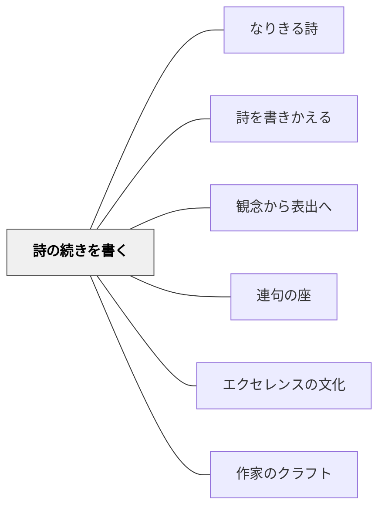

# 詩の続きを書く

> 読んで内側に取り込んだ詩の言葉は、続きを書くことでようやく自分のものになる。

## 背景（Context）

国語の詩の授業は「詩を正しく読む」ことに終わりやすい。訓詁注釈的な授業——語の意味・表現技法・主題の確認——を経ても、詩は「外側の知識」のままである。詩が「自分のもの」になるには、詩を身体に引き受け、そこから何かを書き出す体験が必要だ。

青木幹勇は「第三の書く」として、読むこと（第一）・考えること（第二）を経た後に「書くこと（第三）」が来る、という言語活動の構造を示した。詩の「続きを書く」はこの「第三の書く」の実装の一つである。

## 問題（Problem）

詩の授業で感想を書かせると「きれいだと思った」「意味がわかった」という表面的な反応で終わりやすい。深く詩を読んだ後に「何かを言いたい」という状態が生まれていても、その言葉の出口がないと内側に留まったままになる。

## 力のかたち（Forces）

- 「続き」を書く活動は、正解・不正解がないため全員が参加できる
- 詩の形式・ことばの調子を「借りて」書けるため、完全な白紙よりも書きやすい
- 「続きを書く」ためには詩を深く読む必要がある——書く動機が読みを深める
- 全員の「続き」を並べると、同じ詩から多様な声が生まれることが可視化される

## 解決（Solution）

**詩を繰り返し読み、内側に詩の調子・言葉・世界を引き受けた後で、「詩の続き」を書く。**

近藤真の実践（「木になる」授業・中学2年生）：

---

**PART-1：谷川俊太郎「き」の「書きたし」**

手順：
1. 谷川俊太郎「き」を声に出して繰り返し読む
2. 「きみは変身して何になりたいか」を問い、変身願望を自由に語り合う（雲・太陽・ドラエもん・飛行機…）
3. 冬の森に連れて行く。「木に近づいて、幹に耳を当てて読みなさい」「この詩の続きを書いてみなさい」
4. 各自が木のそばで「書きたし」（詩の続き）を書く

近藤のクラスでは百四十人（3クラス）が書いた「書きたし」が集まった：

> ★木はうごけない。だまっていること...  ——キミコ  
> ★みんな木にはあまり気づいていない...  ——ジュンコ  
> ★木になるためには時間がかかる...  ——ジュンヤ  
> ●光の大空間で、一人空しく生きていく。だれも気づかない孤独  ——ナオコ  
> ●木は同じ種類のものでも一本一本形が違う。この人は自分だけがやりたいことをしたかったのか  

---

近藤はこの実践を「教室で一行ごと、一語ごとの訓詁注釈的授業をしなかった。けれど、森に入り、木によりそうことで、『第三の書く』（青木幹勇）を果たしたのではないか」と振り返る。

---

**ポイント：「続き」は「説明」ではなく「詩のことばで」**

「詩について感想を書く」のではなく、「詩のことばの調子・形式・リズムを引き継いで書く」ことが「第三の書く」の核心である。「ぼくは〜」という一人称の繰り返し、同じリズムの行が続く形式——これを「借りて」書くことで、書き手の声が詩の声と重なる。

---

**他の実装例**

- 黒田三郎「紙風船」の「書きたし」→ 繰り返しの構造を借りて自分の願いを書く（白谷明美）
- 教科書の詩の「続きの連」を書く——最後の連だけを消して、書き加える
- 「もし語り手の次の日はどうなったか」を詩の形で書く

## 結果（Consequences）

- 詩が「外側の知識」から「自分のことば」になる体験が生まれる
- 全員の「書きたし」を並べると、同じ詩から百人の声が生まれる——詩の読みの多様性が可視化される
- 書くことで詩を「深く読む」という逆説的な効果が生まれる
- 教室での訓詁注釈を省いても、「書くこと」が読解の証拠として残る

## クラスター図

## Actionable Insight

- 詩の授業の最後の15分に「詩の続きを1〜3行書く」を加える——「感想を書く」より詩に近い言語体験になる
- 「この詩のことばの調子を借りて、君ならどう続ける？」と一言添えてから書かせる——形式を「借りていい」という許可が書き始めを容易にする
- 全員の「書きたし」を印刷・掲示してクラス全体の「詩集」にする——百人の声が並ぶことが、詩を書くことへの自信と誇りを生む

## 関連パタン

- [[パタン/なりきる詩]] — 詩の「木」になりきってから「書きたし」を書くという流れで接続
- [[パタン/詩を書きかえる]] — 「続きを書く」は書きかえの入口になる
- [[パタン/観念から表出へ]] — 詩を繰り返し読んで内側に取り込む「内側の時間」の後に書く
- [[パタン/連句の座]] — 全員の「書きたし」が並ぶ構造は連句（前の句を受けてつなぐ）と親和性がある
- [[パタン/エクセレンスの文化]] — 全員の「書きたし」を集めて共有することで詩を書く文化が育つ
- [[パタン/作家のクラフト]] — 詩の形式・調子を「借りて書く」はクラフトの学びと重なる

## 出典

近藤真（年不明）『中学生のことばの授業　詩・短歌・俳句を作る、読む』太郎次郎社エディタス（第I部：授業「木になる」PART-I）  
青木幹勇（1986）『第三の書く』（近藤が参照する教育実践論）
