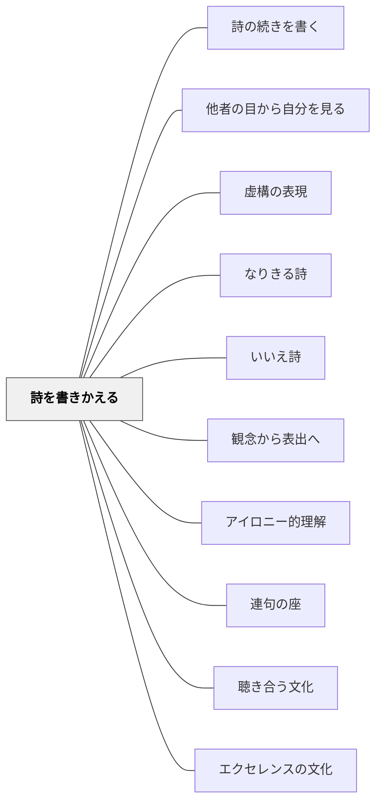

# 詩を書きかえる

> 誰かの詩の「別の声」になって書くとき、その声は書き手自身の本音を乗せてくる。

## 背景（Context）

詩を「読む」ことと「書く」ことは、分離できる活動ではない。優れた詩を深く読んだとき、読者の中に「もし自分が別の立場だったら」「この詩に返事をしたら」という衝動が生まれることがある。本歌取りは和歌の伝統的な技法だが、それは「既存の詩を深く読んで内側に取り込み、そこから自分の言葉を発する」という言語創造の原理でもある。

## 問題（Problem）

白紙から詩を書くよう求めると、子どもは「何を書けばよいか」の迷いで止まりやすい。一方、既存の詩を「読んで感想を書く」だけでは、読みの深まりが外に出てこない。「読む」と「書く」をつなぐ操作が必要である。

## 力のかたち（Forces）

- 優れた詩には「語られていないもう一人の声」が内在していることが多い——その空白が書く動機になる
- 詩の形式・構造を借りることができるので、全くの白紙より書き始めやすい
- 「視点を変える」操作は深い読解を前提とする——書く活動が読みを深める
- 「本歌（元の詩）への敬意と反論」が同時に存在するとき、書き手の思考が最も動く

## 解決（Solution）

**既存の詩を「別の視点から」書きかえる、または「詩人への返歌・返詩」を書く。**

近藤真の実践では次の二つのアプローチが中心：

---

**① 視点転換——「君」の視点から書きかえる**

島崎藤村「初恋」の授業（中学3年生）。「まだあげ初めし前髪の〜」という有名な一節は「われ（語り手・少年）」の視点で書かれている。では「君（林檎を渡した少女）」から見たらどうだったのか——その問いから書きかえる。

実践のポイント：
- 本物の林檎を教室に持ち込み、「君」になりきって林檎を手にする
- 「君」として感じたこと・見たことを詩の言葉にする
- 藤村の詩の構造（七五調・四行連）を参照しながら書く

この操作によって「詩の登場人物の内側に入り込む」読みが起き、初めて詩を「自分ごと」として受け取る経験が生まれる。

---

**② 本歌取り——相聞歌を詠む**

俵万智「サラダ記念日」を本歌にして、返歌・相聞歌を作る（中学3年生）。チーム・ティーチング（O先生と近藤）、1999年7月10日の2時間（2コマ）の授業。

「この味がいいね」と君が言ったから七月六日はサラダ記念日——俵万智の歌集から11首を提示し、生徒が1首を選んで「俵万智の恋人」になりきって返歌を詠む。

実践のポイント：
- **ペンネームで提出**——自分に冠された固有名詞から自由な名前（ドライモン・チェリーといちご・百日紅・まつぼっくり・SOなど）を使うことで、恋愛感情を書く心理的ハードルを下げる
- **評価カード（6項目）**を使って互いの作品を評価する（作者名は伏せたまま）：
  1. 本歌との「対話」が成立しているか
  2. 形式（三十一音）が整っているか
  3. きらりと光る表現があるか
  4. なるほどと納得させる表現があるか
  5. 質の高いユーモアがある
  6. ほかの作品にないその人らしさがある
- **教師も詠む**（35+1の精神）——授業を観察していたAさん（担任）も画用紙にフェルトペンで一首を書き、O先生・近藤も詠んだ
- たがいの作品を読む・読んでつながる——本人が名前を明かして再度読む場面で拍手が起き、詩が「対話」になった

---

**小学校・低学年への展開**

本歌取りは中学向けだが、視点転換は小学校でも使える：
- 谷川俊太郎「き」を読んで「木からみた私」を書く
- 教科書の詩の語り手に「返事の手紙」を書く
- 「ぼく（語り手）」を「きみ」に変えて読んでみて、何が変わるかを感じる

## 結果（Consequences）

- 「読む」と「書く」が分離せず、読みながら書く・書くことで深く読む経験が生まれる
- 詩の登場人物の内側に入り込むことで、詩を「自分ごと」として受け取る読み手が育つ
- 書き手の本音・価値観・感情が、詩の人物を経由して表出される
- 教師が詠むことで「詩を書くのは生徒だけではない」という文化が生まれる

## クラスター図

## Actionable Insight

- 詩の授業で「この詩のもう一人の登場人物の視点から書きかえよう」を一単元に一回入れる——「君」や「傍観者」など視点の置き方を変えるだけで全員が書き始める動機が生まれる
- 本物の実物（林檎・花・写真など）を教室に持ち込んでから書かせる——「なりきる」のに物理的な手がかりがあると詩のイメージが具体的になる
- 教師が自分の返歌・相聞歌を書いて読み上げる——教師が書き手として参加することが「書くことを楽しむ文化」の最も強力なモデルになる

## 関連パタン
- [[実践/詩歌の授業（詩を書く・詩を読む）]]
- [[パタン/詩の続きを書く]]
- [[パタン/他者の目から自分を見る]]

- [[パタン/虚構の表現]] — ペンネーム・視点転換・本歌取りに共通する認知・心理的原理——「虚構の外皮が本音を引き出す」統一原理
- [[パタン/なりきる詩]] — 前段パタン。「なりきって書く」の対象が「物・動植物」から「詩の人物・詩人」へ深化する
- [[パタン/いいえ詩]] — 詩的操作の入口。「いいえ」で転換→「別の声で書く」という流れ
- [[パタン/観念から表出へ]] — 詩を深く読んで内側に取り込んでから書く
- [[パタン/アイロニー的理解]] — 別の視点に立つことで自分の視点が相対化される
- [[パタン/連句の座]] — 詩の書きかえが「往復する」形が相聞歌・連句へと深化する
- [[パタン/聴き合う文化]] — 書きかえた詩を読み合い、違いを発見する
- [[パタン/エクセレンスの文化]] — 書きかえた詩を共有することでクラスの言語文化が豊かになる

## 出典

近藤真（年不明）『中学生のことばの授業　詩・短歌・俳句を作る、読む』太郎次郎社エディタス（第I部：定型詩を書く・俵万智と恋をする）
