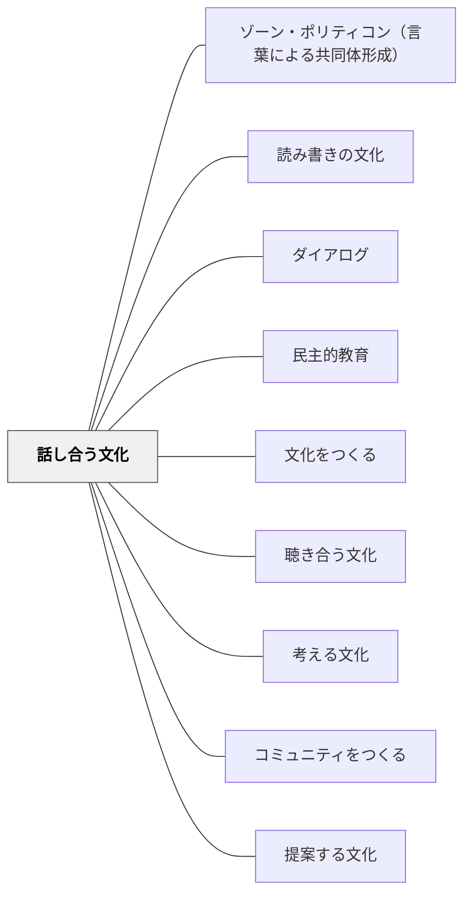

# 話し合う文化

> 話し合いは民主主義の基礎である。

## Pattern Connection

### 細谷恒夫（1957）

細谷の第三章「教育的行為の論理」は、教育的対話が研究的討論や政治的議論とどのように異なるかを分析することで、「話し合う文化」に哲学的な基礎を与える。

- **既存パタンとの関連**：「議論は勝ちを目指す；対話は理解を深める」という本パタンの核心命題に対して、細谷は「なぜ教育的対話が独自の論理をもつのか」を三種の対話の区別から説明する。
- **補強された点**：「話し合いのルール」だけでなく、教育的対話の目的と始源をどこに置くかという問いが明確になる。

**三種の対話の区別**

| 対話の種類 | 始源（どこから始まるか） | 私とあなたの関係 | めざすもの |
|---|---|---|---|
| **研究的討論** | 事象そのもの | ともに事象に向かうパースペクティブの比較 | 客観的真理への接近 |
| **政治的議論** | 私（の欲求・利害） | 私と私——各自の意見の妥協 | 利害調整・合意（妥協） |
| **教育的対話** | あなた（被教育者）の問いの可能性 | 私があなたの問を先取りして呼びかける | あなた自身が問いを自分のものとすること |

**「始源は被教育者の側にある」という原則**

教育的対話において、教師が最初に話しかけることは多い。しかしその対話が教育的であるためには、「教師が生徒の問いの動機づけを先取する」という意味をもたなければならない。

> 「教育者の目からみれば彼のうちに、色々な問への動機づけが可能性として眠っているのである。それを見つけ出し、誘い出し、被教育者自身が、それを自己の問として提起するような構えを…作り出すのが教育者の任務なのである」（第三章）

- ソクラティック・サークルが「教師が問いを作る」ではなく「参加者の問いから始まる」形式をとるのは、この論理と一致する。
- 「この話し合いで聞きたいことは何か」を事前に全員から集めるのは、始源を被教育者の側に置く実践である。

**この分析が示す「話し合う文化」の設計原則**

細谷の分析から、日常の話し合いに混入しやすい「政治的対話」の形（声が大きい者が意見を通す、多数決で終わる）と「教育的対話」の形を区別できるようになる。

> 政治的妥協から真理が生まれることはない。教育的対話においてこそ、「あなた」は「あなた」として完全に保有され、対話は「私とあなた」のものとして進行する。（第三章、要約）

- **他のパタンへの波及**：[[パタン/民主的教育]]（政治的妥協と民主的教育の違い）・[[パタン/熟慮的動機づけ]]（始源を被教育者の側に見つける）・[[パタン/人間形成の様式]]（「教え」の様式の対話的性格）

### 井庭崇（2025）

井庭（2025）のパターン・ランゲージ作成プロセスにおける**ライターズ・ワークショップ**（パターンを参加者が対話しながら磨く場）は、本パタンの方法論的な具体化である。

- **既存パタンとの関連**：細谷が「教育的対話の始源は被教育者の側にある」と論じたのに対し、井庭のパターン作成プロセスは「記述の妥当性の始源は実践者の側にある」という構造を持つ。「他の人にもきっとそうだろう」という**間主観的還元**は、話し合いを通じてしか実現できない。
- **補強された点**：本パタンの「対話は理解を深めることを目指す」という命題が、パターン・ランゲージ作成の文脈では「パターンの記述が一人の主観に留まらないための実践的条件」として位置づけられる。話し合いによって、個人の経験則が共同の知識へと変換される。

**パターン作成における話し合いの三層**

| 話し合いの層 | 目的 | 参加者 |
|---|---|---|
| **プロジェクト内レビュー** | 記述の整合性・抽象度の確認 | 作成チームのメンバー |
| **実践者レビュー** | 「自分の感覚と合っているか」の検証 | その実践を実際に行っている人 |
| **ユーザーテスト** | パターン名・イラストの意味の確認 | 読者・利用者 |

この三層の話し合いが、間主観的還元を段階的に実現する構造になっている。

- **他のパタンへの波及**：[[パタン/省察的評価]]（カンファリングの問い構造とマイニング・インタビューの対応）・[[メタパタン/経験から出発する]]（実践者の語りから本質を取り出す対話的プロセス）・[[文献/質的研究法としてのパターン・ランゲージ（井庭崇）]]

---

## 背景（Context）

民主主義は「異なる意見を持つ人々が対話を通じて合意を形成していく」プロセスである。このプロセスは学校の日常的な話し合いの中で練習される。話し合える文化のない学校から、話し合える市民は育ちにくい。

## 問題（Problem）

対話のルーティンや規範がないと、「授業中の発言」は「先生の質問に正解を答える競争」になる。沈黙が続くか、特定の声の大きい人だけが話す状況になる。

## 力のかたち（Forces）

- 話し合いにはルールと安全の両方が必要
- 議論と対話は異なる（議論は勝ちを目指す；対話は理解を深めることを目指す）
- 全員が話すことと、質の高い対話は必ずしも一致しない

## 解決（Solution）

**対話のルーティンと規範を明示的に教え、定期的に実践する。**

主な形式：
- **クラス会議**：共同の問題を話し合い、意思決定する
- **ソクラティック・サークル**：テキストを中心に問いを深める
- **構造的学術論争**：あえて対立する立場を担い、最後に統合する
- **フィッシュボウル**：内側の対話を外側が観察する

規範の例：「仲間の言葉を繰り返してから自分の意見を言う」「まず理解を確認してから反論する」

## 結果（Consequences）

- 学習者が自分の考えを言語化・整理する力を育てる
- 他者の視点を取り入れて考えを深める経験が積み重なる
- 「対話で問題を解決する」という文化的習慣が形成される

## 関連パタン
- [[パタン/ゾーン・ポリティコン（言葉による共同体形成）]]
- [[学級経営/文化をつくる]]
- [[パタン/読み書きの文化]]
- [[実践/文学討論グループの設計]]
- [[パタン/ダイアログ]]
- [[パタン/民主的教育]]

- [[パタン/文化をつくる]] — 親パタン
- [[パタン/聴き合う文化]] — 話し合いの前提となる傾聴
- [[パタン/考える文化]] — 話し合いを通じた思考の可視化
- [[パタン/コミュニティをつくる]] — 話し合いを支える関係性
- [[パタン/提案する文化]] — 話し合いの中で提案する習慣

## クラスター図

## Actionable Insight

- 週1回「クラス全体で一つの問いを話し合う時間」を15分だけ設ける——話し合いは文化であり、日常的な練習なしには育たない
- 「仲間の言葉を繰り返してから自分の意見を言う」という1つのルールを試す——聴く文化が対話の質を変える
- 意見が出なかったら「Think-Pair-Share（個人→ペア→全体）」を使う——話し合いのルーティンが「正解競争」からの脱出口になる

## 出典

- 動画記録：[[文献/コミュニティオブプラクティスと文化をつくるパタン（動画記録）]]
