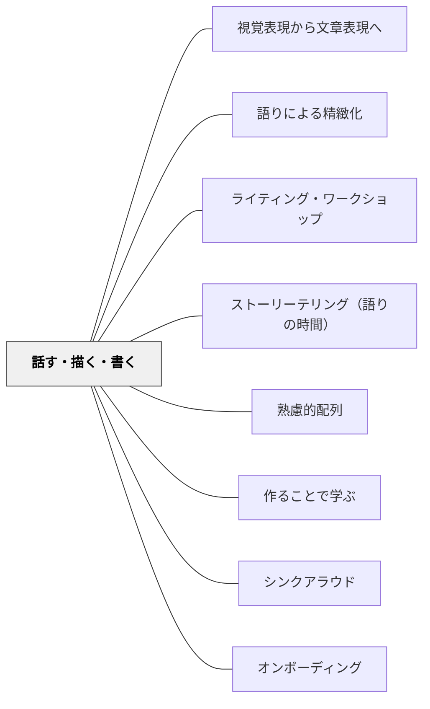

# 話す・描く・書く

> 話すことは物語の発見であり、描くことは意味の作曲であり、書くことはその両方に加わる第三の声である——三つは段階ではなく、同時に使える意味構成の道具だ。

---

## Pattern Connection

**出典**: Horn, M. & Giacobbe, M. E.（2007）*Talking, Drawing, Writing: Lessons for Our Youngest Writers*. Stenhouse Publishers.（初回統合：2026-05-14 / 再統合：2026-05-18）

- **既存パタンとの関連**：[[パタン/視覚表現から文章表現へ]] は「絵・図→文章」の移行を扱うが、本パタンはそれを三段階に分解し「話す」というオーラルな層を最初に加える。また、[[パタン/語りによる精緻化]] の「語ることが理解を整理する」という知見と深く対応する
- **補強された点**：「描くことはイラストレーションではなく作曲（Composing）である」という認識が、[[パタン/視覚表現から文章表現へ]] の「視覚化→言語化」の前段として独立した。絵は文章の補助ではなく、絵そのものが意味の完全な器である
- **修正・拡張された点（2026-05-18 再統合）**：「書く前に話させる」という実践は「書けない」子への応急処置ではなく、あらゆる学習者にとって書く前の本質的なプロセスとして位置づけられる。さらに以下の理論的根拠が明確になった：
  - **Vygotsky（1978）**：話し言葉は子どもが最初に習得する記号システムであり、書き言葉の発達の基盤。描くことは内的言語（private speech）を育てる媒体でもある
  - **Dyson（1986）Symbol Weaving**：子どもは「記号の織り手」であり、話す・描く・書くは段階ではなく同時に織り合わされるモード。一つのモードでの力が他のモードの力を支える
  - **Berthoff（1982）**："You can't know what you mean until you hear what you say"——「聞くまで自分が何を意味しているかわからない」。話すことが自分の考えを発見するプロセスである
  - **Johnston（2004）**："Human beings are natural storytellers"——すべての人が語り手である。書き始める前に語り手として招くことが、すべての子どもへの扉を開く
- **他のパタンへの波及**：[[パタン/ライティング・ワークショップ]] の独立書きの開始時に「まず話す」を組み込む設計が明確になる。新設パタン [[パタン/ストーリーテリング（語りの時間）]] は本パタンの「まず話す」を独立した場の設計として具体化する

---

## 背景（Context）

子どもは言葉を覚えるより先に、豊かなストーリーを持っている。友達と遊ぶとき、親に話しかけるとき、絵を描くとき——子どもは自分の経験や想像を流暢に語る。

しかし「書きなさい」と言った瞬間、多くの子どもが止まる。紙と鉛筆を前にすると、「書けない」と言う子が続出する。この「止まり」は書く能力の欠如ではなく、言語化のモードの切り替えによる負荷である。

Horn & Giacobbe（2007）はこれを「まだ話していないから書けないのだ」と説明した。書く前に声に出して話すこと（Talk）、絵で意味を作ること（Draw）、そして言葉でそれを加えること（Write）——この三つを組み合わせることで、「書くことへのアクセス」が格段に広がる。

## 問題（Problem）

「書きなさい」と言うと、多くの子ども（特に低学年・書くことが苦手な子）が書けない状態になる。この「書けない」は次の問題から起きている：

- 書く内容（トピック）が決まっていない
- 決まっていても「どう言葉にするか」が見えない
- 書くことと話すことが「別の活動」として扱われている
- 絵を描くことが「書く前の遊び・お絵かき」として位置づけられ、描くことが「書くことの一部」として認められていない

## 力のかたち（Forces）

- 話すことは書くことより処理負荷が低く、多くの子どもが流暢に語れる
- 描くことは言語化より先に意味の全体像を作れる（特に視覚優位の学習者）
- しかし、話すだけでは記録に残らず、描くだけでは共有が難しい
- 書くことは話す・描くことと比べて習得に時間がかかる、しかし最も広く共有できる
- 低学年では、三つを「段階」として扱い「卒業」を目指すと、描くことの意義を損なう

## 解決（Solution）

**書く前に「まず声に出して話す」時間を置き、描くことを「文章の挿絵を作ること」でなく「意味を作ること（Composing）それ自体」として扱い、書くことをその追加層として設計する。**

---

### 三つの意味構成モードの役割

| モード | 役割 | 活動 |
|--------|------|------|
| **話す（Talk）** | ストーリーを発見し、考えを声に出す | 「これはどんな話ですか」と聞いて声に出させる |
| **描く（Draw）** | 意味の作曲・全体像を作る（書くことの代替ではなく等価の行為） | ページに絵を描く（挿絵ではなく、物語そのもの） |
| **書く（Write）** | 言葉でもう一層の意味を加える | 絵にラベル・キャプション・文章を追加する |

三つは「段階」ではなく「道具」である——高学年になっても、複雑な作品を書く前に声に出して話すことは有効であり、ラフスケッチや図で構成を整理することも続く。

**「描くことはリハーサルではなく、描くことは書くことである」（Horn & Giacobbe）**：これは単なる言葉遊びではなく、評価・時間配分・教師のまなざしを変える原理である。「早く文字を書かせなければ」という焦りが、描いている子どもの意味構成を打ち切る。Vygotsky の意味論では、絵文字・記号・文字はすべて「第二次象徴システム」の一部であり、幼い子どもにとって絵は文字と同等の記号的行為である（Vygotsky, 1978）。

---

### 「まず話す」の実践

書く前・描く前に30秒〜1分の「話す時間」を置く：

- **教師の問い**：「今日書くことを、隣の人に話してみて」または「これはどんな話ですか、私に話して」
- **ペアで話す**：隣の席の友達に話して、相手は「一番面白いと思ったこと」を言う
- **声に出して自分で確認する**：書く前に自分で「〜という話を書く」と声に出す

「何を書けばいいかわからない」と言う子のほとんどは、30秒話すと「書くこと」が見つかる。

---

### 描くことを「作曲」として扱う

ライティング・ワークショップで白紙の冊子（Blank Booklets）を使うとき：

- 「絵を描いてから文を書く」のが基本の順序——絵が先、文字が後
- 「絵を描いた後、文字を加える」のも書く行為の一部——絵の中の人・もの・場所に名前を書く（ラベリング）だけでも書いている
- 「絵だけ」の作品も作品として認める——絵を「まだ書いていない」と評価しない

**描くことが「作曲」であるための問い**（カンファリングで使う）：
- 「この絵の中で一番大事なところはどこですか」
- 「この絵の人はどんな気持ちですか」
- 「次のページには何を描きますか」

**Dyson（1986）Symbol Weaving の実践的意味**：話す・描く・書くを「別々のスキルの習得」として切り離して教えず、同時に経験させることで、一つのモードでの発見が別のモードへと「織り込まれて」いく。たとえば、描いている最中に語りが豊かになり（Vygotsky の private speech）、その語りが文章になる。

---

### 発達的な書きの連続体

Horn & Giacobbe（2007）の Writing Continuum：

| 段階 | 特徴 | 教師の認識 |
|------|------|-----------|
| 絵のみ（Pictures only） | 絵だけでストーリーを語る | 「書いていない」ではなく「絵で意味を作っている」 |
| ラベリング（Labeling） | 絵の中の人・ものに名前を書く | 文字が意味の一部になり始めている |
| キャプション（Caption） | 絵の下・横に短い文を書く | 絵と文字が協働して意味を作る |
| 文章（Sentences） | 複数の文でストーリーを書く | 言語が主な意味構成になる |

どの段階も「書いている」として認める。発達連続体は「できていない」を見るのではなく「今どこにいるか」を見るためのもの。

---

### 高学年・中学年への応用

「話す→描く→書く」の順序は低学年に限定されない：

- 説明文・意見文の前に「これについて何を知っているか、隣の人に話してみて」（知識の棚卸し）
- 物語の構成を考えるとき、「先に全体の流れをスケッチする」（描くことが構成メモになる）
- 詩を書く前に「この場面を絵に描いてから、絵を見ながら詩の言葉を選ぶ」
- 読んだ本について書く前に「カンファリングで先生に話す」（RIPモデルとの接続）

## 結果（Consequences）

- 「書けない」子が書ける入口を持てる——特に低学年・書くことが苦手な子・特別支援が必要な子
- 描くことが「書く前の遊び」でなく「書くことの一部」と認識されることで、視覚優位の学習者が書き手として参加できる
- 話すことで「何を書くか」が整理されるため、書く時間に停止する子が減る
- ただし「話す時間→描く時間→書く時間」を硬直的な順序として強制すると、話す・描くことが目的でなく義務になる

## 関連パタン

- [[パタン/視覚表現から文章表現へ]] — 視覚的表現から言語的表現への移行パタン（本パタンの大きな文脈）
- [[パタン/語りによる精緻化]] — 語ることが理解・意味の整理になる原理
- [[パタン/ライティング・ワークショップ]] — 本パタンが機能する授業構造
- [[パタン/ストーリーテリング（語りの時間）]] — 「まず話す」を場の設計として具体化した下位パタン
- [[パタン/熟慮的配列]] — 「何を先に・何を後に」という順序設計の上位パタン
- [[パタン/作ることで学ぶ]] — 作ることが学びそのものである認識
- [[パタン/シンクアラウド]] — 教師が話す・描く・書くをモデリングする形態
- [[パタン/オンボーディング]] — 「まず話す」が書く活動への入口となる
- [[実践/ライティング・ワークショップ年度初め]] — このパタンの具体的な実践例

---

## クラスター図

## Actionable Insight

- **「書く前に30秒、隣の人に話して」を習慣にする**——「何を書けばいいかわからない」が減り、書き始めが速くなる。特に低学年・特別支援の子に有効
- **白紙の冊子（A4を半折にして数枚束ねた紙の本）を使う**——罫線がないことで、描くことと書くことが同じページで自由に共存できる。線のある用紙より書く入口が広い
- **「絵だけの作品」を「まだ書いていない」と評価しない**——「この絵はどんな話ですか」と聞いて、子どもが語る内容を書き取ってあげる（書記になる）のが最初のカンファリングになる
- **「描くことはリハーサル」という言葉を使わない**——「描くことは書くことです」と言い換えることで、絵を描いている子どもが「本当に書いている」という認識を育てる
- **ストーリーテリングの時間を書くワークショップの前に置く**——週に1〜2回、クラスで一人が特別な椅子に座って話す時間を設ける。[[パタン/ストーリーテリング（語りの時間）]] を参照

---

## 出典

Horn, M., & Giacobbe, M. E. (2007). *Talking, Drawing, Writing: Lessons for Our Youngest Writers*. Stenhouse Publishers.

Berthoff, A. E. (1982). *Forming/Thinking/Writing: The Composing Imagination*. Boynton/Cook Publishers.

Dyson, A. H. (1986). Transitions and tensions: Interrelationships between the drawing, talking, and dictating of young children. *Research in the Teaching of English, 20*(4), 379–409.

Johnston, P. H. (2004). *Choice Words: How Our Language Affects Children's Learning*. Stenhouse Publishers.

Vygotsky, L. S. (1978). *Mind in Society: The Development of Higher Psychological Processes*. Harvard University Press.

> "When a child says 'I don't know what to write,' what they really mean is 'I haven't had a chance to talk yet.'" —Horn & Giacobbe（2007）

> "Drawing is not rehearsal for writing: drawing IS writing." —Horn & Giacobbe（2007）

> "Drawing and writing are both symbol systems children use to make meaning." —Horn & Giacobbe（2007）

> "You can't know what you mean until you hear what you say." —Berthoff（1982, p.46）

> "Human beings are natural storytellers." —Johnston（2004, p.30）

[[文献/Talking, Drawing, Writing（Horn & Giacobbe）]]
