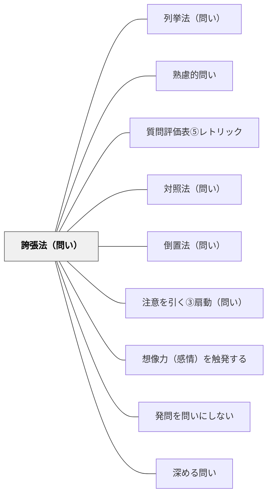

# 誇張法（問い）

> 大袈裟な表現でフォーカスポイントを作り、思考を極端な方向へ引き伸ばす問い。

## 背景（Context）
思考は通常、現実の範囲内で動きがちであり、既存の枠組みを超えにくい。
誇張法は「もし世界中の人が〇〇だったら？」のように、スケールを極端に拡大・縮小することで、問いに劇的なインパクトを与える修辞技法である。
大袈裟な設定が思考実験のトリガーとなり、普段気づかない本質が浮かび上がることがある。
教育の場では、誇張によって学習者が「もしも」の世界を自由に想像できるようになる。

## 問題（Problem）
現実的・穏当な問いだけでは、学習者の思考が日常の範囲に留まりやすい。
「もう少し〇〇だったら？」程度の変化では、発想の転換が起きにくい。
思考の枠組み自体を揺さぶるためには、現実を大きく逸脱した問いが必要になることがある。

## 力のかたち（Forces）
- 誇張が大きすぎると「空想の話」として切り捨てられ、真剣な思考につながりにくくなる。
- 誇張が小さすぎると、通常の問いとの差が生まれず効果が薄れる。
- 誇張法は学習者の感情・ユーモア感覚に働きかけるため、心理的安全性が高い場で効果的である。
- 文化・価値観によって、誇張表現の受け取り方は大きく異なる。

## 解決（Solution）
問いの中の一つの変数（人数・時間・規模・影響範囲など）を極限まで拡大または縮小する。
「もし世界中の教師がこの問いを考えたら？」「もしこれが1秒で解決できるとしたら？」のように設定する。
誇張した問いを提示した後、「では実際の現実ではどうか？」と現実に引き戻す問いとセットで使う。
誇張の程度を学習者と一緒に調整することで、適切なスケールを探る過程自体が学びになる。

## 結果（Consequences）
誇張法を使った問いは、学習者の想像力と遊び心を刺激し、思考実験への入口を作る。
普段は気づかない本質的な構造や関係性が、極端な設定によって可視化されることがある。
一方、誇張が目的化すると問いの深さが失われるため、探究の核心と結びつける意識が必要である。

## 関連パタン
- [[パタン/列挙法（問い）]]
- [[パタン/熟慮的問い]] — 親パタン
- [[パタン/質問評価表⑤レトリック]] — 修辞の評価軸
- [[パタン/対照法（問い）]] — 対比で際立たせる兄弟パタン
- [[パタン/倒置法（問い）]] — 語順で強調する兄弟パタン
- [[パタン/注意を引く③扇動（問い）]] — 誇張は注意を引く扇動的問いと構造が近い
- [[パタン/想像力（感情）を触発する]] — 修辞的問いが感情・想像力を動かす上位パタン
- [[パタン/発問を問いにしない]] — 修辞の形で問いの圧力を柔らげる関連手法
- [[パタン/深める問い]] — 修辞技法が表面的な応答を防ぎ思考を深める

## クラスター図

## Actionable Insight

- 問いの中の1つの変数（人数・時間・規模）を極端に拡大して「もし世界中の人がこれをしたら？」と問う——スケールの誇張が思考の枠組みを揺さぶり普段気づかない本質を浮かび上がらせる
- 誇張した問いの後に「では実際の現実ではどうか？」と現実に引き戻す——現実との対比が探究の核心と結びついた思考の深まりを生む
- 学習者自身に「この問いの誇張バージョンを作ってみよう」と促す——誇張のスケールを探る過程自体が問いの本質への理解になる

## 出典
- [[文献/熟慮的問いのパターンリスト（動画記録）]]
