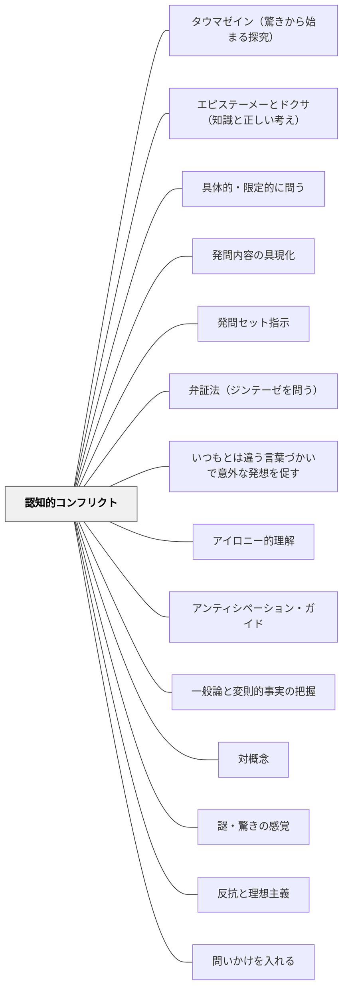

# 認知的コンフリクト

> 予測を裏切られた瞬間、人は「なぜ？」を解かずにいられなくなる。矛盾・驚き・ズレが、探究心への着火点になる。

## Pattern Connection（プラトン『メノン』前387年頃）——エレンコスとアポリア：認知的コンフリクトの哲学的原型

認知的コンフリクトの思想的起源は、ソクラテスの問答法（エレンコス）にある。プラトン『メノン』（71e〜86c）は、意図的に矛盾を露わにすることで探究心を引き出す構造を最も精密に示している。

**エレンコス（論駁）の五段階構造（71e〜79e）：**
1. 学習者が自信を持って答える（メノンの「徳の定義」）
2. 反例・類比で矛盾を示す（ミツバチの比喩、72a〜c）
3. 学習者がアポリア（困惑）に陥る
4. ソクラテス：「難問に入ったことは前より優れた状態」と評価（84a）
5. 次の探究へ進む

**召使いの少年との問答（82a〜86b）：**
少年は「2倍の辺」「3倍の辺」と誤答を繰り返し、ついにアポリアへ落ちる。ソクラテスは問いのみで訂正しない。少年はアポリアの後、自ら正しい答え（対角線）に至る。

Deweyの「困惑（perplexity）」（1916）が認知的コンフリクトの教育哲学的根拠を与えるとすれば、ソクラテスのエレンコスは操作的手順——「どのように」コンフリクトを設計するかを示す。

**補強点**：フェスティンガーの「認知的不協和」（心理学的根拠）＋ Deweyの「困惑は思考の燃料」（哲学的根拠）に、ソクラテスのエレンコス（教師の問答操作の手順）が加わる。コンフリクトは「偶然に起きる」のでなく「問いの設計によって意図的に引き起こせる」ことを示す。

**波及するパタン**：[[パタン/アポリアの設計]] — エレンコスの五段階構造がアポリア設計の原型として独立したパタンになっている；[[文献/メノン（プラトン）]] — 本統合の出典

---

## Pattern Connection（Dewey, 1916）

**補強された点**：フェスティンガーの「認知的不協和」が認知的コンフリクトの心理学的根拠を与えるのに対し、Dewey（1916）は「困惑（perplexity）こそが反省的思考の起点」という教育哲学的根拠を与える。Deweyにとって困惑は解消すべき障害でなく「思考の燃料」であり、教育的に設計すべき資源である。

**困惑（perplexity）——反省的思考の出発点**

Deweyは Ch.12 で反省的思考の第一段階を「困惑・混乱・疑問（a felt difficulty）」と定義する：
- 目前の状況への違和感・不確かさ・引っかかりが思考を起動する
- 困惑のない場所に本物の思考は生まれない
- 「デカルトは懐疑から、ソクラテスは無知の認識から科学が生まれることを示した」

> "The most important factor in the training of good mental habits consists in acquiring the attitude of suspended conclusion, and in mastering the various methods of searching for new materials to corroborate or to refute the first suggestions that arise."（Dewey, 1916, Ch.12）

**「訓練されていない心」の傾向**：Deweyは、訓練されていない心が知的な宙吊り（intellectual suspense）を嫌い、最初に浮かんだ結論に飛びつく傾向を指摘する。これは「コンフリクトが強すぎると拒絶反応を生む」という既存の力の分析と対応する。

**コンフリクトの後に何が続くか**——[[パタン/反省的思考の5段階]] は、着火後の全プロセスを提供する：
- 段階①（困惑）が本パタン
- 段階②（問題の知的化）→③（仮説）→④（推論）→⑤（検証）が続く

**他のパタンへの波及**：コンフリクトを設計するだけでなく、その後の「問題の言語化→仮説→検証」まで授業に組み込むことで、認知的コンフリクトが本物の思考の経験になる。コンフリクトを着火点として、[[パタン/反省的思考の5段階]] を続ける設計が推奨される。

---

## 背景（Context）
認知的不協和（フェスティンガー）の概念が示すように、人は自分の信念・予測と異なる情報に出会うとき、そのズレを解消しようとする強い動機が生まれる。学習場面においてこれを活用することで、学習者の探究心を内側から引き出すことができる。

## 問題（Problem）
「教師が説明する → 学習者がノートをとる」という伝達型の学習では、学習者の既有概念は揺さぶられず、表面的な知識の上書きにとどまることが多い。素朴概念や誤概念を持つ学習者には、それを書き換えるきっかけが必要である。

## 力のかたち（Forces）
- コンフリクトが強すぎると不安や拒絶反応を生み、弱すぎると無視される
- 学習者が「自分の予測」を持っていることが前提。予測なきコンフリクトは驚きに終わる
- コンフリクトの後に探究・検証・再構築の機会が続くことで学習が深まる
- 心理的安全性があるとき、コンフリクトは脅威でなく探究の招待として受け取られやすい

## 解決（Solution）
**学習者が予測を立てた後、それを裏切る現象・事実・事例に出会わせることで、「なぜ？」という探究意欲を喚起する。**

実験で学習者に予測させてから意外な結果を見せる、「こう思っていたけど実は違った」という事例を提示する、学習者同士の異なる考えをぶつけ合わせる議論の設計、一般的な誤解・誤概念に基づく問いかけなどが有効である。

## 結果（Consequences）
- 学習者が能動的に「なぜ？」を問い、探究する姿勢で学習に取り組む
- 素朴概念・誤概念の組み替えが促進され、深い概念理解が生まれる
- 認知的コンフリクトの体験が「予測→検証→再構築」という科学的思考の習慣を育てる

## クラスター図

## Actionable Insight

- 実験や事例を見せる前に「どうなると思う？」と予測を立てさせてから結果を見せる——予測があるからこそ裏切りが「驚き」になり「なぜ？」という探究の着火点になる
- 予測が外れた後に「なぜ違ったのか？」を探究させる時間を最低5分確保する——コンフリクトが探究に変わるのは探索の機会があるときだけ
- 学習者同士の異なる予測・考えをぶつけ合わせる議論を設計する——同士のコンフリクトが安全に経験できる最も自然な形であり、素朴概念の組み替えを促す

## 出典

- 一つの教育のパタン・ランゲージ（岩井輝久）/ Dewey, J. (1916). Democracy and Education

## 関連パタン
- [[パタン/タウマゼイン（驚きから始まる探究）]]
- [[パタン/エピステーメーとドクサ（知識と正しい考え）]]
- [[パタン/具体的・限定的に問う]]
- [[パタン/発問内容の具現化]]
- [[パタン/発問セット指示]]
- [[パタン/弁証法（ジンテーゼを問う）]]
- [[パタン/いつもとは違う言葉づかいで意外な発想を促す]]
- [[パタン/アイロニー的理解]]
- [[パタン/アンティシペーション・ガイド]]
- [[パタン/一般論と変則的事実の把握]]
- [[パタン/対概念]]
- [[パタン/謎・驚きの感覚]]
- [[パタン/反抗と理想主義]]
- [[パタン/問いかけを入れる]]
- [[パタン/熟慮的動機付け]] — 親パタン
- [[パタン/反省的思考の5段階]] — 認知的コンフリクト（段階①）の後に続く全プロセス（Dewey）
- [[パタン/ギャップ]] — 関連パタン
- [[パタン/無知の知]] — 関連パタン
- [[パタン/A1.興味の獲得（知覚的喚起）]] — 関連パタン（ARCSとの接点）
- [[パタン/A2.探究心の刺激（喚起）]] — 関連パタン（ARCSとの接点）
- [[パタン/最適化]] — 関連パタン
- [[パタン/教育＝成長]] — 困惑を扱う力が成長の指標（Dewey）
- [[パタン/テストを繰り返す]] — 想起練習が既有概念との矛盾を見える化しコンフリクトを設計する材料になる
- [[パタン/心理的安全性（コンフォートゾーン）]] — コンフリクトは安全な場があってこそ脅威でなく探究の招待として受け取られる
- [[パタン/アポリアの設計]] — ソクラテスのエレンコス（前387年）は認知的コンフリクトを意図的に設計する問答操作の原型
- [[文献/メノン（プラトン）]] — エレンコスとアポリアの五段階構造の出典
