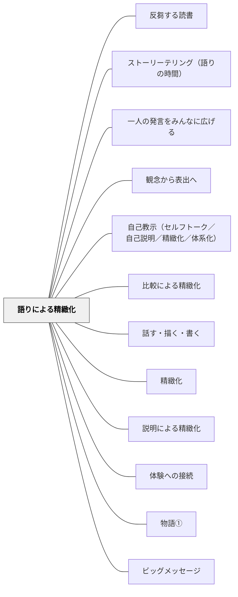

# 語りによる精緻化

## 背景（Context）

[[パタン/精緻化]] によって、知識を深く持続的に理解させたい。人間の認知は、バラバラな事実の羅列よりも「流れのある物語（ナラティブ）」の形で情報を処理・記憶することに適している。知識を「出来事の流れ」「因果の連鎖」「主人公のいる物語」として語ることで、記憶の定着と意味の理解が同時に促される。

## 問題（Problem）

知識が「箇条書きの事実」として積み上げられると、それぞれのつながりが見えず、後から取り出す手がかりがない。「何がどうなったか」ではなく「なぜそうなったのか」「次にどうなるのか」という流れと意味が、理解の深さを決める。

## 力のかたち（Forces）

- 物語構造（起・承・転・結、原因と結果、葛藤と解決）は記憶・理解の強力な骨格になる
- すべての知識が「物語化」できるわけではなく、強引な物語化は歪みを生む
- 語る行為そのものが話者の理解を整理する（「説明による精緻化」と重なる）
- 聞き手がいることで、「どう伝えるか」という設計が理解を深める

## 解決（Solution）

**学んだ知識・概念・出来事を、「流れ・つながり・意味のある物語」として語る形式で再構成する。**

「物語として語る」とは、小説を書くことではなく、「これはこういうことがあって、だからこうなって、その結果こうなった」というつながりで知識を語ることを意味する。

**実践例：**
- 歴史の授業：出来事の年表を「登場人物が葛藤し選択した物語」として語り直す
- 理科：「水が蒸発して雲になり雨になり川に戻る」を、水の視点から一人称で語る
- 道徳：価値観の葛藤を「ある人物の決断の物語」として語り、その判断を問う
- 算数：「この問題を解こうとした人が最初に何を考え、どこで詰まり、どう解決したか」を語る
- 単元末：「今日学んだことを、誰かに話すとしたら、どう話す？」と問い、語らせる

## 結果（Consequences）

- 知識が「点」から「線・流れ」へと変化し、記憶の定着と理解の持続が高まる
- 語る行為を通じて、学習者は自分の理解の粗さ・欠損に気づく（メタ認知の活性化）
- 聞き手への語りが「共有された意味」を生み出し、教室の学びがつながっていく

## クラスター図

## Actionable Insight

- 単元末に「今日学んだことを誰かに話すとしたらどう話す？」と問い、隣の人に1分で語らせる——語る経験が知識を「点」から「流れのある物語」に変換させる
- 歴史や理科の内容を「登場人物の視点」から一人称で語る活動を取り入れる——物語の視点が因果関係と意味の理解を同時に育てる
- 「算数の問題を解こうとした人が最初に何を考えてどこで詰まったか」を語る形で解法を提示する——物語的な説明が思考プロセスの可視化と共感的な理解を生む

## 出典

- 一つの教育のパタン・ランゲージ（岩井輝久）

## 関連パタン
- [[パタン/反芻する読書]]
- [[パタン/ストーリーテリング（語りの時間）]]
- [[パタン/一人の発言をみんなに広げる]]
- [[パタン/観念から表出へ]]
- [[パタン/自己教示（セルフトーク／自己説明／精緻化／体系化）]]
- [[パタン/比較による精緻化]]
- [[パタン/話す・描く・書く]]

- [[パタン/精緻化]] — 親パタン：知識をネットワーク化する学習原理
- [[パタン/説明による精緻化]] — 語りと説明は重なるが、語りはより「流れ」を重視する
- [[パタン/体験への接続]] — 自分の体験を語ることで知識と体験が一つの物語になる
- [[パタン/物語①]] — 物語という認知的道具の教育的活用（大きなパタン）
- [[パタン/ビッグメッセージ]] — 語り手としての教師が伝えるコアメッセージ
