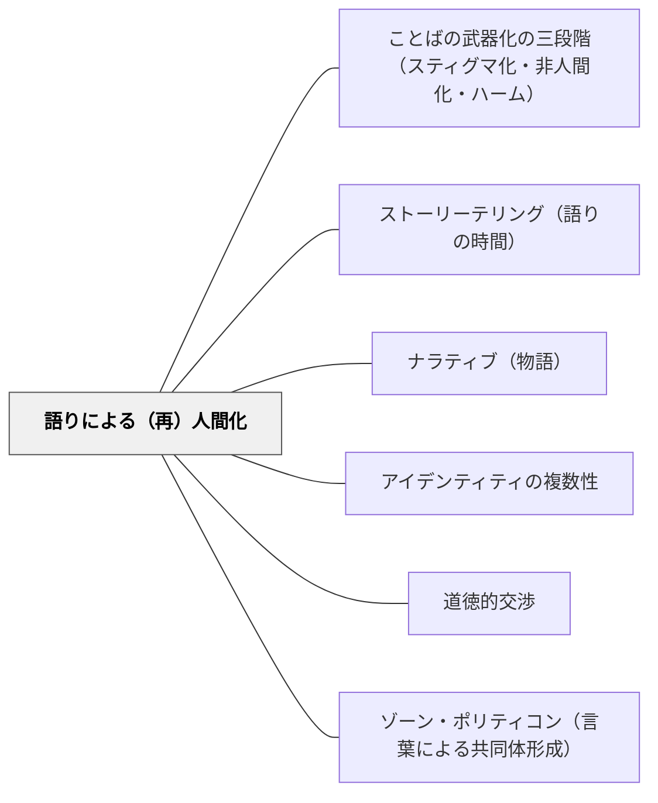

# 語りによる（再）人間化

> 排除され、ラベルを貼られ、「ものあつかい」されてきた人が、自分の声で語るとき——その語りが本人と聴き手の両方を（再び）人間にする。

## Pattern Connection（Pentón Herrera, 2026）

**位置づけ**：Pentón Herrera（2026）は第4章「Moving Forward」で、ことばの武器化への対抗実践として「語りによる（再）人間化（Storytelling as (Re)Humanization）」を提唱した。非人間化のプロセスが「人間を『もの』にすること」であるなら、語りはその逆——「もの扱いされた人が、声・経験・複数性を持つ人間として現れる」実践である。

**（再）人間化（(Re)Humanization）の三機能**：
1. **当事者への機能**：自分の経験を語ることで、付与されたラベルから解放され、自己のナラティブを取り戻す
2. **聴き手への機能**：他者の語りを聴くことで、道徳的脱感作が解け、その人を「だれか（someone）」として認識し直す
3. **集団的機能**：周縁化された声の語りが集まることで、沈黙させられてきた歴史・経験が共有財産になる

**このWikiの他のパタンへの接続**：
- [[パタン/ストーリーテリング（語りの時間）]] は「書く前に語る」という書き手育成の実践だが、本パタンはその実践の持つ根本的な意義——語りが語り手を「書き手のコミュニティの仲間」として存在させること——を「人間化の実践」として再解釈する
- [[パタン/ナラティブ（物語）]] のベンヤミン的理解——「物語は語り手の経験を宿す」——は、本パタンにおける「個人の語りが沈黙させられた経験を取り戻す」機能と共鳴する
- [[パタン/ことばの武器化の三段階（スティグマ化・非人間化・ハーム）]] の第2段階（非人間化）への直接的な対抗実践

---

## 背景（Context）

歴史的に、「語る権利」は不平等に分配されてきた。「誰の声が語る価値があるか」「誰の物語が正史になるか」——これ自体が権力の作用である。マイノリタイズされた集団の物語は周縁化され、書かれず、語られず、聴かれなかった。この沈黙が非人間化を支える。

教室においても、語る機会が偏ることがある。特定の子が「語る子」として固定され、他の子は「聴く子」に留まる。特別支援学級の子ども・外国にルーツを持つ子ども・「問題児」とラベルされた子どもの声は、教室の物語から抜け落ちることがある。

## 問題（Problem）

排除や差別を経験した人が、その経験を語れる場がないとき、二つのことが起きる。第一に、当事者は自分の経験を「語れないもの」として内在化し、自己沈黙する。第二に、周囲の人は当事者を「語る主体」として認識する機会を失い、「もの」として扱い続ける。語りの欠如が非人間化を強化する。

## 力のかたち（Forces）

- 語ることは自己開示——聴き手への信頼と心理的安全が必要。語りを強制することは逆効果になる
- 「正しく語れ」という圧力（文法・形式・内容の評価）が語り手を沈黙させる
- 聴く側の姿勢——共感・傾聴・受け止め——が語りの（再）人間化機能を実現する
- 一つの語りが「代表」として扱われると、当事者に「自分の集団全体を代弁する」負荷をかける
- 語りが承認・賞賛だけを求める場になると、批判的・複雑な語りが出にくくなる

## 解決（Solution）

**「語る権利」を意図的に設計し、周縁化されてきた声が教室に存在できる場をつくる。語りの聴き手も同時に育て、語りが（再）人間化の双方向的な体験となるようにする。**

---

### 語りの場を設計する三つの原則

**① 「語る価値がある話」の定義を広げる**

「特別な体験だけが語る価値がある」という前提を解く。日常——家族との朝食・帰り道の発見・気になっていること——が語りの素材になる。Horn & Giacobbe（2007）が示すように、「あなたの話を聞かせて」という一言で誰もが語り手になれる（→ [[パタン/ストーリーテリング（語りの時間）]]）。

**② 聴き手の文化を育てる**

「聴く」とは消極的な受け取りではなく、「この人を『だれか』として認識する」能動的な行為。語り手が話している間、「この人にはどんな歴史・家族・好みがあるか」を意識して聴く練習を教師がモデルになって示す。

**③ 多様な声を教材に招き入れる**

教科書の「正史」や「主流の声」だけでなく、周縁化されてきた語りを教材として取り上げる。「この人は何を経験したか」「何が語られ、何が語られなかったか」を問うことで、聴き手としての批判的な読み取りが育つ。

---

### 実践例①：「私の話には価値がある」

週1回、5〜10分の「語りの時間」を設ける。洗濯バサミ（または割り箸）をランダムに引いて語り手を決める。語り手は「今週気になっていること」を話す——テーマは何でもよい。教師は「それから？」「どう感じた？」と問いかけて引き出す役に徹する。

目的：すべての子どもが「自分の語りはクラスに受け取られる」という体験を積む。

---

### 実践例②：「この人の声を聴く」読書・鑑賞

授業で取り上げる人物・出来事を選ぶとき、「誰の声がこれまで聞かれてきたか」「誰の声が語られてこなかったか」を意識する。語られなかった側の語りを補う素材（詩・絵本・手紙・インタビュー）を組み合わせ、「物語の空白」を問う。

> 「教科書にはAという人の話がある。でもBはこのとき何を感じていたと思うか？」

---

### 実践例③：自己の語りを作る

「私の経験から話す」というアクティビティ。自分が「ラベルを貼られた経験」「誤解された経験」「初めてわかってもらえた経験」を短く語る（記名でも無記名でも）。語りを書き、読み合うだけでも、「この子にそんな経験があったのか」という（再）認識が起きる。

## 結果（Consequences）

- 周縁化されてきた声が教室の物語に入り、クラスの「知っていること」が広がる
- 語る体験を通じて、語り手が自己のナラティブを取り戻す
- 聴く体験を通じて、他者を「だれか」として認識する力が育つ
- 「語る権利」が不均等になると逆効果になる——設計の細部（順番・聴き方・フォロー）が重要
- 語りが評価対象になると、語り手が「うまく語れない」ことを恐れる——評価しない場であることが必要

## 関連パタン

- [[パタン/ことばの武器化の三段階（スティグマ化・非人間化・ハーム）]] — 非人間化への直接的対抗実践として語りを位置づける
- [[パタン/ストーリーテリング（語りの時間）]] — 語りの場の設計の具体的な実装。本パタンはその持つ（再）人間化的意義を明示する
- [[パタン/ナラティブ（物語）]] — 物語は語り手の経験を宿す（ベンヤミン）——語りの根本的な力の哲学的基盤
- [[パタン/アイデンティティの複数性]] — 語りが単一ラベルを超えた複数の自己を示す
- [[パタン/道徳的交渉]] — 排除された声を聴くことが道徳的問いを生む
- [[パタン/ゾーン・ポリティコン（言葉による共同体形成）]] — 語りが価値を共有する共同体を再建する言語的実践

## クラスター図

## Actionable Insight

- 週に1回「誰でも語れる5分」を設け、割り箸などでランダムに語り手を選ぶ——どの子の話もクラスが受け取るという経験が積み重なる
- 授業で「語られなかった視点」に名前をつける——「教科書にはAの声がある。Bは何を感じていたか？」という問いが聴き手としての想像力を育てる
- 自分が「誰かにわかってもらえた瞬間」を書いて読み合う活動をする——語りが承認体験を共有の財産にする

## 出典

- Pentón Herrera, L. J. (2026). *Language Weaponization*. Cambridge University Press. DOI: 10.1017/9781009789318
- Horn, M., & Giacobbe, M. E. (2007). *Talking, Drawing, Writing: Lessons for Our Youngest Writers*. Stenhouse Publishers.
- Benjamin, W. (1936). Der Erzähler. 邦訳：ベンヤミン「物語作家」

[[文献/Language Weaponization（Pentón Herrera）]]
