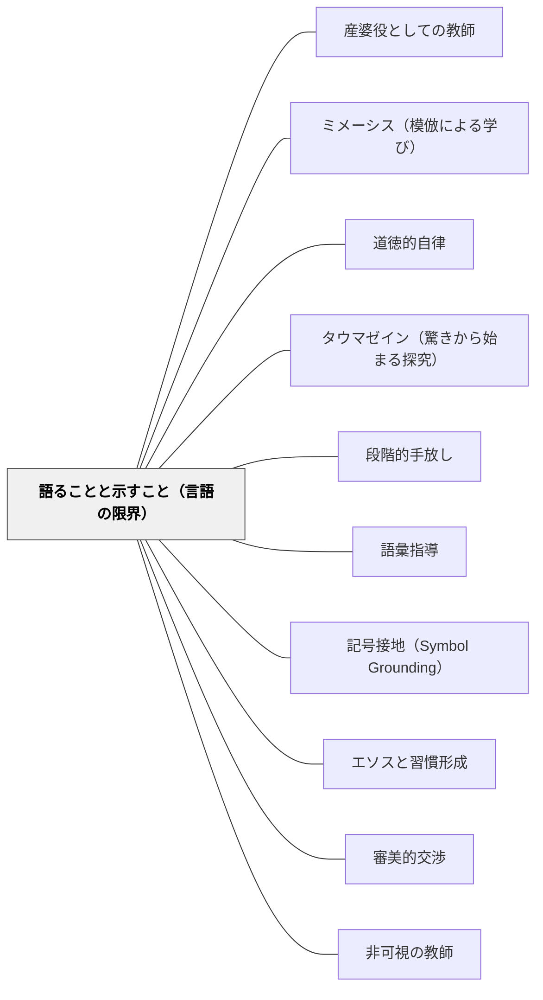

# 語ることと示すこと（言語の限界）

> 「語りえないものが存在する。それは自らを示す。」——ウィトゲンシュタイン（命題6.522）  
> 最も重要なことは命題に語れない——だから教師は「示す」存在でなければならない。

## [Pattern Connection]

### ウィトゲンシュタイン（1921）論理哲学論考——語る/示す（Sagen/Zeigen）の区別

ウィトゲンシュタインは『論理哲学論考』（4.12–4.121, 6.41–6.421, 6.522, 7）において、言語にできることとできないことを根本から区別した。

**語ること（Sagen）**：命題は事実を語ることができる。「猫がマットの上にいる」「水は100℃で沸騰する」——これらは命題として明確に語られる。

**示すこと（Zeigen）**：しかし命題と世界の共有する論理形式そのものは命題によって語られることができない。それはただ示される（sich zeigen）のみ。論理・倫理・美・哲学的自我——これらは語られえず、示されるだけである。

> 「命題はそれが世界と共有している論理形式を語りえない。命題はそれを示す。」（4.121）

> 「倫理は語られえない。倫理は超越論的である。（倫理と美はひとつである。）」（6.421）

> 「語りえないことについては、ひとは沈黙せねばならない。」（命題7）

**教育への転換**：
この哲学的区別は、教育の最も重要な問いに直結する——「最も重要なことを教えることはできるのか」。

知識・手続き・定義・ルールは語ることができる。しかし徳・誠実さ・知的勇気・美的感性・学ぶことへの愛——これらは命題に変換されない。「誠実であることが大切です」という命題を語ることはできるが、それによって誠実さは伝わらない。誠実さは誠実な人の存在を通じてのみ示される。

**「はしごを捨てる」（6.54）**：
命題は「はしご」として機能する——それ自体は足場であり、学習者が自力で登り終えたとき捨てなければならないものである。

> 「私の命題はこのようにして解明となる。私を理解した者は、これらの命題によって—これらの命題の上に立って—これを乗り越えたとき、最終的にそれらを無意味と認識する。彼はいわばはしごを昇り終えた後にはしごを投げ捨てなければならない。」（6.54）

教師が与えるすべての言葉・説明・ルールは「はしご」である——最終的には学習者がそれを捨てて自分の足で立てるように設計される必要がある。

**既存パタンとの関連：**
- **産婆役としての教師への接続**：「語るのでなく産む手伝いをする」という産婆役の機能は、Sagen/Zeigenの区別で哲学的に根拠づけられる。教師が最終的に「示す」存在であることの言語哲学的基盤。牧口の「知識は伝達し得べからず」もSagenではなくZeigenへの要請として読める。
- **補強点**：道徳的自律は語られた規則から生まれず、示された生き方から生まれる——カントの「内から立ち上がる道徳法則」も、ウィトゲンシュタインの「倫理は超越論的」（6.421）も同じ構造を持つ。
- **波及するパタン**：[[パタン/道徳的自律]] — 倫理の超越論性：道徳は語られる命題によってではなく、示される生き方によって形成される；[[パタン/タウマゼイン（驚きから始まる探究）]] — Das Mystische（語りえないものが示される）はタウマゼインの根源的形態；[[パタン/ミメーシス（模倣による学び）]] — 「示す」ことへの応答として模倣が機能する

---

### Kern（2026）——OC/PIへの拡張：「示す」ことが知識そのものの形式

Andrea Kern *Wittgenstein and Skepticism*（2026）は、TLPの語る/示す（Sagen/Zeigen）の区別が、後期ウィトゲンシュタイン（PI・OC）においてどのように発展したかを明確にする。

**TLPからOC/PIへ：**

TLPでの区別は「命題が語れること/論理形式が示すこと」だった。後期では、この区別が「知識について」にも適用される：

- 「知識」を外から理論として語ろうとすること（第三者的認識論）= Sagen の試み
- 「知識」が知る主体の内側から自ずと示されること（一人称的認識論）= Zeigen の形式

**知識は「示すこと」の形式を持つ（PI 150, OC 374）：**

> 「知るという語の文法は、明らかに『できる』『〜できる』という語の文法と密接に関係している。」（PI 150）

「知っている」とは「できる」という能力の発動であり、それは体験者の内側から示される——外から理論として語ることで捉えられるものではない。

さらにOCは「instructionの場」を通じてZeigenの実践形態を与える：

> 「子どもに『これがあなたの手だ』と教える。決して『これがおそらくあなたの手だ』とは教えない。それがどのように子どもが手に関する無数の言語ゲームを学ぶかである。」（OC 374）

教師が疑いを差し挟まずに断定することは、知識を「示す」という意味でZeigenである。「おそらく」という留保は、謙虚さではなくZeigenを壊す行為になりうる。

**修復（restore）と示すことの関係：**

懐疑論者は知識を自分で使えなくしている。ウィトゲンシュタインの仕事は「示す」ことによって懐疑論者の知識を修復すること——「言語ゲームを経験によって説明する」のでなく「言語ゲームを勘定に入れる」（PI 655）こと。

学習者が「わからない」と言うとき、より詳しい「語り」を重ねるのではなく、すでに学習者が持っている理解が「示される」条件を作ることが修復的指導である。

| TLPの語る/示す | OC/PIへの拡張（Kern 2026） |
|---|---|
| 命題が語れること vs. 論理形式が示されること | 知識を「外から理論化」すること vs. 知識が「内側から示される」こと |
| 道徳・美は語れず示される | 知識の在り方自体が語れず示される |
| はしごを投げ捨てる（6.54） | 懐疑論者の知識を「修復する」（restore） |

**補強された点**：「示す（Zeigen）」の概念が命題論的次元（倫理・美・論理形式）から認識論的次元（知識の在り方）へと拡張される。

**他のパタンへの波及**：[[パタン/能力としての知識（知ることはできることだ）]] — 能力としての知識はZeigenの認識論的展開；[[パタン/アスペクトの気づき（もう見えていたのに見えていなかった）]] — アスペクト知覚はZeigenの知覚論的展開；[[パタン/産婆役としての教師]] — instructionの場はZeigenの教育的実践形態；[[文献/Wittgenstein and Skepticism（Kern）]] — 本統合の出典

---

## 背景（Context）

学校では「何かを教える」ことに多くの時間が使われる。教師は語り、説明し、定義し、指示する。語ることは教師の中心的な活動だと思われている。

しかし最も重要なことを考えてみる——「誠実であれ」「知的に謙虚であれ」「学ぶことを愛せ」「他者を尊重せよ」——これらを「語る」ことで伝えようとすると、何かが決定的に欠ける。

ウィトゲンシュタインが哲学的に明らかにしたように、命題（語られること）が表現できるのは事実の世界の出来事だけである。価値・意義・徳・美的感性は「事実」ではなく、命題の外にある——「超越論的」（6.421）である。だから命題として語っても本質的には届かない。

子どもは語られた道徳の規則を暗記できる。しかし道徳的に行動する人間には、語られた規則を学んだだけでは育たない。

## 問題（Problem）

「語れること」と「示されること」を区別せずに授業を設計すると、最も重要なことが「語り」に変換されてしまう。

- 「思いやりを持ちましょう」（語られた規則）→ 思いやりは育たない
- 「勇気を持ちましょう」（語られた規則）→ 勇気は語れない
- 「学ぶことは楽しい」（語られた主張）→ 押しつけられた楽しさには説得力がない

一方、語るべきことを「示す」だけにすると明確さが失われる。手続き・定義・事実は明確に語られなければならない。語ることと示すことの混同が、道徳教育・人格教育・美的教育を形式的にする。

## 力のかたち（Forces）

- 命題に変換できる知識（手続き・定義・事実）は語ることで教えられるが、徳・美・論理形式のような構造は命題に変換されない
- 「言語の限界が世界の限界」（5.6）——語彙を持たない子どもはその現実を捉えられない；だが語彙さえ与えれば世界が広がるわけではない（記号接地の問題）
- 教師の「示す」姿は語られた内容より強力に作用することが多い——言行不一致を子どもはすぐに見抜く
- 「示す」だけでは何を見ればいいか学習者に分からない場合がある；「語る」が「示す」の準備・注釈になることもある
- 命題（はしご）は使い終えたら捨てるもの——いつまでも規則・手続きに依存させる設計は卒業を妨げる

## 解決（Solution）

**教育目標を「語るべきもの」と「示すべきもの」に区別する。語ることで伝えられる知識は明確に語り、語ることでは伝えられない徳・美・誠実さ・学ぶ喜びは、教師自身が体現して示す。命題（足場）は最終的に学習者が不要にできるよう設計する。**

---

### 「語る」と「示す」の仕分け表

| 語ること（Sagen）で伝えられる | 示すこと（Zeigen）でしか伝えられない |
|---|---|
| 計算の手順・公式・定義 | 数学の美しさ・問いへの喜び |
| 道徳の規則・法律の条文 | 誠実さ・勇気・思いやりの姿 |
| 文法規則・語の定義 | 言葉への愛・丁寧な語り方の感覚 |
| 歴史的事実・科学的知識 | 事実に驚く感性・探究する態度 |
| 手順・型・公式 | 型を超えた判断・「なぜ」への好奇心 |

---

### 「示す」教育設計の三原則

**原則①：教師が体現する**
語っていることを、教師自身が生きていること——これが「示す」の最も基本的な形。「知的誠実さが大切」と語る教師が、自分の間違いを認めない場合、子どもは語られたことより示されたことを学ぶ。

**原則②：素材が示す**
文学・芸術・歴史上の人物・科学者の伝記——これらは「誠実さとは何か」「勇気とは何か」を命題として語るのでなく、具体的な生き方・作品・行為を通じて示す。道徳教育の素材として「語れる規則」より「示せる物語」を優先する。

**原則③：はしごの設計——卒業を目指す**
手続き・ルール・足場は「最終的に捨てられるためにある」という意識で設計する。「この九九の表は、いずれ頭の中に入れてしまって不要になる」「この書き方の型は、慣れたら自分の型に変えていい」——足場の卒業を見越した設計。

---

### 具体例①：道徳の授業で「語る」と「示す」を使い分ける

❌ 「友達を大切にすることが大切です。なぜなら……」（語る）  
✅ 友達を大切にしていた人物の物語を読む、または友達のために困難に立ち向かった体験を振り返る（示される）

命題としての道徳規則を語ることは確認として有効だが、それだけでは道徳的感性は育たない。物語・実例・体験を通じて「示される」徳に触れるとき、子どもの内側に何かが目覚める。

---

### 具体例②：算数の「はしごの設計」

三角形の面積の指導において：
- 足場（はしご）：「底辺×高さ÷2」という公式の語り（Sagen）
- はしごの用途：公式を使って計算する練習
- はしごを捨てる：「なぜ÷2なのか」を実際に切って組み替えて理解した後、公式が「見え見えになる」——もはや公式を意識しなくても面積が分かる状態

「公式を暗記させる」だけでは、はしごを渡して終わりになる。「なぜ÷2か」を理解させることで、はしごを捨てた後の「見え方」の変化が起きる。

---

### 具体例③：教師が「示す」瞬間

授業中に教師が間違えた。子どもが指摘した。そのとき教師が——

❌ 「ああ、そうでしたか。では次に進みましょう」（事実だけ語る）  
✅ 「ありがとう、気づいてくれて。先生も間違えることがある——だからこそ確認し合うことが大事だね」（誠実さと知的謙虚さを示す）

語られた謙虚さより、示された謙虚さの方が子どもに伝わる。

---

### 具体例④：自己教育への適用

数学の自己学習において：
- 「解法を語る（Sagen）」だけでは不十分——解法を自分が実際に使い、体験することで「示す」ことが起きる
- 解けない問題に粘り強く向き合うことを示す経験——「諦めない態度」は自分自身に「示す」
- 足場の卒業：補助線の技法を意識して使う段階から、気づいたら使えている段階へ

## 結果（Consequences）

- 教師が「語ること」だけに集中する過負荷から解放され、「示すこと」——つまり存在・態度・体現——の重要性が明確になる
- 道徳教育が規則の暗記から「示される生き方への接触」へと転換する
- 足場の設計が「最終的に不要になる」という目的を持つようになり、依存を生む設計を避けられる
- 「語れないことを語ろうとする」無駄（空虚な道徳講話・抽象的な心の教育）が識別できるようになる
- ただし：「示す」だけでは何を見ればいいか分からない場合がある——「語る」が「示す」の準備・注釈になることもある（語ると示すの協働）

## 関連パタン

- [[パタン/産婆役としての教師]] — 産婆役は「語らず、問い、示す」——知識は伝達されえないという命題の実践形態
- [[パタン/ミメーシス（模倣による学び）]] — 「示す」ことへの応答として模倣（ミメーシス）が機能する；モデルが示すものを学習者が模倣する
- [[パタン/道徳的自律]] — 倫理の超越論性（6.421）：語られた道徳でなく示された生き方から道徳的自律は育つ
- [[パタン/タウマゼイン（驚きから始まる探究）]] — Das Mystische（6.44, 6.522）：語りえない驚きが探究の出発点
- [[パタン/段階的手放し]] — はしごのメタファー（6.54）：足場は使い終えたら捨てる設計
- [[パタン/語彙指導]] — 言語の限界 = 世界の限界（5.6）：語彙を育てることは世界を広げること
- [[パタン/記号接地（Symbol Grounding）]] — 写像理論（Bildtheorie）：名は対象の代わりをする（3.22）——言語が世界に「接地」するメカニズム
- [[パタン/エソスと習慣形成]] — 示された徳の模倣が習慣化されることで性格が形成される（アリストテレス）
- [[パタン/審美的交渉]] — 美も「語りえず示される」（6.421「倫理と美はひとつ」）——美的教育は語るより示す
- [[パタン/非可視の教師]] — 教師が消えて示すものだけが残るとき、Zeigenが最も純粋に機能する
- [[文献/論理哲学論考（ウィトゲンシュタイン）]] — 本統合の出典

## クラスター図

## Actionable Insight

- 今週の授業の目標を「語れる目標」と「示すしかない目標」に分けて書き出してみる——「示す目標」は教師の態度・素材・体験設計で実現するものとして別に設計する
- 道徳や生き方に関わることを「語り」だけで教えようとしている場面を1つ見つけ、代わりに「示す素材（物語・実例・教師自身の行動）」に置き換えてみる
- 子どもに渡している「足場（手順・型・規則）」のうち、「これは最終的に不要になるはしごだ」と意識して設計できているものと、そうでないものを区別する
- 授業中に自分が間違えたとき、どう反応するかを事前に決めておく——誠実さ・知的謙虚さ・訂正の喜びを「示す」最も自然な機会にする

## 出典

Wittgenstein, L. (1921). *Logisch-Philosophische Abhandlung*. Annalen der Naturphilosophie, 14, 185–262.  
邦訳: ウィトゲンシュタイン著, 野矢茂樹訳（2003/2015）『論理哲学論考』岩波文庫（電子版 2017）

> 「語りえないものが存在する。それは自らを示す。これが神秘的なものである。」——ウィトゲンシュタイン（命題6.522）

> 「語りえないことについては、ひとは沈黙せねばならない。」——ウィトゲンシュタイン（命題7）
