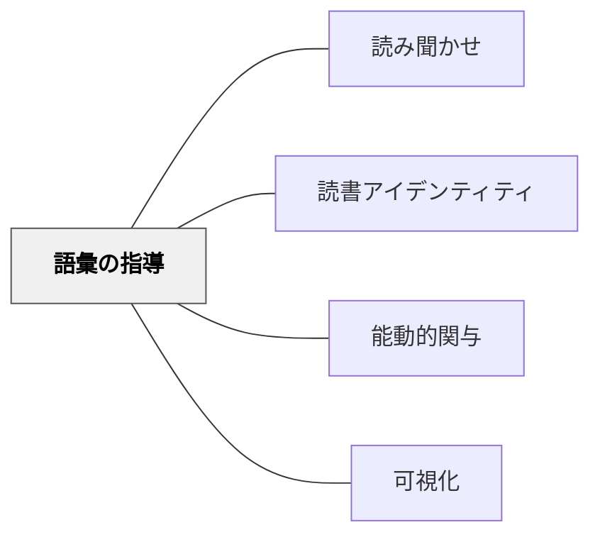

# 語彙の指導

> 語彙は文脈の中で育つ。意味を覚えさせるのではなく、意味に出会わせよ。

## 背景（Context）

語彙力は読解力・表現力の基盤であり、すべての教科学習に影響する。しかし語彙指導は「単語の意味を覚えさせる」ことに矮小化されやすい。意味の暗記と、生きた文脈の中で語彙を習得することはまったく異なるプロセスだ。

読み聞かせや物語の読書の中で出会った言葉は、感情・場面・イメージと結びついて記憶されるため、単独で提示された語彙より定着が深い。

## 問題（Problem）

語彙を文脈から切り離して教えると、意味は一時的には覚えられても実際の読み書きで活用されない。また、語彙量の格差が読解の格差を生み、そのサイクルが固定化される。

## 力のかたち（Forces）

- 語彙習得は文脈との結びつきが鍵——意味と用法は使われている場面から学ばれる
- 低頻度語（アカデミック語彙・専門語）は意図的な指導なしには習得されにくい
- 語彙の豊かさは読書量と相関するが、読書量だけで自動的には語彙は増えない
- 語彙指導に割ける授業時間には限りがある——厳選と文脈活用が必要

## 解決（Solution）

**語彙は文脈の中で意味に出会わせることで育てよ。**

---

### 文脈の中での語彙習得

読み聞かせ・物語読書・説明文読解の中で出会う語彙は、場面・感情・ストーリーと結びついて記憶される。教師が「この言葉、どういう意味だと思う？」と立ち止まり、子どもたちが文脈から推測する経験を重ねることで、語彙習得の方略そのものが育つ。

---

### ティア２語彙（アカデミック語彙）への注目

語彙には3つの層がある：

| 層 | 説明 | 例 |
|----|------|-----|
| ティア１ | 日常会話で自然に習得 | 犬、食べる、嬉しい |
| ティア２ | アカデミックな文脈で頻出・意図的指導が必要 | 推察する、対照的、要因 |
| ティア３ | 特定教科の専門語 | 光合成、分母、俳句 |

**ティア２語彙への意図的な指導**が最も費用対効果が高い——多くの教科にまたがり、理解の深さに影響する。

---

### 語彙指導の実践的手法

- **文脈から推測させる**：読み聞かせを止めて「この言葉、前後の文からどんな意味だと思う？」と問う
- **語彙マップ**：中心語の意味・使い方・反意語・例文を視覚的に整理する
- **くりかえし使う機会をつくる**：習った語彙を振り返りや話し合いの中で意図的に使わせる
- **語彙ノート・語彙日記**：出会った言葉を記録し、自分の言葉で意味をメモする

## 結果（Consequences）

- 語彙が文脈と結びついて定着し、読解・表現の両面で活用される
- 語彙習得の方略（文脈から推測する力）が育つことで、独立した読者に近づく
- 語彙の豊かさが読書への意欲をさらに高める好循環が生まれる

## 関連パタン

- [[パタン/読み聞かせ]] — 語彙に出会う最も豊かな文脈を提供する
- [[パタン/読書アイデンティティ]] — 語彙力は読書の自信と相互に影響する
- [[パタン/能動的関与]] — 語彙に能動的に関わることが定着を深める
- [[パタン/可視化]] — 語彙マップなど思考の外化による語彙整理

## クラスター図

## Actionable Insight

- 今日の読み聞かせで「難しそうな言葉」を1つ選び、「前後の文からどんな意味だと思う？」と全員に問う——正解より推測のプロセスが大切
- 授業の終わりに「今日学んだ言葉を1つ、自分の言葉で説明してみよう」と1分間設ける——アウトプットが定着を促す
- ティア２語彙（「要因」「対照的」「推察」など）を国語・社会・理科の授業で意識的に使い、繰り返し耳に触れさせる

## 出典

Beck, I. L., McKeown, M. G., & Kucan, L. (2013). *Bringing Words to Life: Robust Vocabulary Instruction* (2nd ed.). Guilford Press.
