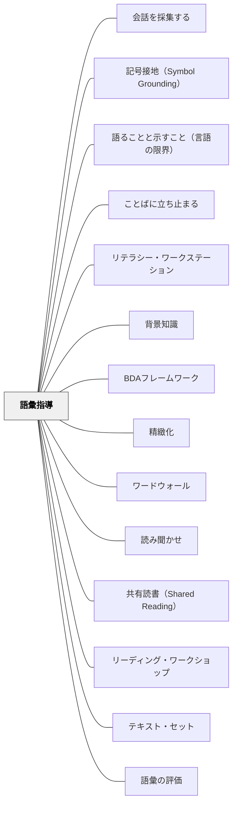

# 語彙指導

> 語彙は単語帳では育たない。読んで、聞いて、使って、つながるなかで——言葉は人に宿る。

## [Pattern Connection]

### 今井むつみ・秋田喜美（2023）言語の本質——語彙習得の認知科学的メカニズム

本書は、語彙指導に関して「なぜ辞書的定義の暗記が機能しないのか」「どのような順序で語彙は習得されるのか」を認知科学的に解明する。

**記号接地と語彙習得——「意味がある」とはどういうことか：**
語彙習得の失敗の根本は「記号接地の失敗」にある。語の定義を別の語で説明するだけでは（辞書学習）、記号が身体・感覚経験に接地しない。Allenが「定義の暗記では語が使えない」と実感したことの認知科学的説明がここにある。

**オノマトペは語彙習得の「第一の足場」：**
子どもの語彙習得の出発点はオノマトペや音象徴——音と感覚イメージの間にアイコン的類似がある語。これが最初に身体に接地する語となり、そこから恣意的な一般語（通常の語彙）へとブートストラップする。

> 「エベレスト登山にたとえるなら、オノマトペは装備を整え、特別な訓練をしていない一般観光客が行けるところくらいまで子どもを道案内する。しかし、その後の登頂までの行程は長く、険しい。」——今井・秋田（2023）

**動詞学習の実証データ——「見せて教える」だけでは不十分：**
3歳児を対象にした実験：
- 「コネケっている」（無意味語）で動作を示す→動作主が変わると同じ動作に適用できない
- 「ノスノスしている」（オノマトペ的造語）で動作を示す→動作主が変わっても同じ動作に一般化できる

オノマトペの音が「このシーンのどこに注目すべきか」を示す情報として機能する。語形そのものが語義の手がかりになる——これは語彙指導における「文脈」の概念を拡張する：単に「文章の文脈」だけでなく「語の音形そのものが持つ感覚的文脈」がある。

**多義語の習得——オノマトペと通常語の違い：**
「切る」の多義（野菜を切る・電話を切る・期限を切る）は互いに感覚的つながりが薄い。対して「コロコロ」の多義（転がる・変わる・丸い）はアイコン的基盤が共有されているため、意味拡張のパターンを子どもが理解しやすい。語彙指導で多義語を扱うとき、その多義がアイコン的か恣意的かで指導の深さを変えることが有効。

**語彙はネットワークとして習得される：**
本書は「語の意味は他の語との関係によって決まる」（語はシステムの一部として抽象的）と論じる。Allenの「リニア・アレイ」（語を意味の程度で並べる）や「コンセプト・ラダー」は、語彙のネットワーク構造を可視化する実践として、この認知科学的な洞察と一致する。

**補強点**：Allen（1999）が「定義の暗記ではなく意味ある文脈での反復」を提唱することの認知科学的根拠が提供される。「文脈の中で語に出会う」ことが語を身体経験に接地させる経路。

**拡張点**：日本語指導において「オノマトペ」が語彙指導の特別な出発点になることが明確になる。日本語は世界的にオノマトペが豊富な言語であり、これを語彙習得の足場として意図的に活用できる。

**波及するパタン**：[[パタン/記号接地（Symbol Grounding）]] — 語彙習得の根本問題；[[パタン/具体から抽象へ]] — オノマトペ（具体）から恣意的語彙（抽象）への道；[[文献/言語の本質（今井むつみ・秋田喜美）]] — 本統合の出典

---

### ウィトゲンシュタイン（1921）論理哲学論考——言語の限界 = 世界の限界：語彙指導の哲学的根拠

今井むつみ・秋田喜美（2023）が語彙習得の認知科学的基盤を示したとすれば、ウィトゲンシュタインは『論理哲学論考』（1921）において語彙指導の**最も根本的な哲学的根拠**を与える。

> 「私の言語の限界が私の世界の限界を意味する。」——命題5.6

**「言語の限界 = 世界の限界」が語彙指導に与える意味：**

この命題は単なる修辞ではない。ウィトゲンシュタインにとって、言語によって語ることができないものは、文字通り「私の世界」の外にある——認識もできず、思考の対象にもできない。言葉を持たないものは、その人にとって「世界に存在しない」に等しい。

子どもの語彙を豊かにすることは、子どもが住める世界を拡張することである：

| 語彙の状態 | 子どもの世界 |
|---|---|
| 「悲しい」しか知らない | 「悲しみ」「哀愁」「切なさ」「望郷」の違いが存在しない |
| 「速い・遅い」しか知らない | 速度・緩急・テンポ・リズムの細かな違いが見えない |
| 「多い・少ない」しか知らない | 豊富・希少・過剰・欠乏・余剰の概念が世界に存在しない |
| 数学語彙が豊かになる | 比率・割合・対称・等価・比例の世界が開かれる |

**語彙指導の三段階と5.6の関係：**

Allen（1999）が示した「言語的連合→部分的概念→完全な概念」の三段階は、5.6の視点から読み直すと：
- **言語的連合**：言葉は世界に「ある」が、まだその世界に入れていない——言語の限界の手前にいる
- **部分的概念**：世界の輪郭が見え始める——言語の限界が拡張しつつある
- **完全な概念**：その語が指す世界を完全に住みこなせる——言語の限界が拡張された

**今井むつみとの接続——記号接地 × 言語の限界：**
今井の「記号接地問題」は「なぜ記号だけでは不十分か」を問う。ウィトゲンシュタインの「言語の限界 = 世界の限界」は「語彙が持つ力の最大値」を示す。両者を合わせると：
- 語彙は世界を広げる力を持つが（5.6）
- その力は語彙が身体経験に接地したときのみ発揮される（今井）
- 記号接地なき語彙拡張は「世界の限界を数えの上だけ広げる」——実際の世界の拡張は起きない

**補強された点**：語彙指導の究極の根拠——「語彙を増やすことは子どもの世界を広げること」——が哲学的に確立される。Allen（1999）の実践論が「なぜ大切か」の哲学的基盤を得る。

**他のパタンへの波及**：[[パタン/語ることと示すこと（言語の限界）]] — 「言語の限界 = 世界の限界」の教育的応用の全体像；[[パタン/記号接地（Symbol Grounding）]] — 語彙拡張には接地が必要——5.6だけでは不十分；[[文献/論理哲学論考（ウィトゲンシュタイン）]] — 本統合の出典

---

読んで、聞いて、使って、つながるなかで——言葉は人に宿る。

## 背景（Context）

> 「言葉は私たちが経験を束ねていく糸だ。」——Aldous Huxley

Janet Allen（1999）は自分のキャリアの大半を「語彙リストを配り、辞書で調べさせ、定義を書かせる」指導法で過ごしてきたことを率直に振り返る。しかしその言葉が生徒の話し言葉や書き言葉に現れることはほとんどなかった。転換点は、広くたくさん本を読んだ生徒 Sarah（10年生）が語った一言だった：

> 「私の言葉が変わっている。どういうことか分からない。あれだけ本を読んで、気がついたら言葉が口から出てくる。どこから来るのか分からないほど。」

「言葉は教えるものでなく、育つものだ」——その認識の転換がこの本の出発点だ。

語彙は読解の土台（[[パタン/背景知識]]）であり、表現の素材であり、学習の道具だ。Davis（1944/1968）の整理では「語彙知識と読解の関係は確かな（unequivocal）ものだ」——語彙量が多いほど、テキストは深く読める。しかし日本の学校では語彙指導が「漢字テスト」や「辞書引き」で代替されることが多く、「文脈の中で言葉に意味をつけていく」過程が意図的に設計されていない。

## 問題（Problem）

語彙リストを覚えても、その言葉は話し言葉にも書き言葉にも現れない。辞書の定義を写しても、テキストの読解には役立たない（Stahl & Fairbanks, 1986）。「語彙が少ない子」のために「もっとリスト・もっと定義」を繰り返すと、「語彙の習得とは退屈な義務だ」というメッセージを送り続けることになる。中学生の率直な声：「語彙指導は最悪。」

## 力のかたち（Forces）

- 語彙知識は「全か無か」でなく段階的に深まる（McKeown & Beck, 1988）——「知っている/知らない」の二分は語彙指導を誤る
- 年間に自然増加する語彙の大半は「読書量」から来る（Nagy et al., 1987）——1日25分の読書で年間約1,000語の自然習得が起きる
- 辞書的定義の指導だけでは読解への効果は生まれない（Stahl & Fairbanks, 1986）
- 「統合・反復・意味ある使用」の三条件が揃って初めて語彙は定着する（Nagy, 1988）
- 語彙を「教える」か「概念を教える」かの区別が必要——既知概念への新ラベルと、概念そのものが新しい場合では指導の深さが異なる（Graves & Graves, 1994）

## 解決（Solution）

**語彙を「定義の暗記」でなく「意味のある文脈での反復的な出会い」として設計する。**

---

### 語彙知識の3段階

| 段階 | 特徴 | 指導の重点 |
|---|---|---|
| **言語的連合（Verbal Association）** | 聞いたことはあるが意味は曖昧 | 広くて豊かな読書・読み聞かせ |
| **部分的概念（Partial Concept）** | なんとなく分かる、複数の文脈で見た | グラフィックオーガナイザーで意味を広げる |
| **完全な概念（Full Concept）** | 深く理解し、別の文脈でも使える | 意味ある文脈での統合・表現・応用 |

語彙を「知っている/知らない」で二分せず、今どのレベルにいるかを把握することが語彙指導の出発点になる。

---

### 語彙習得の3条件（Nagy, 1988）

| 条件 | 意味 | 教室での設計 |
|---|---|---|
| **統合（Integration）** | 既有知識と新しい語彙を結びつける | 既知の概念・経験と関連づける活動 |
| **反復（Repetition）** | 10〜15回の意味ある出会いが必要 | 単元を通じて同じ語が繰り返し登場する仕掛け |
| **意味ある使用（Meaningful Use）** | 実際の文脈で使う・話す・書く | 書く・話す・分類するなどの表現活動 |

---

### 語彙計画の10の問い（Allen, 1999）

テキストを扱う前に教師が問う：

1. この語はテキスト理解にとって最も重要か？
2. 生徒はこの語についてどれくらいの前知識を持っているか？
3. この語は頻繁に出てくるか？
4. この語は多義語（文脈によって意味が変わる）か？
5. この概念は読む前に教える必要があるか？
6. 文脈から推測できる語か？
7. グループにしてまとめて教えられる語はあるか？
8. 生徒の生活と結びつける戦略はあるか？
9. 繰り返し出会わせる楽しい方法はあるか？
10. 意味のある複数の文脈でこの語を使わせられるか？

---

### 3つの読書の道（Mooney, 1990）

語彙は読書から育つ。読書には3つの道がある：

| 道 | 内容 | 語彙との関係 |
|---|---|---|
| **Reading To（読んで聞かせる）** | 教師が読み聞かせる | 生徒自身の読書レベルを超えた語彙に出会える |
| **Reading With（一緒に読む）** | 共有読書・ガイデッド読書 | 語彙方略をリアルタイムで教える場 |
| **Reading By（自分で読む）** | 独立読書 | 年間1,000語以上の自然習得（Anderson et al., 1986）|

> 「必要なのは、より多くの語彙指導ではなく、より多くの読書だ。」——Nagy（1988）

---

### リーン・コンテクスト vs リッチ・コンテクスト

語彙は文脈から学べるかに見えるが、文脈が貧しい（リーン）場合は語義が確定できない。

| 種類 | 例 |
|---|---|
| **リーン・コンテクスト** | 「彼女の軽率さが原因だった。」（「軽率さ」の意味は文から決まらない） |
| **リッチ・コンテクスト** | 「探検隊（Corpsと書いて「コア」と読む。人々が力を合わせる集団のこと）を結成した。」（発音+定義+例が含まれている） |

文脈から語彙を学ぶよう促す前に「この文脈はリッチか」を問う。リーンな文脈では文脈頼りは機能しない。

---

### 語彙方略：Before・During・After

**Before（読む前）——前知識の活性化**

| 方略 | 内容 |
|---|---|
| **リスト・グループ・ラベル** | 主要概念に関連する語をリスト→グループ化→ラベル付け。「脳内のフォルダ」を作る |
| **ワードストーミング** | 関連語を個人→全体で出して整理する語彙版ブレインストーミング |
| **どれだけ知っているか** | 「全く知らない・見たことある・だいたい分かる・使える」の4段階で自己評価 |

**During（読む間）——文脈から読み解く**

| 方略 | 内容 |
|---|---|
| **リッチ・コンテクストの活用** | 語義・発音・類義語が含まれるリッチな文脈から語を推測する |
| **語攻略の12の方略** | 未知語に出会った流暢な読者が使う12の対処法を明示的に教える（下記参照） |

**語攻略の12の方略（Allen, 1999）**——熟達した読者が未知語に出会ったときに使う方法：

1. 文の中での語の位置から意味を考える
2. 辞書で調べ、文の意味と照らし合わせる
3. 教師に聞く
4. 声に出して読んでみる（音から類推する）
5. 同じ文をもう一度読む
6. その文の最初に戻って読み直す
7. 意味を示すキーワードを探す
8. 文脈上「何が来るはずか」を考える
9. 友達に読んでもらって一緒に考える
10. その語の前後を広く読んでから戻る
11. 挿絵・図・グラフがあれば活用する
12. **分からなくても読み進める**（理解に不要な語はスキップしていい）

→ 12番が重要。「知らない語で止まり続けるより、先に進んで文脈が積み上がってから戻る」という熟達者の柔軟さを明示的に教える。この方略リストを印刷して「読む時の道具箱」として生徒に渡すことができる。

**After（読んだ後）——深める・つなげる**

| 方略 | 内容 |
|---|---|
| **コンセプト・ラダー** | 語の見た目・機能・部分・類語などを問いで掘り下げる |
| **コンテクスト−コンテンツ−エクスペリエンス** | 文脈の定義→教科での意味→個人の経験の3コラムで統合する |
| **リニア・アレイ** | 関連語を意味の程度で並べて微妙な違いを視覚化する（例：常に→たびたび→しばしば→たまに→決して） |

---

### 語の構造から学ぶ（形態論的意識）

語の部品——接頭辞・語根・接尾辞——を教えることで、未知語に出会ったときに語の意味を推測できる力が育つ。Allen（1999）は「Part-to-Whole」アプローチとして、**同じ語の部品を繰り返す**方法を推奨する。

**接頭辞の反復法（Allen, 1999）**：

同じ接頭辞を持つ語を連続して提示し、パターンを繰り返す：

```
un-（否定）
unleashed（抑制されていない）
ungrateful（感謝しない）
uninterested（興味のない）
unforgettable（忘れられない）
unpredictable（予測できない）
unpopular（人気のない）
```

各語の「既に知っている同義語」と結びつけることで、パターンが定着する。ポイントは「un- = not（否定）」という一般化が自然に生まれるまで繰り返すことだ。

**日本語への応用**：
- `無-`：無関係・無意識・無限・無条件
- `非-`：非公式・非常識・非現実
- `-的`：科学的・感情的・一般的
- `-性`：可能性・重要性・必要性

**コンセプト・ラダー（語の構造問い）**：

具体的な語を掘り下げる問い：

| 問い | 使い方 |
|---|---|
| 何のように見える・聞こえる？ | 語のイメージを言語化する |
| 何のために使われる？ | 語の機能を問う |
| その部品は何か？（語根・接辞） | 形態論的分析 |
| 何に取って代わったか・何がそれに取って代わるか？ | 概念の歴史・変化 |
| 〜の一種か？（上位語） | カテゴリへの位置づけ |
| 別の言い方は？（類義語） | 語彙ネットワークの拡張 |

抽象的な概念の場合：
- 何が原因か？ / どんな影響があるか？ / 何に関連しているか？ / 何によって解消されるか？

**リニア・アレイ（程度の連続体）**：

意味の程度が異なる関連語を直線上に並べ、微妙な違いを視覚化する：

```
常に → たびたび → よく → ときどき → たまに → めったに → 決して
```

```
懸命な → 熱心な → 真面目な → 普通の → 無関心な → 投げやりな
```

→ 「好き」と「大好き」と「愛している」の違いを問われたとき、リニア・アレイは「語彙は段階的だ」という認識を育てる。

---

### 語彙指導を変える：増やすこと・減らすこと

**増やすこと**：
- 読む時間・豊かで多様なテキストの使用
- 言葉を自然な文脈で聞く・使う機会
- 新旧知識を結びつける機会
- 単語でなく概念を学ぶ学習
- 語彙を自立的に習得する方略の指導

**減らすこと**：
- 定義を写す活動を「語彙学習」と見なすこと
- 文脈理解なしに「文に使う」課題
- テキストの全語を定義しようとする試み
- 単一の定義を求める評価

---

### 具体例①：Sarahの変容（Allen, 1999）

10年生のSarahは語彙の多い本を大量に読んだ後、自分の会話に変化を感じた。「言葉がどこから来るか分からないほど口から出てくる」——これが語彙指導の理想の姿だ。意図的に「教えた」言葉でなく、文脈の中で出会い続けた言葉が自然に使えるようになる過程がここにある。

---

### 具体例②：コールセンターの語彙と文脈理解の事例（Allen, 1999より示唆）

「重くて豊かな語彙が使われているコンテキストで繰り返し読む」ことが語彙を育てる。授業でたった1回の「定義書き」より、3〜5冊のテキスト・セットで同じ語に異なる文脈で出会う設計のほうが、語彙は深まる。（[[パタン/テキスト・セット]]参照）

---

### 具体例③：スラング辞典づくりとコード切替（Allen, 1999）

> 「スラングは袖をまくり、手に唾をつけて働きに出る言葉だ。」——Carl Sandburg

Allen は「生徒がすでに持っている言語的知識」を語彙指導の出発点として尊重することを強調する。「学校語」と「家庭語」の違いを否定するのでなく、「コード切替（聴衆・場面によって言葉を使い分ける力）」として位置づける。

**スラング辞典づくりの活動**：
1. 生徒が「自分たちの言葉」（友達に使うスラング・方言・家庭語）を辞典形式でまとめる
2. それぞれの言葉の「標準語訳」「使われる場面」「使われない場面」を書く
3. クラスで共有し、「この言葉はどんな相手に使うか」を議論する

**この活動が育てるもの**：
- 生徒が言語の研究者・観察者になる視点
- 「言語は聴衆と目的によって変わる」という認識
- 「自分の言葉には知識がある」という自己認識——家庭語を「間違い」として否定されてきた生徒の自己肯定と直結する
- 標準語・学校語も「複数あるコードのうちの一つ」として位置づき、切替が「スキル」として学べる

Meek（1988）の指摘：「学習者が何ができるか・何を知っているかを示す場がなければ、その知識は教師の視野に入らない」——スラング辞典は生徒の言語知識を教室に可視化する装置だ。

---

### 具体例④：「言葉ジャー（Word Jar）」——語彙ノートの一形態（Kyle Gonzalez の実践）

- 生徒が読書・会話・メディアで出会った気になる言葉をスリップに書き、ジャーに入れる
- スリップには「出会った文脈」「予測した意味」を書く
- 毎日2枚引き出し、クラスで議論する

**ねらい**：語彙学習の主体を「教師が教えるもの」から「生徒が集めるもの」に転換する。読書が語彙への意識的な探索になる。

## 結果（Consequences）

- 生徒の会話・作文に「覚えた語彙」が現れ始める
- 語彙に対する好奇心・遊び心が育つ（スラング辞典、語源探し、語の仲間集め）
- 辞書が「最初に行く場所」でなく「確認する場所」になる
- 語彙の量と質が読解力の直接的な伸長につながる
- 語彙テストへの恐れが減り、「知っている度合い」を自己評価できるようになる

## 関連パタン
- [[パタン/会話を採集する]]
- [[パタン/記号接地（Symbol Grounding）]]
- [[パタン/語ることと示すこと（言語の限界）]]
- [[パタン/ことばに立ち止まる]]
- [[パタン/リテラシー・ワークステーション]]

- [[パタン/背景知識]] — 語彙は背景知識の核心。語彙の3段階と背景知識の積み上げは同じプロセスの側面
- [[パタン/BDAフレームワーク]] — Before/During/After に語彙方略を配置する枠組み
- [[パタン/精緻化]] — 統合・反復・意味ある使用は精緻化の三要素と重なる
- [[パタン/ワードウォール]] — 語彙を教室に貼り、繰り返し出会わせる環境設計
- [[パタン/読み聞かせ]] — Reading To による語彙の間接的蓄積
- [[パタン/共有読書（Shared Reading）]] — Reading With による語彙方略の指導
- [[パタン/リーディング・ワークショップ]] — Reading By による語彙の自然増加
- [[パタン/テキスト・セット]] — 同一語彙に複数の文脈で出会わせる設計
- [[パタン/語彙の評価]] — 「使える語彙」を測る評価（Concept Circles・Opposites Hunt・統合の問い）
- [[パタン/数学語彙の文脈的指導]] — 教科語彙への応用（この構造が他教科にも機能する）

## クラスター図



## Actionable Insight

- 今週扱うテキストの語彙を「10の問い」で選ぶ——全部教えようとせず「最も重要な3語」に絞る
- 単元開始時に語彙リストを「どれだけ知っているか」の4段階で生徒に自己評価させる——単元末に再評価することで成長が見える
- 語彙の授業後「この言葉が口から出てきたら記録してみよう」と伝える——言葉が日常に染み出す意識が語彙学習の質を変える
- 辞書で「定義を写す」代わりに「コンテクスト−コンテンツ−エクスペリエンス」の3コラムを使う——文脈の定義+教科の使い方+自分の経験で語が立体的になる

## 出典

Allen, J. (1999). *Words, Words, Words: Teaching Vocabulary in Grades 4-12*. Stenhouse Publishers. → [[文献/Words, Words, Words（Janet Allen）]]

> 「言葉は私たちが経験を束ねていく糸だ。」——Aldous Huxley

Nagy, W. E. (1988). *Teaching Vocabulary to Improve Reading Comprehension*. NCTE/IRA.  
Davis, F. B. (1944). Fundamental factors of comprehension of reading. *Psychometrika*, 9, 185–197.  
McKeown, M. G., & Beck, I. L. (1988). Learning vocabulary: Different ways for different goals. *Remedial and Special Education*, 9(1), 42–52.  
Stahl, S. A., & Fairbanks, M. M. (1986). The effects of vocabulary instruction. *Review of Educational Research*, 56(1), 72–110.  
Anderson, R. C., et al. (1986). Becoming a Nation of Readers. Center for the Study of Reading.  
Nagy, W. E., et al. (1987). Learning word meanings from context during normal reading. *American Educational Research Journal*, 24(2), 237–270.  
Graves, M. F., & Graves, B. B. (1994). *Scaffolding Reading Experiences*. Christopher-Gordon.  
Mooney, M. (1990). *Reading To, With, and By Children*. Richard C. Owen.
