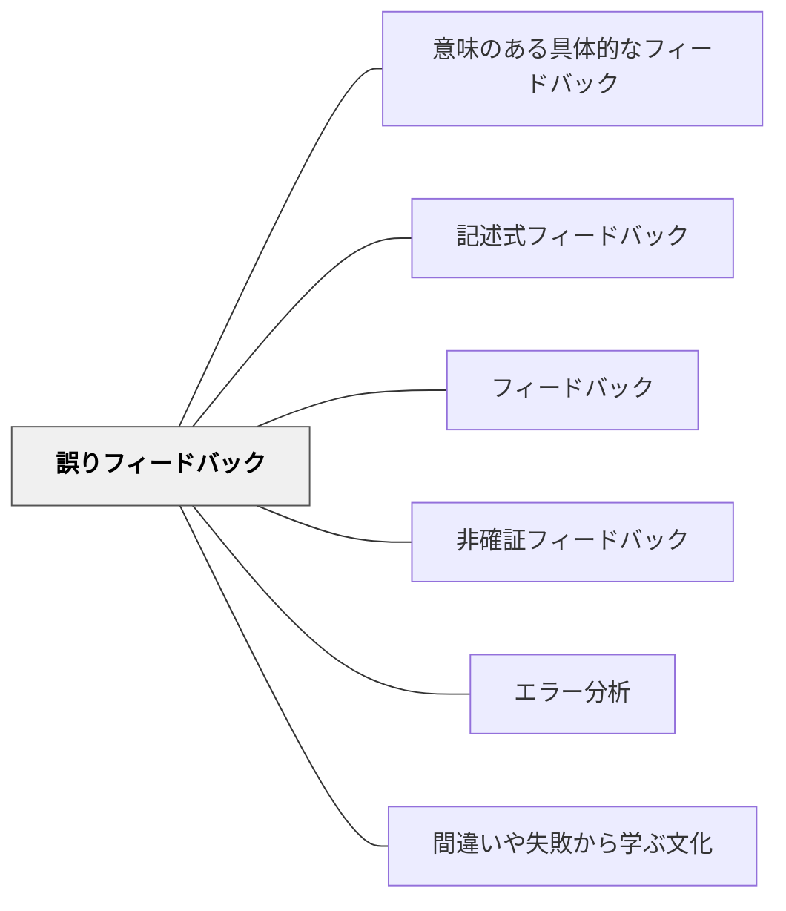

# 誤りフィードバック

> 誤りを「悪いもの」としてではなく学習データとして扱い、誤りの種類を特定して種類に応じた修正を促す。

## 背景（Context）

学習において誤りは避けられない。しかしすべての誤りが同じ原因・意味を持つわけではない。ケアレスミス（注意不足による誤り）、概念的誤解（根本的な理解の誤り）、戦略的誤り（アプローチ・方法の選択ミス）では、それぞれ異なる対応が必要である。

誤りフィードバックは、単に「間違い」と指摘するだけでなく、誤りの種類を診断し、その原因に応じた修正を促すフィードバックである。エラー分析（Error Analysis）として言語教育・数学教育で体系化されてきた実践である。

## 問題（Problem）

誤りをすべて「間違い」として一括して扱うと、学習者は何が問題かを特定できない。ケアレスミスに対して「概念から学び直せ」と言うのは過剰であり、概念的誤解に対して「もっと注意しろ」と言っても改善につながらない。誤りの種類を無視した修正指示は、学習者の時間と努力を無駄にする。

また、誤りを「減らすべきもの」「恥ずかしいもの」として扱う文化では、学習者は誤りを隠したり、チャレンジを避けたりする。誤りをデータとして活用するためには、誤りを安全に開示できる環境が必要である。

## 力のかたち（Forces）

- 誤りには種類があり、種類に応じた修正フィードバックが効果的である
- 誤りを「悪いもの」として扱う文化は、誤りの開示を妨げデータとして活用できなくなる
- 誤りを積極的に分析することは、教師の授業改善にも学習者の自己理解にも役立つ

## 解決（Solution）

誤りを受け取ったときに、まずその誤りがどの種類かを診断する。

- **ケアレスミス**：理解はあるが実行で誤った場合。確認・繰り返しの練習を促す。
- **概念的誤解**：根本的な理解が誤っている場合。概念の再構築が必要。具体例・対比・類推を用いて再説明する。
- **戦略的誤り**：理解はあるがアプローチが適切でない場合。より効果的な方法を示す。

誤りの種類を学習者自身に特定させることが[[パタン/エラー分析]]につながり、自己調整学習の力を育てる。誤りを「学びの証拠」として教室でオープンに扱う[[パタン/間違いや失敗から学ぶ文化]]を育てることで、誤りフィードバックの効果が最大化される。

## 結果（Consequences）

- 誤りの種類に応じた対応で、修正の効率が上がる
- 誤りをデータとして扱う文化が育ち、学習者が誤りを開示しやすくなる
- 教師が誤りのパターンを把握することで授業設計の改善にも役立つ

## 関連パタン
- [[パタン/意味のある具体的なフィードバック]]
- [[パタン/記述式フィードバック]]

- [[パタン/フィードバック]] — 親パタン
- [[パタン/非確証フィードバック]] — 誤りを指摘するフィードバックの基本
- [[パタン/エラー分析]] — 誤りを体系的に分析する実践
- [[パタン/間違いや失敗から学ぶ文化]] — 誤りを安全に扱うための文化的土台

## クラスター図

## Actionable Insight

- 間違いを見たらまず「ケアレスミスか・概念的誤解か・方法の問題か」を10秒診断する——種類が違えば対応が全く変わる
- 「この間違いはどこから来たと思う？」と本人に聞く——誤りの種類を学習者自身が特定する経験がエラー分析の力を育てる
- クラスに多い誤りを「今日の学びの素材」として匿名で取り上げる——誤りを全体で分析することが最も効率的な概念修正になる

## 出典

Corder, S. P. (1967). The Significance of Learners' Errors. *International Review of Applied Linguistics*, 5(4), 161–170.
Hattie, J. (2009). *Visible Learning*. Routledge.
