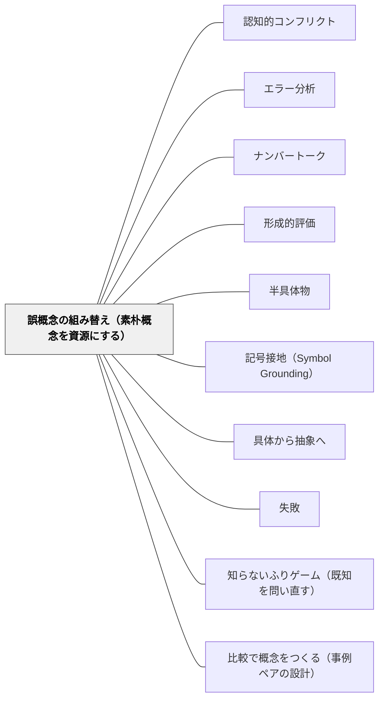

# 誤概念の組み替え（素朴概念を資源にする）

> 誤概念は「白紙の上の誤り」ではない。それまでの経験で機能してきた素朴理論を、子どもが新しい場面まで律儀に運んでくれた結果である。撲滅すべき敵ではなく、「どこまでは正しいのか」をめぐる再交渉の相手——そう扱い直したとき、誤概念は資源になる。

## 背景（Context）

子どもは入学する前から、数と量にまつわる素朴な理論をすでにいくつも持っている。「かけ算をすると答えは大きくなる」「桁の多い数のほうが大きい」「長いほうがたくさん」——どれも自然数や具体物の世界では正しく機能してきた経験則であり、生活の中で何度も「使えた」実績がある。

学校で扱う算数は、その素朴理論の適用範囲の外側に出ていく営みである。小数のかけ算は答えを小さくすることがあり、小数の大小は桁数では決まらず、分数の分母は「大きいほど一つ分は小さい」。素朴理論は「間違っていた」のではなく、「ここまでしか効かなかった」のだ。Smith, diSessa & Roschelle（1993）はこれを「knowledge in pieces（断片としての知識）」と呼び、誤概念の芯にはしばしば正しい直観が断片として含まれていると論じた。撲滅すべき誤りではなく、組み替えるべき資源としての素朴概念——この見方が本パタンの土台にある。

## 問題（Problem）

誤概念は「正しい説明をきちんと聞けば直る」ものではない。教師が黒板で丁寧に説明し、子どもがその場では「わかった」と言い、テストでも正答する。それでも数週間後・別の文脈になると、素朴概念があっさり復活する。これは経験的に強固なものを言葉の説明だけで上書きしようとした結果である。

さらに厄介なのは、子どもが「概念を変えずに表面的な手続きだけ覚える」という回避策をとれてしまうことだ。「×0.5は÷2と同じ」と手続きとして覚えれば、「かけると大きくなる」という素朴概念を維持したまま正答できてしまう。教師から見ると「直った」ように見えるが、概念は何ひとつ組み替えられていない。

Posner et al.（1982）は概念変化が成立するには「現在の概念への不満」「新概念の理解可能性」「もっともらしさ」「有効性」の4条件が要ると論じた。「先生がそう言ったから」では概念は動かない。子ども自身が「これでは説明できない場面がある」と感じ、新しい見方に乗り換える理由が要る。

加えて、誤りを正面から「違うよ」と訂正することは、子どもの自尊心と参加意欲を削る。素朴概念は本人の知的努力の結晶であり、それを「ただの間違い」と片付けられる経験を重ねると、子どもは予想を口にしなくなる——誤概念は地下に潜り、見えなくなる。

## 力のかたち（Forces）

- 素朴概念は経験的に成功してきたため頑健であり、言葉の説明だけでは置き換わらない
- 正面からの否定は自尊心と参加意欲を削る——「間違えるくらいなら黙る」という回避を生む
- 誤概念の芯にはしばしば正しい直観が含まれている（Smith, diSessa & Roschelle 1993の resources観——knowledge in pieces）。芯ごと捨てると貴重な認識資源も失う
- 教師がその単元の典型的誤概念を予測していないと、授業中の発言・誤答を「単なる間違い」として流してしまい、組み替えの好機を逃す
- 概念変化には不満・理解可能性・もっともらしさ・有効性の4条件が要る（Posner et al. 1982）。どれが欠けても変化は持続しない
- 認知的コンフリクトだけを起こすと、一部の子は「わからなくなった」で終わる——コンフリクトを支える足場と再交渉のプロセスが必要
- 誤概念は単元末で直ったように見えても文脈が変わると復活する——一回完結の指導では足りない

## 解決（Solution）

**誤概念を「撲滅対象」ではなく「組み替え対象」として扱う。素朴概念のどこまでが正しく、どこから先が通用しなくなるのか——その適用範囲の境界を、子どもと一緒に再交渉する。**

実装は次の5ステップで進める。①〜③・⑤は既存パタンと重なるが、本パタンの固有部分は④の「組み替え（適用範囲の再交渉）」にある。

1. **予測する（教師の準備）**：単元に入る前に、その単元で典型的に起きる誤概念を3つ書き出しておく。「かけ算は答えを大きくする」「桁が多いほうが大きい」「分母が大きいほうが大きい」など、教科書のどのページで・どの問題で出やすいかまで想定しておく。予測がなければ、誤答は授業中に通り過ぎる
2. **顕在化させる（隠れているものを見える化する）**：診断課題・予想発問・[[パタン/ナンバートーク]]で、子どもの素朴概念を授業の表面に引き出す。「答えを出す前に、まず予想を書いてみよう」と先に言葉にさせると、誤概念は安全に見える形で出てくる
3. **ゆさぶる（[[パタン/認知的コンフリクト]]）**：素朴概念では説明できない反例に出会わせる。「かけると大きくなる」を持っている子に、6×0.5の文章題で「答えは6より小さくなる」場面を見せる
4. **組み替える（本パタンの固有部分）**：ゆさぶりだけで終わらせず、「素朴概念のどこまでは正しかったか」を明示的に言語化する。「自然数のかけ算では答えは大きくなった——これはこれで正しい。ただし小数や分数のかけ算では成り立たない」というふうに、素朴概念を**否定するのではなく適用範囲を縮める**形で再交渉する。子どもの言葉で「いつ使える/いつ使えない」を一緒に書き出す
5. **再訪する（[[パタン/形成的評価]]）**：単元終了時に「直った」と判断せず、数週間後・別の文脈で同じ誤概念がないか診断する。誤概念は復活することを前提にする

---

### 具体例1：「かけ算はいつも答えを大きくする」（Fischbein et al. 1985）

Fischbein et al.（1985）が世界中の子どもで報告した最も頑健な誤概念のひとつ。自然数のかけ算で長年成功してきた直観が、小数のかけ算でつまずきを生む。

授業の流れ:

- 単元の冒頭、「6×0.5の答えは6より大きい？小さい？同じ？」と予想させる（顕在化）。挙手・ネームプレートで分布を可視化する
- 「大きくなる」と予想した子に「どうしてそう思った？」と問う。「いつもそう習ってきた」「かけると増えるから」という言葉が出てきたら、否定せずに黒板に残す
- 数直線で「6を半分にする」操作と「6×0.5」を重ね、答えが6より小さくなる場面を確かめる（ゆさぶり）
- ここからが本パタンの固有部分。「みんなの『かけると大きくなる』はどこまで正しい？」と問い、子どもの言葉で適用範囲を書き出す——「整数どうしのかけ算なら正しい」「1より小さい数をかけると小さくなる」「1をかけると変わらない」。素朴概念を**捨てさせない**ことが要。
- 単元末の数週後、別の文脈（「8×0.25」「リボン2mを0.3倍する」）で再診断する

---

### 具体例2：小数の大小「0.25は0.5より大きい（桁が多いから）」

整数では「12は5より大きい——桁が多いから」が常に正しかった。その経験則を小数にそのまま運んでくると誤概念になる。

授業の流れ:

- 「0.25と0.5、どちらが大きい？」を予想させる。分布を見せる
- 「桁が多いから0.25のほうが大きい」という発言を黒板に残す
- 1mのテープを使い、0.5mと0.25mを実際に並べる。0.1ますに区切られた数直線でも確認する（半具体物・[[パタン/半具体物]]）
- 「みんなが使っていた『桁が多いほうが大きい』というルールは、整数では正しい。小数ではどう？」と問い直す。「0より大きい数として並べたとき、桁の数では決まらない」「小数第一位で勝負がつくこともある」など、子どもの言葉で適用範囲を書き直す
- 「0.5と0.50」「0.4と0.40」のような追加の場面で、組み替えた見方が使えるか確かめる

---

### 具体例3：分数「1/4は1/3より大きい（4>3だから）」

ここでも「数字が大きいほうが大きい」という素朴理論が分母にそのまま適用される。

授業の流れ:

- 同じ大きさの折り紙を配り、「1/3」と「1/4」をそれぞれ自分で折って切り取らせる
- 切り取った一片を並べて比べる——明らかに1/3のほうが大きい
- 「不思議だね、4のほうが大きいのに、できた一片は小さい」と引っかかりを残す（[[パタン/認知的コンフリクト]]）
- 「分ける数が増えると、一つ分の大きさは……？」と問い、子どもの言葉で「分ける数が増えると一つ分は小さくなる」を引き出す
- 適用範囲の組み替え:「分子が同じときは、分母が大きいほうが一つ分は小さい」という限定版のルールに書き直す。「数字が大きいほうが大きい」を捨てさせず、「整数の大小では正しい/分数の分母比較ではひっくり返る」と境界を明示する

---

### 特別支援の視点：顕在化が自己否定にならない設計

誤概念の顕在化は、子どもにとって「自分の考えが間違っていることを公開される」体験になりうる。特に自己評価の低い子・失敗経験の蓄積がある子にとって、これは強いストレスになる。

- **誤答を匿名化して扱う**：「去年こういう答えを書いた子がいたんだけど、どう思う？」「もしAさんがこう考えたとしたら、どこまで正しい？」のように、特定の子の発言として扱わない
- **「予想」段階にする**：答えではなく予想として書かせる。予想は外れていても恥ずかしくない、というルールを学級文化として共有する（[[パタン/失敗（インストラクション）]]）
- **「どこまでは正しい？」と問い返す**：誤答に対して「違うよ」と返さず、「この考え、どこまでは合っている？」と問う。これは特別支援の子だけでなく全員に有効だが、自己評価の低い子にとって特に守りになる
- **適用範囲の言語化を視覚的に残す**：「整数なら○、小数なら△」のような表を教室に貼っておく。記憶に頼らず参照できる形にする

## 結果（Consequences）

**利点：**
- 誤概念が「直ったように見えて復活する」サイクルから、概念そのものが組み替えられた状態へ進める
- 「間違い＝考える材料」という文化が、教師の言葉ではなく授業構造として育つ（[[パタン/失敗（インストラクション）]] [[パタン/エラー分析]] の制度的下支え）
- 教師の側に「典型的誤概念の予測リスト」が蓄積され、教材研究の質が上がる
- 子どもが「自分の考えは無駄ではなかった——適用範囲が狭かっただけだ」と理解できるため、参加意欲が削がれない

**注意点：**
- 認知的コンフリクトを起こすだけだと「わからなくなった」で終わる子がいる。ゆさぶりの後の「組み替え（ステップ④）」を必ず置く——適用範囲を子どもの言葉で再交渉するところまでセットで設計する
- 全単元でやると重い——核となる概念（小数のかけ算、分数の大小、面積と周の関係など、典型的誤概念が頑健な単元）に絞る
- 誤概念リストの作成には教材研究の蓄積が要る。同僚との共有・授業記録の積み上げが前提になる
- 「直ったように見える」現象に注意する。単元末の正答率だけで判断せず、数週間後・別の文脈で再診断する習慣を持つ
- 「素朴概念を尊重する」を言い訳に、誤った概念のまま放置してはいけない。組み替えのゴールは「適用範囲を正しく持つ」状態であり、両論併記ではない

## 関連パタン

- [[パタン/認知的コンフリクト]] — ゆさぶりのステップ③を担う中核手法。本パタンはコンフリクトの後の「組み替え」までを設計する
- [[パタン/エラー分析]] — 誤答のパターンを指導情報に変える実践。本パタンは「誤答の背後にある素朴理論」まで掘り下げて組み替えるところに焦点を置く
- [[パタン/ナンバートーク]] — 複数の考え方を並べることで誤概念が安全に顕在化する場。ステップ②（顕在化）の代表的な舞台
- [[パタン/形成的評価]] — 診断課題による顕在化と単元後の再訪は形成的評価の実装。ステップ①②⑤と直接重なる
- [[パタン/半具体物]] — 組み替えの足場となる表現（数直線・面積図・折り紙）。素朴概念をゆさぶり再構成する素材
- [[パタン/記号接地（Symbol Grounding）]] — 記号操作が素朴概念と接地していないことが誤概念温存の一因。手続きだけ覚えて概念は変わらない構造を説明する
- [[パタン/具体から抽象へ]] — 適用範囲の拡張は具体経験の再構成として進む。「自然数で成り立つ→小数・分数では成り立たない」の組み替えは、抽象化のやり直しでもある
- [[パタン/失敗（インストラクション）]] — 「間違い＝考える材料」の文化が顕在化（ステップ②）の前提。安全に予想を出せる場がなければ素朴概念は地下に潜る
- [[パタン/知らないふりゲーム（既知を問い直す）]] — 教師があえて誤概念を演じて子どもに反証させる応用形。組み替えを子ども側に委ねる発展バリエーション
- [[パタン/比較で概念をつくる（事例ペアの設計）]] — よく設計された事例ペアは「例の運の悪さ」による誤概念の混入を入口で予防する。本パタン（事後の組み替え＝治療）と予防の関係

## クラスター図

## Actionable Insight

- **次の単元の典型的誤概念を3つ書き出してから授業を設計する**——教材研究の冒頭に「この単元でよく起きる素朴概念は何か」を3つ挙げる。Fischbein・Smithらの研究や教科書の指導書、同僚との情報共有から拾い集める。リストがあるだけで、授業中の誤答を「単なる間違い」ではなく「組み替えの好機」として捉えられる
- **授業冒頭に診断1問を置いて分布を見る**——単元の最初の5分で、誤概念が割れる問題を1問だけ予想させる。挙手・ネームプレート・小さなホワイトボードで分布を可視化する。誰がどの素朴概念を持っているかを知った上で授業に入ると、ステップ③〜④の組み替えの解像度が上がる
- **誤答が出たら「どこまでは正しい？」と問い返す**——「違うよ」ではなく「この考え、どこまでなら使える？」と返す習慣をつくる。この一言が「素朴概念は資源だ」というメッセージを構造として伝える。子どもは自分の考えを捨てずに、適用範囲を縮めることで前に進める

## 出典

Posner, G. J., Strike, K. A., Hewson, P. W., & Gertzog, W. A. (1982). Accommodation of a scientific conception: Toward a theory of conceptual change. *Science Education*, 66(2), 211–227.

Smith, J. P., diSessa, A. A., & Roschelle, J. (1993). Misconceptions reconceived: A constructivist analysis of knowledge in transition. *Journal of the Learning Sciences*, 3(2), 115–163.

Fischbein, E., Deri, M., Nello, M. S., & Marino, M. S. (1985). The role of implicit models in solving verbal problems in multiplication and division. *Journal for Research in Mathematics Education*, 16(1), 3–17.
