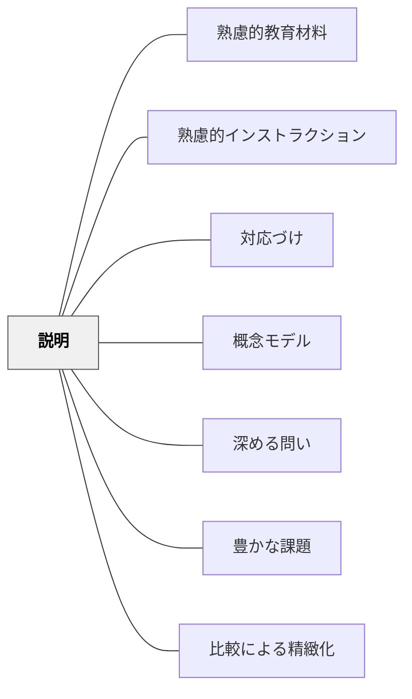

# 説明

> 概念・原理・手順を学習者が理解できる形で説明することが、教材の核となる。

## 背景（Context）

教材の内容要素としての「説明」。単なる情報の羅列ではなく、学習者の既有知識・誤概念・理解のしやすさを考慮した説明の設計が必要。例示・比喩・段階的展開など、説明技法が理解に大きく影響する。

## 問題（Problem）

説明が学習者の理解水準に合っていないと、情報が伝わっても理解に繋がらない。

## 力のかたち（Forces）

- 具体例が抽象概念の理解を助ける
- 説明が長すぎると認知負荷が増す
- 学習者によって最適な説明形式が異なる

## 解決（Solution）

**学習者の既有知識・水準に合わせた説明を設計する。例示・比喩・図解・段階的展開を組み合わせ、理解を段階的に構築する。**

## 結果（Consequences）

- 学習者が概念・原理を正確に理解できる
- 後続の課題への準備が整う

## 関連パタン

- [[パタン/熟慮的教材教具]] — 親パタン
- [[パタン/熟慮的インストラクション]] — インストラクション設計全般
- [[パタン/対応づけ]] — 既有知識との接続
- [[パタン/概念モデル]] — 説明の可視化

- [[パタン/深める問い]] — 説明への問い返しが理解の深化を促す
- [[パタン/豊かな課題]] — 説明を核にした豊かな課題設計
- [[パタン/比較による精緻化]] — 複数の説明の比較が概念の精緻化を生む

## クラスター図

## Actionable Insight

- 新しい概念を説明するとき「身近な例→抽象概念→形式的定義」の順で展開する——具体から抽象への流れが理解の段階的構築を支える
- 「この説明で一番わかりにくかった点は？」を説明直後に問い、即座に補足する——学習者のフィードバックが説明の質を継続的に高める
- 学習者が「自分の言葉でもう一度説明してみて」と言われるくらいシンプルな説明を心がける——過剰な情報量は理解を妨げる。削ることが説明の核心

## 出典

- 鈴木克明（2002）『教材設計マニュアル――独学を支援するために』北大路書房
