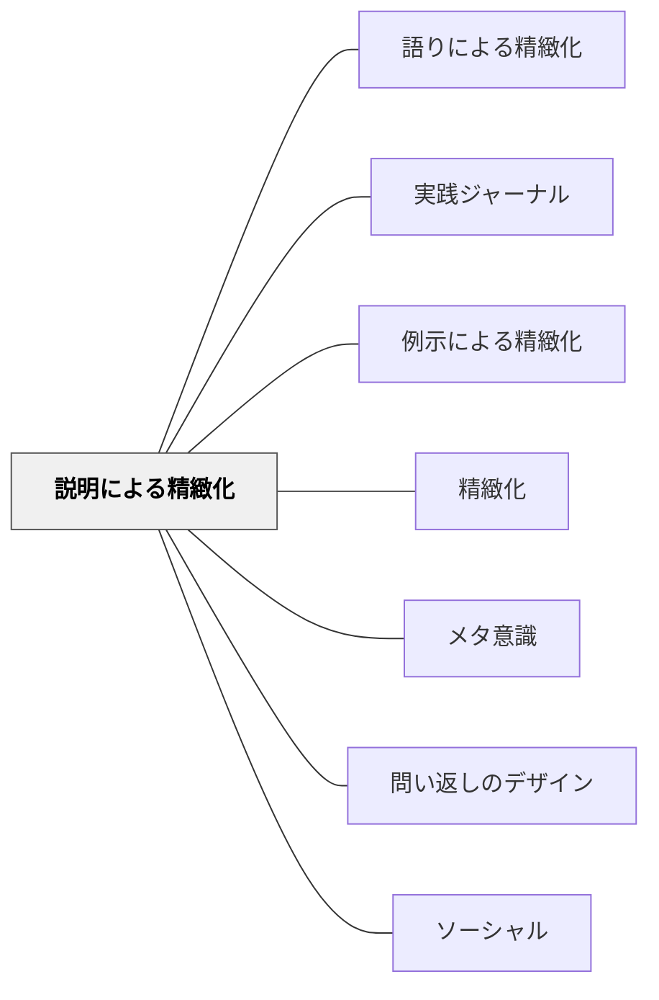

# 説明による精緻化

## 背景（Context）

学習した内容が断片的で、知識同士のつながりが弱いために、記憶の定着や応用的理解が難しい。特に、「新しい概念を学んだ直後」「わかった気になっている状態」「自分の言葉で説明する機会がない授業展開」において生じやすい。

## 問題（Problem）

知識が断片的なまま保持され、「**わかった気になっているだけ**」の状態にとどまる。理解の程度を教師も学習者自身も把握しにくい。

## 力のかたち（Forces）

- 理解が浅くても「わかった」という感覚は生じる（自己評価の不正確さ）
- 他者に説明しようとした瞬間に初めて「わかっていない部分」が明確になる
- 授業時間の制約から、アウトプットの機会が設けられにくい

## 解決（Solution）

学習者が**自分の言葉で他者に説明する**ことを通じて、知識同士の関係性を構造化し、理解を深める。

教師は「説明する場面」を意図的に授業に組み込む：
- **ピアティーチング**：ペアやグループで互いに説明し合う
- **ミニプレゼン**：短い時間で自分の理解を発表する
- **リフレクティブ・ライティング**：学んだことを書いて説明する
- **「○○に説明するとしたら」**：特定の相手（低学年の子、親など）に向けて説明を組み立てる

## 結果（Consequences）

- 説明の中で自らの理解のズレに気づく（**メタ認知の活性化**）
- 知識が自分の中で整理され、他の知識との接続が進む
- 自己表現力・思考力が育ち、他者との意味共有が促進される
- 教師は学習者の思考過程を可視化でき、フィードバックしやすくなる

## 関連パタン
- [[パタン/語りによる精緻化]]
- [[パタン/実践ジャーナル]]
- [[パタン/例示による精緻化]]

- [[パタン/精緻化]] — 親パタン：知識をネットワーク化する学習原理
- [[パタン/メタ意識]] — 説明を通じて自己の理解状態を把握する
- [[パタン/問い返しのデザイン]] — 説明を深める問い返し
- [[パタン/ソーシャル]] — 他者との相互作用による学習

## クラスター図

## Actionable Insight

- 授業の最後に「今日学んだことをペアに2分で説明する」時間を設ける——説明しようとした瞬間に「わかっていない部分」が自分に見えてくる
- 「低学年の子に説明するとしたら」という設定で説明させる——対象を意識した説明が知識の再構成を促し理解の深さを測る最速の方法
- ミニホワイトボードに「今日学んだことの要点」を書かせて教師に見せる——アウトプットの可視化が教師に学習状態を把握させ形成的評価として機能する

## 出典

- パタン集/説明による精緻化.md
