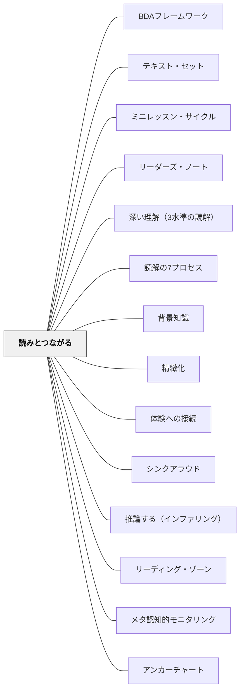

# 読みとつながる

> テキストは、読む者の経験・他の本・世界の知識と出会うことで、はじめて意味をもつ。

## [Pattern Connection]

Harvey & Goudvis（2007）の **Strategies That Work** が提唱する "Making Connections" は、読書を「孤立したテキストの理解」から「読者の既有知識・経験・世界観との対話」へと変える読解ストラテジーの基礎。これは [[パタン/精緻化]] の「体験への接続」（自分の体験と結びつけることで知識が定着する）を読書実践として具体化したものである。

- **補強点**：[[パタン/体験への接続]] に「テキストを読みながら、その場でつながりを意識する」という実践形態を与える
- **修正・拡張点**：「つながり」は多ければよいのではなく、「意味のある理解の深化」につながるかが問われる——「接線的なつながり（Tangential Connection）」と「有意義なつながり（Meaningful Connection）」の区別を指導することが必要
- **他のパタンへの波及**：[[パタン/推論する（インファリング）]]・[[パタン/シンクアラウド]]・[[パタン/リーディング・ゾーン]]

**Harvey & Goudvis（2007）教室の蔵書点検の示唆（2026-05-17）：**

Making Connections の指導において Harvey & Goudvis が指摘する重要な問題：教室の蔵書の約80%はフィクションだが、実生活で読むテキストの80%はノンフィクションである。

**TW（Text-to-World）のつながりとノンフィクション**：
- TS（テキスト⇔自分の経験）は読み始めのつながり指導に入りやすいが、TS だけに偏るとつながりが「自分語り」になる
- TW は背景知識（世界についての知識）を必要とする——TW が豊かな読者は、背景知識も豊かである
- ノンフィクションを多く読む経験が TW のストックを増やし、結果的に TW のつながりが深まる
- **蔵書のバランスを変える**ことが、TW を育てるための環境整備になる

→ [[パタン/重要性の見極め]] の「80%問題」と連動する実践提案：教室のノンフィクション比率を上げることが、つながり（特に TW）の豊かさに直接影響する。

Debbie Miller（2002）の **Reading with Meaning** はこのパタンを「スキーマ（Schema）」という概念で捉え直し、年間指導として体系化する。TS・TT・TW の3つのつながりを「スキーマを意識的に育てる年間活動」として位置づけ、「スキーマは知識の積み重ねであり、読むほど豊かになる」とする。ベン図を使った TT 比較（2つのテキストを比べる）が低学年でも機能することを実践から示し、「同じテキストでも読者によってつながりが違う」——クラスで共有するつながり——をクラスで探る活動が学びのコミュニティを育てる。

**Miller（2002）スキーマ指導の詳細（2026-05-18追補）：**

- **接線的なつながりの問題**：The Relatives Came のつながり指導で Olivia が「モールに行ったことがある」（登場人物がモール近くを通ったから）というつながりを出した。Miller はすぐには指摘しないが、後の指導で「そのつながりは読みをどう深めた？」と問う。読みを深めないつながりを「接線的なつながり」として区別する
- **子どもによる発見**：テイラー・ジャスティン・ケンダルが「小さなつながり vs. 大きなつながり」を発見——「The Wall（Eve Bunting）では、兄が戦争で死んだときのことを思って泣いた。それは小さなつながりじゃない」。意味のあるつながりとそうでないつながりを子どもたち自身が区別し始めた
- **TT つながり**：Amazing Grace（Mary Hoffman）と Oliver Button Is a Sissy（Tomie dePaola）のベン図比較——「夢に向かう子ども」「周囲の偏見」「自分を信じる」という共通テーマを低学年が発見
- **スキーマを育てる（Building Schema）**：著者別（同じ著者の本を複数読む）・テキスト種別・テキスト要素別にスキーマを積み上げる。Topic Study は「ペーパーファイルの比喩」——新しい情報は「すでにある引き出し」に入れるか「新しいファイルを作る」かを子どもが意識する
- **Activating, Building, Revising Schema チャート**：スキーマの3つの使い方を示す年間チャート。スキーマは「起動する（読む前に引き出す）」だけでなく「構築する（読みながら育てる）」「修正する（新情報で更新する）」という3方向で動く

---

## 背景（Context）

熟練した読者は、テキストを読みながら自分の経験や知識を結びつけ、より深い理解を構築している。しかし多くの子どもたちは、テキストと自分の間に意識的なつながりをつくることを知らない。読書指導は「内容を答える」形が多く、「読みながら考えること」が見えにくい。

Harvey & Goudvis は、読者がテキストを「自分のもの」にする最初の入口として Making Connections を位置づける。背景知識（Background Knowledge）がなければ推論もできず、理解も表面的になる。

## 問題（Problem）

「本を読んで感想を書きなさい」だけでは、子どもたちは「あらすじを書く」か「面白かった」で終わる。テキストを読みながらどのように思考すればよいかを知らないと、読書は「情報の受け取り」になり、自分の理解が深まらない。

## 力のかたち（Forces）

- 背景知識が豊かなほど、テキストから引き出せる意味が増える
- 「つながり」は自然に起きるが、意識的に使うことで読解が深まる
- 「何でもつながる」状態（接線的なつながり）は、理解の深化につながらない
- 3種類のつながりを区別して教えることで、子どもは自分の思考を整理しやすくなる
- つながりを記録（テキストコーディング・付箋）することで、読書後の振り返りが豊かになる

## 解決（Solution）

**テキストを読みながら「自分の経験・他のテキスト・世界」とのつながりを意識し、そのつながりが理解をどう深めたかを問い続ける。**

### 3種類のつながり

| 種類 | 略号 | 意味 | 例 |
|------|------|------|----|
| **Text-to-Self** | TS | テキスト ⇔ 自分の体験・感情・記憶 | 「主人公が転んだ場面で、自分が転んで泣いたときを思い出した」 |
| **Text-to-Text** | TT | テキスト ⇔ 別のテキスト（本・記事・映像） | 「これは先週読んだ別の本の登場人物に似ている」 |
| **Text-to-World** | TW | テキスト ⇔ 世界の出来事・社会・科学知識 | 「このニュース記事の内容は、理科で習った温暖化と関係している」 |

---

具体例①：絵本でのシンクアラウド（TS）

先生が「Little Mama Forgets」を読みながら：
> 「（立ち止まって）この場面でおばあちゃんが何度も同じことを聞くのを見て、自分のおじいちゃんが同じことを繰り返していたことを思い出しました。TS って付箋に書いておきます。このつながりがあるから、孫の気持ちがよく分かる気がする」

---

具体例②：読書ノートでの記録

付箋に小さく「TS」「TT」「TW」と書き、思ったことを一言添えてテキストに貼る：

```
TS — 「自分も転んで泣いたことある。主人公の気持ちわかる」
TW — 「これって環境問題のこと？授業で聞いたやつに似てる」
TT — 「前に読んだ○○って本の主人公も同じことしてた。なんで？」
```

---

具体例③：TT のベン図比較（Miller の低学年実践）

2冊の本を読んだ後、ベン図で比べる：

```
[本Aだけ]        [両方]        [本Bだけ]
・主人公が女の子  ・森が舞台   ・主人公が男の子
・冬の話         ・動物が出る  ・夏の話
```

「この2つの本には、どんな共通点があった？違いは？」→ 子どもたちが TT のつながりを図で整理できる。ベン図は1年生でも視覚的に理解しやすく、2冊の本を「見比べる」経験が TT の感覚を育てる。

---

具体例④：「接線的なつながり」を教える

子どもが「主人公の名前がジェームズで、私の友達にもジェームズがいる」と言ったとき：

先生：「それは面白い気づきだね。でも、そのつながりは読んでいる話の理解を深めてくれた？——このつながりが理解の役に立っていないとき、私たちは『接線的なつながり』と呼びます。有意義なつながりは、テキストをよりよく理解するのに役立つつながりです」

（Harvey & Goudvis はこれを "Connections in Common" vs. "Tangential Connections" と呼ぶ）

---

## 結果（Consequences）

- 子どもたちが「読みながら考える」ことを意識的に始める
- 背景知識の活性化が読解の深さに直結することを体験できる
- 読書後の共有・対話が豊かになる（「私は TS があった」「TW も感じた」）
- テキストコーディングと組み合わせることで、読書記録が「思考の可視化」になる

## 関連パタン
- [[実践/読み語りの実践]]
- [[実践/リテラチャー・サークルの起動]]
- [[パタン/BDAフレームワーク]]
- [[パタン/テキスト・セット]]
- [[パタン/ミニレッスン・サイクル]]
- [[パタン/リーダーズ・ノート]]
- [[パタン/深い理解（3水準の読解）]]
- [[パタン/読解の7プロセス]]
- [[パタン/背景知識]]

- [[パタン/精緻化]] — つながりをつくることが精緻化の本質
- [[パタン/体験への接続]] — 精緻化の下位パタン（TS との対応）
- [[パタン/シンクアラウド]] — つながりをシンクアラウドでモデリングする
- [[パタン/推論する（インファリング）]] — 背景知識（BK）がつながりを推論の材料にする
- [[パタン/リーディング・ゾーン]] — 没入読書の中でつながりは自然に起きる
- [[パタン/メタ認知的モニタリング]] — つながりの質を問うことはメタ認知
- [[実践/テキストコーディング]] — TS・TT・TW を記号として記録する実践
- [[パタン/アンカーチャート]] — スキーマとつながりを年間チャートで可視化する

## クラスター図



## Actionable Insight

- 次の読み語りで1回「あ、今これが自分の体験とつながった」と声に出す——子どもが「先生もつながりを考えながら読んでいるんだ」と知る
- 読書後に「TS・TT・TWのどれかを1つ、付箋に書いてみて」と問う——感想文より具体的な思考の記録になる
- 「そのつながりは、本をよりよく理解するのに役立った？」という問いをクラスの言葉にする——つながりの「質」を問うことが読解の深化につながる

## 出典

Harvey, S., & Goudvis, A. (2007). *Strategies That Work: Teaching Comprehension for Understanding and Engagement* (2nd ed.). Stenhouse Publishers.

> "The primary reason for a reader to make connections is to enhance understanding, and it is highly unlikely that sharing a name with the main character... would do that."

Miller, D. (2002). *Reading with Meaning: Teaching Comprehension in the Primary Grades*. Stenhouse Publishers.

> "Schema is background knowledge — it's what we know. The more we read, the richer our schema becomes."

[[文献/Strategies That Work（Harvey & Goudvis）]]
[[文献/Reading with Meaning（Miller）]]
