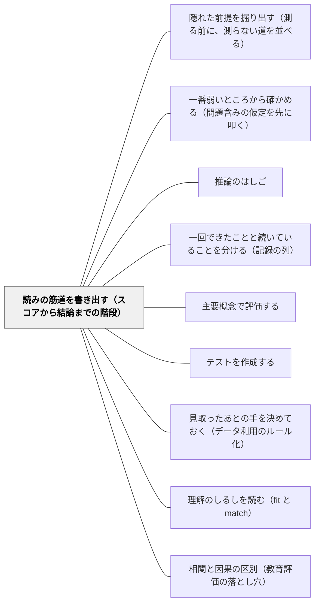

# 読みの筋道を書き出す（スコアから結論までの階段）

> 点から「この子は割合が分かっていない」までは、一段ではない。何段もある。書き出されていない段は、点検のしようがない。

## [Pattern Connection]

本パタンは Kane（1990）の妥当化手続きの **Step 1**——「解釈的論証をできるだけ明確に述べよ」——を教室の手つきにしたものである。Kane の枠組みでは、スコアから結論・決定までの推論と仮定をつないだものが**解釈的論証**であり、その論証を信じてよい理由を集めたものが**妥当性論証**である（→ [[概念/解釈的論証と妥当性論証（何を確かめればよいかを決める）]]）。妥当化はこの二つの区別の上に立つが、実務上いちばん効くのは第一歩のほうである。**書き出すまでは、何を確かめればよいかも決まらない。**

三本で一組をなす。本パタンが**書き出す**、[[パタン/隠れた前提を掘り出す（測る前に、測らない道を並べる）]] が**書かれていなかったものを掘る**、[[パタン/一番弱いところから確かめる（問題含みの仮定を先に叩く）]] が**弱いところを叩く**。順番は動かせない。掘るのも叩くのも、階段が紙の上にあってはじめてできる作業だからである。

この Wiki の既存パタンとの関係では、[[パタン/推論のはしご]] が最も近い。アージリス／センゲのはしごは、事実から行動への飛躍を7段で描き、対話の場で「降りる」ことを勧める。本パタンとの違いは二つある。第一に、Kane の階段は**スコアという特定の観察**から始まる。第二に、Kane は段の**種類に名前を与える**——一般化、外挿、説明、予測、決定。名前があると、その段に何の証拠が要るかが決まる。はしごが「飛躍に気づく」ための道具なら、階段は「飛躍ごとに違う宿題を配る」ための道具である。

[[パタン/一回できたことと続いていることを分ける（記録の列）]] とは、同じ手つきを別の材料に当てている。あちらは記録の列から能力への飛躍を扱い、「集約は証拠を作らない」と言った。Kane の語彙で読み直すと、あの鎖は**一般化と外挿の重ね合わせ**である。同じテストの同じ型で三回できたことから「別の場面でも使える」へ渡る一歩は、一般化ではなく外挿であり、まったく別の証拠を要求する。

[[概念/証拠不足と不成立の区別]] とも接続する。階段を書き出すと、たいていどこかの段に証拠がない。そこで「この段はまだ渡っていない」と書けるのが本パタンの利得であって、「この段は渡れない」と書くこととは違う。

## 背景（Context）

単元テストを採点している。ある子の割合の単元テストが42点だった。採点しながら、頭の中ではもう先へ進んでいる。「割合の意味が入っていない」「もとにする量が取れていない」「来週の時間に取り出して、線分図からやり直そう」。

ここまでが、だいたい数秒である。速いこと自体は悪くない。教師の判断は速くなければ現場で使えない。問題は、速さのせいで**途中がひとつづきに見える**ことである。42という数字と、取り出し指導という決定のあいだに、いくつの主張が挟まっているか——その問いは、ふつう立たない。

同じことが、もっと重い場面でも起きる。ケース会議で、検査結果の数値が読み上げられる。所見が配られる。そのあと「では、通級の方向で」という結論が出る。数値から結論までの道筋は、誰の口からも一段ずつは語られない。語られないまま、全員がなんとなく同じ道を歩いたつもりになる。

Kane がこの領域に持ち込んだのは、新しい妥当性の定義ではない。**手順**である。妥当性の文献は「どうやって証拠を集めるか」を教えてくれるが、「この事例ではどの証拠から集めればよいか」を教えてくれない。Kane の答えは単純である——**その解釈の中に埋まっている推論と仮定を書き出せ。証拠を集める仕事は、そのリストに従わせよ。**

## 問題（Problem）

**スコアから結論・決定までの推論は、書き出されないかぎり点検できない。そして、ふつう書き出されない。**

書き出されないことが、三つの結果を連れてくる。

第一に、**種類の違う飛躍が、同じ確からしさに見える**。「テストで42点だった」から「この単元の内容が入っていない」への一歩と、「この単元の内容が入っていない」から「日常場面で割合の判断ができない」への一歩は、必要な証拠がまるで違う。前者は同種の観察への一般化であり、後者はテスト場面とは重要な点で異なる行動への外挿である。しかし口に出すときは、どちらも同じ調子の一文になる。

第二に、**仮定が仮定として見えない**。Kane はここを繰り返し強調する。論証の欠陥は、たいてい論理の誤りではなく、あやしい仮定に宿る。

> 妥当化の観点からは、仮定が一般に解釈的論証の鍵となる要素である。解釈的論証の欠陥は、論理の欠陥よりも、誤ったあるいは疑わしい仮定に関わる可能性が高い。論理の誤りは一般に検出しやすく修正しやすいが、仮定の弱さはそうではない。**とくに、論証が明確に述べられていない場合には。**

論理の誤りは、書いてあれば誰かが見つける。仮定は、書いていなければ誰も見つけられない。しかも Kane が「隠れている（hidden）」と呼ぶ仮定——論証の一部として意識すらされていない仮定——は、**論証が明確に述べられていないときに最も問題を起こす**。書き出さないことは、隠れる場所を用意することである。

第三に、**崩れたときに、どこまで崩れたのかが分からない**。証拠が一つ出てきたとき、それが読み全体を崩すのか、末端の一段だけを崩すのかは、階段の形が分かっていなければ判定できない。判定できないと、全部捨てるか全部守るかの二択になる。妥当性の問いが yes/no になってしまうのは、たいていこの二択に落ちたときである。

## 力のかたち（Forces）

- **速さ vs 点検可能性**——教師の判断は速くなければ使えない。三十人分の採点をしながら一人ずつ階段を書き出すことは、物理的に不可能である。書き出す対象は選ばなければならない
- **書き出すと結論が弱くなる**——階段を三段書けば、たいてい二段目か三段目に証拠がないと分かる。分かってしまうと、当初の断定が書けなくなる。**書き出す作業は、自分の確信を削る作業でもある**。この痛みが、書き出さない最大の理由である
- **会議は結論を求め、道筋を求めない**——ケース会議も学年会も、時間が限られている。「では通級の方向で」までの道筋を一段ずつ確かめる進行は、遅い進行に見える。進行役でなければ持ち込めない
- **狭い読みほど堅く、広い読みほど役に立つように見える**——「この形式の問題に答える技能」は堅いが、面白みがない。「割合の理解」は動かしやすく、指導計画にも書きやすい。実務は広い読みを求め、証拠は狭い読みしか支えない
- **書き出したものが記録として残るリスク**——階段を紙に書けば、その紙は残る。「この段には証拠がない」と書いた紙が、あとで別の文脈で読まれることへの警戒は、正当な警戒である
- **一般化と外挿の境目がはっきりしない**——Kane 自身が但し書きを置いている。無作為標本を実際に引くことはまずないので、単純な一般化はたいてい適切なモデルではなく、**一般化と外挿のあいだに鋭い区別はない**。教室の見取りはさらに非無作為である（目に付く子から見る、困っている子から見る）。ラベルは厳密な分類ではなく、注意を向けるための道具として使うしかない
- **書き出す言葉を持っていない**——「この一歩は外挿である」と言えるためには、外挿という語を持っている必要がある。語彙がないと、飛躍は飛躍として言語化されず、ただの「気になる感じ」で終わる

## 解決（Solution）

**スコアから結論・決定までを、一段ずつ紙に書く。段と段のあいだに、そこで働いている推論の種類を一語で書き添える。書き出した階段は、そのまま「何を確かめればよいか」のリストになる。**

やり方は三段でよい。単元テストを返す前に、紙の裏でも、採点簿の余白でもよい。

**第一段：観察したこと。** 何点だったか。どの問題を落としたか。ここには解釈を入れない。「42点」「大問3の(2)(3)を落とした」「立式は書いていない」まで。

**第二段：そこから言う結論。** 「もとにする量を取り違えている」。

**第三段：その結論に基づいて打つ手。** 「来週、線分図に戻して取り出しで15分」。

そして——ここが本体である——**段と段のあいだの矢に、一語書く。**

| 一語 | 何をしているか | どんな証拠が要るか |
|---|---|---|
| **一般化** | 観察したその場面から、同種の場面の広い集合へ | 別の日・別の場所・別の採点者でも同じことが言えるか |
| **外挿** | 観察した場面とは重要な点で異なる行動へ | 二つの場面で使われる過程が似ていると言える根拠 |
| **説明** | なぜそうなったかの過程モデルを当てる | その過程モデル自体の妥当さ。他の説明で同じ結果が出ないか |
| **予測** | この先どうなるかへ | スコアと予測対象の関係についての実績 |
| **決定** | 打つ手へ。ここには価値の仮定が入る | 打つ手の効果、そして打たない場合との比較 |

五つ全部を毎回使うわけではない。**使うのは、その矢がどれかを一語で言うことだけである。** 一語書けないなら、その矢は自分でも何をしているか分かっていない。

Kane の一般化の例が、この作業のいちばん短い見本になる。我々は「太郎は配置テストで60点だった」と言う。「太郎は5月6日に第二講堂で受験し、ジョーンズ教授が採点した配置テストで60点だった」とは言わない。

> そこで我々は、**受験の特定の時と場所、そして採点者の選択は、解釈に関係しないと暗に仮定している。**

言い換えの中に、一般化の推論が丸ごと隠れている。しかもこの一般化は、たいていの子については問題ない。問題になるのは特定の子についてである——午後に崩れる子、朝の登校で消耗している子、書字が読み取りにくく採点者によって点が動く子。**「6月12日5時間目・教室が暑かった日・私が採点」を落としてよいかどうかは、子どもによって違う。** 落としていることに気づいていなければ、その違いに気づきようがない。

さらに三つ、書き出すときに効く原則がある。

**読みは作られたものであって、見つかったものではない。** 同じ読解テストのスコアは、「文章に付いた質問に答える技能」とも、「もっと広く定義された読解力」とも、「言語適性の一指標」とも、「知能のようなより一般的な構成概念の指標」とも読める。観察の手続きは、解釈を一意に決めない。

> データを集めるのに用いた手続きは、その手続きで得られた結果に与えるべき解釈を一意に決めない。**我々が、読解テストの結果をどう解釈するかを決めるのである。**

だから、階段の頂上に何を置くかは、テストが決めるのではなく、こちらが選んでいる。選んでいると知ることには実利がある——**狭い読みほど堅い**。Kane の言い方では「おそらく面白みには欠けるが、より確か（more solid, although perhaps less interesting）」である。頂上を一段下げれば、階段は短くなり、証拠は足りるようになる。

**階段には土台があり、崩れ方は非対称である。** 配置テストの例で、「代数の技能についての結論」は他のすべての結論の土台にある。「配置に役立つ」という結論は土台ではない。だから、テストの読解負荷が大きすぎたという証拠は、代数の技能という読みごと崩し、その上に載っていた配置の結論も一緒に崩す。逆に、配置の役に立たなかったという証拠（微積分の担当教員が必要な代数をその場で教えていた、など）は、**代数の技能という読みを必ずしも崩さない**。

> その構造ゆえに、解釈的論証は全体として受け入れるか拒否するかを迫られるものではない。一部を変更ないし拒否しつつ、他の部分を保つことができる。したがって解釈の妥当性についての問いは、**一般に yes / no の答えには至らない。**

これは実務的に大きい。テストの使い方が一つうまくいかなかったからといって、そのテストの読み全部を捨てる必要はない。逆に、下のほうの段が疑わしいと分かったときは、上を全部見直さなければならない。**どこが崩れたかを見て、どこまで崩れたかを言えるようにするために、階段を書く。**

**仮定が弱点である。** 書き出した階段を眺めると、矢の下に「〜だとすれば」が並んでいるのが見える。そこから先は [[パタン/隠れた前提を掘り出す（測る前に、測らない道を並べる）]] と [[パタン/一番弱いところから確かめる（問題含みの仮定を先に叩く）]] の仕事になる。本パタンの責任は、**掘れる場所を作るところまで**である。

---

### 具体例1：単元テストを返す前に、紙の裏に三段書く（算数・第5学年「割合」）

割合の単元テストを採点し終えた。B児は42点。頭の中ではもう「取り出しで線分図から」まで進んでいる。そこで手を止めて、採点簿の余白に三段書いた。

```
観察：42点。大問3の(2)(3)が空欄。大問1（用語）は全問正解。立式の跡なし。
  ↓ 一般化
結論：もとにする量とくらべる量の対応が取れていない
  ↓ 決定
手 ：来週の算数、取り出しで線分図に戻して15分
```

書いてみて、二つのことが起きた。

一つ目。**一段目から二段目の矢に「一般化」と書いた瞬間、これが一般化として弱いことが見えた。** 根拠は同じ紙の上の二問だけである。別の日、別の形式、別の文脈で同じことが起きるかどうかは、この紙からは分からない。「もとにする量が取れていない」は、この二問についての事実ではなく、**この子についての主張**として書かれている。その飛躍がここにある。

二つ目。空欄だったことに気づいた。大問1の用語は全問正解している。**空欄は「分からない」の証拠ではなく、「書かなかった」という事実である。** 時間が足りなかったのかもしれない。立式の書き方が分からなかったのかもしれない。ここは [[概念/証拠不足と不成立の区別]] の出番であり、階段を書かなければ、空欄はそのまま「できない」に化けていた。

書き直した階段はこうなった。

```
観察：42点。大問3(2)(3)は空欄（誤答ではない）。用語は全問正解。
  ↓ ？（この矢に名前が付かない）
結論：保留
  ↓ 決定
手 ：返却時に、大問3(2)を口頭で一問だけ聞く（1分）
```

打つ手が変わった。取り出し15分が、1分の口頭確認になった。**階段を書くことの実利は、たいていここに出る**——確かめる手間のほうが、確かめずに打つ手より安い。

---

### 具体例2：ケース会議で、検査結果から支援方針までを紙で辿る

支援の方向を検討する会議。検査結果の数値、担任の所見、保護者からの聞き取りが並ぶ。従来は、それらが読み上げられたあと、「では、こういう方向で」と結論が出ていた。

やり方を一つだけ変えた。ホワイトボードに縦線を引き、上から順に段を書く。口頭ではなく、書く。

```
観察：〔検査の下位項目の値〕／授業中の様子（教師が見た場面と回数）
  ↓ 一般化    ← この段：見た場面は何場面か。時間帯は偏っていないか
中間の結論：〔どういう困難があるという見立てか〕
  ↓ 説明      ← この段：どういう過程モデルを当てているか。他の説明はないか
説明：〔なぜそうなっているか〕
  ↓ 予測      ← この段：この支援をすると何がどう変わると言っているか
見通し：〔支援後の姿〕
  ↓ 決定      ← この段：何を良いこととして選んだか。誰の負担がどう変わるか
方針：〔支援の形〕
```

書いてみると、毎回どこかの段が薄い。多かったのは、**「説明」の段が空欄のまま「決定」へ飛んでいる**ことだった。何が起きているかの見立て（中間の結論）はあるが、なぜそうなっているかの過程モデルがない。過程モデルがないまま支援の形を決めると、その支援が効かなかったときに、なぜ効かなかったのかも言えない。

もう一つ見えたのが、**非対称**である。この階段では、「どういう困難があるか」の段が土台にあり、「どの支援の形にするか」はその上に載っている。だから——支援の形がうまくいかなかったという事実は、**見立てを必ずしも崩さない**。形を変えればよい。しかし、見た場面が偏っていた（給食の時間しか見ていなかった等）と分かったら、**その上の段は全部やり直しになる**。

この区別が共有されると、会議のふり返りの質が変わる。「支援がうまくいかなかった」と「見立てが違っていた」を、同じ言葉で語らなくなる。

なお、書いた紙は会議の記録として残る。残ることを前提に、書き方は「この段は証拠が薄い」までにとどめ、子どもの属性についての推測は書かない。**階段は、こちらの推論の記録であって、子どもの記録ではない。**

---

### 具体例3：所見を書く前に、この一文は一般化か外挿かを問う

学期末の所見。書こうとしている一文の前で手が止まったら、一語だけ問う。

「授業では意欲的に取り組んでいました」——これは**一般化**である。見た場面から、見なかった同種の場面（同じ教科の、同じような授業）へ広げている。この一般化がどのくらい強いかは、見た場面の数と偏りで決まる。週三回の算数で毎回見ていたのなら、そこそこ強い。四月と七月に一回ずつ見ただけなら、弱い。

「家庭でも意欲的に取り組むことでしょう」——これは**外挿**である。見た場面とは重要な点で異なる場面（教師がいない、友達がいない、時間の枠がない）へ渡っている。そして、**この外挿を支える証拠は、教師の手元にほぼ一つもない**。

二つは日本語としては同じ形の文である。「〜でした」「〜でしょう」の差でしかない。しかし推論としては別種であり、必要な証拠が違う。所見を一文ずつ、一般化か外挿かで振り分けるだけで、書けることの輪郭が変わる。外挿の文が三つ並んでいたら、そのうち二つは削れる。

同じ振り分けは、「この子は算数が苦手です」にも当たる。単元テストの点から言っているなら、それは**外挿**である——テストという場面から、「算数」という広い領域全体へ渡っている。渡ってはいけないという話ではない。渡っていると知っていれば、「算数が苦手」ではなく「割合の単元のテストでは苦戦した」と書ける。後者のほうが、次の担任にとって使える情報である。

---

### 具体例4：同じスコアの読みを、三つ並べてみる

読解のテストのスコアが手元にある。読みを一つに決める前に、三つ書き出してみる。

- **狭い読み**：この形式の文章に付いた設問に答える技能
- **中くらいの読み**：説明的文章の読解力
- **広い読み**：言語能力／国語の力

Kane の言うとおり、テストの手続きはこの三つのどれかを指定しない。**選んでいるのはこちらである。** そして、狭い読みほど堅い。狭い読みは、いま目の前にある紙で実際に起きたことの、ほとんど言い換えに近いからである。

実務でどれを選ぶかは、その読みを何に使うかで決まる。次の単元の入り口でどこから始めるかを決めたいなら、狭い読みで十分であり、狭いほうが精度が高い。一方、保護者に「国語の力が伸びています」と伝えたい場面では、広い読みが要求される。**要求されていることに気づいたうえで広く読むのと、気づかずに広く読むのは違う。** 前者は、広げた分だけ根拠が薄いことを自分で知っている。

この作業には副産物がある。読みを三つ並べると、**その子への言葉が変わる**。「あのテストは、きみの国語の力全体ではなく、説明的文章の設問への答え方を見ていた部分が大きい」と伝えられる。読みが作られたものであることは、子どもにも渡せる（→ [[パタン/理解のしるしを読む（fit と match）]]）。

---

### 具体例5：階段の形を知っていると、崩れたときに全部を捨てずに済む

学年で使っていたレディネスチェックが、実際にはあまり役に立たなかった、という話が出た。チェックで「要支援」に入った子と、単元の中で実際につまずいた子が、あまり重なっていない。

このとき出やすい結論は二つある。「このチェックは使えない、やめよう」か、「いや、参考にはなる」か。どちらも階段を見ていない結論である。

階段はこうなっていた。

```
観察：チェックの正答数
  ↓ 一般化 → 中間の結論：この前提技能が立っている／立っていない
  ↓ 予測   → 見通し：単元でつまずく／つまずかない
  ↓ 決定   → 手：単元の入り口で誰に何をするか
```

役に立たなかったという事実が直接崩すのは、**「予測」の段**である。前提技能の有無と、この単元でのつまずきの関係についての仮定が弱かった。しかしこの証拠は、**その下の「一般化」の段——チェックが前提技能を測れているかどうか——を崩さない**。非対称はここに効く。

だから取れる手は「やめる」ではなく、「予測の段を切り離す」になった。チェックの結果を「つまずきの予測」としては使わず、「前提技能の現状の記録」として使う。単元の入り口で全員に同じ導入をしたうえで、つまずいた子が出たときに、チェックの記録を**説明の材料**として見に行く。使い方が一段変わっただけで、道具は残った。

逆向きの場合も同じ理屈で読める。もしチェックの問題文の読解負荷が高すぎたと分かったなら、それは**土台の段を崩す証拠**であり、その上に載っていたすべてがやり直しになる。**同じ「うまくいかなかった」でも、どの段の話かで、次にすることがまったく違う。**

---

### 自己教育での適用例：「章末問題が解けた」から「次章へ進んでよい」までの階段

数学の独学を続けていると、毎日この階段を無意識に上っている。

```
観察：章末問題10問中8問正解（解答を見ずに、40分）
  ↓ ？
結論：この単元が分かった
  ↓ ？
手 ：次章へ進む
```

矢に一語書いてみる。一つ目は**一般化**のつもりで書いている——この10問から、この章の同種の問題全体へ。しかしよく見ると、10問は無作為標本ではない。章末問題は著者が選んだ代表であり、しかも解いた側は、直前にその章を読んでいる。Kane の但し書きがそのまま当たる——**無作為標本を実際に引くことはまずないので、単純な一般化はたいてい適切なモデルではない**。

そして「分かった」という結論は、たいてい一般化を超えている。**別の文脈でこの概念を使える**、という含みが入っているなら、それは外挿である。教科書の章の中と、次章での道具としての使用と、まったく別の分野での再会は、重要な点で異なる場面である。

二つ目の矢は**決定**である。ここに価値の仮定が入る——「次へ進むほうが、留まるより良い」。この仮定は自明ではない。留まって同じ章を別の角度から見ることの価値と、進んで先の景色から振り返ることの価値は、どちらが上とも決まっていない。**独学では、この決定を止める人が誰もいない。** だからこそ、矢に「決定」と一語書く価値がある。書いた瞬間、それが判断であって観察の帰結ではないことが見える。

実際に書き直した階段はこうなった。

```
観察：章末問題10問中8問（解答を見ずに40分）。落とした2問はいずれも証明。
  ↓ 一般化（弱い：標本は著者選定・直後）
結論：この章の計算型の問題は、直後なら通る
  ↓ 外挿（証拠なし）
結論：この概念を別の場面で使える ← まだ言えない
  ↓ 決定
手 ：次章へ進む。ただし、二週間後にこの章の証明2問だけをもう一度解く
```

書き出した結果として出てきたのは、判定ではなく**宿題**である。二週間後の2問。これは [[パタン/一回できたことと続いていることを分ける（記録の列）]] が「集約の第一の産出は判決ではなく観察の宿題である」と言ったことの、階段版になっている。

## 結果（Consequences）

**利点**

- **飛躍が飛躍として見える**——一段ずつ書くだけで、途中に何段あるかが分かる。「点から取り出し指導まで一段」だと思っていたものが、たいてい三段か四段ある
- **確かめる手間が、確かめずに打つ手より安いと分かる**——具体例1のように、階段を書いた結果、15分の取り出しが1分の口頭確認になることがある。**書き出す作業は、手立てを軽くする方向に働くことが多い**
- **証拠を集める場所が決まる**——「妥当性を確かめる」は漠然としているが、「この矢は外挿だから、二つの場面の過程が似ていると言える根拠を探す」は具体的な作業になる。Kane がこの手続きを持ち込んだ理由がここにある
- **崩れたときの被害範囲が判定できる**——土台の段が崩れたのか、上の段が崩れたのかで、次にすることが変わる。道具を丸ごと捨てずに済む
- **会議の記録の質が上がる**——結論だけを書いた記録は、来年読んでも何も分からない。階段を書いた記録は、「この段が薄かった」という形で引き継げる
- **読みを選んでいるという自覚が生まれる**——同じスコアに三つの読みを並べる作業は、そのまま「今回はどの読みが要るか」の検討になる。狭い読みで足りる場面が、思ったより多いことに気づく
- **子どもに渡せる**——「あのテストは、きみの算数の力ではなく、問題文の読み取りを測っていた部分がある」と言えるようになる。読みが作られたものであることは、自己像の材料としても効く
- **自分の学習にも同じ形で使える**——独学は決定を止める人がいない。矢に「決定」と書くことが、その代わりになる

**注意点・リスク**

- **全部の判断で書き出すことはできない**——三十人分の採点をしながら一人ずつ階段を書くのは不可能である。**書き出す対象を選ぶこと自体が実践の一部**になる。目安は、「重い手を打とうとしているとき」と「気になるのに理由が言えないとき」の二つ
- **書き出すと断定が書けなくなる**——所見も、会議の結論も、書かねばならないものは書かねばならない。本パタンは断定を禁じる道具ではない。**どこから跳んでいるかを知って跳ぶための道具**である
- **ラベルを厳密な分類として扱わない**——Kane 自身が「一般化と外挿のあいだに鋭い区別はない」と書いている。教室の観察はさらに非無作為であり、ほとんどの一般化は外挿寄りである。一語は注意を向けるための札であって、正解のある分類問題ではない
- **書いた紙が別の文脈で読まれる**——階段はこちらの推論の記録であり、子どもの記録ではない。書くのは推論と証拠の所在までにとどめ、子どもの属性についての推測を書き残さない
- **段を増やすことが目的化する**——細かく刻むほど精密になるわけではない。三段で足りるなら三段でよい。段を増やすより、**一つの矢に一語書くほうが効く**
- **「証拠がない」を「成り立たない」と読み替えない**——階段の途中に証拠がないと分かったとき、それは保留であって否定ではない（[[概念/証拠不足と不成立の区別]]）
- **書き出して満足して終わる**——階段を書くのは第一歩であり、Kane の六段階のうちの Step 1 でしかない。掘る（[[パタン/隠れた前提を掘り出す（測る前に、測らない道を並べる）]]）と叩く（[[パタン/一番弱いところから確かめる（問題含みの仮定を先に叩く）]]）が続かないと、紙が増えるだけになる

## 関連パタン

- [[概念/解釈的論証と妥当性論証（何を確かめればよいかを決める）]] — 本パタンの親概念。書き出した階段が解釈的論証であり、それを信じてよい理由の集合が妥当性論証にあたる
- [[文献/An Argument-Based Approach to Validation（Kane, 1990）]] — 原典。本パタンは Step 1（解釈的論証を明示的に述べる）を教室の手つきにしたもの
- [[パタン/隠れた前提を掘り出す（測る前に、測らない道を並べる）]] — 三本一組の二本目。書き出した階段の下から、書かれていなかった仮定を掘る
- [[パタン/一番弱いところから確かめる（問題含みの仮定を先に叩く）]] — 三本一組の三本目。書き出した階段のどこを先に叩くかを決める（Kane の Step 4・Step 5）
- [[パタン/推論のはしご]] — 最も近い既存パタン。あちらは飛躍に気づいて降りることを扱い、本パタンは飛躍の種類ごとに違う証拠を配ることを扱う
- [[パタン/一回できたことと続いていることを分ける（記録の列）]] — 記録の列から能力への鎖は、Kane の語では一般化と外挿の重ね合わせにあたる。集約の第一の産出が観察の宿題であるという主張も、階段版で同じ形になる
- [[概念/証拠不足と不成立の区別]] — 階段の途中に証拠がないと分かったとき、それを保留として書くための区別。空欄を「できない」に化けさせない
- [[概念/妥当性（スコアの意味についての評価判断）]] — 上位の枠組み。妥当なのはテストではなく、そのスコアの読みと使い方であるという前提を、本パタンは手続きとして実装する
- [[パタン/主要概念で評価する]] — 階段の頂上に何を置くかの選択にあたる。どの概念について結論を出したいのかが決まらないと、階段は組めない
- [[パタン/テストを作成する]] — 逆向き設計の一段先。何を問うかだけでなく、問うた結果からどんな階段を上るつもりかまで、作る段階で決めておく
- [[パタン/見取ったあとの手を決めておく（データ利用のルール化）]] — 階段の最後の段（決定）を、あらかじめ言語化しておく機構。本パタンの下流にあたる
- [[パタン/理解のしるしを読む（fit と match）]] — 正答が理解の証拠にならないことを扱う。同じスコアに複数の読みが立つという本パタンの前提と、同じ場所を別の角度から見ている
- [[パタン/相関と因果の区別（教育評価の落とし穴）]] — 「説明」の段で何をしているかを点検する道具。過程モデルを当てる矢は、しばしば因果の主張になっている

## クラスター図



## Actionable Insight

- **次の単元テストを返す前に、気になった子を一人だけ選び、紙の裏に三段書く**——「観察したこと（何点／どの問題を落としたか）」「そこから言う結論」「その結論に基づいて打つ手」。三十人分は書かない。一人でよい
- **段と段のあいだの矢に、一語だけ書く**——一般化・外挿・説明・予測・決定のどれか。**書けなかったら、その矢が今日の発見である**
- **所見を書くとき、一文ごとに「これは一般化か、外挿か」を口の中で言う**——「授業では意欲的でした」は一般化、「家でも意欲的でしょう」は外挿。外挿の文が三つ並んでいたら、二つ削る
- **「〇〇が苦手です」と書きそうになったら、観察した場面の名前に戻す**——「算数が苦手」ではなく「割合の単元のテストでは苦戦した」。次の担任にとって使えるのは後者である
- **ケース会議の冒頭に、ホワイトボードへ縦線を一本引く**——検査結果から支援方針までを、口頭ではなく段で書く。とくに「説明」の段が空欄のまま「決定」へ飛んでいないかを見る
- **手元のテストのスコアに、読みを三つ並べてみる**——狭い読み・中くらいの読み・広い読み。そのうえで「今回の目的にはどれで足りるか」を決める。**次の単元の入り口を決めるだけなら、狭い読みのほうが精度が高い**
- **道具がうまくいかなかったという話が出たら、どの段の話かを先に確かめる**——予測の段が崩れただけなら、使い方を変えれば道具は残る。土台の段が崩れたなら、上は全部やり直しになる
- **自分の学習で「次へ進んでよい」と決める前に、その矢に「決定」と書く**——観察の帰結ではなく判断であることが見える。そのうえで、二週間後に一問だけ戻る約束を書き添える

## 出典

Kane, M. T. (1990). *An argument-based approach to validation* (ACT Research Report Series 90-13). American College Testing. (ERIC No. ED 336 429) [[文献/An Argument-Based Approach to Validation（Kane, 1990）]]

> "In reporting results with sentences like, 'John got a 60 on the placement test,' rather than the more cumbersome statement, 'John got a 60 on the placement test that he took on May 6, in auditorium B, and that was scored by Prof. Jones,' we are implicitly assuming that the particular time and place of testing and the choice of scorer are not relevant to the interpretation."
>
> — 結果を「ジョンは配置テストで60点を取った」という文で報告し、「ジョンは5月6日に第二講堂で受験し、ジョーンズ教授が採点した配置テストで60点を取った」というより煩わしい言明では報告しないとき、**我々は、受験の特定の時と場所、そして採点者の選択は解釈に関係しないと暗に仮定している**。（Interpretive Arguments — Inferences and Evidence）

> "Since it is hardly ever the case that we actually draw a random sample from the intended universe, simple generalization is usually not an entirely appropriate model, and there is no sharp distinction between generalization and extrapolation."
>
> — 意図した universe から実際に無作為標本を引くことはまずないのだから、単純な一般化はたいていまったく適切なモデルではなく、**一般化と外挿のあいだに鋭い区別はない**。（同節）

> "From the point of view of validation, the assumptions are generally the key elements in the interpretive argument. Flaws in the interpretive argument are likely to involve faulty or doubtful assumptions, rather than flaws in logic; errors in logic are generally easier to detect and easier to fix than weaknesses in the assumptions, especially if the argument is not stated clearly."
>
> — 妥当化の観点からは、**仮定が一般に解釈的論証の鍵となる要素である**。解釈的論証の欠陥は、論理の欠陥よりも、誤ったあるいは疑わしい仮定に関わる可能性が高い。論理の誤りは一般に検出しやすく修正しやすいが、仮定の弱さはそうではない。**とくに、論証が明確に述べられていない場合には**。（同節）

> "Particularly troublesome are assumptions that are implicit, or 'hidden,' in the sense of not being explicitly recognized as part of the argument. ... they are most likely to cause problems in interpretive arguments that are not stated clearly."
>
> — とりわけ厄介なのは、論証の一部として明示的に認識されていないという意味で暗黙の、すなわち「**隠れた**」仮定である。……それは、**明確に述べられていない解釈的論証において最も問題を起こしやすい**。（同節）

> "Interpretive arguments are artifacts in the sense that they are created and assigned to the test scores by human beings. They can be developed, revised, or abandoned. They are made, not found."
>
> — 解釈的論証は、人間によって作られテストスコアに割り当てられるという意味で**人工物**である。それは開発され、改訂され、放棄されうる。**それは作られるのであって、見つかるのではない**。（Characteristics of Interpretive Arguments）

> "Because the procedures used to collect data do not uniquely determine the interpretation to be given to results obtained using the procedures, one or more interpretations must be assigned to the test scores. We decide how we will interpret the results of the reading comprehension test."
>
> — データを集めるのに用いた手続きは、その手続きで得られた結果に与えるべき解釈を一意に決めないのだから、一つないし複数の解釈がテストスコアに割り当てられなければならない。**我々が、読解テストの結果をどう解釈するかを決めるのである**。（同節）

> "the interpretation of the scores in the reading comprehension test in terms of skill at answering passage-related questions is likely to be more solid (although perhaps less interesting) than interpretations involving more general constructs."
>
> — 読解テストのスコアを「文章に付いた質問に答える技能」として解釈することは、より一般的な構成概念を含む解釈よりも**確からしい（おそらく面白みには欠けるが）**。（同節）

> "Therefore, an important first step in any effort to validate the interpretive argument is to state this argument explicitly. The argument may be changed later, perhaps as a result of validation research, but if the effort to check on the assumptions and inferences in the interpretive argument is to make much progress, the effort needs to begin by stating these assumptions and inferences fairly clearly."
>
> — したがって、解釈的論証を妥当化しようとするいかなる試みにおいても、重要な第一歩は**この論証を明示的に述べること**である。論証は後に、妥当化研究の結果として変わるかもしれない。しかし、解釈的論証の中の仮定と推論を点検する作業が前へ進むためには、**まずそれらの仮定と推論をかなり明確に述べることから始めなければならない**。（同節）

> "There is a definite lack of symmetry here. Within the interpretive argument proposed for the placement test, score-based conclusions about skill in algebra are basic to the other parts of the argument. By contrast, assumptions about the utility of the test for placement in any sequence of courses apply only to certain uses of the test, and are therefore less basic."
>
> — ここには**明確な非対称**がある。配置テストについて提案された解釈的論証の内部では、代数の技能についてのスコアに基づく結論が、論証の他の部分にとって**土台的**である。対して、任意のコース系列への配置に対するテストの有用性についての仮定は、そのテストの特定の使い方にしか当てはまらず、したがって土台的でない。（同節）

> "Because of their structure, interpretive arguments do not have to be accepted or rejected as a whole; we can change or reject parts of the argument while retaining other parts. Therefore questions about the validity of an interpretation, that is questions about the plausibility of an interpretive argument, do not generally lead to a yes-or-no answer."
>
> — その構造ゆえに、解釈的論証は全体として受け入れるか拒否するかを迫られるものではない。**一部を変更ないし拒否しつつ、他の部分を保つことができる**。したがって解釈の妥当性についての問い、すなわち解釈的論証のもっともらしさについての問いは、**一般に yes / no の答えには至らない**。（同節）

> "Step 1: Specify the interpretation by stating the interpretive argument as clearly as possible. ... Of particular interest at this point is the identification of the specific inferences being made, and the identification of the assumptions needed to support these inferences."
>
> — **Step 1：解釈的論証をできるだけ明確に述べることによって、解釈を特定する**。……この時点でとくに重要なのは、**なされている具体的な推論の同定**と、**その推論を支えるために必要な仮定の同定**である。（A Six-Step Process）

——引用は ERIC のスキャン版（ED 336 429 / ACT-RR-90-13）による。OCR の劣化が激しいため、原文の明らかな誤字（"fran"→"from"、"interpreti ve"→"interpretive" など）は正して引用し、頁付けが安定しないため出所は節名で示した。

Argyris, C. (1990). *Overcoming organizational defenses*. Allyn & Bacon.／Senge, P. et al. (2000/2012). *Schools that learn*. Crown Business.——推論のはしご。事実から行動への飛躍を段で描く先行する道具として、[[パタン/推論のはしご]] を参照

Messick, S. (1994). *Validity of psychological assessment* (Research Report RR-94-45). Educational Testing Service.——Kane（1992）の配置テスト分析を「構造的側面が明示的に扱われていない」と評した論文。同じ配置テストの例を、階段の形ではなく採点モデルの構造から読んだもの
