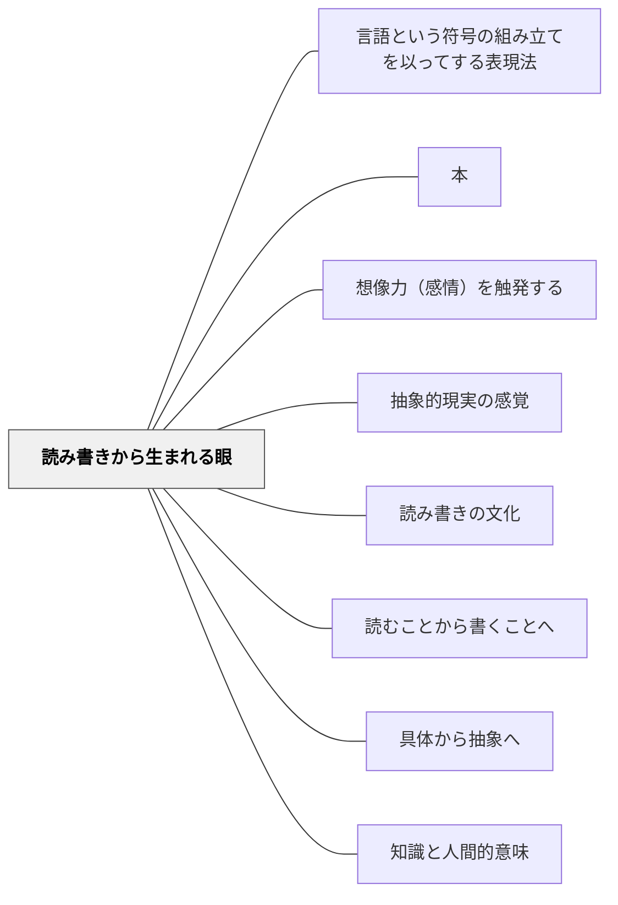

# 読み書きから生まれる眼

> 読み書きの習得が、世界を見る新たな認識の枠組みをつくり出す

## 背景（Context）

読み書きは単なる情報伝達の手段ではない。内田義彦が『読書と社会科学』で述べるように、読み書きを通じて人は「概念装置」を獲得する。この装置を通じてはじめて見えてくるものがある。

## 問題（Problem）

読み書きの指導が技術的スキルの習得にとどまると、その本来の力——世界の見方を変え、思考の質を根本から変革する力——が学習者に伝わらない。なぜ読み書きを学ぶのか、その意味が学習者に届かない。

## 力のかたち（Forces）

- 言語は単なる記号ではなく、概念を生み出し、思考を構造化する装置である
- 「お金」のような概念も、もとは具体物（貝・金属）だったが、読み書きを通じて抽象的に扱えるようになった
- 読み書き能力をもつ者とそうでない者では、世界の認識の仕方そのものが異なる
- しかし読み書きの「眼を開く」力は、日常的な習得訓練の中では見えにくい

## 解決（Solution）

読み書きを教える際に、それが「新たな眼を手に入れること」であるというメタな意味を、具体的な体験を通じて伝える。たとえば、ある概念を言語化する前と後で世界がどう違って見えるかを比較させる活動を設ける。

内田義彦が描く「読書を通じて社会科学的眼が開かれる」プロセスを、それぞれの教科・学習段階に応じた形で再現する。文章を書くことで「自分が何を知っていて何を知らないか」が明確になる体験を設計する。

## 結果（Consequences）

学習者は読み書きに対して道具以上の意味を見出し、主体的に取り組む動機が生まれる。知識の概念的・抽象的な扱いが可能になり、思考の質が高まる。ただし、この体験を引き起こすには単純な反復練習だけでは不十分で、意味のある文脈での読み書き活動が必要である。

## 関連パタン
- [[パタン/言語という符号の組み立てを以ってする表現法]]
- [[パタン/本]]

- [[パタン/想像力（感情）を触発する]]
- [[パタン/抽象的現実の感覚]]
- [[パタン/読み書きの文化]]
- [[パタン/読むことから書くことへ]]
- [[パタン/具体から抽象へ]]
- [[パタン/知識と人間的意味]]

## クラスター図

## Actionable Insight

- 読み書きの授業の終わりに「これを書くことで、何が新しく見えてきた？」と問う——読み書きが「世界の見方を変える体験」として位置づけられると主体的な取り組みが生まれる
- 「この概念を知る前と知った後で、何が違って見えるか」を学習者に1文書かせる——概念獲得による認識の変化を言語化させることで読み書きの深い意味が体験される
- 一つの単元を通じて学んだ後、「このことで見えるようになったことは何か」を書かせる——読み書きが「眼を開く」という感覚を学習者が積み重ねていく

## 出典

Egan, K. (2005). *An Imaginative Approach to Teaching*. Jossey-Bass.（邦訳（2010）『想像力を触発する教育――認知的道具を活かした授業づくり』北大路書房）  
内田義彦（1985）『読書と社会科学』岩波新書
