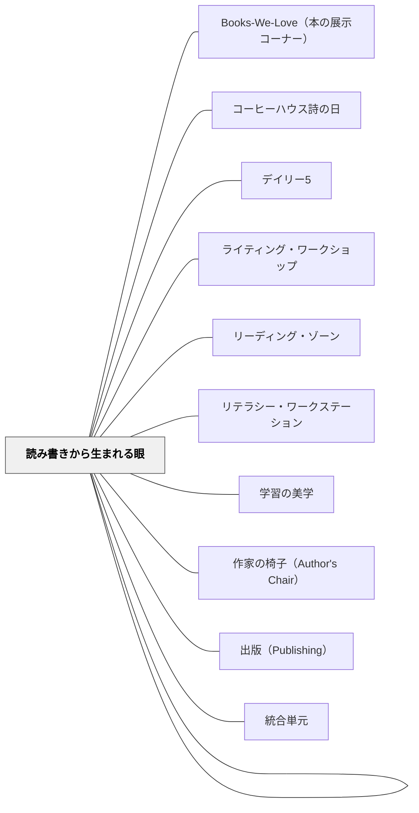

# 読み書きの文化

> 読み書きは民主主義を担う人を育てる基礎である。

---

## Pattern Connection

**出典**: Daniels, H., & Bizar, M.（2005）*Teaching the Best Practice Way: Methods That Matter, K-12*. Stenhouse Publishers.

- **既存パタンとの関連**: Daniels & Bizar の「ベスト・プラクティス」（7構造）はこのパタンの「文化」に具体的な内容を与える——読み書きの文化を作るために何をするかが、リテラチャー・サークル・クラスルーム・ワークショップ・表現して学ぶという構造として明示される。[[パタン/リーディング・ワークショップ]] と [[パタン/ライティング・ワークショップ]] はその中核構造として位置づけられる
- **補強された点**: 「ベスト・プラクティス教室の6特徴」（生徒中心・経験的・協同的・民主的・認知的・挑戦的）が、このパタンの実現度を診断するチェックリストとして機能する——「自分の教室の読み書きの文化は、この6特徴をどれだけ体現しているか？」という問いが実践改善の切り口になる
- **修正・拡張された点**: 文化は「雰囲気や心構え」だけでなく、**具体的な構造（仕組み）によって生まれる**という視点が加わった——ワークショップの「ミニレッスン→独立実践→共有」という時間構造、リテラチャー・サークルの役割システム、表現して学ぶのクイックライト習慣——これらが「読み書きの文化」の可視化された実体だ
- **他のパタンへの波及**: [[パタン/表現して学ぶ]] — クイックライト・クイックドローの習慣が書く文化を作る。[[パタン/リテラチャー・サークル]] — 本について語る文化の具体的実装。[[パタン/段階的手放し]] — 文化は「できるまで支え、できたら手を離す」積み重ねで育つ

---

## 背景（Context）

リテラシー（読み書き能力）はただのスキルではなく、文化的実践である。「読む人・書く人」というアイデンティティは、技能訓練だけでは育たない。コミュニティが読み書きを大切にする文化があってこそ、学習者がそのアイデンティティを内面化する。

## 問題（Problem）

読み書きをスキルとして教えると、「テストのために読む・書く」という動機が生まれ、本を自分から手に取る習慣は育たない。

## 力のかたち（Forces）

- リテラシーのアイデンティティは家庭・学校・地域の文化が複合して形成される
- 「読む人」を見て育った子どもは読む人になりやすい
- 読み書きの楽しさより先にスキルを強調すると意欲が損なわれることがある

## 解決（Solution）

**読書・書くことが「楽しい・価値ある・私たちの文化の一部」となるよう、コミュニティの実践として育てる。**

実践例：
- 教師が読んでいる本・書いているものを共有する（ロールモデル）
- 読了本・好きな文章を掲示・紹介し合う
- 自分のために書く時間（独立書き）を日常化する
- 読み語り・読み聞かせをクラスの儀式にする
- 図書館・本棚を「訪れたい場所」として整える

## 結果（Consequences）

- 学習者が「自分は読む人・書く人だ」というアイデンティティを形成する
- 読み書きが教科の時間を超えて生活に広がる
- 学習者が自分の考えを文章で整理・表現できるようになる

## 関連パタン
- [[パタン/Books-We-Love（本の展示コーナー）]]
- [[パタン/コーヒーハウス詩の日]]
- [[パタン/デイリー5]]
- [[パタン/ライティング・ワークショップ]]
- [[パタン/リーディング・ゾーン]]
- [[パタン/リテラシー・ワークステーション]]
- [[パタン/学習の美学]]
- [[パタン/作家の椅子（Author's Chair）]]
- [[パタン/出版（Publishing）]]
- [[パタン/統合単元]]
- [[パタン/読み書きから生まれる眼]]

## このパタンが働く実践

| 実践パタン | どのように読み書きの文化をつくるか |
|------------|------------------------------------|
| [[パタン/リーディング・ワークショップ]] | 読む時間、選書、共有を日常化し、学習者を読書家として育てる |
| [[パタン/ライティング・ワークショップ]] | 書く時間、自分のトピック選択、作家の椅子を日常化し、学習者を作家として育てる |
| [[実践/デイリー5の起動]] | 独立して読む・書く・聴く活動を日課にし、読み書きの持久力を育てる |
| [[実践/リーダーズ・ノートの起動]] | 読書中の思考をノートに残し、読者としての自分を育てる |
| [[実践/リテラチャー・サークルの起動]] | 本について語る小集団をつくり、読みを共同体の文化にする |
| [[実践/文学討論グループの設計]] | 深い問いを中心に、読む・話す・書くをつなげる |
| [[実践/ライティング・ワークショップ年度初め]] | 白紙の冊子・話す→描く→書く・作家の椅子で書く文化の土台を作る（Horn & Giacobbe, 2007） |
| [[実践/詩を紹介する・詩を創作する]] | 詩集に出会い、紹介文や詩を書き、友達と読み合う場をつくる |
| [[実践/言葉をよりすぐって俳句を作ろう]] | 俳句を読み、三文日記で材料を集め、推敲して句会で読み合う |
| [[パタン/ブッククラブ]] | 本を読むこと、語ること、読みの変化を書くことをクラスの共同実践にする |
| [[文献/リーディング・ワークショップの研究と実践（第５版）]] | 読む時間、選書、共有を日常の読書文化として設計する |

## このパタンが働く教材

| 教材 | どのように読み書きの文化をつくるか |
|------|------------------------------------|
| [[教材/ブック・バズ・ノート]] | 読んだ本を評価し、問いと答えを準備して紹介することで、本をめぐる共有を日常化する |
| [[教材/読書の道具棚]] | 読む前・読む間・読んだ後の記録道具をまとめ、読書の習慣を支える |
| [[教材/書くことの道具棚]] | 書く前・書いている途中・共有の道具をまとめ、書く文化を支える |

- [[パタン/文化をつくる]] — 親パタン
- [[パタン/考える文化]] — 読み書きを通じた思考の深化
- [[パタン/話し合う文化]] — 読み書きと対話の相互補完
- [[パタン/一流から学ぶ]] — 優れた文章を読むことで基準が上がる
- [[パタン/ロールモデル]] — 読む人・書く人のモデリング

## クラスター図

## Actionable Insight

- 教師が「今週読んでいる本・書いているもの」を週に1回だけ紹介する——教師自身が読む人・書く人のモデルを見せることが最も強力
- 授業の冒頭5分を「独立書き（自分のために書く時間）」にする——毎日の書く時間の積み重ねが「書く人」のアイデンティティを育てる
- 図書室や本棚の「今週のおすすめ」を表紙向きに1冊だけ置く——本との出会いを増やす最も小さなナッジ

## 出典

- 動画記録：[[文献/コミュニティオブプラクティスと文化をつくるパタン（動画記録）]]
- ルーシー・カルキンズ他『リーディング・ワークショップ』
