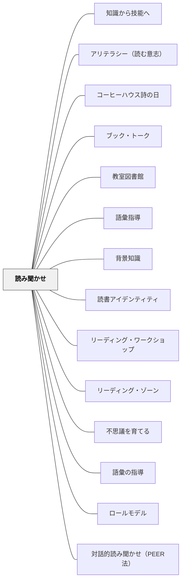

# 読み聞かせ

> 読み聞かせは幼児期だけのものではない——就学前から中学年まで、年齢によって機能を変えながら、語彙・背景知識・動機づけを積み上げる最も効率的なルートである。

---

## Pattern Connection

**Allen（1999）統合（2026-05-20）**：

*Words, Words, Words* は読み聞かせを「Reading To（読んで聞かせる）」と呼び、語彙指導における3つの読書の道（Reading To / With / By）の第一の道として位置づける。

- **既存パタンとの関連**：WillinghamとLayneが「なぜ」「どう」読み聞かせるかを論じるのに対し、Allenは「語彙習得の手段として」読み聞かせの機能を明確にする。「1日25分の独立読書で年間約1,000語の自然習得が起きる」（Anderson et al., 1986）——しかし読み聞かせはそれをさらに上回る語彙密度の高いテキストへのアクセスを可能にする
- **補強された点**：「聴解力が読解力の2年先行する」（Layne / Willingham）という認知科学的事実が、語彙習得の観点からも補強される。子どもが自力では読めないリッチ・コンテクスト（語義・発音・類義語が含まれた文脈）を教師が声で届けることで、「辞書なしで語彙に出会う」体験が生まれる
- **修正・拡張された点**：読み聞かせの選書基準として「語彙が豊かで文脈がリッチなテキスト」という軸が加わる。言葉を「説明する」ために止まるタイミングを意図的に設計することが、語彙習得を高める
- **他のパタンへの波及**：[[パタン/語彙指導]] — Reading To は語彙指導の三つの道の第一の道。[[パタン/ワードウォール]] — 読み聞かせで出てきた語をウォールに追加する流れが語彙の「生きた文脈」を保存する

**出典**: Willingham, D. T.（2015）*Raising Kids Who Read: What Parents and Teachers Can Do*. Jossey-Bass.

- **既存パタンとの関連**: [[パタン/リーディング・ワークショップ]] の「読み聞かせ（Read-Aloud）」コンポーネントに、認知科学的な根拠を付け加える。「なぜ読み聞かせが読書力に効くか」という問いに答える
- **補強された点**: 読み聞かせの価値を「情緒的つながり」だけでなく、「自分の読書レベルを超えた語彙・概念・文体に触れられる唯一の手段」として説明できるようになった。Willingham の「聴解力 → 読解力」という発達的なつながりが明確になった
- **修正・拡張された点**: 読み聞かせは「低学年の活動」という位置づけから「全年齢にわたる知識・動機・アイデンティティの構築装置」として拡張された
- **他のパタンへの波及**: [[パタン/背景知識]] — 読み聞かせは背景知識を広げる最も効率的な手段。[[パタン/読書アイデンティティ]] — 高学年での読み聞かせが「読書＝楽しいもの」という連合を維持する

**Layne（2009）統合（2026-05-15）：**

*Igniting a Passion for Reading* は、読み聞かせを「技芸（craft）」として位置づけ、「どう読むか」という**パフォーマンスの次元**を加える。Willingham が「なぜ読み聞かせが重要か」を説明するのに対して、Layne は「どう読めば聴衆を引き込めるか」という実践技法を提供する。

- **補強された点**：Willingham の「聴解力の向上」という認知科学的効果に、Layne の「読む意志（WILL）に直接働く情熱的な体験」という動機づけ効果が加わった。語彙・知識の蓄積（Willingham）と読む意志の点火（Layne）——両方が読み聞かせから起きる
- **拡張された点（パフォーマンス技法）**：
  - **事前練習**：初見で読まない——一度通読して「止まる場所・声を変える場所」を付箋で決めてから教室で読む
  - **声の変化**：キャラクターごとの声・感情の起伏に合わせたトーン・緊迫した場面での速度上昇と声量低下
  - **クリフハンガーで止める**：最もドラマチックな場面で「続きは明日」と閉じる——「続きが気になって仕方ない」状態を作ることが目的
  - **視線と表情**：本から顔を上げて子どもを見る。表情で感情を伝える
- **修正された点**：「読み聞かせ」はテキストの音読ではなく「聴衆を本の世界へ引き込むパフォーマンス」として設計する——準備なしに読むことへの注意が加わる
- **他のパタンへの波及**：[[パタン/アリテラシー（読む意志）]] — パフォーマンスとしての読み聞かせがWILLに直接働く。[[実践/読書への情熱を育てる実践集]] — 読み聞かせの事前準備チェックリストを実践として展開

**Layne（2009）追補（2026-05-18）：**

OCR全文統合により、読み聞かせに関する Layne の追加知見を補完する。

- **Hoffman, Roser, Battle（1993）の drop-off**：4年生以降、読み聞かせが急に減るという研究——Layne はこれを「最も間違ったタイミングで読み聞かせをやめる」と批判する。4年生以降こそ複雑なストーリー・テーマ・語彙への入口として読み聞かせが必要だ
- **聴解レベルと読解レベルの2年ギャップ**：子どもの listening level（聴いて理解できるレベル）は silent reading level（自力読解）より約2年分高い（Layne, 2009）——この差が読み聞かせの本質的価値を説明する。Willingham の「聴解力は読解力の先行指標」という認知科学的根拠と対応する
- **Number the Stars と A Wrinkle in Time の事例**：Lois Lowry の *Number the Stars*（ホロコーストを扱う歴史的フィクション）の読み聞かせではクラスが静まり返り「なぜこんなことが起きたんですか」という問いが生まれた。Madeleine L'Engle の *A Wrinkle in Time* はある5年生で「5年生の一番の思い出」として語り継がれた——読み聞かせが単なる「活動」ではなく「記憶」として残る力を示す
- **Reader Continuum との接続**：読み聞かせは Disengaged（無関与）の子どもを Engaged（関与）へ動かす最も強力な入口——ただし「パフォーマンスとして準備された読み聞かせ」に限る。平坦な音読では Disengaged は動かない
- **「読み聞かせを邪魔しない」ルール**：Layne の教室では「読み聞かせ中は決して邪魔しない」を4つのクラスルールの最後に置く——これを「一番大事なルール」として提示することが読み聞かせの価値を制度として保護する

**Willingham（2015）追補（2026-05-17）：**

OCR全文照合により、既存の Willingham Pattern Connection に未収録の知見を補完する。

- **National Academy of Education（1985）**：著名な読書研究者10名が執筆したレポートが読み聞かせを「読書促進活動の中で最も重要なもの（single most important activity）」と命名（Anderson, 1985）。認知科学的根拠に加え、教育学的合意の裏付けとして位置づけられる
- **対話的読み聞かせ（Dialogic Reading）**（Arnold & Whitehurst, 1994）：通常の読み聞かせより語彙・文法の習得効果が顕著に高い PEER法（Prompt→Evaluate→Expand→Repeat）。特に2〜5歳に効果が高く、親・保育士・教師が実施できる——ただし「teachy」な感じが嫌なら必須ではない。楽しい読み聞かせの流れを壊さないことが前提。詳細は [[パタン/対話的読み聞かせ（PEER法）]] を参照
- **読み聞かせの遅延効果**（Dickinson, Golinkoff & Hirsh-Pasek, 2010）：就学前の読み聞かせは語彙・知識として蓄積され、3〜4年生の読解力として発現する——効果は即時でなく数年後に出る。「就学前に読み聞かせをしても読解力向上が見えない」という誤解を解く知見
- **American Academy of Pediatrics の推奨**：米国小児科学会は出生直後からの読み聞かせを推奨。3か月頃から視覚が安定し本格化可能。乳幼児期の読み聞かせは語彙習得より「ルーティンの形成」と「本＝温かい体験」という連合の構築が主目的
- **電子書籍での読み聞かせ**（Parish-Morris et al., 2011 等）：インタラクティブ機能（タッチで絵が動く等）が読解に役立つかは内容による——タッチ機能が注意を引きすぎて内容理解が下がるケースもある。従来の紙の絵本での読み聞かせが語彙習得において安定した効果を示す

**Collins（2004）統合（2026-05-24）：**

*Growing Readers* は読み聞かせを「バランスト・リテラシー」の不可欠なコンポーネントとして位置づけ、Interactive Read-Aloud（対話的な読み聞かせ）を重視する。

- **補強された点（Contagious Enthusiasm の原則）**：Collins は「教師の本への熱意は子どもに伝染する」というContagious Enthusiasmの原則を挙げる——教師が本当に好きな本を読み聞かせることが最も効果的。「義務としての読み聞かせ」と「愛情としての読み聞かせ」は子どもに届く深さが違う
- **補強された点（著者研究との連動）**：読み聞かせで同じ著者の本を連続して取り上げることで、著者研究の「浸透フェーズ」が自然に実現する——Mem Foxの本を3週間連続で読み聞かせると、「また家族のことを書いている！」という自発的な気づきが生まれる
- **拡張された点（Thinking Strategies の指導場面として）**：Chapter 6でCollinsは読み聞かせをThinking Strategies（反応する・映像化する・予測する・接続する・モニタリングする）のモデリング場として使う——教師が声に出して「今頭の中でこんな映像が浮かんだ」とデモすることで、子どもが思考しながら読むことを学ぶ
- **他のパタンへの波及**：[[パタン/著者研究]] — 読み聞かせの著者の選び方が著者研究の準備になる

---

## 背景（Context）

Willingham（2015）は「子どもは自分で読める本しか独立読書では読めない」という事実を出発点に、読み聞かせの特別な役割を論じる。

自分で読むとき、子どもはデコーディング（文字を音に変換する処理）に認知資源を使う。特に低学年では、デコーディングの自動化が終わっていないため、語彙・概念の処理に使える資源が少ない。結果として「自分で読める本」は「すでに知っている語彙と概念が8〜9割を占める本」に限定される。

読み聞かせは、このデコーディングの壁を取り除く。**聴くときはデコーディングが不要**なので、認知資源のすべてを語彙・概念・構造の処理に使える。「聴解力（listening comprehension）」は「読解力（reading comprehension）」の先行指標であり、読み聞かせは子どもの聴解力の限界まで引き上げることができる——その「聴解力の引き上げ」が、後の「読解力」の基盤になる。

## 問題（Problem）

読み聞かせは「就学前・低学年のもの」として位置づけられることが多く、「もう自分で読めるから」と3〜4年生で打ち切られる。しかしWillinghamはこれが誤りだと主張する。

3年生以降こそ、「読めるが理解できない」という壁（第3学年の転換点）に差し掛かる時期だ。自分で読める本の難度は実際の語彙・背景知識の水準より低い。この差を読み聞かせが埋めなければ、語彙と背景知識の蓄積は自然に起きない。

また、「自分で読む本を選ぶ楽しさ」だけでは、子どもが自力で読めないレベルの良書——豊かな文体・複雑な概念・幅広い知識を含む本——と出会う機会が作られない。

## 力のかたち（Forces）

- 自分で読める本 ≦ 語彙・知識の水準（自分で読む限り語彙・知識は頭打ちになる）
- 聴解力 > 読解力（特に低学年では差が大きく、中学年以降も一定の差がある）
- 読み聞かせは「楽しい経験」——プレッシャーなしで難しいテキストに触れる唯一の文脈
- 高学年での読み聞かせは「読書＝楽しいもの」という連合を維持する動機づけ効果がある
- 教師が声に出して読む姿は「読書家のモデル」として機能する
- フィクションだけでなくノンフィクションの読み聞かせが、背景知識の幅を広げる

## 解決（Solution）

**年齢に応じて目的を変えながら、全学年で読み聞かせを続ける。フィクション・ノンフィクションの両方を選書し、語彙・背景知識・動機を意図的に積み上げる。**

---

### 年齢段階別の読み聞かせの役割

| 年齢段階 | 読み聞かせの主な機能 | 選書のポイント |
|---|---|---|
| **就学前** | 音韻認識（韻・頭韻・言葉遊び）の発達、語彙の初期蓄積 | 繰り返し・韻のある絵本、ことばあそびの本 |
| **低学年（1〜2年生）** | 語彙・背景知識の蓄積（デコーディングの壁を超える） | 自分では読めないが聴けるレベルの本。ノンフィクションも積極的に |
| **中学年（3〜4年生）** | 背景知識の拡張、難語彙との出会い、動機づけの維持 | 複雑なストーリー・知識豊かなノンフィクション。科学・歴史・伝記 |
| **高学年（5〜6年生）** | 読書アイデンティティの維持、文体・構造への気づき | 長編・古典・現代文学。「読書家として楽しむ」経験を共有する |

---

### 読み聞かせの中での語彙・知識の補完

Willingham は「読み聞かせ中に意図的な語彙補完を行う」ことを推奨する：

1. **ちょっと止まって（Stop and Explain）**: 難語彙が出てきたところで一度止まり、「これは○○ということ」と短く説明する
2. **文脈を生かした問い**: 「この言葉、他のところで見たことある？」「これってどういうことだと思う？」と問い、既有知識とつながる
3. **事後の対話**: 読み終わったあと「今日の本で一番驚いたことは？」「これって知ってたこと？それとも初めて知ったこと？」と聞く

**ただし**、解説しすぎると読み聞かせの流れが壊れる。「ちょっと止まって」は1〜2箇所に絞り、読む楽しさを優先する。

---

### ノンフィクションを読み聞かせに入れる

Willingham が特に強調するのが「フィクション以外も読み聞かせに入れること」だ。

ノンフィクションの読み聞かせが積み上げるもの：
- 理科・社会・地理・歴史・自然科学の背景知識
- 「驚く事実」への好奇心——知ること自体の喜び
- 図鑑・説明文・新聞・教科書への読解力の基盤

実践例：
- 毎週の読み聞かせに「科学の本1冊」「歴史・伝記の本1冊」を加える
- 「今日は事実がいっぱいの本を読みます」と前置きして読む
- 理科・社会の単元の導入に関連ノンフィクションの読み聞かせを使う

---

### 高学年でも読み聞かせを続ける理由

「もう自分で読める」という理由で高学年の読み聞かせをやめないことが重要だ。

高学年での読み聞かせの効果：
- 難しい本への「入口」——一人では手が届かない名作・長編への動機が生まれる
- 「この本面白い」「続き読みたい」という体験を教師が先導できる
- 読む共同体の感覚——同じ本の世界を共有するクラスの一体感
- 「読書は楽しいもの」という連合の更新・強化

実践のコツ：
- 第1章だけ読んで「続きは自分で」と貸し出す（読む動機づけに使う）
- 子どもがリクエストした本を読み聞かせに取り上げる
- 読み終わった後の感想を「強要しない」——黙って聴くだけでいい日もある

---

## 結果（Consequences）

- 自分では読めないレベルの語彙・概念・文体に毎日触れる機会が生まれる
- 語彙の蓄積が加速し、3年生以降の読解力の基盤が形成される
- ノンフィクションへの親しみから、理科・社会の読解力が育ちやすくなる
- 「読書＝楽しいもの」という連合が年齢を超えて維持され、読書アイデンティティが強化される
- 教師の読む姿が最も強力な読書モデルとして機能する
- ただし、読み聞かせ中の「解説しすぎ」「評価への転換（感想文の義務化）」は効果を打ち消す

## 関連パタン
- [[パタン/知識から技能へ]]
- [[パタン/アリテラシー（読む意志）]]
- [[パタン/コーヒーハウス詩の日]]
- [[パタン/ブック・トーク]]
- [[パタン/教室図書館]]
- [[パタン/語彙指導]]

- [[パタン/背景知識]] — 読み聞かせは背景知識を広げる最も効率的な手段
- [[パタン/読書アイデンティティ]] — 読み聞かせが「読書＝楽しい」という連合を作り続ける
- [[パタン/リーディング・ワークショップ]] — 読み聞かせはリーディング・ワークショップの冒頭コンポーネント
- [[パタン/リーディング・ゾーン]] — 読み聞かせがゾーン体験の最初の入口になる
- [[パタン/不思議を育てる]] — ノンフィクションの読み聞かせが「驚く事実」への好奇心を育てる
- [[パタン/語彙の指導]] — 読み聞かせ中の語彙補完が文脈の中での習得を支える
- [[パタン/ロールモデル]] — 教師が読む姿が読書家のモデルになる
- [[パタン/対話的読み聞かせ（PEER法）]] — PEER法（Prompt→Evaluate→Expand→Repeat）による語彙・文法習得の強化技法——「どう読むか」の次の一手

---

## クラスター図

## Actionable Insight

- 今週の読み聞かせに1冊ノンフィクション（科学・歴史・伝記など）を加える——「面白い事実」のある本を選ぶだけで、語彙と背景知識が一緒に入ってくる
- 読み聞かせ中に難語彙が出てきたら、1〜2箇所だけ「ちょっと止まって」短く説明する——全部解説しようとせず、流れを壊さない程度に留める
- 「もう3年生だから読み聞かせはしない」という判断を一度保留する——高学年こそ背景知識と動機づけのために読み聞かせが必要な時期

---

## 出典

Willingham, D. T. (2015). *Raising Kids Who Read: What Parents and Teachers Can Do*. Jossey-Bass.

> 「子どもは自分で読めるレベルの本しか独立読書では読めないが、読み聞かせなら自分の読書レベルを超えた語彙・概念・世界観に出会える。この聴解力が後に読解力になる。」—Willingham（2015）
