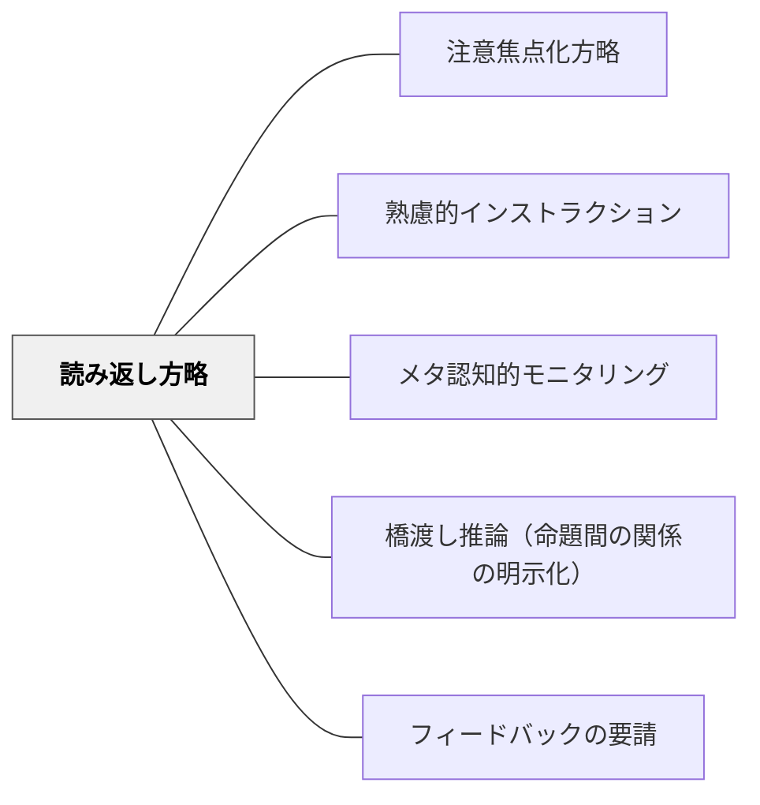

# 読み返し方略

> つまずきに気づいて読み返し・修復する自己調整と、事後質問文による学習の整理を組み合わせる。

## 背景（Context）
山本博樹（2019）『教師のための説明実践の心理学』ナカニシヤ出版で示された説明実践の方略の一つ。読み返し方略は、学習者が自分のつまずきに気づいて理解を修復する自己調整的な読みの方略である。また、単元末に事後質問文を配置することで、学習の振り返りと整理を促す設計的な活用もある。例えば「鎌倉・室町幕府の特徴を理解しましたか？」という問いが単元末に置かれると、学習者は学習物を見直す動機を持つ。

## 問題（Problem）
一度読んだ・聞いたからといって理解が完成しているとは限らない。しかし多くの学習者は、分からなかった部分を読み返すことなく「なんとなく分かった」で進んでしまう。自分のつまずきに気づき、自発的に読み返す自己調整は、指導がなければ育ちにくい。

## 力のかたち（Forces）
- 読み返しは自己調整の核心だが、何を読み返すかの判断が難しい
- 事後質問文があることで読み返しの目的と焦点が明確になる
- 読み返し方略は初期段階では教師の足場がけが必要
- メタ認知的モニタリングと組み合わせると効果が高まる

## 解決（Solution）
**単元や活動の末尾に「○○を理解しましたか？」「△△についてどこが分かりにくかったですか？」という事後質問文を置き、学習者が自分の理解を確認して必要な箇所を読み返す機会を設ける。**
授業中に「分からなかった部分に印をつけながら読もう」という教示をすることで、読み返しの対象が明確になる。ペアやグループで「どこが分かりにくかったか」を共有することで、読み返しが協働的に行われる。読み返した後に「今度は分かりましたか？」と確認することで、自己調整のサイクルが形成される。

## 結果（Consequences）
- 学習者がつまずきに気づき、自発的に修復する自己調整力が育まれる
- 単元末の質問文が学習の整理と定着を促す
- 教師が学習者のつまずきの箇所を把握し、次の指示・説明に活かせる

## クラスター図

## Actionable Insight

## 出典

- 一つの教育のパタン・ランゲージ（岩井輝久）

- 単元末に「○○を理解しましたか？」という確認問いを1問置き、分からない部分を見直す動機を作る——事後質問文が読み返しの目的と焦点を明確にし自己調整のきっかけになる
- 「分からなかった部分に★をつけながら読もう」という教示をして読み返しの対象を明確にする——読む前の目的設定が自己調整的な読みの最初のステップになる
- 「どこが分かりにくかったか」をペアで共有してから一緒に読み返す——協働的な読み返しが個人では気づかないつまずきを発見しコミュニティの理解を同時に高める

## 関連パタン
- [[パタン/注意焦点化方略]]
- [[パタン/熟慮的インストラクション]] — 親パタン
- [[パタン/メタ認知的モニタリング]] — 自分の理解を監視する力
- [[パタン/橋渡し推論（命題間の関係の明示化）]] — 理解の統合
- [[パタン/フィードバックの要請]] — 学習者の状態把握

## このパタンが働く教材

| 教材 | どのように読み返しを促すか |
|------|----------------------------|
| [[教材/リーディング・ワークショップの小さい付箋]] | よく分からなかったところや疑問解決の手がかりに印をつけ、読み返す場所を明確にする |
