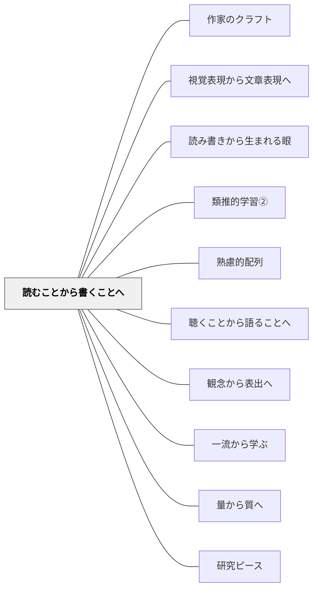

# 読むことから書くことへ

> 書く力は、読んだものの堆積から生まれる。

## 背景（Context）

[[パタン/熟慮的配列]] の読み書き次元。読書と作文の関係についての長い研究知見が示すように、書くことの力は読むことの豊かな経験に根ざす。Nancie Atwell らのライティング・ワークショップの実践でも、読み手としての経験がライターとしての成長を支えることが強調される。

## 問題（Problem）

書き方の技法だけを教えても、書く内容・書きたいという動機・文体の感覚が育たない。書くための「内側の貯蔵庫」が貧しければ、技法はからの器になる。

## 力のかたち（Forces）

- 読むことと書くことは相互に支え合う（書くことで読みが深まる、という逆もある）
- 書く指導には明示的な技法教授も必要
- 読む量を増やすことだけでは書けない学習者もいる
- 個人の読書経験は差が大きい

## 解決（Solution）

**まず豊富な読書体験（多様なジャンル・多量の文章）を保証し、「書き手としての目」で読むことを促した後に、書く活動へと移行する。**

実践例：
- 作家の目で読む：「この書き手はここでどんな工夫をしているか」に注目させる
- 気に入った一文・表現を集めるノートを作り、それを書く際に活用する
- あるジャンルの文章（詩・説明文・物語）をたくさん読んでから、そのジャンルで書く
- 特定の作家の文体を「真似る」模倣作文から始める

**Nancy Atwellのジャンル学習：**  
優れた物語をいくつか読み比べ、「優れた作家が行っていること」「優れた作品の特徴」をクラスで書き出す活動を行う。こうして学習者の中に「良い物語とはこういうものだ」というイメージ・指標ができる。書く活動はその後。書く最中のメタ認知・自己評価・自己調整にも、書き終えた後の見直しにも、他者の作品を読むときの視点にも、この「読んで作られたイメージ」が機能し続ける。

[[文献/リーディング・ワークショップの研究と実践（第５版）]] が参考になる。

## 結果（Consequences）

- 書く内容・文体・語彙に厚みが生まれる
- 書くことへの抵抗感が下がり、「書きたい」という動機が育つ
- 読む力と書く力が相互に高め合うサイクルが生まれる

## クラスター図

## Actionable Insight

- あるジャンルで書かせる前に、同ジャンルの優れた例を2〜3本読ませる——書く前の読みが「何を書くか」より「どう書くか」の内的イメージを育てる
- 読んだ文章で「気に入った一文」を書き抜くノートを作らせる——書き手として読む習慣が語彙・文体の貯蔵庫を育てる
- 特定の作家の文体を「真似る」模倣作文を1回行う——模倣は盗作ではなく、技法を学ぶ最も効果的な方法の一つ

## 出典

- リーディング・ワークショップの研究と実践（第５版）

## 関連パタン
- [[実践/書き出しのクラフト]]
- [[パタン/作家のクラフト]]
- [[パタン/視覚表現から文章表現へ]]
- [[パタン/読み書きから生まれる眼]]
- [[パタン/類推的学習②]]

- [[パタン/熟慮的配列]] — 上位パタン
- [[パタン/聴くことから語ることへ]] — 音声言語版の同じ方向
- [[パタン/観念から表出へ]] — 内側の形成が先
- [[パタン/一流から学ぶ]] — 優れた作家の文章をモデルとして内面化する
- [[パタン/量から質へ]] — まず多く読む・書くことで質が育つ
- [[パタン/研究ピース]] — 読書が引用・コメントというアウトプット（ピース）に変わる
