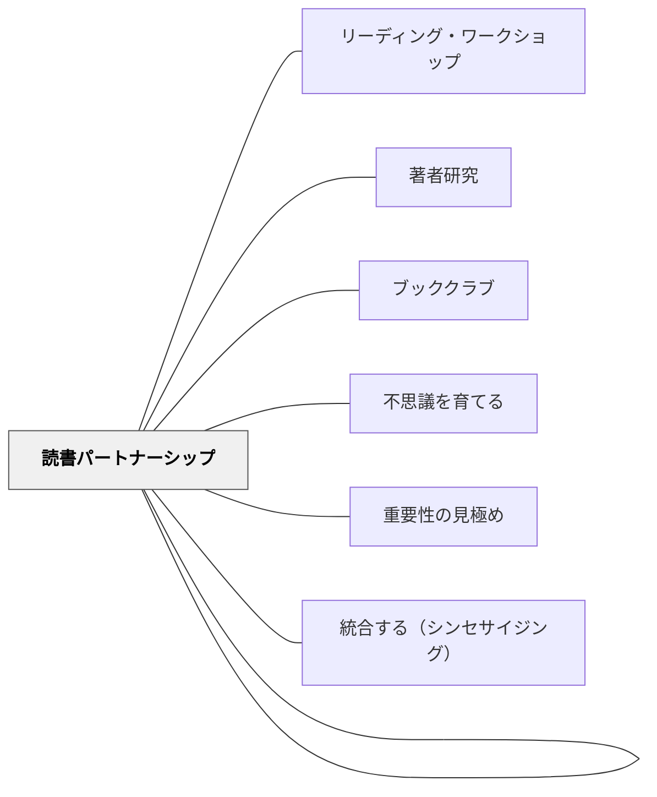

# 読書センター

> 4〜6人が選んだジャンル・著者・テーマを中心に集まり、私読みの時間とは別に「追求する読書」を育てる場を設ける。

---

## 背景（Context）

リーディング・ワークショップが定着し、子どもたちが Just-Right Books を毎日30分読める力がついてきたとき、次のステップとして「**読書の興味を深める場**」が必要になる。1〜5月（Collins の「Readers Pursue Their Interests」単元）に設けるのが Reading Centers（読書センター）だ。

## 問題（Problem）

毎日の私読み（Private Reading Time）は個人の読書スタミナを育てるが、それだけでは「本を深く探究する」体験が生まれにくい。「速く多く読む」から「深く選んで読む」への転換点が必要。

## 力のかたち（Forces）

- 同じジャンル・著者・テーマについて話し合える仲間がいると、読書が知的な社会活動になる
- しかし全員が同じテーマを同時に研究すると、興味の多様性が失われる
- 私読み時間（Just-Right Books）は毎日維持しつつ、センター活動を加える必要がある——削ると読書量が落ちる
- 話し合いの構造がないと「好きな話をするだけ」で終わり、読書力が伸びない

## 解決（Solution）

**私読みの時間を毎日維持しつつ、センター活動の時間を週数回追加する**。センターは4〜6人のグループで、特定のテーマを2〜4週間かけて研究する。

### センターの種類（Collins, 2004 Chapter 7）

| センター名 | 研究するもの | 育てる読み手の力 |
|-----------|-------------|----------------|
| **著者研究** | 好きな著者の全作品 | 著者の文体・テーマの類似と相違に気づく力 |
| **登場人物研究** | 好きなシリーズキャラクター | 人物の動機・成長を推論する力 |
| **詩の研究** | 詩のジャンル・技法 | 声に出して読む・詩人の技法を評価する力 |
| **ノンフィクション研究** | テーマ別ノンフィクション本 | 重要性の見極め・情報の統合 |
| **プロジェクト読書** | 自分で設定した研究テーマ | 自律的な読書計画と目標設定 |

---

### 運営の基本構造

**Cycle 1 → Cycle 2 → Celebration** の3段階が典型的なパターン：

**Cycle 1（1〜2週間）**：浸透・発見
- グループで選んだテーマの本を読み集める
- 「気づいたこと」をsticky noteに書く
- 読み終えたらパートナーと共有

**Cycle 2（1〜2週間）**：深化・分析
- Cycle 1 の気づきを整理し、さらに深める問いを立てる
- 著者なら「この本とあの本の共通テーマを探す」、ノンフィクションなら「最も重要な情報はどれか」

**Celebration（1〜2日）**：共有・祝祭
- センターの研究成果を他のグループに紹介する
- Book talk・ポスター・詩の発表会など形式は多様

---

### 登場人物研究の具体例

Collins 自身の子どもの頃の愛読キャラクター：Harriet the Spy、Mrs. Piggle-Wiggle、Pippi Longstocking、Encyclopedia Brown。

低学年版の登場人物研究では：
- Henry（Henry and Mudge シリーズ）が好きな子が集まる
- 「Henryはなぜいつも犬を求めているの？」という推論の問いから対話が深まる
- キャラクターが長編シリーズに登場するとき、「成長」を追うことができる

---

### 詩のセンターの計画例（Collins, 2004）

| サイクル | 活動 |
|---------|------|
| Cycle 1 | 詩を感情を込めて声に出して読む練習 |
| Cycle 2 | 詩人の技法（繰り返し・対比・擬人化など）を評価する |
| Cycle 3 | 自分が愛する詩を集め、なぜ好きかを語る |
| Celebration | クラス詩集を作る・詩のスラム・詩をギフトとして贈る |

---

### 日本の文脈での実装

- センターは週2回（例：火・木）の読書時間に設ける
- 「今日は私読み day」「今日はセンター day」を明示する
- センターの本は学校図書館と連携してテーマバスケットを作る
- 登場人物研究は「国語の教科書の登場人物」からスタートできる

## 結果（Consequences）

- 読書が「量の競争」から「質の探究」に転換する
- グループでの読書対話が自然に深まる——「あのシーンどう思った？」が始まる
- ノンフィクション研究は理科・社会の調べ学習への橋渡しになる
- センターで深めた著者やジャンルが、その後の一人読みの選書に影響する

## 関連パタン

- [[パタン/リーディング・ワークショップ]] — センターが組み込まれる親構造
- [[パタン/著者研究]] — 著者センターの詳細
- [[パタン/読書パートナーシップ]] — センターの話し合いもパートナーベースで行われる
- [[パタン/ブッククラブ]] — センターの発展形として文学討論グループへ
- [[パタン/不思議を育てる]] — ノンフィクションセンターで「問いをもつ」が育つ
- [[パタン/重要性の見極め]] — ノンフィクションセンターでの核心的ストラテジー
- [[パタン/統合する（シンセサイジング）]] — センター研究の最終段階で起きる

---

## クラスター図

## Actionable Insight

- 読書センターの導入前に「読み聞かせで同じ著者の本を3回連続で取り上げる」週を設ける。子どもが自然と「またこの著者だ」と気づく体験が、センター活動への動機になる
- 最初のセンターは「著者研究」がシンプルで始めやすい——著者バスケット（1著者の本10冊前後）を紙袋に入れて棚に並べるだけで準備できる
- Cycle終わりの共有は「他のセンターに1分だけ報告する」形式にすると全員が聴き合える

---

## 出典

Collins, K.（2004）*Growing Readers: Units of Study in the Primary Classroom*. Stenhouse Publishers.

> "Readers gather and read texts by authors they love."
> "Readers pursue their interests and passions in books and other texts."
