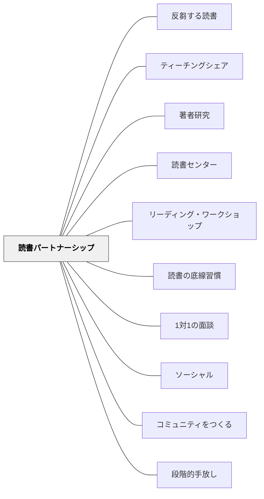

# 読書パートナーシップ

> 読む力が近い者どうしが長期パートナーになることで、互いの最近接発達領域に居続け、読書を社会的実践へと拡張する。

---

## 背景（Context）

リーディング・ワークショップでは、毎日のパートナー読みの時間（約10分）に子どもが2人組で本を読み、話し合う。このパートナーをどう組むかは、指導の質と子どもの成長に大きく影響する。

## 問題（Problem）

グループ活動で「誰と組むか」は多くの教師の悩みの種だ。混合能力グループは社会的に公平に見えるが、読書という認知的実践においては非対称性が大きくなりすぎ、片方が常に「教わる側」になってしまう。また、毎回パートナーを変えると、関係を築く前に時間が過ぎてしまう。

## 力のかたち（Forces）

- 能力差がありすぎると、弱い読み手は受け身になり、強い読み手は面倒を見るだけになる
- しかし、全く同じ力だと互いの読書から学べるものが少なくなる
- パートナーが変わり続けると、深い読書対話が生まれる前に関係が終わる
- 能力別にしすぎると「グループ固定化」の感覚が生まれ、子どもに自己像を刷り込む危険がある

## 解決（Solution）

**能力別・長期パートナーシップ**を設計する。

Kathy Collins（2004）は混合能力パートナーではなく、**互いがお互いの最近接発達領域（ZPD）の中に位置する組み合わせ**を推奨する。これはVygotskiの「あと少しで届く距離」の相互版であり、両者がほぼ同じレベルにいることで、片方が届かないとき他方のちょっとした助けが本質的な助けになる。

**アナロジー**：マラソンの練習仲間のようなもの。自分より少し速い/遅い仲間と走るのが最も効果的——速すぎる仲間とは会話すらできない。

### パートナーシップの設計手順

1. **観察期（9月初め）**：最初の数週間はランダムにパートナーを組み、読書の様子を観察する
2. **固定期（9月後半）**：観察結果をもとに能力別で固定。レベルが近く、人間関係が機能しそうな組み合わせを選ぶ
3. **見直し期（冬休み前後）**：成長に伴い再編成が必要か判断する

### パートナー読みの構造

- **Private Reading（私読み）の後**にパートナーと集まる
- 同じ本を読む（ペア本）か、別の本について話し合う
- パートナー読みの活動例：
  - 読んだところを声に出して読み合う
  - sticky noteにメモした思考を見せ合う
  - 「今日何が面白かった？」から始める対話
  - 好きなページを選んでパートナーに読む

### 長期パートナーシップの利点（Collins, 2004）

- **スタートアップコストがかからない**：毎回関係づくりをしなくてよい
- **深く投資できる**：互いの読書習慣・好みを知っているので対話が深まる
- **コミュニケーションのショートハンドが生まれる**：「また？」「今日もあのシリーズ？」という短い言葉で豊かなやりとりが生まれる

### 具体例

**Emersonとのカンファランスより**（Collins, 2004）：
EmersonはLittle Bearを正確に読むが声が機械的だった。パートナーとの読み合いでは「どちらの声がキャラクターらしいか」を競い合うようになり、自然と「talking voice」（会話するように読む声）が育っていった。

**連句のような読書対話**：
長期パートナーは「同じ著者の本を全部読んでいる」という共通体験を持ち、著者研究の時間に「この著者の本には必ずこういうキャラクターが出てくる」という深い話し合いができる。

## 結果（Consequences）

- 読書が「一人で黙って読む」活動から「社会的実践」へと広がる
- パートナーの存在が毎日の読書のモチベーションになる（「あの子に話したい」）
- 教師は全員のカンファランスではなく、観察と重点指導に集中できる
- 長期であることで子どもが読書パートナーとしての自分を育てる

## 関連パタン
- [[パタン/反芻する読書]]
- [[パタン/ティーチングシェア]]
- [[パタン/著者研究]]
- [[パタン/読書センター]]

- [[パタン/リーディング・ワークショップ]] — 読書パートナーシップが組み込まれる親構造
- [[パタン/読書の底線習慣]] — パートナーと話すことが底線習慣の一つ
- [[パタン/1対1の面談]] — カンファランスで観察したことがパートナー設計に活かされる
- [[パタン/ソーシャル]] — 読書が社会的実践であることの大パタン
- [[パタン/コミュニティをつくる]] — パートナーシップが読書コミュニティの基盤
- [[パタン/段階的手放し]] — 最初は教師主導→パートナー→独立という手放しの構造
- [[パタン/読書アイデンティティ]] — 補完: パートナーに話したい読書体験が、「自分は読む人間だ」という自己像を支える

---

## クラスター図

## Actionable Insight

- 9月初めの2週間は毎日「誰がどのレベルの本を読んでいるか」を記録する。そのデータでパートナー固定の根拠を作る
- パートナー読みの最初の1週間は「自分の好きなページをパートナーに読む」だけにシンプルに始める
- パートナーを固定したら名前カードで見える化し、「今日パートナーと何を話したか」を一言で振り返る時間を作る

---

## 出典

Collins, K.（2004）*Growing Readers: Units of Study in the Primary Classroom*. Stenhouse Publishers.

> "We complemented each other because we were working within each other's zone of proximal development."（Vygotsky, 1962 を Collins が引用）
