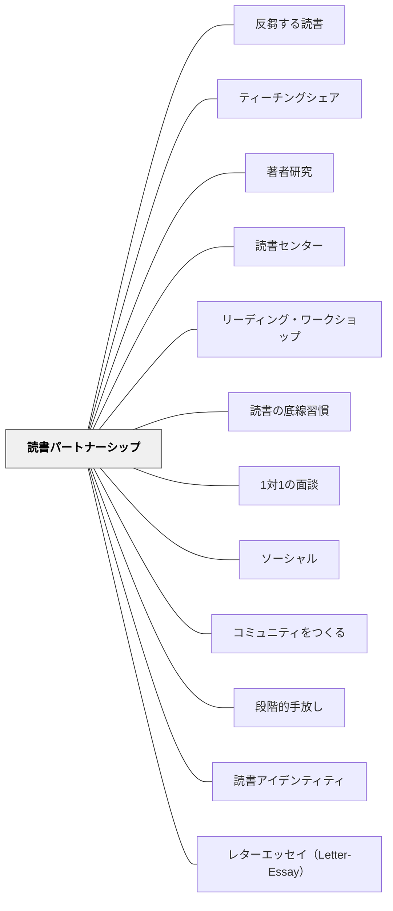

# 読書パートナーシップ

> 読む力が近い者どうしが長期パートナーになることで、互いの最近接発達領域に居続け、読書を社会的実践へと拡張する。

---

## 背景（Context）

リーディング・ワークショップでは、毎日のパートナー読みの時間（約10分）に子どもが2人組で本を読み、話し合う。このパートナーをどう組むかは、指導の質と子どもの成長に大きく影響する。

## 問題（Problem）

グループ活動で「誰と組むか」は多くの教師の悩みの種だ。混合能力グループは社会的に公平に見えるが、読書という認知的実践においては非対称性が大きくなりすぎ、片方が常に「教わる側」になってしまう。また、毎回パートナーを変えると、関係を築く前に時間が過ぎてしまう。

## 力のかたち（Forces）

- 能力差がありすぎると、弱い読み手は受け身になり、強い読み手は面倒を見るだけになる
- 読む力が近くても、得意なところ・苦手なところは二人で少しずつ違い、そこに補い合う余地がある
- パートナーが変わり続けると、深い読書対話が生まれる前に関係が終わる
- 能力別にしすぎると「グループ固定化」の感覚が生まれ、子どもに自己像を刷り込む危険がある

## 解決（Solution）

**能力別・長期パートナーシップ**を設計する。

Kathy Collins（2004）は混合能力パートナーではなく、**互いがお互いの最近接発達領域（ZPD）の中に位置する組み合わせ**を推奨する。これはVygotskiの「あと少しで届く距離」の相互版であり、両者がほぼ同じレベルにいることで、片方が届かないとき他方のちょっとした助けが本質的な助けになる。

**アナロジー**：Collinsは、自分がマラソンに向けて練習していたときの話をしている。一流の走者の講演を聞いて、この人とは練習仲間になれない、いつも後ろを走ることになる、と感じた。実際の練習仲間はルームメイトで、相手のほうが速く、自分のほうが長く走れた。相手は自分のスピードを上げてくれ、自分は相手の長距離走を伸ばした。得意・不得意が違う二人が、互いの最近接発達領域の中で補い合えた、という類推である。

### パートナーシップの設計手順

1. **観察期（9月初め）**：最初の数週間はランダムにパートナーを組み、読書の様子を観察する
2. **固定期（9月後半）**：観察結果をもとに能力別で固定。レベルが近く、人間関係が機能しそうな組み合わせを選ぶ
3. **見直し期（冬休み前後）**：成長に伴い再編成が必要か判断する

### パートナー読みの構造

- **Private Reading（私読み）の後**にパートナーと集まる
- 同じ本を読む（ペア本）か、別の本について話し合う
- パートナー読みの活動例：
  - 読んだところを声に出して読み合う
  - sticky noteにメモした思考を見せ合う
  - 「今日何が面白かった？」から始める対話
  - 好きなページを選んでパートナーに読む

### 長期パートナーシップの利点（Collins, 2004）

Collinsは、大人の研修で同僚と組むときの経験から類推している。よく知らない人と組むと、天気の話などで打ち解けるまでの「立ち上げのコスト」がかかり、親しい間柄の短い言葉で通じるやりとりもなく、取り組みへの打ち込み方も違う。よく知る同僚となら、すぐに始められ、すぐに通じ合える。子どもも同じだ、という。

- **スタートアップコストがかからない**：毎回関係づくりをしなくてよい
- **深く投資できる**：一緒にうまく取り組むやり方が育ち、パートナーシップに打ち込むようになる
- **コミュニケーションのショートハンドが生まれる**：親しい間柄にある、短い言葉で通じるやりとりができる

### 具体例

**DeannaとReinaの読み合い**（Collins, 2004）：
読み始めの二人が一緒に読んでいた。Deannaが「climbs」でつまずき、最初の音をくり返していると、Reinaは木に登る猿の絵をよく見て、自分でも音を試し、「それだと意味が通らない」と言う。するとDeannaが「climb でやってみよう」と引き取り、二人で文の頭から読み直した。ずっと先を行く読み手と組んでいたら、すぐに答えを言ってしまい、最初の音の出し方や絵を確かめることの手本にはならなかっただろう。Reinaが自然にそうできたのは、Deannaと同じところにいる読み手だったからだ、とCollinsは書く。

## 結果（Consequences）

- 読書が「一人で黙って読む」活動から「社会的実践」へと広がる
- パートナーの存在が毎日の読書のモチベーションになる（「あの子に話したい」）
- 教師は全員のカンファランスではなく、観察と重点指導に集中できる
- 長期であることで子どもが読書パートナーとしての自分を育てる

## 関連パタン
- [[パタン/反芻する読書]]
- [[パタン/ティーチングシェア]]
- [[パタン/著者研究]]
- [[パタン/読書センター]]

- [[パタン/リーディング・ワークショップ]] — 読書パートナーシップが組み込まれる親構造
- [[パタン/読書の底線習慣]] — パートナーと話すことが底線習慣の一つ
- [[パタン/1対1の面談]] — カンファランスで観察したことがパートナー設計に活かされる
- [[パタン/ソーシャル]] — 読書が社会的実践であることの大パタン
- [[パタン/コミュニティをつくる]] — パートナーシップが読書コミュニティの基盤
- [[パタン/段階的手放し]] — 最初は教師主導→パートナー→独立という手放しの構造
- [[パタン/読書アイデンティティ]] — 補完: パートナーに話したい読書体験が、「自分は読む人間だ」という自己像を支える
- [[パタン/レターエッセイ（Letter-Essay）]] — 発展: パートナーとの口頭の読書対話を、手紙による往復対話へ広げる

---

## クラスター図

```mermaid
flowchart LR
    ne8aaade69bb8e38391e383bce38388e3838ae383bce382b7e38383e38397["読書パートナーシップ"]
    ne58f8de88abbe38199e3828be8aaade69bb8["反芻する読書"]
    ne38386e382a3e383bce38381e383b3e382b0e382b7e382a7e382a2["ティーチングシェア"]
    ne89197e88085e7a094e7a9b6["著者研究"]
    ne8aaade69bb8e382bbe383b3e382bfe383bc["読書センター"]
    ne383aae383bce38387e382a3e383b3e382b0e383bbe383afe383bce382afe382b7e383a7e38383e38397["リーディング・ワークショップ"]
    ne8aaade69bb8e381aee5ba95e7b79ae7bf92e685a3["読書の底線習慣"]
    n31e5afbe31e381aee99da2e8ab87["1対1の面談"]
    ne382bde383bce382b7e383a3e383ab["ソーシャル"]
    ne382b3e3839fe383a5e3838be38386e382a3e38292e381a4e3818fe3828b["コミュニティをつくる"]
    ne6aeb5e99a8ee79a84e6898be694bee38197["段階的手放し"]
    ne8aaade69bb8e382a2e382a4e38387e383b3e38386e382a3e38386e382a3["読書アイデンティティ"]
    ne383ace382bfe383bce382a8e38383e382bbe382a4efbc884c65747465722d4573736179efbc89["レターエッセイ（Letter-Essay）"]

    ne8aaade69bb8e38391e383bce38388e3838ae383bce382b7e38383e38397 --- ne58f8de88abbe38199e3828be8aaade69bb8
    ne8aaade69bb8e38391e383bce38388e3838ae383bce382b7e38383e38397 --- ne38386e382a3e383bce38381e383b3e382b0e382b7e382a7e382a2
    ne8aaade69bb8e38391e383bce38388e3838ae383bce382b7e38383e38397 --- ne89197e88085e7a094e7a9b6
    ne8aaade69bb8e38391e383bce38388e3838ae383bce382b7e38383e38397 --- ne8aaade69bb8e382bbe383b3e382bfe383bc
    ne8aaade69bb8e38391e383bce38388e3838ae383bce382b7e38383e38397 --- ne383aae383bce38387e382a3e383b3e382b0e383bbe383afe383bce382afe382b7e383a7e38383e38397
    ne8aaade69bb8e38391e383bce38388e3838ae383bce382b7e38383e38397 --- ne8aaade69bb8e381aee5ba95e7b79ae7bf92e685a3
    ne8aaade69bb8e38391e383bce38388e3838ae383bce382b7e38383e38397 --- n31e5afbe31e381aee99da2e8ab87
    ne8aaade69bb8e38391e383bce38388e3838ae383bce382b7e38383e38397 --- ne382bde383bce382b7e383a3e383ab
    ne8aaade69bb8e38391e383bce38388e3838ae383bce382b7e38383e38397 --- ne382b3e3839fe383a5e3838be38386e382a3e38292e381a4e3818fe3828b
    ne8aaade69bb8e38391e383bce38388e3838ae383bce382b7e38383e38397 --- ne6aeb5e99a8ee79a84e6898be694bee38197
    ne8aaade69bb8e38391e383bce38388e3838ae383bce382b7e38383e38397 --- ne8aaade69bb8e382a2e382a4e38387e383b3e38386e382a3e38386e382a3
    ne8aaade69bb8e38391e383bce38388e3838ae383bce382b7e38383e38397 --- ne383ace382bfe383bce382a8e38383e382bbe382a4efbc884c65747465722d4573736179efbc89

    classDef hub fill:#f0f0f0,stroke:#555,color:#000,font-weight:bold
    class ne8aaade69bb8e38391e383bce38388e3838ae383bce382b7e38383e38397 hub
```

## Actionable Insight

- 9月初めの2週間は毎日「誰がどのレベルの本を読んでいるか」を記録する。そのデータでパートナー固定の根拠を作る
- パートナー読みの最初の1週間は「自分の好きなページをパートナーに読む」だけにシンプルに始める
- パートナーを固定したら名前カードで見える化し、「今日パートナーと何を話したか」を一言で振り返る時間を作る

---

## 出典

Collins, K.（2004）*Growing Readers: Units of Study in the Primary Classroom*. Stenhouse Publishers.

> "We complemented each other because we were working within each other's zone of proximal development."（Vygotsky, 1962 を Collins が引用）
