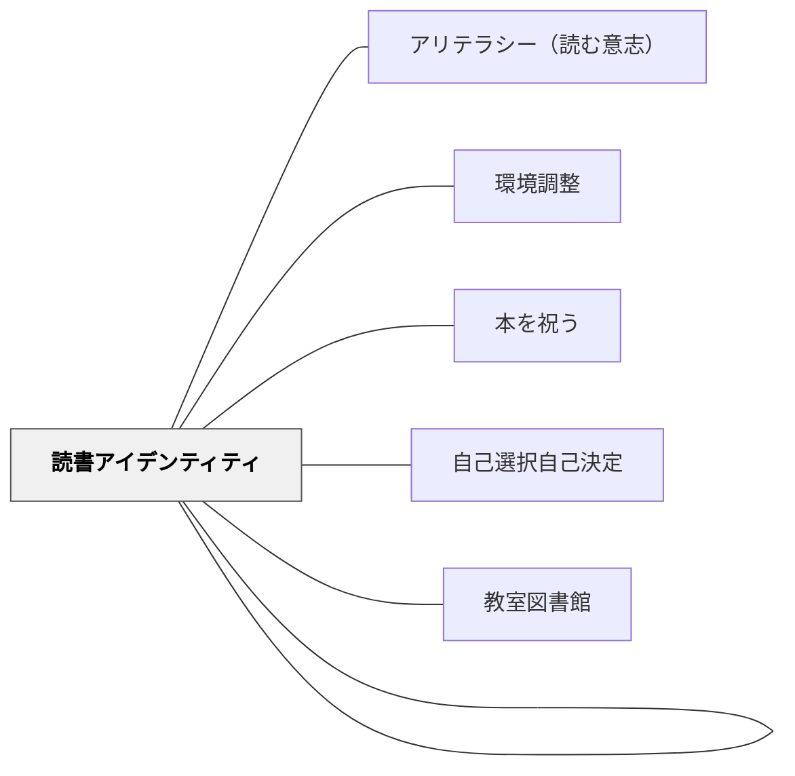

# 読書ラウンジ

> 「読書がそれほど重要なら、学校は読書ラウンジのための場所を見つけるだろう」——Ryan McNamara の一言が、すべてを語っている。読書を特別な体験として物理的に位置づけることが、WILLへの最も強力なメッセージになる。

---

## Pattern Connection

**出典**: Layne, S. L.（2009）*Igniting a Passion for Reading: Successful Strategies for Building Lifetime Readers*. Stenhouse. Chapter 7: "Nothing's More Dangerous Than a Teacher with a Good Idea"

- **既存パタンとの関連**：[[パタン/環境調整]] の「物理的空間の意図的設計」として機能する。読書のための専用空間は「読書は特別だ」というメッセージを無言で伝える——教師の言葉より空間が語る
- **補強された点**：[[パタン/アリテラシー（読む意志）]] の「WILL育成のための物理的環境設計」として具体化する。「読む意志（WILL）は内側だけでなく、外側（空間）からも育てられる」という観点が加わる
- **他のパタンへの波及**：[[パタン/本を祝う]] — 読書ラウンジが YA Café などの祝祭活動の物理的な舞台になる。[[パタン/読書アイデンティティ]] — ラウンジは「読む人間のための場所」という象徴として機能する

---

## 背景（Context）

Layne（2009）第7章「Nothing's More Dangerous Than a Teacher with a Good Idea」は、Butler Junior High（Oak Brook, Illinois）の廊下の一角に置かれたソファ・ランプ・本棚からなる小さな読書空間の事例で始まる。その空間が生徒の放課後の「居場所」になっていた。

読書ラウンジ（Reading Lounge）は、図書館でも一般的な教室でもない——「読書のためだけに作られた、快適で招待的な空間」だ。

「読書は特別な体験だ」というメッセージを、言葉ではなく空間で伝える。

## 問題（Problem）

教室の標準的な環境——整然と並んだ椅子・机・蛍光灯——は「学習のための空間」だが、「読書を楽しむための空間」ではない。

- 読書嫌いの子にとって「読書の時間 = 強制的に座って本を開く時間」になりやすい
- 快適さの欠如が「読書は楽しくない」という連合を強化する
- 本の選択・座る場所・読む体勢——すべてが規定された状況では、読書への「自発性」が生まれにくい

物理的環境は無言のメッセージを送り続ける——「ここは読書が価値ある体験として扱われている場所か、そうでないか」。

## 力のかたち（Forces）

- 快適な身体的状態が読書への没頭を助ける——ソファで読む体験は机で読む体験とは違う
- 「特別なコーナー」への招待が読書への動機（「あそこで読みたい」）を作る
- 人数制限が「特別感」を維持する——誰でも行けない場所だから価値がある
- コミュニティの家具（寄付・中古）が「みんなで作った」という当事者性を生む
- 空間自体が「読書は大事にされている」という制度的メッセージを毎日送り続ける
- 一方、設置・維持のコスト（予算・防炎確認・管理職の理解）が障壁になる

## 解決（Solution）

**教室の一角（または廊下の一隅）に、快適な座面・照明・本棚を組み合わせた読書ラウンジを設ける。人数制限と利用ルールで「特別感」を維持する。**

---

### 物理的セットアップ

| 要素 | 具体的な方法 | 注意点 |
|---|---|---|
| **座る場所** | ソファ・クッション・マット・ビーンバッグ | **防炎加工（flame-retardant）** の確認必須——学校の消防規定 |
| **明るさ** | 窓際を優先。スタンドライト（可能なら） | 蛍光灯の直接照明より間接照明が「くつろぎ」の連合を作る |
| **本棚・本の展示** | 「今月のおすすめ」「Golden Recommendation Shelf」の小コーナー | 利用者が手に取りやすい高さ・配置 |
| **区切り** | 本棚・パーティション・カーテンで「ラウンジの中と外」を作る | 完全に仕切られなくてもいい——「感覚的な境界」で十分 |
| **名前の掲示** | 子どもと一緒に「このコーナーの名前」を決めて掲示 | 当事者性が愛着を生む |

**家具の調達**：目録（カタログ）で買う必要はない——地域のリサイクルショップ・保護者への寄付呼びかけ・学校の倉庫から調達する。コミュニティで作ることが当事者意識を高める。

---

### 利用ルールの設計（Reading Lounge Guidelines）

ルールは教師が決めるより**子どもと一緒に作る**——自分たちで決めたルールは守られやすい。

典型的なルール：
1. ラウンジでは静かに読む
2. 持ち込める本は「自分が選んだ本」（課題テキストは持ち込まない）
3. 人数制限（3〜5人）——輪番制またはサインアップ制
4. ゴミは持ち帰る。本は元に戻す
5. 「ラウンジタイム」が終わったら静かに席に戻る

---

### 3つの障壁と対処

| 障壁 | 対処 |
|---|---|
| 管理職の理解が得られない | Ryan McNamara の言葉を引く——「読書が大事なら、場所は見つかる」。Butler Junior High の成功事例を紹介する |
| 予算がない | 保護者への呼びかけ・地域のリサイクルショップ・PTA 予算・学校の倉庫確認 |
| 防炎加工（flame-retardant）の確認 | 購入前に学校の消防規定を確認。家具のラベルを確認するか、市の消防署に問い合わせ |

---

### スケジューリング・バインダー

誰がいつラウンジを使うかを管理するバインダーを作る：
- 週ごとのサインアップシート
- 「今週のラウンジ当番」をクラス全員が見える場所に掲示
- 教師が「今日はどのグループのラウンジの日か」を確認できる

---

### デコレーション

子どもが作ったポスターでラウンジを飾る（コンテスト形式）：
- 「読書ポスター・コンテスト」を開き、入賞作品をラウンジに掲示（額装）
- 入賞者に小さなギフト（本の詰め合わせなど）を贈ることも動機になる

---

## 結果（Consequences）

- 「ここで読みたい」という場所への欲求が読む行動を引き出す
- 「読書を特別にしている先生・学校だ」という認識が読書アイデンティティを支える
- ラウンジで友達が読んでいる姿が「社会的モデリング」として機能する
- 快適な体験が「読書は気持ちいい」という連合を積み上げる
- ただし、ラウンジが「行儀よくすれば行ける特権的な賞」になるとWILLへの効果が薄れる——「賞として使わない」ことが原則

## 関連パタン

- [[パタン/アリテラシー（読む意志）]] — ラウンジはWILLを育てる環境設計の一部
- [[パタン/環境調整]] — 物理的空間の意図的設計の大きな枠組み
- [[パタン/読書アイデンティティ]] — ラウンジが「読む人間のための場所」という象徴として機能する
- [[パタン/本を祝う]] — ラウンジはYA Café・Read Aroundsなどの祝祭活動の舞台
- [[パタン/自己選択自己決定]] — ラウンジに何を持ち込み、どこで読むかを「自分で選ぶ」
- [[実践/読書への情熱を育てる実践集]] — 四半期計画の中での読書ラウンジの設置・運用
- [[パタン/教室図書館]] — ラウンジと並ぶ物的読書環境の設計：本の陳列・選書システム

---

## クラスター図

## Actionable Insight

- 今日できること：教室の一角にクッション2つと小さな本棚（または段ボール箱の本置き）を置いてみる——「ラウンジ」の感覚は家具の価格でなく「意図」で生まれる
- 今週中に：子どもと一緒に「このコーナーの名前を決める」5分を作る——その会話で、すでにラウンジの文化が始まる
- 管理職への説明が必要なら：「もし読書がそれほど重要なら、学校はそのための場所を作るはずだ」という Ryan McNamara の言葉を出発点にする

---

## 出典

Layne, S. L. (2009). *Igniting a Passion for Reading: Successful Strategies for Building Lifetime Readers*. Stenhouse Publishers. Chapter 7.

> "If reading was important, they'd find space for a reading lounge."
> —Ryan McNamara（in Layne, 2009）
