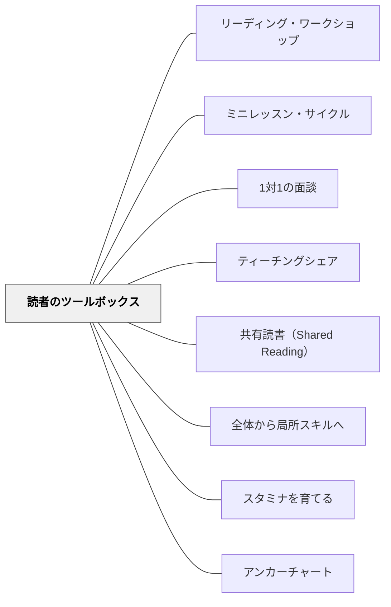

# 読者のツールボックス

> 「意味が通るか・音として正しいか・字の形が合うか」の3つの問いを持てる読み手は、詰まったとき自分で動き出せる。

---

## 背景（Context）

リーディング・ワークショップで独立読書をしている低学年の子どもたちは、知らない言葉や難しい文章に頻繁に出会う。このとき「どうやって読み進めるか」の手立てを持っているかどうかが、読書体験の質を大きく左右する。

Collinsは第6章で、この手立てを**Reader's Toolbox（読者のツールボックス）**と呼ぶ。工具箱には複数の道具が入っており、状況に応じて使い分ける——それが熟練した読み手の姿だという考え方がこのパタンの核心だ。

## 問題（Problem）

「わからない字は一字一字声に出して読む（phonics drillのみ）」という一つのストラテジーしか持たない読み手は、意味を追う読み方ができなくなる。反対に「なんとなく流して読む」読み手は、文字情報を活かさない。どちらも「詰まったときに自分で動き出せない」という問題を持っている。

## 力のかたち（Forces）

- 低学年にはデコーディング（文字を音に変換する）の明示的指導が必要
- しかしフォニックス・ドリルだけでは「意味を作る読み」への転移が起きにくい
- 複数のストラテジーを持つと、一つが機能しないとき別の手段を試せる
- 「どれを使うか」の判断は文章の文脈によって変わる——文脈から切り離した練習では身につかない
- 自分のストラテジー使用を意識（メタ認知）できる読み手ほど、問題解決が速い

## 解決（Solution）

Collins（2004）が提示するReader's Toolboxの中核は、**MSV三点クロスチェック**である。

---

### MSV三点クロスチェック

知らない言葉や詰まったとき、次の3つを問う：

| 問い | 意味 | キューの種類 |
|------|------|-------------|
| **M: Does it make sense?（意味が通る？）** | 文脈・物語の意味から考える | 意味（Meaning）キュー |
| **S: Does it sound right?（音として正しい？）** | 日本語として自然か、文法として通るか | 構造（Structure）キュー |
| **V: Does it look right?（字の形と合う？）** | 実際に書いてある文字と一致するか | 視覚（Visual）キュー |

熟練した読み手は三点を**同時・無意識**に使っている。初心者は意識的に順番に確認する練習が必要。

---

### 詰まったときに使える具体的な手立て

```
① 先を読んでもう一度戻る（Go back and reread）
② 絵を手がかりにする（Use the picture）
③ 最初の音を手がかりに意味を考える（Get your mouth ready）
④ 前後の文脈から予測する（Think about what would make sense）
⑤ 文字の塊を見つける（Look for a chunk you know）
⑥ 声に出して読んで耳で確かめる（Read it aloud and listen）
```

これらを紙に書いてアンカーチャートとして教室に掲示し、「ツールボックス」と名付ける。

---

### 流暢さ（Fluency）もツールボックスの一部

Collins は流暢さを「速さ」ではなく**「声の表情」**として教える。

- 「ロボット声（robot voice）」：一語ずつ区切って読む——流暢でない状態
- 「話す声（talking voice）」：キャラクターが実際に話しているように読む——流暢な状態

**ミニレッスン例（流暢さ）**：教師が同じ文を2回読む——1回目はロボット声で、2回目は話す声で。「どちらが物語が伝わった？」と問い、聴き比べから流暢さの価値を引き出す。

---

### ランニングレコードとツールボックスの接続

1対1のカンファランス（[[パタン/1対1の面談]]）でランニングレコードを取ると、子どもがどのキュー（M・S・V）を使いすぎているか、使えていないかが見える。

- 「意味は取れているが字が違う」→ Visual キューへの注目を促す
- 「字は読めているが意味を確認していない」→ Meaning キューの問いを持つよう促す

この観察がミニレッスンの選択を決定する——ツールボックスのどの工具を全体に教えるかは、カンファランスの観察から始まる。

---

### 「ツール化」の原則

Collins が強調するのは、ストラテジーを**いつでも取り出せるツール**として子ども自身が所有すること。

> "We want readers to be able to use these strategies when they are reading on their own." （Collins, 2004）

そのため：
- アンカーチャートは子どもが参照できる場所に常時掲示する
- カンファランスで「今日どのツールを使った？」と聞く
- ティーチングシェア（[[パタン/ティーチングシェア]]）でツールの使い方を仲間の言葉で共有する

## 結果（Consequences）

- 詰まったとき自分で動き出せる読み手が育つ——教師への依存が減る
- 「フォニックスだけ」から「意味を作る読み」への転換が起きる
- ランニングレコードを通じて教師の観察眼が鋭くなる——カンファランスの質が上がる
- 流暢さの向上が「読書が楽しくなる」という体験につながる

## 関連パタン

- [[パタン/リーディング・ワークショップ]] — ツールボックス指導が組み込まれる4部構造
- [[パタン/ミニレッスン・サイクル]] — ストラテジーの最初の指導はミニレッスンで行う
- [[パタン/1対1の面談]] — ランニングレコードでツール使用状況を診断する
- [[パタン/ティーチングシェア]] — ツールの実践をクラス全体で共有する
- [[パタン/共有読書（Shared Reading）]] — ツールのモデルを教師が示す場
- [[パタン/全体から局所スキルへ]] — 全体読書の文脈の中でストラテジーを教える
- [[パタン/スタミナを育てる]] — ツールが機能すると詰まりが減り、読書スタミナが伸びる
- [[パタン/アンカーチャート]] — ツールボックスの内容を視覚化し教室に常設する

---

## クラスター図



## Actionable Insight

- アンカーチャートに「詰まったら……」という見出しで3〜4つのストラテジーを子どもと一緒に作る——「クラスのツールボックス」として壁に貼ると、独立読書中に自分で参照できる
- カンファランスで「今どのツールを使った？」と一問添える習慣をつける——自分の使ったストラテジーを言語化することがメタ認知の練習になる
- 1週間に1回、同じ文を「ロボット声」と「話す声」で読み比べる2分間を設ける——流暢さが聴いてわかる体験が、子どもに「どう読むか」の目標を与える

---

## 出典

Collins, K.（2004）*Growing Readers: Units of Study in the Primary Classroom*. Stenhouse Publishers. → [[文献/Growing Readers（Collins）]]

> "Good readers use a variety of strategies to figure out unknown words, and they know when and how to use them." ——Collins（2004）
