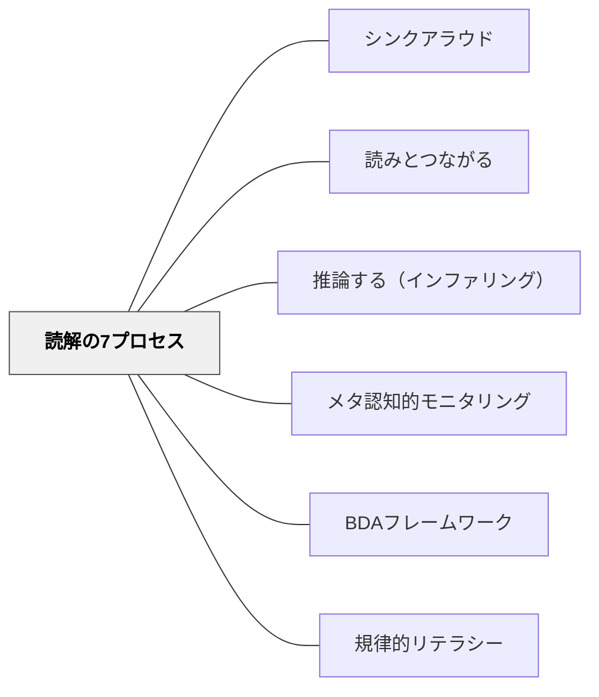

# 読解の7プロセス

> 熟達した読者は「正しく読もう」とするのではなく、7つの思考プロセスを意識的・無意識的に動かしながら意味を作り続ける——この思考プロセスを教えることが読解指導の核心だ。

## [Pattern Connection]

**Buehl（2014）統合（2026-05-19）——7プロセスと授業設計の接続：**

Buehl は Keene & Zimmermann（2007）の7プロセスを、本書43戦略すべての読解プロセス指標として採用している。各戦略の Strategy Index には「どのプロセスを育てるか」が明示されており、7プロセスは**個別の読解授業の評価基準**として機能する。

- **補強された点**：7プロセスは単独で教えるより、BDA フレームワーク（[[パタン/BDAフレームワーク]]）と組み合わせることで「どのフェーズでどのプロセスが育つか」が設計できる——Before でつながりと問い、During で推論・視覚化・重要性の判断・モニタリング、After で統合
- **拡張された点**：Buehl の教科別質問分類表（Tables 5-14）は、7プロセスを各教科の文脈に落とし込んだもの——歴史での「推論（Making Inferences）」と算数での「推論」は問いの形が異なる。教科横断的な読解指導の共通言語として7プロセスが機能する
- **他のパタンへの波及**：[[パタン/規律的リテラシー]] — 教科ごとの disciplinary lens 読解が、7プロセスの教科固有の実装として展開される

---

## 背景（Context）

Keene & Zimmermann（2007）は、熟達した読者がどのように読むかを20年以上の教室観察・実践研究を通じて描き出した。その核心は：**熟達した読者は7つの思考プロセスを同時に、かつ柔軟に使いながら意味を作っている**。

「読解ストラテジー」という言葉は1980年代から使われていたが、Keene & Zimmermann はそれを「スキルの習得」ではなく「思考プロセスの内面化」として再定義した。7つのプロセスは「覚えるもの」ではなく「どんなテキストでも機能する思考の土台」として教える。

Duke & Pearson（2002）が確認した：「熟達した読者がこうした思考プロセスをどのように使うかが分かった今、問いは変わった——これを学習者に教えられるか？ 答えは明白にイエスだ。」

## 問題（Problem）

「内容を理解させる」読解授業と「読み方を教える」読解授業は根本的に違う。内容の確認（「何が書いてあったか答えなさい」）は読解プロセスを教えていない。読者の思考プロセスが見えなければ、「読めない子どもに何をすればいいか」が分からない。

また、7つのプロセスをバラバラに単元として教えると「つながりの単元」「推論の単元」となり、プロセスが孤立する。熟達した読者がプロセスを統合的に使うことが伝わらない。

## 力のかたち（Forces）

- 7つのプロセスは独立していない——推論するためにつながりを使い、統合するために重要性の判断が必要
- 読解プロセスは見えない——シンクアラウド（[[パタン/シンクアラウド]]）でモデリングしなければ学習者には届かない
- プロセスは「使う文脈」と切り離せない——教科の読みの中でプロセスを使うことで初めて定着する
- 教師が「今どのプロセスが起きているか」を言語化する習慣が、子どもの自己認識を育てる

## 解決（Solution）

**7つの読解プロセスを授業の共通言語として使い、熟達した読者がどのように思考しているかをシンクアラウドで見える化する。各プロセスを個別に教えつつ、実際の読書の中で統合的に使う機会を設ける。**

---

### 熟達した読者の7つの読解プロセス

| プロセス | 内容 | 関連パタン |
|---|---|---|
| **既有知識とのつながり（Making Connections）** | Text-to-Self・Text-to-Text・Text-to-Worldの3種でテキストと既知の知識を照合し理解を更新する | [[パタン/読みとつながる]] |
| **問いの生成（Generating Questions）** | 読みながら自ら問いを立てる——著者との内なる対話。「なぜ？」「次はどうなる？」 | |
| **視覚化・感覚的イメージ（Visualizing）** | 言語を体験・感覚と結びつけ心の中の映像・音・匂い・感触を作る | |
| **推論（Making Inferences）** | 著者が明示していない意味を、テキストの手がかりと自分の知識で補う | [[パタン/推論する（インファリング）]] |
| **重要性の判断（Determining Importance）** | 多くの情報から「記憶すべき核心」を選び取る——全てが等しく重要ではない | |
| **統合（Synthesizing）** | 読んだことをまとめて個人的な解釈・結論・要約を作る——新しい知識と既知の知識の化学反応 | |
| **読解の監視と修正（Monitoring & Fix-Up）** | 理解が崩れたときに気づき、立て直す（再読・前後の文脈を探す・スキップして続ける） | [[パタン/メタ認知的モニタリング]] |

---

### BDAフレームワークと7プロセスの対応

| フェーズ | 主要プロセス | 方略例 |
|---|---|---|
| **Before（読む前）** | Making Connections・Generating Questions | アンティシペーション・ガイド・KWL |
| **During（読む間）** | Visualizing・Making Inferences・Determining Importance・Monitoring & Fix-Up | テキスト・コーディング・シンクアラウド |
| **After（読んだ後）** | Synthesizing・Generating Questions（新たな問い） | クイックライト・マグネット・サマリー |

---

### シンクアラウドで7プロセスを見える化する

教師のシンクアラウドは7プロセスを子どもに「見せる」中心的な方法だ。各プロセスに対応する言語例：

| プロセス | 教師のシンクアラウドの言語 |
|---|---|
| Making Connections | 「今ここを読んで、去年の社会科で学んだ○○を思い出した」 |
| Generating Questions | 「なぜここでこうなったんだろう。続きを読んで確かめてみよう」 |
| Visualizing | 「このシーンを読んだとき、どんな音がするか想像できた」 |
| Making Inferences | 「著者は直接言っていないけれど、この言葉のパターンから○○だと推論した」 |
| Determining Importance | 「この段落で一番大事なのはここだと思う。なぜかというと……」 |
| Synthesizing | 「ここまで読んで、私の理解が変わった。最初は○○と思っていたが、今は△△だと思う」 |
| Monitoring & Fix-Up | 「あれ、今ここが全然分からなくなった。もう一度読み直してみます」 |

---

## 結果（Consequences）

- 「読めない」子どもに「どのプロセスが詰まっているか」という診断的な視点が生まれる
- 子どもたちが「今つながりが生まれた」「推論している」と自分の思考を言語化できるようになる
- 授業が「答えの確認」から「思考の見える化」へと変わる
- ただし、7プロセスは意識的に「やる」ものではなく実際の読書の中で自然に起きるもの——全ての読みに付箋を貼らせる等の過剰な指導は読書の流れを壊す

## 関連パタン

- [[パタン/シンクアラウド]] — 7プロセスをモデリングする中心的な方法
- [[パタン/読みとつながる]] — Making Connections の専用パタン
- [[パタン/推論する（インファリング）]] — Making Inferences の専用パタン
- [[パタン/メタ認知的モニタリング]] — Monitoring & Fix-Up の理論的基盤
- [[パタン/BDAフレームワーク]] — 7プロセスをフェーズ設計に組み込む
- [[パタン/規律的リテラシー]] — 教科ごとに7プロセスの問い方が変わる

---

## クラスター図

## Actionable Insight

- 今週のシンクアラウドで7つのプロセスのうち1つだけを意識して声に出す——「今つながりが生まれた」「今推論した」と言語化するだけで子どもたちの意識が変わる
- 子どもが「先生、分からなくなった」と言ったとき「どこで分からなくなったか」を聞く——Monitoring プロセスが起きていることを価値づける
- 授業後に「今日の読みの中で、どのプロセスが起きていたか」を自分で確認する——教師の7プロセスへの感度が上がると、子どもへの問い返しが変わる

---

## 出典
- [[文献/Classroom Strategies for Interactive Learning（Buehl）]]

Keene, E. O., & Zimmermann, S. (2007). *Mosaic of Thought: The Power of Comprehension Strategy Instruction* (2nd ed.). Heinemann.
Buehl, D. (2014). *Classroom strategies for interactive learning* (4th ed.). Newark, DE: International Reading Association.

> "Proficient readers spontaneously and purposefully use comprehension strategies, but they also know when and why to use them." —Keene & Zimmermann（2007）
