# 誰が書けるかを明文と実効で読む

> 「この記録を書けるのは誰か」を、二つの列に分けて読む。決まりがそう定めているという列と、現にそう行われているという列。どちらか一方から、他方は出ない。

## [Pattern Connection]

本パタンは岩井（2026）『圏論的教育記述の公理化ノート 第3巻』第1章・第4章の**教室語版**であり、**理論の正は書籍にある**（定義・記号はこの Wiki に置かない）。ここに書くのは、教室で使える形に開いた読み方の手順だけである。

そして、このページには最初に一行、釘を打っておかなければならない。**このパタンは、記録をめぐる非対称の当否を判定しない。** 「誰が書けるべきか」「その決まりは正しいか」を、このパタンは一言も言わない。渡すのは**正確に記述する手順**であって、**あるべき姿**ではない。

この釘が要るのには、形式上の理由がある。パタンというものは、そもそも**命令形で書かれる**——「こうしなさい」「こう置きなさい」。一方、出典の理論は「これは、これを意味しない」という**否定形**で書かれている。つまり、パタンという器そのものが、この本の抑制とは逆を向く力を持つ。だから本ページは、命令形を使う場所を、**手順の側だけ**に限る。「二つの列に分けて書け」とは言う。「こうあるべきだ」とは言わない。

このWikiには、記録を**残す**側のパタンがすでに厚くある——[[パタン/ドキュメンテーション]]、[[パタン/自己記録]]、[[パタン/つまずきを構造で記録する（診断の粒度設計）]]。本パタンはその隣に、**その記録を、誰が書ける場所に立っているのかを読む**側を置く。何を書くかの技術と、誰が書き手の位置にいるかを読む技術は、別のものである。

[[概念/証拠不足と不成立の区別]] が「証拠がないことは、無いことではない」を一人の子の水準で確定したのに対し、本パタンは同じ手つきを**決まりの側**に使う。決まりが見当たらないことは、「誰も書いてはいけない」でも「誰でも書いてよい」でもなく、ただ**未記録**である。

## 背景（Context）

授業のあと、返却を受けた子が、自分の学習を自分で振り返って一枚の記録を残す。「1を動かしたことが分かるように書く」。教師が書いた記録の山の中に、子どもが書いた一枚が混じっている。

その一枚を前にすると、ふだん一度も問わない問いが立つ。**この学級で、記録を書けるのは、誰なのか。**

ノートに書き込むこと。返却を返すこと。評価を残すこと。記録を訂正すること。記録の様式そのものを変えること。観察の窓を開けること。これらは、いつも同じ人がしてよいことになっているのか。それとも、位置によって、誰がそこに立てるかが変わるのか。

学校の日常は、この問いをほとんど言葉にしない。だが、実務のあちこちで、この問いは形を変えて現れる。「このノート、係以外が書いていいんだっけ」。「保護者から、所見の書き方を直してほしいと言われた」。「システムに子どもは入れません」。そのつど、たいていは経験と印象で答えが決まる。そして、決まった答えは、次からは決まりのような顔をして通用しはじめる。

## 問題（Problem）

**「誰が書けるか」を読もうとすると、二つのことが同時に起きる。混ぜてはいけない二つの根拠が混ざり、そして、記述したとたんに告発になる。**

### 混ざる——決まりと、実際

「このノートを書けるのは、係だけだよね」。この一文は、二つのまったく別の主張のどちらでもありうる。

- **決まりが、そう定めている**（明文）
- **現に、そう行われている**（実効）

言った本人も、聞いた側も、たいていどちらの意味かを区別していない。そして、**どちらか一方から、他方は出ない**。決まりがあることは、実際に行われていることを意味しない（規程に「保護者は訂正を申し立てられる」と書いてあっても、申し立てが一件もないことはある）。行われていることは、決まりがあることを意味しない（現に係だけが書いていても、それを定めた決まりは無いかもしれない）。

混ざったまま話すと、話し合いは「そうだったっけ」「いや、そういうものでしょう」の応酬になり、確かめようがなくなる。

### 滑る——「非対称がある」が「不当だ」に読まれる

もう一つ、こちらのほうが厄介である。

> 「この記録実践には、こういう非対称がある」という一文は、放っておくと「この非対称は不当である」へ、**一語も変えずに**読まれる。

非対称の記述は、読み手の中で、自動的に告発になる。滑りは両方向に起きる。**書く側**では、記述のふりをした評価がまぎれこむ——「〜しか書けない」という書き方に、すでに批判の色がついてしまう。**読む側**では、事実の報告が、責める言葉として受け取られる。

これは読み手が悪いのではない。人間の読みが、そう働くのである。そして、この癖は、暴いても消えない。一度「記述は告発ではない」と学んでも、次の一文の前で、また滑る。

問いはこうなる——**では、どうやって「誰が書けるか」を、告発にせずに書くのか。**

## 力のかたち（Forces）

- **記述と告発の紙一重**——「非対称がある」は、放っておくと「不当だ」と読まれる。正確に書こうとするほど、書いた文が誰かを責めているように見える
- **明文化すると門番化しやすい／明文が無いと恣意が見えない**——決まりを書けば、誰が何を根拠に判断しているかが確かめられるようになる。だが、書いた決まりを「通す・弾く」の装置にした瞬間、決まりの外の出来事は記録に残らなくなる
- **一件の重みと、一件の危うさ**——一件は、位置が固定されていないことの証人になる。だが同じ一件を「だから誰でも書けるのだ」と読めば、それは実効の列が支えていない主張になる
- **システム化の利便と、乖離が見えなくなること**——校務支援システムは、間違いを減らし、手間を減らす。同時に、決まりの外の行使が**そもそも起こりえない**世界を作る
- **当否を言わないことが「事なかれ」に見える**——「それが良いか悪いかは、この道具からは出ません」は、逃げに見えることがある。出典はこう答えている——知を制限するのは無知のためではない。その先に、**実践の判断が座るための場所を空けておくため**である
- **同僚関係と、正確さ**——「決まりは無いですよ」と言うことは、事実の指さしであると同時に、相手の言い方を否定する行為にもなる。同じ内容でも、言い方一つで告発になる
- **忙しさ**——二つの列に分けて確かめるには、ノートをめくる時間と、規程を探す時間が要る。その場で言い切ってしまうほうが、いつも速い

## 解決（Solution）

**「誰が書けるか」を、明文と実効の二つの列に分けて読み、分けたまま報告する。そして、当否は出力しない。**

### 二つの列

- **明文**——誰がその位置に立てるかを定めた決まり・規程が、そう定めているということ
- **実効**——現にその位置の行為がなされたという、**行使の記録**が、そう示しているということ

この二つを**分けて報告する**ことが、この道具の心臓部である。そして、繰り返しになるが、**どちらか一方から他方は出ない**。

### 五つの位置

記録をめぐって、人が立ちうる位置は一つではない。少なくとも、次の五つは分かれる。

| 位置 | 問い |
|---|---|
| **書き手** | この記録を書けると扱われているのは、誰か |
| **読み手** | 読めると扱われているのは、誰か |
| **申立て手** | 訂正や異議を申し立てられると扱われているのは、誰か |
| **改訂手** | 記録の様式そのものを変えられると扱われているのは、誰か |
| **観察手** | 観察の窓を開けられると扱われているのは、誰か |

同じ記録でも、位置ごとに答えは違う。所見は、書き手は担任、読み手は保護者と本人、申立て手は——たいてい未記録である。様式を変えられる改訂手は、担任ではないことが多い。

そして大事なこと。**この五つは、閉じた完全な分類ではない**。暫定的な列挙である。教室で「これはどの位置だ」と言えない場面が出てきたら、それは分類の失敗ではなく、**六つ目の候補の発見**である。候補として書き留めて、保存しておく。

### 「決まりが無い」は、正直に「未記録」と書く

学級の記録実践の資格が明文化されていないのは、**むしろ常態**である。貸出ノートを誰が書いてよいかを定めた文書は、まず存在しない。

そのとき、正直に「**決まりは無い**」と返す。**でっち上げてはならない。** 「たぶん、こういうことになっているはず」を明文の列に書き込んだ瞬間、この道具は使えなくなる。

そして——「まだ言えない」は「成り立たない」ではない。決まりが無いことは、「誰でも書ける」でも「その位置が固定されている」でもない。**決まりの列が空である**、それだけである。（[[概念/証拠不足と不成立の区別]] と、まったく同じ手つきである。）

---

### 一件は、証人一件である

この道具の実務的な急所は、ここにある。

ある学級に、**学級文庫の貸出ノート**がある。誰が書いてよいかの決まりは、どこにも書かれていない。ノートをめくると、図書係の子二人の記録が多数と、係ではないAさんの記録が**一件**ある。同僚が言う——「このノートを書けるのは、係だけだよね」。

二つの列で読む。

**明文**——決まりが、無い。だから未記録である。無いものを、あることにしてはならない。

**実効**——現に書いた者を列挙する。図書係の二人と、Aさん。ここで大事なのは、**Aさんの一件を、列挙から外さない**ことである。

> **一件は、証人一件である。**

もしAさんの一件を「例外だから」と落とせば、位置が係に固定されていないことの、**いちばん大事な証人が消える**。多数決ではない。列挙である。

したがって、同僚の発言「係だけ」は、**明文の主張としては根拠がなく**（決まりが無い）、**実効の主張としてはAさんの一件が反例の証人になって**、どちらの列でも立たない。

そして、ここからが本番である。**言えないことを、はっきりさせる。**

「Aさんが書いてよかったか」「係に限る**べき**か」——これは**当否**であり、この検査からは出ない。同僚に返せるのは、

> **「決まりは無く、現にAさんも一件、書いている」**

という、**事実の指さしまで**である。それ以上は、この道具の仕事ではない。ここで止まれるかどうかが、この道具が使えるか、告発の装置になるかの分かれ目になる。

---

### 記述であって、門番ではない

いちばん危ない誘惑は、この道具を「**通す・弾く**」を決める装置として使うことである。

> **注釈外の行使は、拒否すべき違反ではなく、記録すべき出来事である。**

決まりに無い者の行使——子どもが自分の学習の記録を書く、保護者が訂正を申し立てる——が現れたとき、それを**弾かない**。**決まりと実際の乖離の発見**として、記録する。

> **門番は、非対称を見えなくする。記述は、非対称を見えるようにする。**

出典の起点の例に戻る。返却を受けた児童Dが、自分の学習を自分で振り返って一枚の記録を残した——「1を動かしたことが分かるように書く」。**もしこの道具が門番だったら、この一枚は弾かれて、消えていた。** 位置が教師に固定されていないことを示す、いちばん大事な証人が、記録から消えてしまう。

そして、なぜ一枚で「書き手の位置に立てると扱われている」と言えるのか。その一枚が**捨てられずに、記録として通用しているから**である。学級の記録実践が、その一筆を「記録」として扱った——**その扱いそのものが、証人**である。逆に、実践が「子どもの書いたものは記録ではない」として捨てていたなら、その一枚はどこにも存在せず、実効の列は教師だけのままだっただろう。

「立てると扱われている」という言い方そのものが、この設計を守っている。これは「誰が立てる**べき**か」ではない。記録が**現に示している範囲**を述べるだけの言葉であって、門番の言葉（誰を通すか・誰を弾くか）ではない。

---

### メディアの選択そのものが、権限の設計である

このページで、いちばん重い一節である。

> **どの記録を紙に置き、どれをシステムに置くかというメディアの選択そのものが、権限の設計である。**

例を出す。**児童アカウントからの入力を受け付けない校務支援システム**。仕様として、そもそも児童はそこに入れない。

この仕様は、決まり（書き手は教職員）を、**門番として機械に実装している**。その下では何が起きるか。**決まりの外の行使の証人が、原理的に生まれなくなる。** 実効の列は、明文の列の**写ししか出力できない**。乖離そのものが、観察できなくなる。

紙のノートの世界では、子どもの一枚が生まれられた。だが、このシステムの中では、生まれられない。

そして、いちばん静かで、いちばん重い一点。もし「児童が記録を書く」という状況そのものが「あり得ない話」に見えるとしたら、それは何の証拠か。

> **弾かれる場面すら想像できないのは、門番が完全に勝っている証拠である。**

弾かれる場面が思い浮かばないのは、その領域で門番化がすでに完全に勝っているからである。どこにも「弾かれた」という記録が残らないほど、位置が固定されている。

**この一点も、当否は言わずに記述する。** それが公正か・不当かは、この道具の仕事ではない。だが、**そこに非対称があること**、そして**それが観察できるかどうかがメディアの選択に懸かっていること**は、記述できる。

---

### 子どもの権利は、「記述すべき現象」として入る

子どもの権利は、この枠組みには「導出すべき規範」としてではなく、「**記述すべき現象**」として入る。

- **意見の表明**は、応答欄の**行使**として記述できる
- **記録へのアクセス**は、**読み手位置**の資格と行使として記述できる（本人は、自分についての記録を読める位置にいるか）
- **訂正の申立て**は、**申立て手位置**の資格と行使として記述できる

「学校との緊張関係」は、非対称の**事実**として正確に書ける——子どもは自分についての記録の、書き手でも改訂手でもないことが多く、読み手・申立て手の資格も、制度に依存する。

そして、ここが重要である。**この正確な記述それ自体が、権利の議論への寄与になる。規範を語らずに、である。**

ただし、境界ははっきりしている。**なぜ権利を保障すべきかという規範的な根拠**・**条約の法解釈**・**制度への勧告**は、この枠組みの外にある。この道具は、それらのどの立場とも競合しない。競合しないのは、そこに踏み込まず、**席を空けている**からである。

---

### 具体例1：貸出ノートの「係だけだよね」に、その場で返す

上の急所を、実際の言葉にする。

同僚「このノート、書けるのは係だけだよね」。
返せる言葉——「**決まりは、たぶんどこにも無いですね。ノート見たら、係の二人のほかにAさんが一回書いてました。**」

これだけである。「だから誰が書いてもいい」とは言わない。「係に限るのはおかしい」とも言わない。二つの列を口に出しただけで、話し合いは「そういうものでしょう」から「じゃあ、どうしましょうか」へ移る。**どうするかを決めるのは、この道具ではなく、その学級を持っている人たちである。**

---

### 具体例2：係活動の記録

学級の当番表・給食の記録・生き物の世話のノート。これらは、たいてい「係が書くもの」として運用されている。

二つの列で読んでみる。**明文**——学級のきまりを子どもたちと決めたなら、それは明文である（教室の壁に貼ってある紙が、明文の記録になる）。決めていないなら、未記録。**実効**——現に誰が書いているか。係でない子が書いた回があれば、それを数える。

ここで見えてくるのは、たいてい**改訂手**の位置である。この様式そのもの（「日付・名前・気づいたこと」の欄）を作ったのは誰か。変えられるのは誰か。多くの学級で、この位置は教師に固定されていて、しかもそのことは一度も話題になっていない。

もし子どもが「この欄、いらないと思う」と言い出したら——それは違反ではなく、**改訂手の位置に立つ行使**である。記録すべき出来事である。

---

### 具体例3：子どもが自分の振り返りを記録に残す場面

振り返りカード、学習感想、自主学習ノート。これらは、たいてい「子どもが書くもの」として設計されている。だから、書き手位置に子どもがいることは、はじめから明文に近い。

**では、その先の位置はどうか。**

- **読み手**——その振り返りは、誰が読むのか。教師だけか。本人は自分の過去の振り返りを読み返せる場所にあるか（ファイルは教師の机の引き出しか、子どもの手元か）
- **申立て手**——教師がその振り返りに書いたコメントに対して、子どもは「そこは違う」と返せるか。返す欄はあるか
- **改訂手**——振り返りカードの様式（「今日がんばったこと」「明日やること」）を、子どもは変えられるか

書き手位置だけを子どもに開いて、読み手・申立て手・改訂手は閉じている——これは、非常によくある形である。**そのこと自体は、良くも悪くもない。** だが、そう**なっている**ことは、書ける。書けたら、次に何を開くかを考えるのは、実践の側の仕事になる。

---

### 具体例4：校務システムに移した記録と、紙に残した記録

年度当初、「これは今年からシステム入力です」という連絡が来る。そのとき一度だけ、次の問いを置く。

**この記録がシステムに移ることで、誰が書けなくなるか。誰が読めなくなるか。誰が申し立てられなくなるか。**

たとえば、紙の連絡帳では保護者が同じ紙面に書き込めた。アプリの通知になると、返信欄があるかないかで、申立て手の位置が変わる。紙のノートでは、子どもが横に一行書き足せた。システムでは、その一行は存在できない。

繰り返すが、**どちらが良いかを、この道具は言わない。** システム化には理由があり、その理由はたいてい正当である。書けるのは——「この記録では、これまで◯◯の位置に◯◯が立っていた。移行後は、その位置に立てる記録が残らない」まで。

そして、その先はこうである。**乖離が観察できなくなること自体を、記録に残しておく。** 「今年から、この欄は子どもが書き足せません」とメモしておく。何年か経つと、それが「もともとそういうものだった」に変わるからである。

---

### 具体例5：保護者からの訂正の申し出

「所見のこの書き方を直してほしい」と、保護者から連絡が来る。

反射的に立つ問いは「直せるのか／直すべきか」である。だがその手前に、二つの列がある。

**明文**——訂正の申立てについて定めた決まりが、あるか。学校の文書に、あるか。無ければ、未記録である。「前例がない」は明文ではない。**実効**——過去に、保護者からの申し出で記録が動いた事例が、あるか。あれば、申立て手位置に保護者が立った証人が、現に存在する。

ここで大切なのは、**この申し出を「違反」として扱わない**ことである。決まりに無い者からの行使は、弾くべきものではなく、**決まりと実際の乖離の発見**である。記録すべき出来事である。

そして、その申し出にどう応じるかは——**この道具からは出ない**。学校として、担任として、判断する。ただし、判断の前に、二つの列を見た状態で判断できる。それがこの道具の全部である。

---

### 具体例6：自己教育での適用——三つの位置が、全部自分

このWikiの持ち主は、子どもに教える者であると同時に、**自分自身を学習者として実験する実践者**である（数学の自己学習を、日々続けている）。その学習記録に、この道具を当ててみる。

自分のノート、間違いの記録、「今日わかったこと」のメモ。

- **書き手**——自分
- **読み手**——自分
- **申立て手**——自分
- **改訂手**——自分（ノートの取り方を、いつでも変えられる）
- **観察手**——自分（どこを見るか、何を記録に残すかを、自分で決めている）

**五つとも自分である。** これは、教室の記録とは正反対の分布である。そして、その意味は二つある。

一つ。**位置の非対称がゼロであることが、そのまま良いことを意味しない**（分布の対称は、それだけでは何も保証しない）。改訂手が自分しかいないということは、**都合の悪い記録の様式を、いつでも自分で変えられる**ということでもある。「この欄、書きにくいからやめよう」——それは改訂手の行使であり、同時に、証人を消す行為でもある。

二つ。**観察手が自分しかいない**ということは、「見ていないから分からない」と「見たうえで無かった」を分けてくれる人が、誰もいないということである。自分が窓を開けなかった領域は、記録の上では、初めから存在しないように見える。

だから、自己学習の記録に一つだけ足すとよいものがある。**改訂の記録**である。「◯月◯日、この欄をやめた」「今日から、間違いの理由を一行書くことにした」。様式を変えた事実を、変えた記録として残す。改訂手が自分しかいない世界では、**改訂の履歴だけが、外からの証人の代わりになる**。

そして、教室に戻ったときに効くのは、この経験である。子どもたちの記録で、**五つの位置のうちいくつが、その子に開いているか**。自分の学習では五つとも自分だった。同じ問いを、子どもの側で立ててみる。

## 結果（Consequences）

**利点**

- **話し合いが、確かめられる形になる**——「そういうものでしょう」が「決まりは無く、現にこう行われています」に変わる。後者は、ノートをめくれば誰でも確かめられる
- **決まりの外の一件が、消えなくなる**——「例外だから」で落としていたものが、証人として数えられるようになる。位置が固定されていないことの、いちばん大事な情報である
- **五つの位置が、抜けを教えてくれる**——書き手だけを見ていると気づかない。読み手・申立て手・改訂手・観察手を並べると、「この記録、本人は読めないんだな」といった空白が見える
- **メディアの選択が、事務ではなくなる**——「システムに移す」の一言の中に、誰が書けなくなるかが含まれていることが見える。移す前に一度だけ問える
- **子どもの権利の話を、規範論争にせずに扱える**——「意見表明権を保障すべきだ」の手前に、「今この記録で、本人はどの位置に立てているか」という、確かめられる問いが置ける
- **自分の記録実践を、自分で点検できる**——自己学習の記録に当てると、五つとも自分であることの意味（証人がいないこと）が見える

**注意点・リスク**

- **当否を判定しない**——このパタンは「誰が書けるべきか」を、**一言も言わない**。言えるのは「決まりはこうで、現にこう行われている」まで。**分布が対称であること**も、**非対称であること**も、それ自体では良し悪しを意味しない。当否は、この道具の外にある
- **同僚を裁く道具にしない**——「係だけだよね」と言った同僚を論破するために使うと、この道具はそのまま**告発の装置**になる。返せるのは事実の指さしまでである。出典自身、校長の発言を検査する場面で「これは校長を責める言葉ではない。四段のどこまで来ているかを、見えるようにする言葉である」と断っている。同じ抑制を、教室でも通す
- **明文化が門番化を呼ぶ**——決まりを書けば、恣意は減る。だが、書いた決まりを機械に実装した瞬間、**決まりの外の行使が起こりえなくなり、乖離が見えなくなる**。明文化は、それ自体では解決ではない
- **一件を過大に読まない**——一件は、位置が固定されていないことの証人である。だが「だから誰でも書ける」の証人ではない。**一件が支えるのは、一件が支えるところまで**である
- **五つの位置を、完成した分類として扱わない**——暫定的な列挙である。当てはまらない場面が出たら、分類に押し込まずに、候補として書き留める
- **「当否を言わない」が、事なかれに見える**——「良いか悪いかは、この道具からは出ません」は、逃げに見えることがある。そうではない。**その先に、実践の判断が座る場所を空けている**のである。判断は要る。ただし、判断は装置ではなく、人がする
- **検査そのものが、監視になりうる**——「誰が書いたか」を数え始めると、子どもや同僚を採点しているように受け取られることがある。数えるのは**位置**であって、人の働きぶりではない。何のために見ているのかを、自分の中ではっきりさせておく

## 関連パタン

- [[文献/圏論的教育記述の公理化ノート 第3巻（岩井）]] — 本パタンの出典。**理論の正はこの書籍にある**（定義・記号はこのWikiに置かない）
- [[パタン/声を聞く仕組みを四段で確かめる（欄・行使・考慮・反映）]] — 同じ本の教室語版。「欄がある」と「声が届いた」を分ける。本パタンが位置を読むのに対し、こちらは行使のその先を四段で読む
- [[パタン/沈黙に値をつけているのは誰か]] — 同じ本の教室語版。「見たうえで無かった」と「見ていないから分からない」を分ける。値を決めるのが観察手位置の選択であるという点で、本パタンと直結する
- [[概念/証拠不足と不成立の区別]] — 「決まりが無い＝未記録」は「書けないと決まっている」ではない。本パタンの明文の読みは、この区別を資格の側へ持ち込んだもの
- [[パタン/学級の文化と書く前に三つを揃える]] — 前巻の教室語版。「文化がある」と書いてよいかを扱う。本パタンはその隣に「その一文を書けるのは誰か」を置く
- [[パタン/一回できたことと続いていることを分ける（記録の列）]] — 記録の列を作る観察の窓を、**誰が開けたのか**を問い直す層が本パタンにあたる
- [[パタン/返したことと届いたことを分ける（返却の五段）]] — 返却の五段の「応答」の欄が、本パタンでは申立て手位置の資格と行使として読み直される
- [[パタン/ドキュメンテーション]] — 記録を残す側の技術。何を残すかを設計するとき、同時に「誰が書き手か」も設計している
- [[パタン/自己記録]] — 子ども自身が書き手位置に立つ実践。本パタンの起点の例（子どもが自分の学習を書いた一枚）は、まさにこれである
- [[パタン/つまずきを構造で記録する（診断の粒度設計）]] — 記録の様式そのものの設計。様式を変えられるのは誰か、という改訂手位置の問いへつながる
- [[パタン/自己選択自己決定]] — 子どもが決められる範囲を広げる側のパタン。本パタンは、いま**現にどこまで開いているか**を読む側を担う。二つは対になる
- [[パタン/さまざまなレベルの参加を奨励する]] — 参加の度合いを分けて見る発想。位置ごとに開き方が違うという本パタンの見方と地続き
- [[パタン/保護者と他の学校協力者のフィードバック]] — 保護者が申立て手・読み手の位置に立つ場面。訂正の申し出をどう受けるかの実務がここで交わる
- [[パタン/検査質問を一つだけ持って教室に入る]] — 本パタンの二つの列を、その場で引ける一問の形にする道具立て
- [[概念/証拠性標識（エビデンシャリティ）]] — 「どこから知ったか」を言葉に埋め込む仕組み。明文由来か実効由来かを分けて言う習慣は、これの実務版といえる
- [[文献/圏論的教育記述の公理化ノート 第2巻（岩井）]] — 前巻。返却・記録の列・学級の文化を扱う。本パタンはその記録たちを「誰が書いたのか」の側から読み直す

## クラスター図

```mermaid
flowchart LR
    ne8aab0e3818ce69bb8e38191e3828be3818be38292e6988ee69687e381a8e5ae9fe58ab9e381a7e8aaade38280["誰が書けるかを明文と実効で読む"]
    ne5a3b0e38292e8819ee3818fe4bb95e7b584e381bfe38292e59b9be6aeb5e381a7e7a2bae3818be38281e3828befbc88e6ac84e383bbe8a18ce4bdbfe383bbe88083e685aee383bbe58f8de698a0efbc89["声を聞く仕組みを四段で確かめる（欄・行使・考慮・反映）"]
    ne6b288e9bb99e381abe580a4e38292e381a4e38191e381a6e38184e3828be381aee381afe8aab0e3818b["沈黙に値をつけているのは誰か"]
    ne5ada6e7b49ae381aee69687e58c96e381a8e69bb8e3818fe5898de381abe4b889e381a4e38292e68f83e38188e3828b["学級の文化と書く前に三つを揃える"]
    ne4b880e59b9ee381a7e3818de3819fe38193e381a8e381a8e7b69ae38184e381a6e38184e3828be38193e381a8e38292e58886e38191e3828befbc88e8a898e98cb2e381aee58897efbc89["一回できたことと続いていることを分ける（記録の列）"]
    ne8bf94e38197e3819fe38193e381a8e381a8e5b18ae38184e3819fe38193e381a8e38292e58886e38191e3828befbc88e8bf94e58db4e381aee4ba94e6aeb5efbc89["返したことと届いたことを分ける（返却の五段）"]
    ne38389e382ade383a5e383a1e383b3e38386e383bce382b7e383a7e383b3["ドキュメンテーション"]
    ne887aae5b7b1e8a898e98cb2["自己記録"]
    ne381a4e381bee3819ae3818de38292e6a78be980a0e381a7e8a898e98cb2e38199e3828befbc88e8a8bae696ade381aee7b292e5baa6e8a8ade8a888efbc89["つまずきを構造で記録する（診断の粒度設計）"]
    ne887aae5b7b1e981b8e68a9ee887aae5b7b1e6b1bae5ae9a["自己選択自己決定"]
    ne38195e381bee38196e381bee381aae383ace38399e383abe381aee58f82e58aa0e38292e5a5a8e58ab1e38199e3828b["さまざまなレベルの参加を奨励する"]
    ne4bf9de8adb7e88085e381a8e4bb96e381aee5ada6e6a0a1e58d94e58a9be88085e381aee38395e382a3e383bce38389e38390e38383e382af["保護者と他の学校協力者のフィードバック"]
    ne6a49ce69fbbe8b3aae5958fe38292e4b880e381a4e381a0e38191e68c81e381a3e381a6e69599e5aea4e381abe585a5e3828b["検査質問を一つだけ持って教室に入る"]

    ne8aab0e3818ce69bb8e38191e3828be3818be38292e6988ee69687e381a8e5ae9fe58ab9e381a7e8aaade38280 --- ne5a3b0e38292e8819ee3818fe4bb95e7b584e381bfe38292e59b9be6aeb5e381a7e7a2bae3818be38281e3828befbc88e6ac84e383bbe8a18ce4bdbfe383bbe88083e685aee383bbe58f8de698a0efbc89
    ne8aab0e3818ce69bb8e38191e3828be3818be38292e6988ee69687e381a8e5ae9fe58ab9e381a7e8aaade38280 --- ne6b288e9bb99e381abe580a4e38292e381a4e38191e381a6e38184e3828be381aee381afe8aab0e3818b
    ne8aab0e3818ce69bb8e38191e3828be3818be38292e6988ee69687e381a8e5ae9fe58ab9e381a7e8aaade38280 --- ne5ada6e7b49ae381aee69687e58c96e381a8e69bb8e3818fe5898de381abe4b889e381a4e38292e68f83e38188e3828b
    ne8aab0e3818ce69bb8e38191e3828be3818be38292e6988ee69687e381a8e5ae9fe58ab9e381a7e8aaade38280 --- ne4b880e59b9ee381a7e3818de3819fe38193e381a8e381a8e7b69ae38184e381a6e38184e3828be38193e381a8e38292e58886e38191e3828befbc88e8a898e98cb2e381aee58897efbc89
    ne8aab0e3818ce69bb8e38191e3828be3818be38292e6988ee69687e381a8e5ae9fe58ab9e381a7e8aaade38280 --- ne8bf94e38197e3819fe38193e381a8e381a8e5b18ae38184e3819fe38193e381a8e38292e58886e38191e3828befbc88e8bf94e58db4e381aee4ba94e6aeb5efbc89
    ne8aab0e3818ce69bb8e38191e3828be3818be38292e6988ee69687e381a8e5ae9fe58ab9e381a7e8aaade38280 --- ne38389e382ade383a5e383a1e383b3e38386e383bce382b7e383a7e383b3
    ne8aab0e3818ce69bb8e38191e3828be3818be38292e6988ee69687e381a8e5ae9fe58ab9e381a7e8aaade38280 --- ne887aae5b7b1e8a898e98cb2
    ne8aab0e3818ce69bb8e38191e3828be3818be38292e6988ee69687e381a8e5ae9fe58ab9e381a7e8aaade38280 --- ne381a4e381bee3819ae3818de38292e6a78be980a0e381a7e8a898e98cb2e38199e3828befbc88e8a8bae696ade381aee7b292e5baa6e8a8ade8a888efbc89
    ne8aab0e3818ce69bb8e38191e3828be3818be38292e6988ee69687e381a8e5ae9fe58ab9e381a7e8aaade38280 --- ne887aae5b7b1e981b8e68a9ee887aae5b7b1e6b1bae5ae9a
    ne8aab0e3818ce69bb8e38191e3828be3818be38292e6988ee69687e381a8e5ae9fe58ab9e381a7e8aaade38280 --- ne38195e381bee38196e381bee381aae383ace38399e383abe381aee58f82e58aa0e38292e5a5a8e58ab1e38199e3828b
    ne8aab0e3818ce69bb8e38191e3828be3818be38292e6988ee69687e381a8e5ae9fe58ab9e381a7e8aaade38280 --- ne4bf9de8adb7e88085e381a8e4bb96e381aee5ada6e6a0a1e58d94e58a9be88085e381aee38395e382a3e383bce38389e38390e38383e382af
    ne8aab0e3818ce69bb8e38191e3828be3818be38292e6988ee69687e381a8e5ae9fe58ab9e381a7e8aaade38280 --- ne6a49ce69fbbe8b3aae5958fe38292e4b880e381a4e381a0e38191e68c81e381a3e381a6e69599e5aea4e381abe585a5e3828b

    classDef hub fill:#f0f0f0,stroke:#555,color:#000,font-weight:bold
    class ne8aab0e3818ce69bb8e38191e3828be3818be38292e6988ee69687e381a8e5ae9fe58ab9e381a7e8aaade38280 hub
```

## Actionable Insight

**「◯◯しか書けないよね」と誰かが言った（自分が言いかけた）とき、その場で（一分）**

- **「それ、決まりですか、それとも実際ですか」と、口に出して分ける**——きつく聞こえるなら、「決まりってありましたっけ」だけでよい
- **決まりが見当たらなければ、「決まりは無いですね」と正直に言う**——「たぶんこうなっているはず」を決まりの側に入れない
- **実際に書いた人を、数えずに**列挙する**——「係の二人と、Aさんが一回」。多数決にしない。一件を落とさない
- **そこで止める**——「だから誰が書いてもいい」「係に限るのはおかしい」まで進まない。判断は、この道具の外にある

**記録を一つ選んで、五つの位置を書き出す（十分・年度当初がよい）**

- **紙を一枚出して、五行書く**——書き手／読み手／申立て手／改訂手／観察手
- **その記録について、各行に「誰」を入れる**——入らない行があれば「未記録」と書く。空欄のままにしない
- **本人（子ども）の名前が入る行が、いくつあるかを数える**——書き手だけ、というのはよくある形である。数えるだけでよい
- **どの行にも入らない役割が出てきたら、六つ目の候補として余白に書き留める**——五つは暫定の列挙である

**決まりの外の行使が現れたとき（子どもが自分で書いた・保護者が訂正を申し出た）**

- **弾く前に、記録する**——「◯月◯日、◯◯が◯◯を書いた（申し出た）」。**違反の記録ではなく、乖離の記録**として書く
- **その一件を、捨てない**——捨てた瞬間に、位置が固定されていないことの証人が消える
- **どう応じるかは、記録したあとで判断する**——記録することと、認めることは別である

**「システムに移します」と言われたとき（三分）**

- **一度だけ問う——この記録で、誰が書けなくなるか・読めなくなるか・申し立てられなくなるか**
- **変わる点を、一行メモに残す**——「今年から、この欄は子どもが書き足せない」。数年で「もともとそういうものだった」に変わるのを防ぐ
- **「弾かれる場面が思い浮かばない」と感じたら、それ自体をメモする**——想像できないこと自体が、位置の固定の度合いを示している

**自分の学習記録に当てる（自己教育・五分）**

- **自分のノートについて、五つの位置を書き出す**——おそらく五つとも自分になる
- **改訂の履歴を残す欄を、一つ作る**——「◯月◯日、この欄をやめた」。改訂手が自分しかいない世界では、履歴だけが証人の代わりになる
- **「見ていないから分からない」領域を、月に一度だけ書き出す**——観察手も自分しかいないので、窓を開けなかった場所は、自分で書かないと存在しないままになる

## 出典

岩井輝久（2026）『圏論的教育記述の公理化ノート 第3巻——権力・沈黙・訂正に、異なる住所を与える』第1章・第2章・第3章・第4章・終章。

> 本巻が扱うのは、記録をめぐる位置の非対称の記述であって、その非対称の当否ではない。（第1章）

> 記述は告発ではない。本巻は、公正・不当に相当する述語を、一つも新設しない。（第1章）

> 明文の資格は、行使の実態を意味しない。行使の実態は、明文の資格を意味しない。（第1章）

> 権限注釈は記述であって、門番ではない。注釈外の行使は、拒否すべき違反ではなく、記録すべき出来事である。（第1章）

> 門番は、非対称を見えなくする。記述は、非対称を見えるようにする。（第1章）

> 規程のない教室に、権力がないのではない。明文が空でも、現に書くのは誰か・沈黙の値を決めるのは誰かという非対称は、記録に現れる。（第2章）

> 一件は、証人一件である。例外として落とせば、位置が固定されていないことの証人が消える。（第4章）

> どの記録を紙に置き、どれをシステムに置くかというメディアの選択そのものが、権限の設計である。（第4章）

> 弾かれる場面すら想像できないのは、門番が完全に勝っている証拠である。（第4章）

> 知を制限するのは、無知のためではない。その先に、実践の判断が座るための場所を、空けておくためである。（コラムⅤ）

> 外に置くことは、追放ではない。席を空けておくことである。（終章）

- 前巻：[[文献/圏論的教育記述の公理化ノート 第2巻（岩井）]]
- 数式ゼロで読む入口：[[文献/続・教育の見方が変わる十一の問い（岩井）]]
