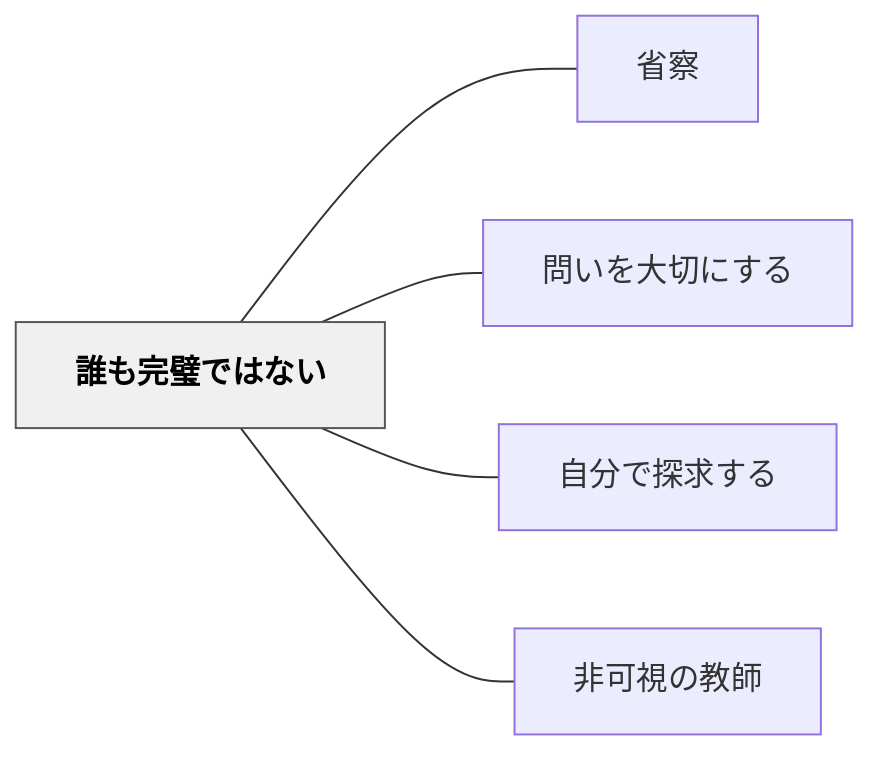

# 誰も完璧ではない

> 知らないことを認める勇気が、知る文化をつくる。

## [Pattern Connection]

- **既存パタンとの関連**：[[パタン/省察]] と深く連動する——自分の知識の限界を認識し、それを率直に表明することは省察の外側への表現形態である。[[パタン/問いを大切にする]] とも相補的。教師が「答えられない問いがある」と示すことで、学習者は問うこと自体の価値を体感できる。
- **補強された点**：「完璧でなくてよい」は理念的な言葉だが、本パタンは具体的な行動レベルで実装する——わからないと認める、一緒に調べることを提案する、他の学習者が知っているか問いかける、という手順を与える。
- **修正・拡張された点**：文化的文脈への言及が重要。日本の学校文化では教師が「わかりません」と言うことへの心理的障壁が高い。だからこそ、このパタンの意識的な適用が必要である。
- **他のパタンへの波及**：[[パタン/自分で探求する]] ——教師が「一緒に調べましょう」と言うとき、学習者の自律的探求が始まる。[[パタン/非可視の教師]] ——知らないときにピアへ向かわせることで、教師の非可視化が実践される。

## 背景（Context）

教師は教科の専門家であるが、すべての問いに対して答えを持っているわけではない。とりわけ、子どもたちの問いは教師の想定外の方向から来ることがある。算数の授業でも、「なぜ0で割ってはいけないの？」「無限って本当に存在するの？」といった問いは、一言では答えられない深さを持つ。

## 問題（Problem）

知らない問いに直面したとき、教師は「権威を守るために」答えを作ったり、問いを迂回したりする誘惑に駆られる。しかし、誤った説明や回避は、学習者の信頼を損なうだけでなく、誤解を植え付けるリスクもある。また、教師が完璧でなければならないというプレッシャーが、問い自体を抑制する文化をつくることがある。

## 力のかたち（Forces）

- 学習者は（特に若い頃は）教師を「すべてを知る権威者」とみなしやすい
- 教師がわからないことを認めることは、権威が傷つくと感じられる文化がある
- しかし、誤った答えや回避は、後で発覚すると信頼を大きく損なう
- 知らないことを認めた教師の姿は、学習者にとって強力な「知的謙虚さのモデル」になる
- 「わかりません」は弱さではなく、正直さと探求心の表れとして機能しうる

## 解決（Solution）

**知識の限界を率直に認め、それを探求の機会に変えよ。**

---

### 具体的な行動

**「知りません」と言う**
- 「それはよい問いです。正直に言うと、私もすぐには答えられません」と伝える
- 問いを難しそうに見せる必要はない。単純に「わかりません」でよい

**問いを「一緒に調べる」機会にする**
- 「一緒に調べてみましょう」と提案することで、探求の姿勢をモデルとして示す
- 次の授業までに答えを調べて持ってくることを約束する

**クラスに問いを投げ返す**
- 「この問いに答えられる人はいますか？」とクラス全体に向ける
- [[パタン/非可視の教師]] の実践——知らない瞬間にピアが活きる

**安易に問いを難しく見せない**
- 「これは大学レベルの話で…」と問いを遠ざけない
- 問いを難しく見せることは、問う行為自体を抑制してしまう

---

### 文化的注意点

日本を含むアジア圏では、教師が限界を認めることへの心理的障壁が特に高いとBerginらは指摘する。意識的にこのパタンを実践することが、問いを歓迎する文化（[[パタン/問いを大切にする]]）をつくる土台になる。

## 結果（Consequences）

- 教師の正直さが学習者の信頼を高める（逆説的だが、「知らない」と言える教師は信頼される）
- 誤った情報を植え付けるリスクが下がる
- 学習者が「知らないことは恥ではない」というモデルを体験する
- クラスに「問いは歓迎される」という文化が育つ
- 一緒に調べる姿勢が、学習者の探求心を引き出す

## 関連パタン

- [[パタン/省察]] — 自分の限界を知ることが省察の始まり
- [[パタン/問いを大切にする]] — 「わからない」と言える教師が問いを歓迎する文化をつくる
- [[パタン/自分で探求する]] — 知らないとき「一緒に調べよう」と促す入り口
- [[パタン/非可視の教師]] — 知らない問いをピアに向かわせるときに機能する

## クラスター図

## Actionable Insight

- 今週の授業で子どもに「なぜ？」と聞かれたとき、答えを知っていても「みんなはどう思う？」と返してみる——知らなくても同じ問いかけができることを確認する
- 「先生もわかりません。一緒に調べましょう」と言ってみる機会を意識的に作る。まずは安全な話題（算数の「なぜ？」系の問い）で試してみる
- 授業の最後に「今日、私が一番驚いた問いは〇〇でした」と教師自身が語ることで、問いを評価する文化を示す

## 出典

Bergin, J., Eckstein, J., Volter, M., Sipos, M., Wallingford, E., Marquardt, K., Chandler, J., Sharp, H., & Manns, M. L. (2012). *Pedagogical Patterns: Advice For Educators*. Joseph Bergin Software Tools. (CC BY-SA 3.0)  
https://www.pedagogicalpatterns.org/

> "Therefore, admit your limitations with grace. Do not try to be perfect. In particular, if you cannot answer a question, admit it." — Bergin et al. (2012)

> "Do not try to make the question seem overly difficult. Suggest that you might explore it together. Ask if any student knows the answer." — Bergin et al. (2012)
