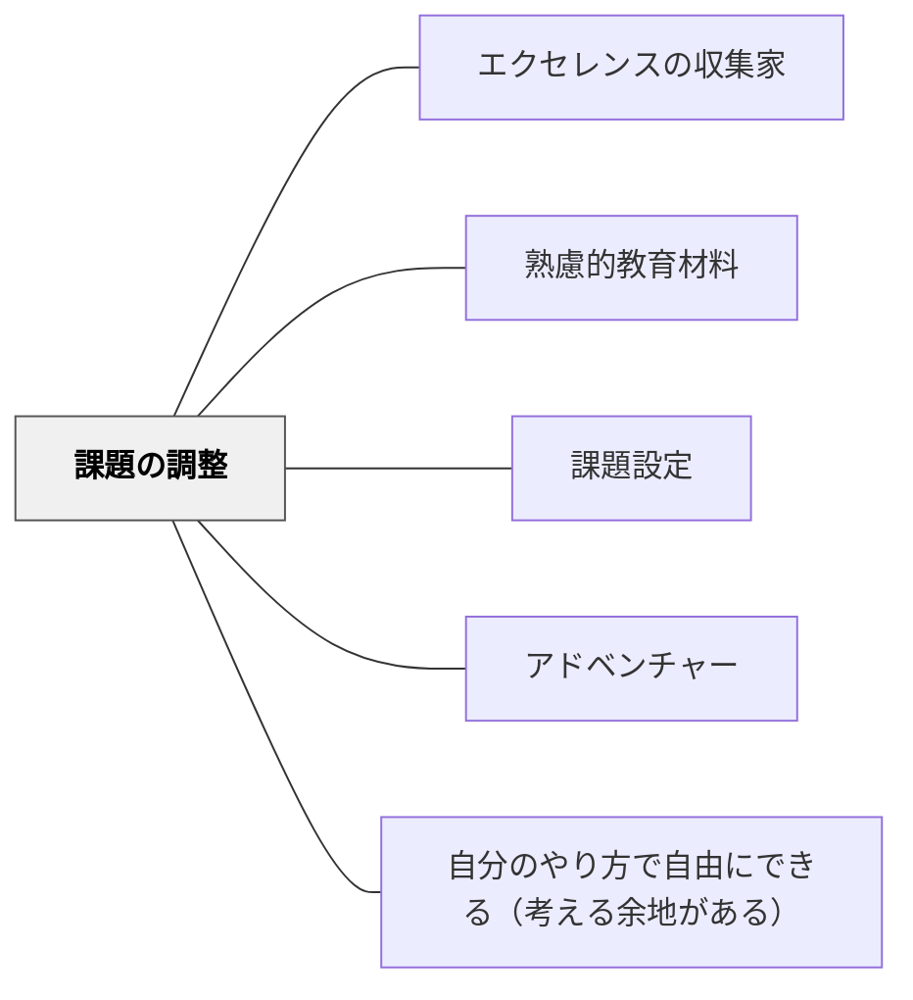

# 課題の調整

> 学習者の状態に応じて課題の難易度・量・形式を柔軟に調整し、適切なチャレンジを維持する。

## 背景（Context）

チクセントミハイのフロー理論における「スキルと挑戦のバランス」、甲斐崎博史の「ストレッチゾーン」の概念。課題が固定されていると、学習者の成長に合わせた調整ができず、退屈または挫折を生む。足場掛け（スキャフォールディング）の段階的削減もこの文脈。

## 問題（Problem）

同じ課題では学習者によって易しすぎたり難しすぎたりし、フロー状態に入れない学習者が生まれる。

## 力のかたち（Forces）

- 課題の調整可能性が個別最適化の基盤になる
- 段階的な難易度設計が継続的な達成感を生む
- 調整がなければ学習者の多様性に対応できない

## 解決（Solution）

**課題の難易度・量・形式に調整可能な選択肢を設ける。スキャフォールディング（足場掛け）を段階的に外せるよう設計し、学習者の成長に合わせて挑戦が維持されるようにする。**

## 結果（Consequences）

- 異なる習熟度の学習者がそれぞれのストレッチゾーンで学べる
- フロー状態と継続的な動機が維持される

## 関連パタン
- [[パタン/エクセレンスの収集家]]

- [[パタン/熟慮的教材教具]] — 親パタン
- [[パタン/課題設定]] — 課題設計の基盤
- [[パタン/アドベンチャー]] — ストレッチゾーンの概念
- [[パタン/自分のやり方で自由にできる（考える余地がある）]] — 自律的調整
- [[特別支援/太田ステージ]] — ステージ評価が課題調整の根拠を与える

## クラスター図

## Actionable Insight

- 同一の学習内容に「基礎・標準・発展」の3段階バージョンを用意し、学習者が自分で選べるようにする——選択肢があるだけでフロー状態に入りやすくなる
- 足場（ヒントカード・例題・テンプレート）を最初に用意し、習熟に応じて1つずつ取り除いていく——スキャフォールディングの段階的削減が挑戦の維持につながる
- 授業中に「退屈している・詰まっている」学習者を観察し、その場で課題の量や難度を調整する——リアルタイムの調整が個別最適な学びの核心になる

## 出典

- 鈴木克明（2002）『教材設計マニュアル――独学を支援するために』北大路書房
