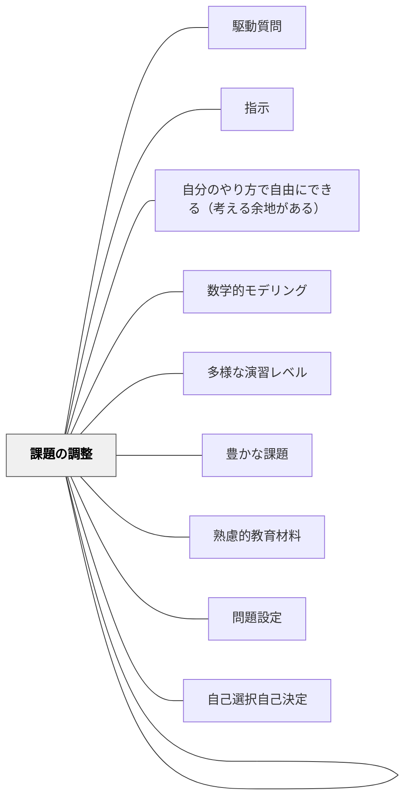

# 課題設定

> 学習者が実際に取り組む課題を適切に設計することで、学びが動き出す。

## 背景（Context）

問題設定を受けて「学習者が何に取り組むか」という課題を具体的に設計する。課題は学習目標と学習者の現状をつなぐ橋。パフォーマンス課題・プロジェクト・練習問題・探究課題など多様な形式がある。

## 問題（Problem）

課題が易しすぎると学習者は退屈し、難しすぎると挫折する。課題が目標とずれていると学習が空回りする。

## 力のかたち（Forces）

- 適切な難易度（ストレッチゾーン）が動機付けを支える
- 課題の文脈・意味が学習の質を左右する
- 自己選択・自己決定を組み込める課題ほど動機が高まる

## 解決（Solution）

**学習目標に対応した適切な難易度・文脈・意味を持つ課題を設計する。学習者が自己選択できる余地を組み込む。**

## 結果（Consequences）

- 学習者が主体的に課題に取り組む
- 目標達成が自然に促進される

## 関連パタン
- [[パタン/駆動質問]]
- [[パタン/指示]]
- [[パタン/自分のやり方で自由にできる（考える余地がある）]]
- [[パタン/数学的モデリング]]
- [[パタン/多様な演習レベル]]
- [[パタン/豊かな課題]]

- [[パタン/熟慮的教材教具]] — 親パタン
- [[パタン/問題設定]] — 課題の前段階
- [[パタン/課題の調整]] — 難易度・量の調整
- [[パタン/自己選択自己決定]] — 選択の余地

## クラスター図

## Actionable Insight

- 課題に「選択できる要素」を1つ組み込む（テーマ・表現形式・問いの切り口など）——自己選択があるだけで主体的な取り組みへの切り替えが起きる
- 課題を渡す前に「これは難しすぎないか・簡単すぎないか」をひとりの学習者に試してみる——ストレッチゾーンの確認が全体設計の精度を上げる
- 課題の文脈を学習者の日常・関心に結びつけた一文を冒頭に入れる——意味のある文脈が学習への動機を生み出す

## 出典

- 鈴木克明（2002）『教材設計マニュアル――独学を支援するために』北大路書房
