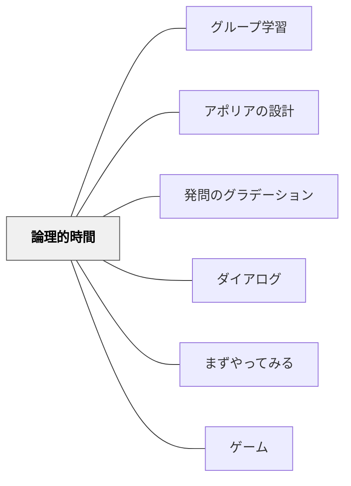

# 論理的時間

> 確信は行為の前ではなく後で生まれる——「わかってから動く」ではなく「動くことでわかる」。他者の躊躇が消える前に、自分の仮説を宣言することで、主体は初めて真理に到達する。

---

## Pattern Connection

**ラカン入門（向井雅明）統合（2026-06-03）：**

ラカンの1945年論文「論理的時間と確信の先取りという断定」が本パタンの理論的基盤である。

- **既存パタンとの関連**：[[パタン/グループ学習]] における「なぜ動くのか」「なぜ誰かが最初に結論を出すのか」の心理的構造を説明する。[[パタン/アポリアの設計]] の「宙吊りの時間」は「理解の時間」に対応し、[[パタン/発問のグラデーション]] の「広げる→しぼる」は「注視の時→理解の時間→結論の時」の設計と重なる
- **補強された点**：グループ活動で「最初に発言する子が空気を読みすぎる」「全員が待ちの姿勢になる」という現象に、論理的時間の「結論の時の欠落」として説明がつく
- **他のパタンへの波及**：[[パタン/ダイアログ]] における「他者の応答を待つことで自分の理解が変わる」という構造の論理的基盤

---

## 背景（Context）

グループで考えるとき、全員が「考えている」のに誰も動かない時間がある。または一人が動き出すと全員が動き出す——「一人目の勇気」が集団の行動を触発する。

ラカンは1945年の小論文「論理的時間と確信の先取りという断定」で、三人の囚人の論理パズルを用いて、この現象を「時間の弁証法」として解析した。

**三囚人のパズル**：
3人の囚人がいる。所長は白いマーク3枚・黒いマーク2枚を持ち、3人それぞれの背中にマークを1枚貼る（全員白い）。「自分のマークが何かを論理的に判断して、最初に部屋を出た者を釈放する」と告げる。全員が同じ状況にある——誰の背中も見えず、鏡もなく、他の囚人の表情だけが手がかりだ。

## 問題（Problem）

問い：「なぜ、どのようにして一人目の囚人は部屋を出るのか？」

この問いは授業設計にも重なる：

- 「全員が考えているのに、なぜ誰も発言しない？」
- 「特定の子だけがいつも最初に答えを出す——他の子はそれを待っている？」
- 「"分かってから発言"では、本当の意味での思考は起きているのか？」
- 「確信が持てないのに（あるいは持てないからこそ）行動することはどういう意味を持つか？」

## 力のかたち（Forces）

- 他者の存在が自分の推論の材料になる——「あの人が動かないなら、私のマークは白かもしれない」
- 他者が動くと根拠が消える——他者の躊躇が自分の確信の根拠だから、他者が動き始めると「私も白、あなたも白」になり根拠が崩れる
- 確信は不完全なままでも行為しなければならない——完全な証明を待っていると他者に先を越される
- 行為が真理を生み出す——「私は白だ」という宣言が、その後遡及的に正しかったと証明される

## 解決（Solution）

**論理的時間の三構造を授業設計に意図的に組み込む。**

---

### 論理的時間の三つの時

**1. 注視の瞬間（l'instant de regarder）**

目の前の事実をそのまま把握する。
「二つの黒が見えれば即座に白と分かる」——しかし全員白なのでこれは使えない。問題の構造を正確に「見る」ことだけが起きる段階。

**授業設計への変換**：
- 問題・課題・状況を提示する
- 「何が見えているか」を整理する時間——視覚化・情報整理
- まだ推論していない、ただ「見ている」段階を保証する
- 例：「まず問題を読んで、何が分かっているか列挙してみよう」

**2. 理解の時間（le temps pour comprendre）**

他者を経由した推論。「もし私が黒なら、あの二人はすぐに動くはずだが動かない。では私は……」

この段階の特徴：
- **他者依存性**：自分の推論が他者の行動（や非行動）を根拠にしている
- **不確定性**：まだ確信はない。推論の連鎖が続いている
- **相互作用**：他者の様子を見ながら自分の仮説を更新する

**授業設計への変換**：
- グループで「他者の反応を手がかりに自分の考えを更新する」時間
- 「隣の人はどう考えているか観察しながら、自分の考えを再検討する」
- ペアで「あなたが○○と考えるなら、私は……」という推論の連鎖を作る
- 焦れったさを感じるのが正常——まだ結論は出ていない

**3. 結論の時（le moment de conclure）**

他者の躊躇が消えないうちに、焦燥に駆られて行為する。

「あの二人がまだ動かないうちに——」という緊張感の中で宣言する。確信は完全ではない。しかし行為しなければ機会が消える。そして**行為が真理を生み出す**——宣言した後、遡及的にその正しさが確認される。

**授業設計への変換**：
- 「他の人が言い始める前に、今の自分の仮説を言ってみる」という問いかけ
- 「まだ確信がなくても、今の自分の考えを宣言してみよう」
- 発表・宣言・書き出しの行為が「確信を生み出す」という体験の設計
- 全員が同時に答えを書いて見せ合う（ホワイトボード・カード・挙手）

---

### 「結論の時」の設計——行為が真理を生む体験

論理的時間の教育的核心は「結論の時」にある。

> 「行為が真理を生み出す。主体は焦燥に駆られ行為に走る。この決定は予知的な確信である。行為がなされた後、遡及的にその正しさが証明される」

**「まず言ってみる」という設計が主体を育てる**：

確信があってから発言する（=答えが分かった子だけが発言する）授業では、「理解の時間」止まりになる。結論の時——不確定だが宣言する——の体験がない。

授業で「結論の時」を作る工夫：

| 工夫 | 内容 |
|---|---|
| 同時発表 | 全員が同時に答えを見せる（手を見せない、一斉）。他者より先に動く必要性が生まれる |
| 時間制限宣言 | 「30秒以内に仮説を言葉にしよう」——締め切りが焦燥を生む |
| 不完全な発言を歓迎 | 「まだよく分からないけど今の考え」を明示的に求める |
| 予測の先出し | 実験・読み・計算の前に「どうなると思うか」を宣言させる |
| ペア確認の焦燥 | 「隣の人が言う前に、自分の答えを言ってみよう」 |

---

### 論理的時間とグループ思考の活性化

グループで「全員待ちの状態」になる理由：「結論の時」の焦燥が設計されていない。

**「一人目の勇気」が他者を引き出す構造**：
1. 一人が宣言する（結論の時）
2. 他者はその宣言を見て「では私は……」という推論が動く（理解の時間が更新される）
3. 次々と宣言が出る

この構造を意図的に設計する：
- ローテーションで「最初に言う役」を変える
- 「一番自信がない人から言おう」というルール（安全性を上げつつ焦燥を活かす）
- ランダムな指名（誰が最初かは決まっていない——焦燥が分散する）

---

## 結果（Consequences）

- 「分かってから発言」という安全な行動様式から、「発言することで分かる」という体験への転換が起きる
- グループの「全員待ち」状態が解消されやすくなる——「結論の時」の設計が焦燥を生む
- 「宣言した後に正しかった」という経験が繰り返されると、「まず行動してみる」という学習スタンスが育つ
- 逆効果の可能性：急かすことで浅い考えが出やすい——「注視の時」と「理解の時間」を十分に保証した上で「結論の時」を設計することが必要

## 関連パタン

- [[概念/鏡像段階]] — 他者との鏡像的関係・他者依存的推論の理論的背景
- [[パタン/グループ学習]] — グループ活動における論理的時間の応用
- [[パタン/アポリアの設計]] — 「理解の時間」の宙吊り体験のデザイン
- [[パタン/発問のグラデーション]] — 三つの時を意識した問いの段階設計
- [[パタン/ダイアログ]] — 他者の応答が自己の推論を動かす対話構造
- [[パタン/まずやってみる]] — 「行為が真理を生み出す」という実践知
- [[パタン/ゲーム]] — 論理的時間を組み込んだ活動設計
- [[文献/ラカン入門（向井雅明）]] — 論理的時間の主出典

---

## クラスター図

## Actionable Insight

- **「同時提示」を一つ試す**——次の授業で、発表の場面に「全員が同時に答えを見せる」仕掛けを一つ入れてみる（ホワイトボード・指の数・カード）。誰かに続くのではなく、他者より先に動く必要性が生まれる
- **「まだ分からないけど今の考え」を明示的に求める**——「考えが固まった人から発言」ではなく、「今の時点での仮説を言おう」という発問に変える。不確定な宣言を歓迎する空気を作る
- **30秒タイマーで「結論の時」を作る**——「理解の時間（グループ話し合い）」の後に「30秒以内に今の考えをノートに書く」という締め切りを入れる。焦燥が確信の代わりに行為を促す

---

## 出典

向井雅明（2015）．*ラカン入門*．ちくま学芸文庫．

Lacan, J. (1945). Le temps logique et l'assertion de certitude anticipée.

> 「行為が真理を生み出す。主体は焦燥に駆られ行為に走る。この決定は予知的な確信である。行為がなされた後、遡及的にその正しさが証明される」——ラカン（1945年）
