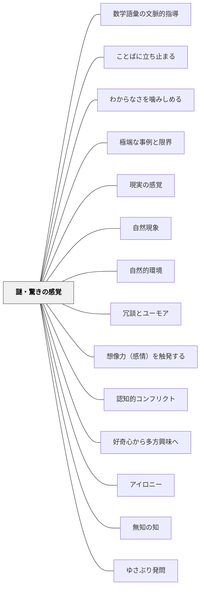

# 謎・驚きの感覚

> 「え、なぜ？」という揺らぎが、探究の火をつける

## 背景（Context）

人間は自分の既存の認識が揺さぶられたとき、強い感情的反応とともに「確かめたい」「理解したい」という欲求が生まれる。この感覚こそが学びの入口となる。

## 問題（Problem）

学習者がすでに答えを知っていると思っているとき、または内容に意外性がないとき、探究への動機が生まれない。どうすれば学習者の「当たり前」を揺さぶって探究欲を引き出せるか。

## 力のかたち（Forces）

- 認知的コンフリクト（予想と現実のずれ）は強力な学習動機を生む
- 驚きは感情的な高揚をもたらし、記憶に残りやすい
- 社会科・理科でのグラフの「意外な変化」など、データが予想と異なるとき強い関心が生まれる
- 謎を長く引っ張りすぎると不満や混乱につながる

## 解決（Solution）

授業の冒頭や展開の中で「謎」や「意外な事実」を意図的に提示する。たとえば、予想と全く異なるグラフの変化・矛盾した事実・常識に反するデータなどを見せ、「なぜそうなるのか？」という問いを学習者から引き出す。学習者の既存の認識を「揺さぶる」設計が鍵となる。

## 結果（Consequences）

- 内発的な探究意欲が高まり、「確かめたい」という動機で学習が進む
- 感情的な高揚が記憶への定着を助ける
- 謎への答えが得られないまま授業が終わると、フラストレーションが残る

## 関連パタン
- [[パタン/数学語彙の文脈的指導]]
- [[実践/詩歌の授業（詩を書く・詩を読む）]]
- [[パタン/ことばに立ち止まる]]
- [[パタン/わからなさを噛みしめる]]
- [[パタン/極端な事例と限界]]
- [[パタン/現実の感覚]]
- [[パタン/自然現象]]
- [[パタン/自然的環境]]
- [[パタン/冗談とユーモア]]

- [[パタン/想像力（感情）を触発する]]
- [[パタン/認知的コンフリクト]]
- [[パタン/好奇心から多方興味へ]]
- [[パタン/アイロニー]]
- [[パタン/無知の知]]
- [[パタン/ゆさぶり発問]]

## クラスター図

## Actionable Insight

- 授業の冒頭に「予想と全く異なるグラフの変化・矛盾した事実」を1つ見せ、「なぜそうなるのか？」を問う——認知的コンフリクトが探究の火をつける
- 「常識に反する」データや事実を見せ、「あなたの予想はどうでしたか？」と問いかける——予想と現実のずれを意識させることで驚きが学習動機になる
- 単元末まで「答えをあえて見せない謎」を一つ用意し、授業の節目に問い直す——謎が持続することで探究への関心が単元を通じて続く

## 出典

キアラン・イーガン（2010）『想像力を触発する教育――認知的道具を活かした授業づくり』北大路書房
