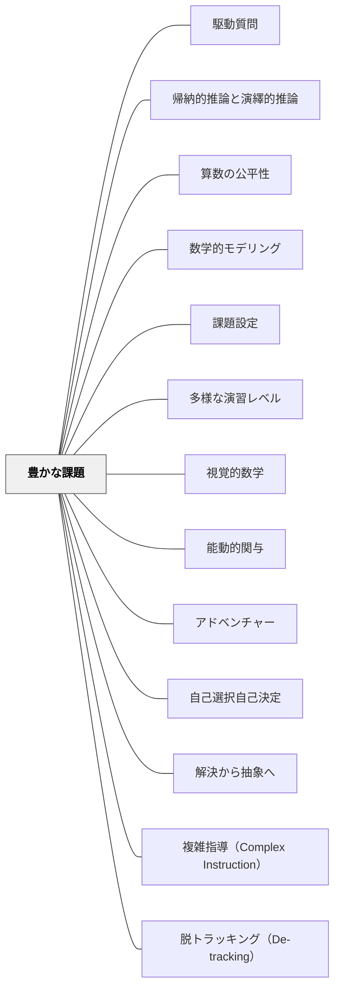

# 豊かな課題

> 「床は低く、天井は高く」——すべての子が入れて、どこまでも伸びられる課題を設計する。

## [Pattern Connection]

Boaler（2015）の **Mathematical Mindsets** は "Low Floor, High Ceiling" (LFHC) というタスク設計の原理を、豊富な実例と子どもたちの反応とともに紹介している。これは既存の [[パタン/課題設定]] が「何を学ぶか」に着目するのに対し、「誰でも入れて、限界なく伸びられる構造」という設計思想を加えるものである。

- **補強点**：「難しい問題＝よい課題」ではなく、「多様な参加が生まれる問題＝よい課題」という発想の転換を支える
- **拡張点**：既存の問題を LFHC に変える具体的な手法（「どのように見えますか？」「別の方法は？」「自分でより難しい問いを作ってください」）を提供する。またBoaler はLFHC課題の評価基準として **5C エンゲージメント** を提示している——Curiosity（好奇心）・Connection Making（接続）・Challenge（挑戦）・Creativity（創造性）・Collaboration（協働）。豊かな課題はこの5Cすべてを生む設計であるべきで、5Cのうちどれが弱いかを課題改造の診断基準として使える
- **他のパタンへの波及**：[[パタン/視覚的数学]]・[[パタン/多様な演習レベル]]・[[パタン/能動的関与]]・[[パタン/複雑指導（Complex Instruction）]]（LFHC課題があって初めて混合グループが機能する）・[[パタン/脱トラッキング（De-tracking）]]（LFHC課題は能力別グループ分けを不要にする前提条件）

---

## 背景（Context）

算数の授業でよく使われる問題は、「正しい手順で解けば答えが出る」一本道のものが多い。これは速く正確に解ける子にとっては易しすぎ、苦手な子にとっては入れない問題になる。さらに、早く終わった子に「もっと同じ問題を解きなさい」と言うのは、速さへの報酬になりやすく、数学的な探究とは逆行する。

## 問題（Problem）

一本道の問題では、参加できる子とできない子の差が生まれやすく、終わった子は退屈し、苦手な子は入れず、クラス全体が数学を探究する場にならない。

## 力のかたち（Forces）

- フロアが高い課題は「入れない子」を生む
- 天井が低い課題は「終わった子」を退屈させ、速さを競う文化を生む
- 「どのように見えますか？」という問い一つで、多くの既存の問題のフロアを下げられる
- 「より難しい問いを自分で作ってください」という一文が天井を取り除く
- 複数の方法が尊重される課題では、間違いが「別の見方」として扱える

## 解決（Solution）

**すべての子が参加でき（低いフロア）、どこまでも伸びられる（高い天井）課題を設計・改造する。**

設計のポイント：

1. **答えを一本道にしない**：「面積を求めなさい」→「面積が 24 の長方形を全部見つけなさい」
2. **見え方・方法を問う**：「どのように解きましたか？」「別の見方はありますか？」
3. **自己拡張を仕込む**：「終わったら、より難しい問いを自分で作ってみてください」
4. **視覚を使う**：図・絵・色を使って考える許可を明示する
5. **正しい方法を1つに絞らない**：解き方の違いを比較する時間を作る

---

具体例①：「四つの4」（[[教材/四つの4]] 参照）

> 4つの「4」と好きな演算記号だけを使って、1から20までのすべての数を作れますか？

誰でも「4+4+4+4=16」から始められる（低いフロア）。どこまでも難しくできる（高い天井）——20を超える数、負の数、分数への拡張、最大の数の探索など。解き方は100通り以上ある。

---

具体例②：階段パタンの成長（[[教材/形の成長を見る]] 参照）

1段、2段、3段…の階段形。

> 「この形はどのように成長していますか？ 10段目はいくつのブロックでできますか？ n 段目は？」

誰でも「数えてみる」から始められる。「見え方」によって、三角数・正方形・代数的一般化まで深められる。

---

具体例③：既存の問題の改造（Boaler, 2015 Ch.5）

| 元の問題（一本道） | 豊かな課題への変換 |
|-------------------|-------------------|
| 12 × 4 の面積を求めなさい | 面積が 48 の長方形を全部見つけなさい |
| 角 A は何度ですか？ | この図の角度の関係をすべて色分けして分類してください |
| 8 + 7 を計算しなさい | 8 + 7 を3通りの方法で解いてください |

---

具体例④：授業での天井の取り除き方

中学生が「階段問題」を解いていたとき、Alonzo という生徒が最初の問いをすぐに解き終えた。教師は「4方向に伸びる階段だったら？」と聞いた。Alonzo は自分で問いを作り、より深い代数的構造へ進んだ——これが「天井を取り除く」実践である（Boaler, 2015）。

---

## 結果（Consequences）

- クラス全員が同じ課題に参加できる（特別支援の子から先に進む子まで）
- 速さより深さが評価されるメッセージが課題設計から伝わる
- 子どもが「自分の問い」を持ち始め、数学への内発的関与が生まれる
- 教師は「終わった子への追加問題」を用意しなくてよくなる

## 関連パタン
- [[教科/LowFloorHighCeilingタスク集]]
- [[教科/算数]]
- [[教科/算数・数学で使うパタン]]
- [[パタン/駆動質問]]
- [[パタン/帰納的推論と演繹的推論]]
- [[パタン/算数の公平性]]
- [[パタン/数学的モデリング]]

- [[パタン/課題設定]] — 課題全般の設計思想の上位パタン
- [[パタン/多様な演習レベル]] — 同一課題内に複数の難易度を含む別の設計思想
- [[パタン/視覚的数学]] — 視覚的な問いがフロアを下げる
- [[パタン/能動的関与]] — 豊かな課題は全員の能動的参加を生む
- [[パタン/アドベンチャー]] — 「先が見えない探究」としての数学の喜び
- [[パタン/自己選択自己決定]] — 「自分でより難しい問いを作る」は最高の自己選択
- [[パタン/解決から抽象へ]] — 自分の解き方から一般化へ
- [[パタン/複雑指導（Complex Instruction）]] — LFHC課題を混合グループで実施するための指導法
- [[パタン/脱トラッキング（De-tracking）]] — LFHC課題が能力別グループ分けを不要にする根拠

## クラスター図

## Actionable Insight

- 今週の算数問題を1問だけ改造してみる——「答えを求めなさい」→「いくつの方法がありますか？」か「〇〇をすべて見つけなさい」に変えるだけでよい
- 「早く終わった子にやらせる問題」を準備するかわりに、「終わったら自分でより難しい問いを作ってみてください」の一文を問題の最後に加える
- [[教材/四つの4]] を5分間の温まり活動として使ってみる——レベルに関係なく全員が入れる課題を体験する

## 出典

Boaler, J. (2015). *Mathematical Mindsets: Unleashing Students' Potential Through Creative Math, Inspiring Messages and Innovative Teaching*. Jossey-Bass.

> "All of the tasks I have described are low floor and high ceiling. The breadth of the space inside them means that they are accessible to a wide range of students and they extend to high levels."

[[文献/Mathematical Mindsets（Boaler）]]
