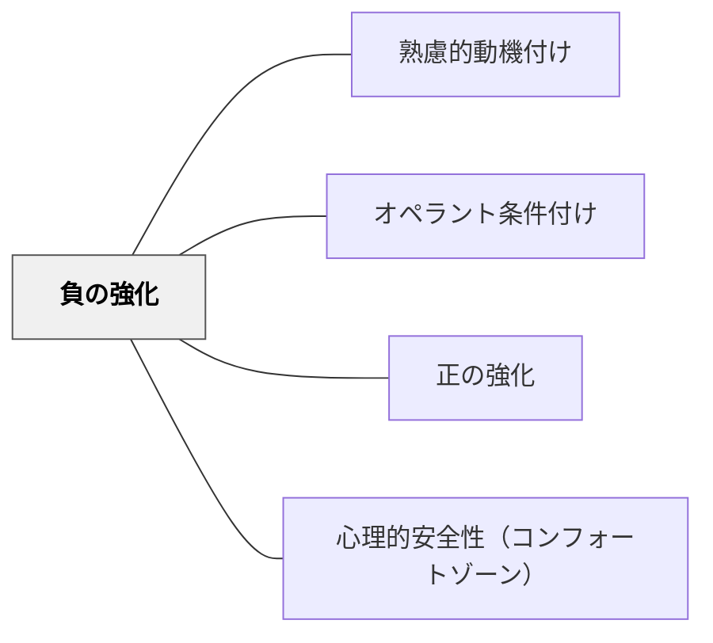

# 負の強化

> 望ましい行動をとることで不快なものが取り除かれる。行動は増える。

## 背景（Context）
オペラント条件付けの一手法。「負」とは「取り除く」ことを意味し、望ましい行動の後に不快な刺激を除去することで、その行動の頻度が増える。「宿題をやれば居残りなし」が典型例である。正の強化と混同されやすい概念である。

## 問題（Problem）
正の強化との混同が多く、教育現場での誤用が見られる。また、不快な刺激を使うため、過度に用いると学習環境の心理的安全性を損なう可能性がある。適切な文脈と使い方の理解が必要である。

## 力のかたち（Forces）
- 「負」は価値的なマイナスではなく、「取り除く」という操作の意味である
- 不快な刺激の設定によっては学習者にストレスを与える
- 正の強化と比較して、動機の質（回避動機）が異なる
- 回避動機は接近動機より持続性が低いことが多い

## 解決（Solution）
**望ましい行動が起きたときに不快な刺激を取り除くことで、行動の頻度を増やす。ただし、心理的安全性を保ちながら慎重に活用する。**

「提出物を期限内に出せば補講免除」「練習をしっかりやれば延長練習なし」など、不快を回避できるという動機を使う。しかし過度な不快刺激の設定は避け、可能な限り正の強化との組み合わせを検討する。

## 結果（Consequences）
- 望ましい行動の頻度が増える
- 回避動機主体になると、義務感・プレッシャーが強まる
- 心理的安全性が低下するリスクがある

- [[パタン/負の罰]] — オペラント条件付けの4象限を構成する兄弟パタン
- [[パタン/正の罰]] — 強化と罰の対比で理解するパタン
- [[パタン/省察的評価]] — 強化の効果を振り返り適切な使用を判断する
## クラスター図

## Actionable Insight

- 「提出物を期限内に出せば補講免除」など不快を回避できる動機を使う場合、不快刺激の強度を最小限にとどめる——過度な不快刺激は回避動機を高めるが心理的安全性を損なうリスクがある
- 負の強化を設計するとき「正の強化・負の罰で代替できないか」を先に検討する——心理的コストの低い選択肢が優先されることで学習環境の安全性が保たれる
- 使用前に「この不快刺激は学習者にとってどのくらいのストレスか？」を意識的に確認する——回避動機主体の学習は持続性が低いため内発的動機への橋渡しを意識する

## 出典

- 一つの教育のパタン・ランゲージ（岩井輝久）

## 関連パタン
- [[パタン/熟慮的動機付け]] — 親パタン
- [[パタン/オペラント条件付け]] — 親パタン（直接の上位パタン）
- [[パタン/正の強化]] — 対比して理解するパタン
- [[パタン/心理的安全性（コンフォートゾーン）]] — 安全な環境設計との関連
