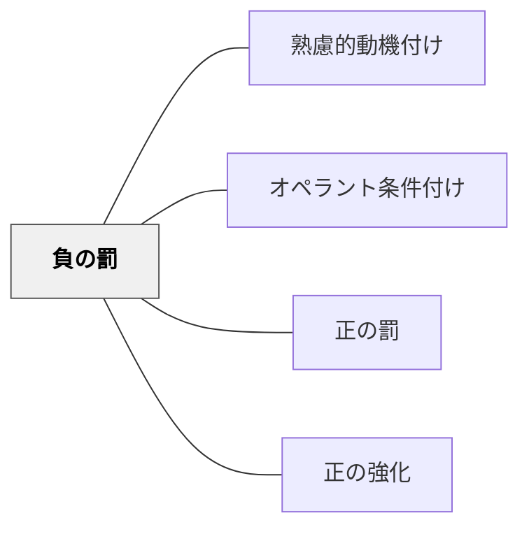

# 負の罰

> 望ましくない行動のあとに心地よいものを取り去ることで、その行動が減る。

## 背景（Context）
オペラント条件付けの一手法。「負」とは「取り除く」ことを意味し、望ましくない行動の後に学習者が好む刺激を除去することで、その行動の頻度を減らす。ゲーム時間の取り上げや特権の剥奪などが典型例。

## 問題（Problem）
望ましくない行動を減らしたいとき、直接的な不快を与える正の罰より心理的安全性への影響が小さい場合がある。しかし、何を取り去るかの選択と、その実施方法によっては不満・反抗を引き起こす。

## 力のかたち（Forces）
- 正の罰より身体的・精神的な傷つきが少ないことが多い
- 何が「心地よいもの」かは個人によって大きく異なる
- 取り去るものへの執着が強いと、反抗心や不信感が生じやすい
- 剥奪と行動のつながりを学習者が理解することが重要

## 解決（Solution）
**望ましくない行動が起きたとき、その学習者が好む刺激を一時的に除去し、行動と結果のつながりを明確に伝える。**

「授業中にスマートフォンを使ったら、自由時間が短くなる」など、事前にルールを明示した上で実施する。剥奪の理由と期間を明確にし、望ましい行動に戻ったときには速やかに回復させる。正の強化との組み合わせが効果的。

## 結果（Consequences）
- 望ましくない行動が減少する
- 剥奪されたものへの不満が蓄積する可能性がある
- 行動の理由を理解させないと、行動の本質的な変容につながらない

- [[パタン/負の強化]] — オペラント条件付けの4象限を構成する兄弟パタン
- [[パタン/省察的評価]] — 罰の使用とその効果を振り返る
- [[パタン/考える文化]] — 罰に頼らない自発的な行動変容を育てる文化
## クラスター図

## Actionable Insight

- 「授業中にスマートフォンを使ったら自由時間が短くなる」のように、事前にルールを明示した上で実施する——事前の明示が剥奪の恣意性を排除し行動と結果のつながりを学習者が理解できるようにする
- 剥奪の理由と期間を明確にし、望ましい行動に戻ったときには速やかに回復させる——速やかな回復が行動変容への明確なシグナルになりペナルティの長期化による不満蓄積を防ぐ
- 負の罰を使う前に「正の強化・正の罰で代替できないか？」を先に検討する——心理的コストの低い選択肢を優先することが学習環境の安全性と信頼関係を保護する

## 出典

- 一つの教育のパタン・ランゲージ（岩井輝久）

## 関連パタン
- [[パタン/熟慮的動機付け]] — 親パタン
- [[パタン/オペラント条件付け]] — 親パタン（直接の上位パタン）
- [[パタン/正の罰]] — 対比して理解するパタン
- [[パタン/正の強化]] — 組み合わせると効果的なパタン
