# 質の幅ぜんぶに出会わせる（作品の束）

> 良い作品だけを見せても、良さは分からない。上も下も真ん中も、同じジャンルの本物をまとめて **束** にして渡す。学級の作品だけで幅が足りないなら、足りないところは教師が匿名で書いて足す。

## [Pattern Connection]

石田（2021）は、サドラーが評価エキスパティーズ——とりわけ **質** に関する概念——を育てるための第一歩として、「同じジャンルに属する多種多様な、あらゆる質の幅を持つ **本物の** 作品に触れること」を挙げていると整理する。そして、サドラー自身の教育実践において、作品事例の質が学生集団の質に限定されないよう、**自分が作った匿名の作品事例を作品の束に織り交ぜている** ことを報告している。この一手が、本パタンの核心である。

- **[[パタン/作品例を集める]] との差分**：あちらは「高い質の作品例（アンカー作品）を蓄積し、目指す水準のイメージを持たせる」パタンである。本パタンは二点で異なる。第一に、**集めるのは良い例だけではない**——低いもの・中くらいのものを含む幅の全体が要る。第二に、**見せるのではなく判断させる**——束は鑑賞の対象ではなく、判断の素材である
- **[[パタン/エクセレンスの収集家]] との差分**：教師が優れたものを集めて質の感覚を育てるパタン。本パタンはその対概念を含む。**優れていないものも意図的に集める**（あるいは作る）
- **[[パタン/ルーブリック]] との差分**：ルーブリックのアンカー作品運用も複数レベルの作品を並べるが、目的が違う。あちらは **基準の例示**（レベル3とはこういうものだ）、こちらは **判断力の育成**（これはどのくらいうまくいっているか、あなたが決める）。アンカーは基準に貼り付けられた見本であり、束は答えの付いていない問題である
- **補強点**：[[パタン/実例を比べて分析する]] は「複数の良い実例を比べて共通点を抽出する」手法だが、サドラーはその複数性の理由をもう一段深く説明する。質の理解には二種の知が要る——**質の高低に関する知** と、**同等性（comparability）** ＝同等の質と判断される作品にも多様な形態や様相があることの理解。二軸である。だから範例は複数要る（1989年論文の「単一の実例では基準を伝えるのに不十分」という主張と一致する）
- **他パタンへの波及**：[[パタン/四つの問いで作品を判断する]] は束を素材として使う（束が用意されていないと第二の問いに差が生まれない）。[[パタン/潜在規準と顕在規準（規準の浮き沈み）]] は、束と出会ったときにクライテリアが顕在化する機構を扱う

## 背景（Context）

サドラーは、教師が質の概念をどう獲得したかを振り返るところから説明する。教師は、**様々な学習者の作品に触れる中で**、二つの種類の知を発達させる。

1. **質の高低に関する知**——これは良い、これはまだ、という縦の軸
2. **同等性（comparability）の知**——同等の質と判断される作品にも、多様な形態や様相があることの理解。横の広がり

この二つを二軸とする空間が、教師の質概念をつくっている。石田はこれを「質概念の二次元空間」と表現する。**学習者もこの豊かな質概念を発達させる必要がある。** そして特に、良質なものがどのようなものかを理解することが重要であるとされる。

問題は、この二次元空間が何によって育ったかである。教師の場合、それは定義や研修ではなく、**何百枚もの作品を見てきた経験** である。同じ課題への多様な応答を、良いものから不十分なものまで、何年も見続けてきた。サドラーはこの獲得の道筋を、学習者にも開こうとする。

> クライテリアの知識は、定義からではなく経験を通して「掴まれる」ものである。これは、鑑識眼を備えた人の導きの下で共有される評価活動への長期的な関与という、帰納的プロセスによって発達される。（Sadler, 1989, p.135）

## 問題（Problem）

**目指す水準の作品だけを見せても、質は分からない。そして学級の子どもの作品だけを集めても、幅が足りない。**

第一の問題。良い作品例を一本、あるいは数本示す実践は広く行われている。しかしそれで伝わるのは「この形にすればよい」という **型** であって、質そのものではない。高い作品ばかり見た子どもは、「良い」の内側にどれだけの幅があるかを知らないまま、一つの形に収束していく。しかも、良いものしか見ていない子どもは、**うまくいっていない作品を判断する経験を一度もしないまま単元を終える**。実際に彼らが判断しなければならないのは、たいてい自分の書きかけの、まだうまくいっていない作品である。

第二の問題。ではピア・アセスメントで学級の作品を使えばよいかというと、そこには構造的な制約がある。石田はサドラーの実践を紹介しながら、この懸念を明示している——「このように作品事例を中心とする場合、**学生作品群の質の範囲に学習が限定される** という懸念が生じる」。学級の作品が全部似た質なら、質の軸に差が生まれない。誰も到達していない水準の作品は、その学級には存在しない。逆に、大きく外している作品もたまたま無いかもしれない。**学級は、質の幅のサンプルとしては偏っている。**

第三の問題。仮に幅のある作品が集まったとしても、それを **見せる** だけでは判断力は育たない。サドラーの批判の根底は、フィードバックもフィードフォワードも本質的に「伝えること（as telling）」だという点にあった。良い作品を並べて「ここが良いですね」と解説するのは、実例を使った伝達であって、伝達であることに変わりはない。

問いはこうなる——**質の幅の全体を、偏りなく、判断の素材として子どもの前に置くには、何を用意すればよいか。**

## 力のかたち（Forces）

- **良い例を見せたい vs 幅を見せたい**：教師は良いものを見せたくなる。憧れを持たせたいからであり、それ自体は正しい（[[パタン/作品例を集める]]）。しかし良いものしかない束では、判断が「どれが一番好きか」に落ちる
- **質の低い作品を扱う倫理 vs 判断に必要な素材**：うまくいっていない作品を教室で扱うことには、書いた子を傷つけるリスクがある。しかしその種の作品なしに判断の練習はできない。この緊張の解き方が、匿名化と **教師の自作** である
- **模倣の懸念 vs 模倣の効用**：作品を渡せば写す子がいる。サドラー（1989）はこれに、模倣（emulation）は古くからのほぼ普遍的な学習方法であり、そこから得るものを得きった段階で教師が引き離せばよい（wean them away）と応じている。恐れて渡さないことのほうが損失が大きい
- **教師の手間 vs 一度作れば残る資産**：束を用意するのは重い。過年度作品の許可、匿名化、教師の自作。ただし一度作った束は翌年も使える。ルーブリックを毎年書き直すよりは軽い
- **学級の作品の生々しさ vs 外から持ち込む作品の安全さ**：自分たちの作品は関心を引くが危険も伴う。他学年・過年度・教師自作の作品は安全だが、当事者性が薄い。両方を段階的に使う
- **本物であること vs 都合よく作れること**：教師が自作すると、教えたい論点に合わせて作れてしまう。作りすぎた作品は「本物の作品」ではなくなり、判断の素材としての手応えを失う

## 解決（Solution）

**単元で扱うジャンルについて、質の幅の全体を覆う作品の「束」を用意する。学級の作品だけでは幅が足りないので、足りないところは教師が匿名で自作して織り交ぜる。そして束は見せるのではなく、判断させる。**

束の条件は六つ。

1. **同じジャンル・同じ課題規程であること**——比較の条件を揃える。ジャンルが違えば質は比べられない（課題適合性の問題になってしまう）
2. **本物であること**——実際に誰かが真面目に書いた（作った）もの。論点説明のために作った教材くさいサンプルは束に入れない
3. **質の幅を覆うこと**——全体的に不十分なもの、部分的に良いもの、細部の不備があるだけのもの、そして学級の誰も到達していない水準のもの。**上下ともに学級の外へはみ出させる**
4. **同等性を含むこと**——質としては同等だが形態や様相がまるで違う作品を、必ず二本以上入れる。これがなければ「良さ」は一つの型として理解される
5. **匿名であること**——誰の作品かが分からないこと。特にうまくいっていない作品については絶対条件
6. **教師の自作を混ぜること**——束の幅が学級の幅に閉じないようにするための、サドラー自身の一手

### 教師が自作を混ぜるとは、具体的にどうすることか

サドラーは、作品事例の質が学生集団の質に限定されないよう、**自身が作った匿名の作品事例を作品の束に織り交ぜる**。教室に翻訳すると、教師が次の二種類を書く（作る）。

- **わざとイマイチな作品**——学級に「うまくいっていない作品」が無い（あるいは、あるが本人が特定されてしまう）ときに、教師が書く。よくある崩れ方を一つだけ仕込む。二つ以上仕込むと、判断が「間違い探し」になる
- **学級の誰も到達していない水準の作品**——上の天井を開ける。これがないと、学級で一番の子の作品が「最高」になり、質の軸がそこで打ち止めになる。天井が学級内にあるかぎり、その子自身も伸びない

そして **どれが教師の作品かは言わない**。言った瞬間に、判断が「先生の作品を評価する」という別の課題に変わる。単元が終わってから明かすかどうかは学級の文化次第だが、判断の最中には明かさない。

### 束は見せない。判断させる

束を配って「どこが良いか説明する」のは伝達である。束の使い方は、[[パタン/四つの問いで作品を判断する]] を通すことである。①課題に答えているか、②全体としてどのくらいうまくいっているか、③どこを見てそう思ったか、④どうすればぐんと良くなるか。

この過程で何が起きるか。サドラーによれば、**クライテリアは具体物を知覚・認識することによって活性化され、潜在的なものから顕在的なものへと現れる**。束を判断することで、学習者は質やクライテリアについての豊かな理解とレパートリーを得るだけでなく、**クライテリアが顕在化したり潜在化したりする、質的評価（判断）のメカニズムそのもの** を掴み取っていく。「この作品ではここが効いてくるが、あの作品では別のところが効く」という、規準の浮き沈みそのものを体で覚える（[[パタン/潜在規準と顕在規準（規準の浮き沈み）]]）。

---

### 具体例1：五年生・意見文の束を、単元の一週間前に作る

**用意するもの：6本。** 内訳は、過年度の児童作品3本（高・中・低）、他学年または他教材からの本物1本、教師の自作2本（わざとイマイチ1本、学級の誰も到達していない水準1本）。

**手順。**

- **過年度作品の許可**——年度末に、次年度の授業で匿名の資料として使うことについて、書いた本人と保護者の同意を取っておく。「良い例として」だけでなく「みんなで考える資料として」と伝える。同意が取れなかった作品は使わない。同意が取れた作品も、翌年度以降に学年をまたいで使う（同学年内で回すと、書いた子が教室にいる）
- **匿名化の実務**——名前を消すだけでは足りない。**筆跡で分かる。** 教師がワープロで打ち直し、6本すべてを同じ書式・同じフォント・同じ行数の紙に揃える。手書きの味を残したい場合でも、少なくともうまくいっていない作品は必ず打ち直す。固有名詞（習い事の名前、飼っている犬の名前、行った場所）も差し替える。作品には A〜F の記号だけをつける
- **教師の自作①（わざとイマイチ）**——十五分で書く。仕込む崩れ方は一つだけ。たとえば「主張は明確だが、理由が二つとも同じことを言い換えているだけ」。字はきれいに、誤字はなしにしておく。**表面がきれいで中身が崩れている作品** が最も学習価値が高い。表面が汚い作品は「ていねいに書いていない」で判断が止まってしまう
- **教師の自作②（天井を開ける）**——学級の最高到達点より一段上を書く。ただし「大人の文章」にしない。子どもが手を伸ばせば届く距離に置く
- **同等性の二本**——6本のうち、質としては同等だが書きぶりがまるで違う二本を意図的に含める。一本は体験から入り、一本はデータから入る。判断の場面で「この二つ、どっちも同じくらいうまくいっている」という声が出たら、そこが最も大事な瞬間である。教師はその声を拾って「形は全然違うのに、同じくらいなんだね」と置き直す

**使い方。** 第1時に6本を配り、まず一人で読んで A〜F を「かなりうまくいっている／まあまあ／もうすこし」の三つの山に分ける。理由は書かない。次に四人組で山を突き合わせ、割れたところだけを話す。**割れたところが授業になる。** 全員一致の作品には学ぶことが少ない。

---

### 具体例2：算数の説明の束——同等性が最も見えやすい教科

算数の「なぜそうなるか」の説明は、束を作るのが最も易しい教科である。同じ問題への説明を4本用意すればよい。

- **A**：式だけ書いてある（説明になっていない＝①課題適合性で止まる）
- **B**：手順は書いてあるが「なぜ」が無い（同じく①で止まる。AとBの違いが議論になる）
- **C**：図を使って説明している
- **D**：言葉と式だけで説明している

**CとDは、質としては同等である。** 図を使わなければならない理由はない。ここが同等性の教材になる。「図があるほうがえらい」と思い込んでいる子は多く、束で判断させると、その思い込みが表に出て検討にかけられる。

Cを書いたのが学級の子、Dを書いたのが教師、という構成にしてもよい。教師は「学級の中に無いタイプの良さ」を担当する。

---

### 具体例3：図工・体育——束は紙とはかぎらない

図工なら、単元と同じ題材の作品写真を6枚。体育なら、同じ技の動画を6本（他学年・過年度・教師自身のもの。学級の子の動画を使うのは、文化ができてから）。

動画の束には、紙にはない利点がある。**同等性が一目で分かる。** 同じくらいうまくいっている前転が、体格も助走も違う二人で成立している映像を並べると、「うまい」が一つの形ではないことが説明抜きで伝わる。

うまくいっていない動画は、必ず **教師自身のもの** を使う。子どもの失敗映像を教材にすることの危険は、紙よりはるかに大きい。教師が自分の下手な前転を出すと、教室は安全になり、しかもよく見る。

---

### 具体例4：自己教育での適用——自分の学習に束を作る

大人の自己学習でも、束は作れる。数学の自己学習を続けている場合、ある一つの問題について次を並べる。

- 自分の今日の答案
- **自分の半年前の答案**（同種の問題。取ってあるなら最良の素材）
- 参考書の模範解答
- 別の本の、同じ問題に対する別解
- **わざと雑に書いた答案**（自分で五分で書く。「結論は合っているが、条件を使った場所が書かれていない」など）

これを並べ、どれがどれか忘れる程度に時間を置いてから、[[パタン/四つの問いで作品を判断する]] を通す。効くのは二点である。第一に、**自分の答案が束の中の一本になる** ため、防衛的にならずに判断できる。第二に、模範解答と別解を並べることで **同等性** が見える——「まったく違う書き方だが、どちらも通っている」。これは模範解答を一本だけ見ていると絶対に手に入らない知である。

質の幅は、一人でも作れる。足りない幅（雑な答案・別解）は、教師がそうするように、**自分で書いて足せばよい**。

---

### 特別支援の視点：幅を見せることは配慮であり、同時に危険でもある

**配慮の側。** 「もっとくわしく」「もう少していねいに」という言葉は、教師の頭の中の質概念を共有している子には指示になるが、共有していない子には何の情報にもならない。束は、この暗黙の期待を **実物として** 目の前に置く。抽象語を理解しなくても、A と F を見比べれば違いは分かる。特に、うまくいっていない作品が束に含まれていることには意味がある——良い作品しか見ていない子は「自分の作品はこれとは全然違う」としか思えないが、幅の中に自分の位置が見えれば、次の一歩が測れるようになる（[[パタン/最適なギャップ（願望水準の交渉）]]）。

**危険の側。** うまくいっていない作品が、自分の作品に似ていると気づく子がいる。「これ、ぼくのみたい」と口に出すこともある。ここへの備えは三つ。

- 束には **必ず教師の自作が入っている** ことを、単元の最初に一度だけ全体に伝えておく（どれかは言わない）。「この中に先生が書いたのもあります」という一文が、束全体の匿名性を守る
- **同学年・同年度の作品は入れない。** 過年度・他学年・教師自作に限る。この原則を崩すと、匿名化は事実上できない
- 判断のときは **「この作品は」** と言う。「この人は」と言わない（[[パタン/四つの問いで作品を判断する]] の具体例3）

模倣についても一言。束を配ると、一本を丸写しする子が出る。サドラー（1989）が言うように、模倣は古くからのほぼ普遍的な学習方法であり、写す過程で価値あるものを学ぶことがある。教師の仕事は写すことを禁じることではなく、**得るものを得きったところで引き離す（wean them away）** ことである。ただし、束の中に **同等性の二本**（形は違うがどちらも良い）が入っていれば、丸写しは自然に難しくなる。どちらを写せばよいか決まらないからである。**同等性の二本は、模倣への最良の予防でもある。**

## 結果（Consequences）

**利点**

- **質が二軸で理解される**——高低の軸だけでなく、同等性の軸（同じくらい良いのに形が違う）が入る。これによって「良い作品＝一つの型」という誤解が崩れる
- **判断のメカニズムそのものが手に入る**——束を判断し続けると、クライテリアが作品ごとに浮き沈みすることが体で分かる。個々のクライテリアの知識より、この **メカニズムの理解** のほうが遠くまで持っていける
- **学級の質の天井が外れる**——学級の最高到達点が「最高」でなくなる。一番の子にも伸びしろが見えるようになる
- **うまくいっていない作品を判断する経験ができる**——子どもが実際に判断しなければならないのは、たいてい自分の書きかけの作品である。良い作品しか見ていないと、その練習ができていない
- **束は資産になる**——一度作れば翌年も使える。年々、良い作品と崩れ方のバリエーションが増えていく（[[パタン/エクセレンスの収集家]] を、幅の方向に拡張したもの）
- **教師の質概念が言語化される**——「わざとイマイチな作品」を書くには、何が崩れると質が落ちるかを教師自身が特定しなければならない。書く作業そのものが、教師のギルド知識の棚卸しになる

**注意点・リスク**

- **匿名化が甘いと事故になる**——筆跡・固有名詞・作品の癖。打ち直しは手間だが省略できない。同年度・同学年の作品を入れないことが最大の安全策
- **教師の自作が作りすぎになる**——論点を仕込みすぎた作品は「本物の作品」ではなくなり、間違い探しの教材に堕する。仕込む崩れ方は **一本につき一つ**
- **束が大きすぎると judgment が浅くなる**——6本前後が上限。10本を超えると、一本あたりの判断が「ざっと見て分ける」になる
- **「悪い例」を笑う空気**——うまくいっていない作品を扱うときに笑いが起きたら、その場で止める。教師の自作を先に出して、笑いが自分に向く経験を通しておくのが有効
- **束を見せて終わらせない**——配って解説すれば「伝えること」に戻る。束は判断の素材であり、鑑賞の対象ではない。[[パタン/四つの問いで作品を判断する]] とセットでしか機能しない
- **教師自身が幅を判断できる必要がある**——束の質の並びを教師が誤って組むと、学級全体の質概念がその誤りごと形成される。自信のない領域では、同僚と束を突き合わせて判断が一致するかを確かめてから使う

## 関連パタン

- [[パタン/四つの問いで作品を判断する]] — 対になるパタン。束は素材、四つの問いは使い方。片方だけでは機能しない
- [[パタン/作品例を集める]] — 最も近い既存パタン。あちらは高い質のアンカー作品を蓄積して水準のイメージを持たせる。本パタンは **幅の全体** を集め、しかも見せるのではなく判断させる
- [[パタン/エクセレンスの収集家]] — 優れたものを集めるパタン。本パタンはそれを「優れていないものも集める（作る）」方向へ広げる
- [[パタン/実例を比べて分析する]] — 複数の実例から質を抽象する手法。本パタンはその複数性の理由を、質の高低と同等性という二軸で説明する
- [[パタン/ルーブリック]] — アンカー作品の運用と形は似るが目的が違う。あちらは基準の例示、こちらは判断力の育成。束を判断させている最中はルーブリックを出さない
- [[パタン/潜在規準と顕在規準（規準の浮き沈み）]] — 束と出会ったときに起きること。クライテリアが作品ごとに浮き沈みする機構
- [[パタン/評価的専門性を渡す（ギルド知識のダウンロード）]] — 上位の原理。教師が長年の作品経験で得た質概念を、束という形で学習者の前に置く
- [[パタン/ピアフィードバック]] — 仲間の作品を評価する経験。本パタンは、その素材が学級内の質の幅に閉じてしまう構造的制約を、教師の自作で開く
- [[パタン/自分の学習物が学級で批評される]] — 束が「誰のでもない作品」であるのに対し、こちらは自分の作品を出す段階。順序としては束が先
- [[パタン/最適なギャップ（願望水準の交渉）]] — 幅の中に自分の位置が見えると、次の一歩の距離が測れるようになる
- [[パタン/エクセレンスの文化]] — 束の蓄積が文化の物的基盤になる。ただし本パタンは「優れたものだけを飾る」文化とは一線を画す
- [[パタン/制作しながら質を判断する（産出中のモニタリング）]] — 束で育った質概念が、自分の制作中に働くようになった段階
- [[概念/質的判断（曖昧な規準とメタ規準）]] — 束が育てようとしている判断の中身
- [[概念/評価エキスパティーズ（課題適合性・質・クライテリア）]] — 束が直接ねらうのは、このうち「質」の側面
- [[概念/鑑識眼（コノサーシップ）]] — 束を判断し続けた先にあるもの
- [[パタン/質の根拠を見えるようにする（伝えることからの脱却）]] — 束を「見せて解説する」と伝達に戻る。この原理が歯止めになる
- [[文献/ロイス・サドラーによる形成的アセスメント論の検討（石田智敬, 2021）]] — 出典の文献ページ
- [[文献/Formative Assessment and the Design of Instructional Systems（Sadler）]] — 単一の実例では基準を伝えるのに不十分であること、模倣への応答を論じた1989年論文
- [[パタン/授業の中で批評する]] — 束にした作品を実際に扱う場。批評の文化が前提になる

## クラスター図

```mermaid
flowchart LR
    ne8b3aae381aee5b985e3819ce38293e381b6e381abe587bae4bc9ae3828fe3819be3828befbc88e4bd9ce59381e381aee69d9fefbc89["質の幅ぜんぶに出会わせる（作品の束）"]
    ne59b9be381a4e381aee5958fe38184e381a7e4bd9ce59381e38292e588a4e696ade38199e3828b["四つの問いで作品を判断する"]
    ne4bd9ce59381e4be8be38292e99b86e38281e3828b["作品例を集める"]
    ne382a8e382afe382bbe383ace383b3e382b9e381aee58f8ee99b86e5aeb6["エクセレンスの収集家"]
    ne5ae9fe4be8be38292e6af94e381b9e381a6e58886e69e90e38199e3828b["実例を比べて分析する"]
    ne383abe383bce38396e383aae38383e382af["ルーブリック"]
    ne6bd9ce59ca8e8a68fe6ba96e381a8e9a195e59ca8e8a68fe6ba96efbc88e8a68fe6ba96e381aee6b5aee3818de6b288e381bfefbc89["潜在規準と顕在規準（規準の浮き沈み）"]
    ne8a995e4bea1e79a84e5b082e99680e680a7e38292e6b8a1e38199efbc88e382aee383abe38389e79fa5e8ad98e381aee38380e382a6e383b3e383ade383bce38389efbc89["評価的専門性を渡す（ギルド知識のダウンロード）"]
    ne38394e382a2e38395e382a3e383bce38389e38390e38383e382af["ピアフィードバック"]
    ne887aae58886e381aee5ada6e7bf92e789a9e3818ce5ada6e7b49ae381a7e689b9e8a995e38195e3828ce3828b["自分の学習物が学級で批評される"]
    ne69c80e981a9e381aae382aee383a3e38383e38397efbc88e9a198e69c9be6b0b4e6ba96e381aee4baa4e6b889efbc89["最適なギャップ（願望水準の交渉）"]
    ne382a8e382afe382bbe383ace383b3e382b9e381aee69687e58c96["エクセレンスの文化"]
    ne588b6e4bd9ce38197e381aae3818ce38289e8b3aae38292e588a4e696ade38199e3828befbc88e794a3e587bae4b8ade381aee383a2e3838be382bfe383aae383b3e382b0efbc89["制作しながら質を判断する（産出中のモニタリング）"]
    ne8b3aae381aee6a0b9e68ba0e38292e8a68be38188e3828be38288e38186e381abe38199e3828befbc88e4bc9de38188e3828be38193e381a8e3818be38289e381aee884b1e58db4efbc89["質の根拠を見えるようにする（伝えることからの脱却）"]
    ne68e88e6a5ade381aee4b8ade381a7e689b9e8a995e38199e3828b["授業の中で批評する"]

    ne8b3aae381aee5b985e3819ce38293e381b6e381abe587bae4bc9ae3828fe3819be3828befbc88e4bd9ce59381e381aee69d9fefbc89 --- ne59b9be381a4e381aee5958fe38184e381a7e4bd9ce59381e38292e588a4e696ade38199e3828b
    ne8b3aae381aee5b985e3819ce38293e381b6e381abe587bae4bc9ae3828fe3819be3828befbc88e4bd9ce59381e381aee69d9fefbc89 --- ne4bd9ce59381e4be8be38292e99b86e38281e3828b
    ne8b3aae381aee5b985e3819ce38293e381b6e381abe587bae4bc9ae3828fe3819be3828befbc88e4bd9ce59381e381aee69d9fefbc89 --- ne382a8e382afe382bbe383ace383b3e382b9e381aee58f8ee99b86e5aeb6
    ne8b3aae381aee5b985e3819ce38293e381b6e381abe587bae4bc9ae3828fe3819be3828befbc88e4bd9ce59381e381aee69d9fefbc89 --- ne5ae9fe4be8be38292e6af94e381b9e381a6e58886e69e90e38199e3828b
    ne8b3aae381aee5b985e3819ce38293e381b6e381abe587bae4bc9ae3828fe3819be3828befbc88e4bd9ce59381e381aee69d9fefbc89 --- ne383abe383bce38396e383aae38383e382af
    ne8b3aae381aee5b985e3819ce38293e381b6e381abe587bae4bc9ae3828fe3819be3828befbc88e4bd9ce59381e381aee69d9fefbc89 --- ne6bd9ce59ca8e8a68fe6ba96e381a8e9a195e59ca8e8a68fe6ba96efbc88e8a68fe6ba96e381aee6b5aee3818de6b288e381bfefbc89
    ne8b3aae381aee5b985e3819ce38293e381b6e381abe587bae4bc9ae3828fe3819be3828befbc88e4bd9ce59381e381aee69d9fefbc89 --- ne8a995e4bea1e79a84e5b082e99680e680a7e38292e6b8a1e38199efbc88e382aee383abe38389e79fa5e8ad98e381aee38380e382a6e383b3e383ade383bce38389efbc89
    ne8b3aae381aee5b985e3819ce38293e381b6e381abe587bae4bc9ae3828fe3819be3828befbc88e4bd9ce59381e381aee69d9fefbc89 --- ne38394e382a2e38395e382a3e383bce38389e38390e38383e382af
    ne8b3aae381aee5b985e3819ce38293e381b6e381abe587bae4bc9ae3828fe3819be3828befbc88e4bd9ce59381e381aee69d9fefbc89 --- ne887aae58886e381aee5ada6e7bf92e789a9e3818ce5ada6e7b49ae381a7e689b9e8a995e38195e3828ce3828b
    ne8b3aae381aee5b985e3819ce38293e381b6e381abe587bae4bc9ae3828fe3819be3828befbc88e4bd9ce59381e381aee69d9fefbc89 --- ne69c80e981a9e381aae382aee383a3e38383e38397efbc88e9a198e69c9be6b0b4e6ba96e381aee4baa4e6b889efbc89
    ne8b3aae381aee5b985e3819ce38293e381b6e381abe587bae4bc9ae3828fe3819be3828befbc88e4bd9ce59381e381aee69d9fefbc89 --- ne382a8e382afe382bbe383ace383b3e382b9e381aee69687e58c96
    ne8b3aae381aee5b985e3819ce38293e381b6e381abe587bae4bc9ae3828fe3819be3828befbc88e4bd9ce59381e381aee69d9fefbc89 --- ne588b6e4bd9ce38197e381aae3818ce38289e8b3aae38292e588a4e696ade38199e3828befbc88e794a3e587bae4b8ade381aee383a2e3838be382bfe383aae383b3e382b0efbc89
    ne8b3aae381aee5b985e3819ce38293e381b6e381abe587bae4bc9ae3828fe3819be3828befbc88e4bd9ce59381e381aee69d9fefbc89 --- ne8b3aae381aee6a0b9e68ba0e38292e8a68be38188e3828be38288e38186e381abe38199e3828befbc88e4bc9de38188e3828be38193e381a8e3818be38289e381aee884b1e58db4efbc89
    ne8b3aae381aee5b985e3819ce38293e381b6e381abe587bae4bc9ae3828fe3819be3828befbc88e4bd9ce59381e381aee69d9fefbc89 --- ne68e88e6a5ade381aee4b8ade381a7e689b9e8a995e38199e3828b

    classDef hub fill:#f0f0f0,stroke:#555,color:#000,font-weight:bold
    class ne8b3aae381aee5b985e3819ce38293e381b6e381abe587bae4bc9ae3828fe3819be3828befbc88e4bd9ce59381e381aee69d9fefbc89 hub
```

## Actionable Insight

- **次の単元で扱うジャンルの作品を、6本集める**——過年度の児童作品3本（高・中・低）、外から1本、教師の自作2本。10本を超えさせない
- **教師の自作「わざとイマイチな作品」を15分で書く**——仕込む崩れ方は一つだけ。字はきれいに、誤字はなしで書く。表面がきれいで中身が崩れている作品が、最も学習価値が高い
- **教師の自作「学級の誰も到達していない作品」を1本書く**——学級の最高到達点より一段上。ただし大人の文章にはしない。天井を開けるのが目的
- **同等性の二本を必ず入れる**——質としては同等だが書きぶりがまるで違う二本。「どっちも同じくらいいい」という声が出たら、その瞬間を拾って板書する
- **匿名化はワープロで打ち直すところまでやる**——名前を消すだけでは筆跡で分かる。固有名詞も差し替える。作品には A〜F の記号だけをつける
- **単元の最初に一度だけ「この中に先生が書いたのもあります」と言う**——どれかは言わない。この一文が束全体の匿名性を守る
- **年度末に、次年度以降に匿名で使う許可をもらう**——「良い例として」ではなく「みんなで考える資料として」と伝える。同学年内では使わず、学年をまたいで使う
- **自分の学習でも束を作る**——今日の答案・半年前の答案・模範解答・別解・わざと雑に書いた答案を並べ、時間を置いてから判断する。足りない幅は自分で書いて足す

## 出典

石田智敬（2021）「ロイス・サドラーによる形成的アセスメント論の検討――学習者の鑑識眼を錬磨する――」『教育方法学研究』第46巻, 1–12.

> 氏は、学習者が評価エキスパティーズ、特に質に関する概念を発達させるためには、まず、同じジャンルに属する多種多様な、あらゆる質の幅を持つ本物の作品に触れることが重要であるとする。氏によれば、このような多種多様な作品に触れる中で、作品の全体的な質というものがどのように現れてくるのか、とりわけ良質とはなんであるかの理解を掴んでいく。（p.8）

> クライテリアは、具体物を知覚・認識することによって活性化され、潜在的なものから顕在的なものへと現れている。［中略］この方法に則ることで、学習者の質やクライテリアに対する豊かな理解やレパートリーの獲得に至るのみならず、クライテリアが顕在化したり潜在化したりする質的評価（判断）のメカニズムを掴み取っていくことが可能になる。（p.8）

> ただ、このように作品事例を中心とする場合、学生作品群の質の範囲に学習が限定されるという懸念が生じる。そこで氏は、作品事例の質が学生集団の質に限定されないよう、作品の束に自身が作った匿名の作品事例をも織り交ぜる。（p.9）

> 第一は、質の高低に関する知である。第二は、「同等性（comparability）」であり、これは同等の質と判断される作品にも多様な形態や様相があることの理解を指す。（p.7）

Sadler, D. R. (1989). Formative assessment and the design of instructional systems. *Instructional Science, 18*(2), 119–144.

> Criteria knowledge is 'caught' through experience, not defined... developed through an inductive process which involves long-term involvement in shared evaluative activity under the guidance of a person who is already a connoisseur. （p.135）
> — クライテリアの知識は、定義からではなく経験を通して「掴まれる」ものである。これは、鑑識眼を備えた人の導きの下で共有される評価活動への長期的な関与という、帰納的プロセスによって発達される。

— 同論文は、単一の実例では基準を伝えるのに不十分であること、および模倣（emulation）が古くからのほぼ普遍的な学習方法であり、教師の仕事は模倣を禁じることではなく、得るものを得きった段階で引き離す（wean them away）ことであると論じている。また、質の記述文（descriptive statements）と作品事例（exemplar）の組み合わせを、質の概念を外化する方法として提案している（p.127）。

Sadler, D. R. (2009). Transforming holistic assessment and grading into a vehicle for complex learning. In G. Joughin (Ed.), *Assessment, learning and judgement in higher education* (pp.45–63). Springer.
— クライテリアが具体物の知覚・認識によって活性化され、潜在から顕在へと現れる過程を論じる（pp.56–59）。「鑑識眼とは、質的判断の能力が高度に発達したものである」（p.57／石田, 2021, p.9 の訳による）。

Sadler, D. R. (2010). Beyond feedback: Developing student capability in complex appraisal. *Assessment and Evaluation in Higher Education, 35*(5), 535–550.
— 評価エキスパティーズの三側面（課題適合性・質・クライテリア）と、質概念の二軸（高低の知・同等性の知）を提示（pp.542–546）。

Sadler, D. R. (2013). Opening up feedback. In S. Merry, M. Price, D. Carless, & M. Taras (Eds.), *Reconceptualising feedback in higher education* (pp.54–63). Routledge.
— 匿名の自作作品を作品の束に織り交ぜる実践の記述（pp.59–62）。
