# 質の根拠を見えるようにする（伝えることからの脱却）

> 赤ペンを丁寧に書いても、ルーブリックを細かく配っても、それは「伝えること」のままだ。伝え方をよくするのではなく、質の根拠が学習者自身に見えるようにする。

## [Pattern Connection]

**出典**：石田智敬（2021）「ロイス・サドラーによる形成的アセスメント論の検討――学習者の鑑識眼を錬磨する――」『教育方法学研究』第46巻, pp.1-12.（統合：2026-08-03）

このWikiの評価まわりのパタン群は、[[パタン/フィードバック]] をハブとし、その下に「よいフィードバックとは何か」「規準をどう共有するか」を並べる構造になっている。石田（2021）が明らかにしたのは、**その構造の前提そのものに、サドラー本人が2000年代以降に異議を唱えている**という事実である。しかもサドラーは、このWikiがフィードバック論の土台として繰り返し引いている 1989年論文の著者その人である。

**既存パタンとの関連**

- [[パタン/評価的専門性を渡す（ギルド知識のダウンロード）]] は前期サドラー（1989）から取り出したパタンで、「教師の頭の中にある質の概念を、外に出して学習者へ渡す」ことを扱う。本パタンはその **後期版** にあたる。渡すという方向は変わらないが、後期サドラーは **渡し方から「伝えること」を外す** ところまで踏み込む。前期パタンが「記述文と実例の組み合わせ」を渡す経路として挙げていたところ、後期サドラーは記述文（＝言葉で伝える側）への依存そのものを疑う
- [[概念/評価エキスパティーズ（課題適合性・質・クライテリア）]]・[[概念/鑑識眼（コノサーシップ）]] は、本パタンが目指す到達点を概念として取り出したもの。本パタンは「そこへ至る道として、伝えることを選ばない」という設計判断を扱う
- [[パタン/四つの問いで作品を判断する]]・[[パタン/質の幅ぜんぶに出会わせる（作品の束）]] は、本パタンの具体的な実装。本パタンが「なぜ伝えないのか」を扱い、あちらが「では何をするのか」を扱う

**修正される点（このWikiの既存記述に対する修正圧）**

- [[パタン/フィードバック]] ——「フィードバックは学習に最も影響を与える要因の一つ」というハッティ由来の記述は、サドラーの指摘では **射程が限定されている**。フィードバックが効くことを示した代表的な4論文（Natriello 1987 / Crooks 1988 / Black & Wiliam 1998a / Hattie & Timperley 2007）は、いずれも初等・中等教育レベルの、とくに測定しやすい限定的な学力を対象にしている。作文・鑑賞・探究のような、複雑に絡み合った規準による質的判断が中心を担う場面でも同じように効くかは、検討の余地がある。ハブページの「使いすぎ注意：返しすぎると、自己判断の機会を奪う」という一行は、この批判の入口を既に含んでいる。本パタンはその一行を、単なる程度問題ではなく **原理の問題** として展開する
- [[パタン/ルーブリック]] —— ルーブリックを単元の最初に渡すという推奨（本Wikiの Actionable Insight にも書かれている）は、サドラーの枠組みでは **フィードフォワード＝伝えることの一形態** である。「事前設定されたクライテリアを使うことが複雑な作品を評価する唯一の方法または最善の方法だ」という条件づけは、はっきりとアンラーンされなければならない、というのが2009年の主張である。ただしサドラーのルーブリック観は豪州の事情（ルーブリックが採点装置として強い規範性・厳格性を持つ）を背景に持つため、日本の運用にそのまま重ねることはできない。この留保も含めて修正圧として受け取る
- [[概念/形成的評価の5つの戦略（3×3の枠組み）]] —— 戦略①「学習の意図と成功の規準を明確にし、共有し、理解する」は、サドラーの批判が最も強く当たる場所である。「共有する」という語が、事前に言葉で示すことと同一視されている限り、それは情報伝達モデルの内側にとどまる。戦略①を「示す」ではなく「判断させて掘り起こす」と読み替えることが、本パタンの提案である

**他のパタンへの波及**

[[パタン/潜在規準と顕在規準（規準の浮き沈み）]] は、この修正圧を受けたときの現実的な着地点になる。規準を全部配ることと、何も示さないことの間に、**出し入れする**という第三の道がある。[[パタン/実例を比べて分析する]]・[[パタン/ピアフィードバック]]・[[パタン/授業の中で批評する]] は、本パタンの下で「伝えることの代替」として位置づけ直される——それらは活動の種類ではなく、**評価エキスパティーズを育てるために構造化された場**として設計されねばならない。

## 背景（Context）

形成的アセスメント論の理論的ルーツの一つは、サドラーの1989年論文にある。ところが、この論文は発表から10年近く誰にも読まれていなかった。論文データベース Web of Science での被引用数は、1998年以前は **0回** である。1998年のブラックとウィリアムの二本の論文が引用したことで、この論文は「10年の眠りから目覚めた」（石田, 2021）。現在の被引用数は1288回。

こうして形成的アセスメントは世界的な潮流になり、日本にも入ってきた。学習目標を事前に示す、達成クライテリアを明示する、ルーブリックで評価規準・基準を可視化する（＝フィードフォワード）。そして、何ができていて、どこに改善の余地があり、どう改善できるかを丁寧に返す（＝フィードバック）。この二つで学習改善のループを成立させる——これが標準的な形成的アセスメントの姿になった。

ところが、その理論的ルーツとされた当人が、2000年代以降にこの潮流を批判し始める。石田による聞き取りで、サドラーはこう述べている。

> 私はアセスメント、特に形成的アセスメントについて、他の多くの国際的研究者とは全く異なる視点を持っている。フィードバックは、必ずしも形成的アセスメントの重要な要素ではない。［中略］私は、この問題について主流派ではない見解を持っている。（Personal Communication, 31st May 2018）

批判は2010年の論文を核として、2013年、2014年へと展開する。事前設定（pre-set）の固定的クライテリアの危うさは2009年論文で論じられる。この批判的論調は、国内外の形成的アセスメント研究において基本的に扱われてこなかった。

サドラーが一貫して見ているのは、**複雑で高次な学習の文脈**である。学習者の成果作品やパフォーマンスに対して、複雑に絡み合った多様なクライテリアによる質的判断が、評価行為の中心を担う場。小学校でいえば、作文、詩の創作、鑑賞、発表、図画工作の制作、探究のレポート、そして算数の「説明」がここに入る。正誤で機械的に判定できる漢字テストや計算ドリルは、この文脈ではない。

## 問題（Problem）

**教師のフィードバックが、どれほど丁寧で、正確で、具体的であっても、複雑な学習の改善に届かないことがある。そして、その原因はフィードバックの質にはない。**

サドラーの一文はこうである。

> どれほど巧みで良心的に構成されたものであっても、その特性に関わらず、フィードバックが改善のための主要な手段であるという重荷を担うことを認めることは難しい。（Sadler, 2010, p.541）

問題は三重になっている。

**第一に、フィードバックが効くという根拠は、射程が狭い。** フィードバックの有効性を裏づけてきた代表的な研究群は、初等・中等教育レベルの、とくに測定しやすい限定的な学力を対象にしてきた。複雑で高次な学習の文脈でも同じように有効かは、そもそも検討されていない。「フィードバックは効果量が大きい」という一般命題を、作文や鑑賞にそのまま持ち込む根拠はない。

**第二に、フィードバックを受け取るには、あらかじめ背景知識が要る。**

> 多くの学習者は、フィードバックを適切に理解していない、なぜなら学習者は適切に記述を読解する用意ができていないからである。（Sadler, 2010, p.539）

「この段落は根拠が弱い」というコメントが情報として働くのは、読み手が「根拠」という語が作品の中で何を指し、どの程度あれば十分かを既に分かっている場合だけである。この背景知識をサドラーは **評価エキスパティーズ**（課題適合性・質・クライテリアに関する知）と呼ぶ。つまりフィードバックは、それが効くために必要なものを、あらかじめ相手が持っていることを要求する。そして——ここが決定的だが——**評価エキスパティーズが育つと、フィードバックの重要性は低下し、教師のフィードバックへの依存は究極的にはなくなる**。フィードバックは、それが最も必要な相手には効かず、効くようになった相手には要らなくなる。

**第三に、批判の根底にあるのは、フィードバックでもルーブリックでもない。「伝えること」そのものである。**

フィードバックもフィードフォワードも、本質的には「**伝えること（as telling）**」である。学習改善を促進する主な手段として「伝えること」に依存するのは、重要な評価知を発達させるために「**情報伝達モデル（information transmission model）**」に依存することと同義だ、というのがサドラーの批判である。

したがって——**問題はフィードバックやフィードフォワードの質ではない。「伝えること」が複雑な学習の改善に向けた最も適切な方法だという仮定そのものにある。**

石田は、サドラーの意図をこうまとめる。

> 氏の意図は、伝えること、すなわち伝達の質を改善するのではなく、伝達とは原理的に異質にして、それを無用にしてしまうような形成的アセスメント論を築くことにある

赤ペンのコメントをもっと具体的にする、ルーブリックの記述語をもっと分かりやすくする、規準の数を絞る——これらはすべて「伝達の質の改善」であり、同じ土俵の上にある。サドラーが提起しているのは、土俵を降りることである。

## 力のかたち（Forces）

このパタンは強い主張であり、そのまま採れば教室が壊れる種類の主張でもある。働いている力を正直に並べる。

- **伝えなければ何も始まらない vs 伝えるほど依存が固定される**——初めての課題で何も示さなければ、子どもは何をすればよいか分からない。しかし示せば示すほど、「先生が言ったことをやる」構えが強化される。どちらも本当であり、どちらかを選べば済む問題ではない
- **明示は公正さと説明責任を支える vs 明示は判断の複雑さを学ぶ機会を奪う**——「何で評価されるか分からない」という不安は実在する。事前にクライテリアを示すことは、その不安を減らし、評価の恣意性への歯止めにもなる。保護者への説明責任の観点でも明示は強い。一方でサドラーは、明示されたクライテリアで評価する経験を積むほど、**質的評価が本来持っている複雑さを学べなくなる**と指摘する
- **短期の改善 vs 長期の力量**——伝えれば今回の作品はよくなる。判断させれば今回の作品は伸び悩むかもしれないが、次以降の判断力が育つ。単元の成果物の質を上げたいのか、判断できる子を育てたいのかで、選ぶ手が変わる
- **時間の制約**——判断させる活動は単元の進度を食う。作品を並べて比べさせ、根拠を言わせ、ずれを扱うには、少なくとも一単位時間が要る。「今日はここまで進める」という計画と正面から衝突する
- **教師の側に鑑識眼があることが前提になる**——石田が明確に指摘する限界である。サドラーの徒弟制的方法論は、導きを示す **熟達者の力量** と **構成集団の質** に制約を受ける。教師自身がその領域の目利きでなければ、判断の場を設計しても、出てきた判断を扱えない。サドラー自身はこの課題に十分な解決策を示していない
- **文脈の移植問題**——サドラーのルーブリック批判は、豪州でルーブリックが **採点装置として強い規範性と厳格性を有している**という事情を背景に持つ。日本の小学校のルーブリックは、そこまで硬い装置として働いていないことが多い。批判の強度をそのまま輸入すると、過剰な否定になる
- **石田自身が挙げる限界**——「これによりフィードバックの提供やクライテリアを明示化する利点や意義が、蔑ろになっている側面も一定ある」「氏の形成的アセスメントのアプローチが有効となる射程がどこにあるのかについて見極める必要がある」。このパタンは、射程を見極めながら使うべきものであって、フィードバックとルーブリックの全面否定ではない
- **サドラー自身の揺れ**——2009年の論文でもサドラーは「柔軟性のないアルゴリズムに依存しない形で、少なくともいくつかのクライテリアを事前に示すこともできる」（p.55）と書いている。全面禁止ではない

## 解決（Solution）

**「作品の質を伝える」ことから、「質の根拠が学習者に見える」ことへ、教師の仕事の焦点を移す。教師の役割は、判断を伝える人から、判断せざるをえない場を設計する人になる。**

サドラーの中心的な一文（石田訳）。

> 明確な目的は、学習者に作品の質を伝えること（disclosure）から離れて、質の根拠を見て理解してもらうこと（visibility）に焦点を移し、その過程で、複雑な判断をするための個人的な能力を発達させることにある（Sadler, 2010, p.546）

**disclosure（開示・告知）から visibility（可視性）へ。** これがパタン名の由来である。開示は、教師が持っている判断を相手に渡す行為である。可視性は、判断の根拠が相手の側から見える状態をつくることである。前者は情報のやりとりだが、後者は環境の設計であり、渡されるのは情報ではなく **判断の機会** である。

代案の方向は明確である。「伝えること」ではなく、**学習者が熟達者の導きの下で多くの本物の作品事例に接し、ホリスティックな評価判断を下していく**という、経験的である種徒弟制的な方法。

> 鍵となることは、専門家の評価者が特徴的に使用するのと同様の方法で、本質的で包括的な判断を行う技法（arts）を学習者に育成することにある（Sadler, 2010, pp.546-547）

設計の要点は四つになる。

1. **同じジャンルの、あらゆる質の幅を持つ本物の作品に、たくさん出会わせる**（[[パタン/質の幅ぜんぶに出会わせる（作品の束）]]）。良い例だけではない。良し悪しの幅の全体に触れることで、「全体としての質」がどう現れてくるかを掴む
2. **ホリスティックな判断を先に下させる**。クライテリアごとに分析して合成するのではなく、作品全体を見て「どの程度うまくいっているか」をまず判断させる
3. **その判断の根拠を、後から言葉にさせる**。ここでクライテリアが、潜在的なものから顕在的なものへと立ち上がってくる。クライテリアは具体物を知覚・認識することによって活性化される、というのがサドラーの認識論である
4. **熟達者がその場にいて、評価ディスコースを形成する**。放任ではない。教師は判断を伝えないが、判断を扱う。ずれを拾い、言葉を与え、集団の議論を成り立たせる

そして、この一連の判断活動を構造化したものが、サドラーの四つの問いである（[[パタン/四つの問いで作品を判断する]]）。作品は課題規程で指定された問題に対処しているか／その作品は全体としてどの程度うまくいっているか／その判断に至った根拠は何か／どうすれば作品を大幅に改善することができるか。

---

### 具体例1：作文の返却場面——赤ペンを書く前に、二本並べる

五年生の説明文を書く単元。従来、教師は提出された原稿に赤ペンで「もっと具体的に」「ここは詳しく」と書き込んで返していた。子どもは赤の入ったところだけ直して再提出する。半年やっても、赤が入らない場所は誰も直さない。

やり方を変える。返却の前に、教師は過去の児童作品（匿名・本人の許可済み）を二本、A・Bとして全員に配る。どちらも同じ課題で書かれたもので、Aのほうが「具体的」だと教師は判断している。しかしそれは言わない。

問うのは二つだけ。**「AとB、どちらが具体的ですか」「なぜそう思いましたか」**。

子どもたちは分かれる。「Aは数字が入っている」「Bのほうが長い」「Aは見た人の様子が書いてある」。教師は正解を言わず、「長いほうが具体的、でいい？」とだけ返す。すると「長くても同じことを繰り返してたら具体的じゃない」という発言が出る。ここで「具体的」という語が、子どもの側から中身を持ち始める。

板書に残るのは、教師が用意した規準ではない。**子どもが判断の根拠として口に出した言葉**である。そのうえで、自分の原稿を出させる。教師は赤ペンを入れない。「さっき自分たちが言った目で、自分の原稿を見てください。直すところに鉛筆で線を引く」。

ここで起きたことを整理すると、教師は「もっと具体的に」という判断を **伝えなかった**。かわりに、「具体的」という語の根拠が子どもから見える状態を作った。所要時間は一単位時間。赤ペンで全員分書けば同じくらいの時間はかかっている。

---

### 具体例2：図画工作——「どっちがいい絵ですか」と聞ける教科

図画工作は、この方法論の条件が最初から整っている教科である。作品が教室という開かれた場で作られ、他の子の作品と、それに対する反応が自然に目に入る。作品の質が、正誤ではなく質的判断でしか測れない。まさにサドラーの言う「複雑で高次な学習の文脈」である。

四年生の絵。制作の途中で一度止め、机上に全員の途中作品を置いて、教室を一周させる。戻ってきたら、問うのは一つ。**「いま、いちばん『やってみたい』と思った工夫を一つ挙げて、なぜそう思ったかを言ってください」**。

「〇〇さんの、影を青でぬってるところ。ほんとの影は黒だと思ってたけど、青のほうが暗く見えた」——この発言は、「色の対比」という規準が、この子の中で潜在から顕在へ浮上した瞬間である。教師が最初に「色の対比に気をつけましょう」と伝えていたら、この浮上は起きなかった。伝えられた規準は、その場で使う指示にはなるが、次の作品で自分から呼び出せる規準にはなりにくい。

ここで教師がやるべきでないことは二つ。「そうだね、色の対比が大事なんだよ」と要約して概念名を先に与えること（伝えることに戻る）。もう一つは、「どれがいちばん上手ですか」と聞くこと（順位づけになり、判断の根拠が語られなくなる）。

音楽でも同じ構造が使える。二つの演奏を続けて聴かせ、「どちらのほうが、この曲らしいと感じましたか。どこでそう思いましたか」。

---

### 具体例3：単元の最初にルーブリックを全部配る運用を、いったん止めてみる

「課題を渡すときにルーブリックを必ず一緒に渡す」は、このWikiの [[パタン/ルーブリック]] にも書かれている推奨である。これを全否定はしない。しかしサドラーの警告はこうである。

> 多くの学生は、事前設定されたクライテリアを使用することが複雑な作品を評価する唯一の方法または最善の方法であるという原則を自明なものとしてしまっている。このような条件付けは、はっきりとアンラーンされなければならない（Sadler, 2009, p.60）

現実的な着地点は、[[パタン/潜在規準と顕在規準（規準の浮き沈み）]] との接続にある。**全部配るか、何も配らないかの二択にしない。**

- 単元のはじめに顕在化させるのは、**課題適合性に関わる部分だけ**にする。「これは物語ではなく説明文を書く単元です」「四百字程度で書きます」——サドラーの四つの問いの第一問にあたる部分で、ここは伝えてよい。伝えないと課題が成立しない
- 質そのものに関わるクライテリア（「構成が明確」「表現が豊か」など）は、**最初に配らない**。作品を並べて判断させ、子どもの言葉で出てきたものを顕在規準として浮上させる
- 定着した規準は、次の単元で沈める（言わなくする）。かわりに新しい規準を浮上させる

つまりルーブリックの記述欄は、**単元の終わりに埋まっていく**ものになる。単元の初めに完成しているルーブリックは、伝えるための装置である。単元の中で子どもと一緒に埋めていくルーブリックは、判断の履歴の記録になる。

---

### 具体例4：作品の束に、教師が作った作品を混ぜる

サドラー自身が実践で使った工夫である。学級の作品だけを材料にすると、**学習が学級の質の範囲に閉じ込められる**。上のほうが薄い集団では、子どもが出会う「いちばん良い」が、その学年で到達しうる質に届かない。逆に、失敗の型に出会えないこともある。

そこでサドラーは、作品の束に **自分が作った匿名の作品事例を織り交ぜる**。誰の作品かは明かさない。子どもは、それも仲間の作品と同じように扱って判断する。

小学校でこれをやるなら、教師が意図的に「惜しい作品」を書く。あと一歩で良くなる、しかし何かが足りない作品である（[[パタン/不備のある実例を示す]] の発想に近いが、ここでは**束の中に紛れ込ませる**のが要点である。「これは先生が作った悪い例です」と前置きした瞬間、それは伝えることに戻る）。過去年度の作品を蓄積しておくと、この束は年々豊かになる（[[パタン/作品例を集める]]）。

---

### 具体例5：自己教育での適用——独学の数学で、解法を三つ並べる

独学には、構造的に「伝えてくれる教師」がいない。ふつうこれは不利と見なされる。しかしサドラーの枠組みで見ると、独学は **伝えることに依存できないぶん、この方法論を強制的に実行させられる場**である。

一つの問題について、模範解答・参考書の別解・自分が最初に書いた解答を三つ並べる。そして問うのは「どれが正しいか」ではない（三つとも正しいことがある）。**「どれがいちばん見通しがよいか。なぜそう思ったか」**である。

- 最初は「短いほうがよい」といった表面の判断しか出ない
- 何十回か続けると、「短いが、なぜその変形を思いつくのかが書かれていない解答」と「長いが、次に何をすべきかが毎行から読める解答」の違いが見えてくる
- ここで「見通しがよい」という語が、自分の中で中身を持つ。これは誰にも伝えられていない。自分で掘り起こした規準である

さらに、**時間をおいて自分の過去の解答を判断する**と、束の中に自分の作品が匿名で混ざっているのと同じ効果が得られる。半年前の自分の答案は、ほとんど他人の答案として読める。

独学者にとっての「熟達者の導き」は、良質な本と、その本が示す解法の並びが部分的に代替する。ただし完全な代替ではない——判断のずれを拾って言葉を与える相手がいないため、判断が独りよがりになるリスクは残る。サドラーが「鑑識眼は実践共同体によって堅牢に間主観化されたものである」と強調しているのは、まさにこの点である。独学であっても、判断を他者に晒す場（勉強会・記録の公開・LLMとの対話）を持つことが要る。

---

### 特別支援の視点：「まだ判断はできない」と置いた瞬間に、依存が固定される

「評価は高度な認知的技能だから、この子にはまだ無理だ」という前提は、支援を要する子どもに対して最も強く働く。しかしこの前提を置いた瞬間、教師のフィードバックだけが唯一の情報源になり、**教師依存が構造として固定される**。前期サドラーが指摘したとおり、子どもは学校の外で日常的に評価しており、求めれば素朴だが筋の通った理由を述べる。

一方で、いきなり「全体としてどの程度うまくいっているか」を問うのは重すぎることがある。ここは段階を置く。サドラーの評価エキスパティーズの三側面のうち、**課題適合性（task compliance）が最も入口に近い**からである。

- 第一段階：**課題適合性だけを問う**。「この作品は、頼まれたことをやっていますか」。物語を書く課題に説明文が出てきていないか。四百字と言われて百字になっていないか。ここは質の判断ではなく、一致・不一致の判断であり、二択で答えられる
- 第二段階：**二つの作品の比較**。「AとB、どちらが〇〇ですか」。ゼロから質を評価するより、比較のほうがはるかに軽い。判断の対象が一点に絞られる
- 第三段階：**根拠を一つだけ言う**。「どこを見てそう思いましたか。指でさして」。言葉にできなくても、指さしは判断の根拠を可視化する

注意点として、この段階性は「いつか判断できるようになったら本番」という順序ではない。第一段階も、それ自体が評価判断である。課題適合性を判断できることは、評価エキスパティーズの一部を既に持っているということである。

## 結果（Consequences）

**利点**

- **フィードバックが要らなくなる方向へ進む**——サドラーの主張の核心はここにある。評価エキスパティーズが培われると、フィードバックの重要性は低下し、教師のフィードバックへの依存は究極的にはなくなる。フィードバックを上手にする努力は、依存を維持したまま質を上げる努力であり、この方向とは向きが違う
- **教師が枠組みづけた学習改善サイクルを、学習者が超えられるようになる**——石田が挙げる最も重要な含意である。与えられた枠組みの内側で質を改善するにとどまらず、**学習者に内在する鑑識眼の導きによって、新たな質やクライテリアを認識して掘り起こし、枠組み自体をも問い直していく**力量を授けることができる。石田の注56はこれを具体的に述べている——与えられたルーブリックで評価する行為が習慣化すると、経験の乏しい学習者はその枠組みを自明視し、問い直すことが難しくなる。一方、有能な評価者は、ルーブリックの背後にある深い評価知識を過去の評価経験から獲得しているため、**ルーブリックで妥当な評価ができない場合（ルーブリックの破れ）に気づき、必要に応じて再構成することができる**
- **教師の赤ペン時間が、中長期では減る**——最初は判断させる活動のぶん時間を食う。しかし、子どもが第一次の判断を自分でするようになると、教師が引き受ける判断の総量そのものが下がる
- **質的判断が中心の教科（図工・音楽・作文・鑑賞）で、評価の空回りが減る**——これらの教科では、そもそも正誤で測れないため、伝えることによる改善が最も効きにくい。本パタンはこの領域で最も強く働く
- **課題の指示そのものの粗さが露見する**——判断させると、子どもの判断が割れる。割れ方が課題の曖昧さに由来していることがある。判断の場は、課題設計の点検の場でもある

**注意点・リスク**

- **教師に鑑識眼がなければ成立しない**——石田が明確に指摘する最大の限界。判断の場を作っても、出てきた判断を扱えなければ、放任になる。自分がその領域の目利きでない教科・単元では、まず教師が作品を集めて見る側から始める（[[パタン/エクセレンスの収集家]]）
- **集団の質に天井を規定される**——学級の作品だけで束を作ると、学習がその範囲に閉じる。教師が作った作品や過去年度の作品を混ぜる工夫が要る
- **「伝えない」を放任と取り違える危険**——サドラーが提案しているのは、伝えないかわりに **特別に構造化・設計された評価活動** を置くことである。「自分たちで考えなさい」と言って教師が退場することではない
- **公正さ・説明責任との緊張**——「何で評価されるか分からない」という不安は実在し、保護者にも説明が要る。実務的には、**成績認定のためのクライテリアは明示し、学習のための判断活動では明示しない**という分離が現実的な線になる。評定と形成的な場を混ぜない
- **日本の文脈への過剰輸入に注意**——サドラーのルーブリック批判は豪州の採点文化を背景に持つ。日本の小学校の運用にそのまま重ねると、必要な明示までやめてしまう
- **射程の見極めが必要**——石田自身が課題として挙げているとおり、このアプローチが有効になる射程がどこかは未確定である。漢字・計算・基礎的な技能の習得では、結果の知識としてのフィードバックが依然として有効である。**単元の性質で使い分ける**
- **時間割との衝突**——判断の場は一単位時間を要する。年間指導計画のどこに何回置くかを、最初に決めておかないと、進度に押されて消える

## 関連パタン

- [[パタン/評価的専門性を渡す（ギルド知識のダウンロード）]] — 前期サドラー（1989）版。「渡す」方向は同じで、本パタンは渡し方から「伝えること」を外すところまで進める
- [[文献/ロイス・サドラーによる形成的アセスメント論の検討（石田智敬, 2021）]] — 本パタンの出典。後期サドラーの批判の全体像と、その限界の指摘
- [[概念/鑑識眼（コノサーシップ）]] — 本パタンが最終的に目指す到達点。実践共同体によって間主観化された質的判断の能力
- [[概念/評価エキスパティーズ（課題適合性・質・クライテリア）]] — フィードバックが効くための前提であり、本パタンが育てようとしている当のもの
- [[パタン/四つの問いで作品を判断する]] — 本パタンの中心的な実装。判断の場をどう構造化するか
- [[パタン/質の幅ぜんぶに出会わせる（作品の束）]] — 本パタンの材料側の実装。良い例だけでなく質の幅の全体に出会わせる
- [[パタン/フィードバック]] — 本パタンが修正圧をかける相手。「フィードバックの質を上げる」努力とは向きが違う
- [[パタン/ルーブリック]] — 事前設定クライテリアもまた「伝えること」の一形態である、という批判の宛先
- [[パタン/潜在規準と顕在規準（規準の浮き沈み）]] — 全部配るか何も示さないかの二択を回避する現実的な着地点。規準を出し入れする
- [[パタン/実例を比べて分析する]] — 「伝える」かわりに置く活動の基本形。比較が判断を強制する
- [[パタン/ピアフィードバック]] — サドラーが提案する実践形態はピア・アセスメントである。ただし負担軽減ではなく評価エキスパティーズ育成のために構造化されたもの
- [[パタン/授業の中で批評する]] — 判断とその根拠を集団で語る場。評価ディスコースの形成にあたる
- [[パタン/制作しながら質を判断する（産出中のモニタリング）]] — 育った判断力が働く場面。返却後ではなく作っている最中に自分で見る
- [[パタン/自己内フィードバック]] — 目的地。外からのフィードバックが要らなくなる状態
- [[パタン/評点なしで返す（コメントだけの一巡）]] — 評点という暗号を外す手立て。本パタンはさらにコメントそのものへの依存を疑う
- [[概念/質的判断（曖昧な規準とメタ規準）]] — なぜ複雑な質が公式に還元できないかの理論的な裏づけ
- [[概念/形成的評価の5つの戦略（3×3の枠組み）]] — 戦略①「規準の共有」を、「示す」から「判断させて掘り起こす」へ読み替える修正圧

## クラスター図

```mermaid
flowchart LR
    ne8b3aae381aee6a0b9e68ba0e38292e8a68be38188e3828be38288e38186e381abe38199e3828befbc88e4bc9de38188e3828be38193e381a8e3818be38289e381aee884b1e58db4efbc89["質の根拠を見えるようにする（伝えることからの脱却）"]
    ne8a995e4bea1e79a84e5b082e99680e680a7e38292e6b8a1e38199efbc88e382aee383abe38389e79fa5e8ad98e381aee38380e382a6e383b3e383ade383bce38389efbc89["評価的専門性を渡す（ギルド知識のダウンロード）"]
    ne59b9be381a4e381aee5958fe38184e381a7e4bd9ce59381e38292e588a4e696ade38199e3828b["四つの問いで作品を判断する"]
    ne8b3aae381aee5b985e3819ce38293e381b6e381abe587bae4bc9ae3828fe3819be3828befbc88e4bd9ce59381e381aee69d9fefbc89["質の幅ぜんぶに出会わせる（作品の束）"]
    ne38395e382a3e383bce38389e38390e38383e382af["フィードバック"]
    ne383abe383bce38396e383aae38383e382af["ルーブリック"]
    ne6bd9ce59ca8e8a68fe6ba96e381a8e9a195e59ca8e8a68fe6ba96efbc88e8a68fe6ba96e381aee6b5aee3818de6b288e381bfefbc89["潜在規準と顕在規準（規準の浮き沈み）"]
    ne5ae9fe4be8be38292e6af94e381b9e381a6e58886e69e90e38199e3828b["実例を比べて分析する"]
    ne38394e382a2e38395e382a3e383bce38389e38390e38383e382af["ピアフィードバック"]
    ne68e88e6a5ade381aee4b8ade381a7e689b9e8a995e38199e3828b["授業の中で批評する"]
    ne588b6e4bd9ce38197e381aae3818ce38289e8b3aae38292e588a4e696ade38199e3828befbc88e794a3e587bae4b8ade381aee383a2e3838be382bfe383aae383b3e382b0efbc89["制作しながら質を判断する（産出中のモニタリング）"]
    ne887aae5b7b1e58685e38395e382a3e383bce38389e38390e38383e382af["自己内フィードバック"]
    ne8a995e782b9e381aae38197e381a7e8bf94e38199efbc88e382b3e383a1e383b3e38388e381a0e38191e381aee4b880e5b7a1efbc89["評点なしで返す（コメントだけの一巡）"]

    ne8b3aae381aee6a0b9e68ba0e38292e8a68be38188e3828be38288e38186e381abe38199e3828befbc88e4bc9de38188e3828be38193e381a8e3818be38289e381aee884b1e58db4efbc89 --- ne8a995e4bea1e79a84e5b082e99680e680a7e38292e6b8a1e38199efbc88e382aee383abe38389e79fa5e8ad98e381aee38380e382a6e383b3e383ade383bce38389efbc89
    ne8b3aae381aee6a0b9e68ba0e38292e8a68be38188e3828be38288e38186e381abe38199e3828befbc88e4bc9de38188e3828be38193e381a8e3818be38289e381aee884b1e58db4efbc89 --- ne59b9be381a4e381aee5958fe38184e381a7e4bd9ce59381e38292e588a4e696ade38199e3828b
    ne8b3aae381aee6a0b9e68ba0e38292e8a68be38188e3828be38288e38186e381abe38199e3828befbc88e4bc9de38188e3828be38193e381a8e3818be38289e381aee884b1e58db4efbc89 --- ne8b3aae381aee5b985e3819ce38293e381b6e381abe587bae4bc9ae3828fe3819be3828befbc88e4bd9ce59381e381aee69d9fefbc89
    ne8b3aae381aee6a0b9e68ba0e38292e8a68be38188e3828be38288e38186e381abe38199e3828befbc88e4bc9de38188e3828be38193e381a8e3818be38289e381aee884b1e58db4efbc89 --- ne38395e382a3e383bce38389e38390e38383e382af
    ne8b3aae381aee6a0b9e68ba0e38292e8a68be38188e3828be38288e38186e381abe38199e3828befbc88e4bc9de38188e3828be38193e381a8e3818be38289e381aee884b1e58db4efbc89 --- ne383abe383bce38396e383aae38383e382af
    ne8b3aae381aee6a0b9e68ba0e38292e8a68be38188e3828be38288e38186e381abe38199e3828befbc88e4bc9de38188e3828be38193e381a8e3818be38289e381aee884b1e58db4efbc89 --- ne6bd9ce59ca8e8a68fe6ba96e381a8e9a195e59ca8e8a68fe6ba96efbc88e8a68fe6ba96e381aee6b5aee3818de6b288e381bfefbc89
    ne8b3aae381aee6a0b9e68ba0e38292e8a68be38188e3828be38288e38186e381abe38199e3828befbc88e4bc9de38188e3828be38193e381a8e3818be38289e381aee884b1e58db4efbc89 --- ne5ae9fe4be8be38292e6af94e381b9e381a6e58886e69e90e38199e3828b
    ne8b3aae381aee6a0b9e68ba0e38292e8a68be38188e3828be38288e38186e381abe38199e3828befbc88e4bc9de38188e3828be38193e381a8e3818be38289e381aee884b1e58db4efbc89 --- ne38394e382a2e38395e382a3e383bce38389e38390e38383e382af
    ne8b3aae381aee6a0b9e68ba0e38292e8a68be38188e3828be38288e38186e381abe38199e3828befbc88e4bc9de38188e3828be38193e381a8e3818be38289e381aee884b1e58db4efbc89 --- ne68e88e6a5ade381aee4b8ade381a7e689b9e8a995e38199e3828b
    ne8b3aae381aee6a0b9e68ba0e38292e8a68be38188e3828be38288e38186e381abe38199e3828befbc88e4bc9de38188e3828be38193e381a8e3818be38289e381aee884b1e58db4efbc89 --- ne588b6e4bd9ce38197e381aae3818ce38289e8b3aae38292e588a4e696ade38199e3828befbc88e794a3e587bae4b8ade381aee383a2e3838be382bfe383aae383b3e382b0efbc89
    ne8b3aae381aee6a0b9e68ba0e38292e8a68be38188e3828be38288e38186e381abe38199e3828befbc88e4bc9de38188e3828be38193e381a8e3818be38289e381aee884b1e58db4efbc89 --- ne887aae5b7b1e58685e38395e382a3e383bce38389e38390e38383e382af
    ne8b3aae381aee6a0b9e68ba0e38292e8a68be38188e3828be38288e38186e381abe38199e3828befbc88e4bc9de38188e3828be38193e381a8e3818be38289e381aee884b1e58db4efbc89 --- ne8a995e782b9e381aae38197e381a7e8bf94e38199efbc88e382b3e383a1e383b3e38388e381a0e38191e381aee4b880e5b7a1efbc89

    classDef hub fill:#f0f0f0,stroke:#555,color:#000,font-weight:bold
    class ne8b3aae381aee6a0b9e68ba0e38292e8a68be38188e3828be38288e38186e381abe38199e3828befbc88e4bc9de38188e3828be38193e381a8e3818be38289e381aee884b1e58db4efbc89 hub
```

## Actionable Insight

- **次の作文の返却を、一週間だけ赤ペンなしでやってみる**——返却前に、質の違う二本を配って「どちらが〇〇か、なぜそう思うか」を問う。子どもの言葉で出た根拠を板書し、その目で自分の原稿を見て鉛筆で線を引かせる。教師の判断は最後まで言わない
- **「もっと具体的に」「もう少していねいに」と書きそうになったら、手を止めて、その言葉を子どもが判断できる形の問いに変換する**——「AとBのどちらが具体的か」「どこを見てそう思ったか」。判断を伝えるかわりに、判断させる問いにする
- **単元のルーブリックを、単元の最初ではなく最後に完成させる運用を1単元だけ試す**——最初に伝えるのは課題適合性（何を、どんな形式で、どれくらいの量で）だけ。質のクライテリアは、判断活動の中で子どもの言葉から浮上させて書き足していく
- **作品の束に、教師が作った「惜しい作品」を1本、匿名で混ぜる**——「これは先生の悪い例です」とは言わない。仲間の作品と同じ扱いで判断させる。学級の質の範囲に学習が閉じるのを防ぐ
- **図画工作・音楽の時間に、制作の途中で一度止めて教室を一周させる**——「いちばんやってみたいと思った工夫を一つと、その理由」を言わせる。教師は概念名で要約しない。順位も聞かない
- **支援を要する子には、まず課題適合性だけを問う**——「この作品は、頼まれたことをやっていますか」。質の判断より先に、一致・不一致の判断から入る。「まだ判断はできない」という前提を置かない
- **自分の教科の作品を、今日から匿名で保存し始める**——良い作品だけでなく、惜しい作品、方向が違う作品も。質の幅を持つ束がなければ、この方法論は動かない。判断させる材料を持つことが、教師の側の最初の仕事になる
- **自己教育では、一つの問題に対して解答を三つ並べて「どれがいちばん見通しがよいか」を自分に問う**——正誤ではなく質を判断する。半年前の自分の答案を混ぜると、匿名の他人の作品として読める

## 出典

石田智敬 (2021). ロイス・サドラーによる形成的アセスメント論の検討――学習者の鑑識眼を錬磨する――. *教育方法学研究, 46*, 1–12.

> 明確な目的は、学習者に作品の質を伝えること（disclosure）から離れて、質の根拠を見て理解してもらうこと（visibility）に焦点を移し、その過程で、複雑な判断をするための個人的な能力を発達させることにある（Sadler, 2010, p.546／石田訳）

> 氏の意図は、伝えること、すなわち伝達の質を改善するのではなく、伝達とは原理的に異質にして、それを無用にしてしまうような形成的アセスメント論を築くことにある（石田, 2021, p.9）

> どれほど巧みで良心的に構成されたものであっても、その特性に関わらず、フィードバックが改善のための主要な手段であるという重荷を担うことを認めることは難しい（Sadler, 2010, p.541／石田訳）

> 多くの学習者は、フィードバックを適切に理解していない、なぜなら学習者は適切に記述を読解する用意ができていないからである（Sadler, 2010, p.539／石田訳）

> 多くの学生は、事前設定されたクライテリアを使用することが複雑な作品を評価する唯一の方法または最善の方法であるという原則を自明なものとしてしまっている。このような条件付けは、はっきりとアンラーンされなければならない（Sadler, 2009, p.60／石田訳）

> 鍵となることは、専門家の評価者が特徴的に使用するのと同様の方法で、本質的で包括的な判断を行う技法（arts）を学習者に育成することにある（Sadler, 2010, pp.546-547／石田訳）

> 鑑識眼とは、質的判断の能力が高度に発達したものである（Sadler, 2009, p.57／石田訳）

本パタンが依拠するサドラーの主要論考:

Sadler, D. R. (2009). Transforming holistic assessment and grading into a vehicle for complex learning. In G. Joughin (Ed.), *Assessment, learning and judgement in higher education* (pp. 45–63). Springer.

Sadler, D. R. (2010). Beyond feedback: Developing student capability in complex appraisal. *Assessment & Evaluation in Higher Education, 35*(5), 535–550.

Sadler, D. R. (2013). Opening up feedback. In S. Merry, M. Price, D. Carless, & M. Taras (Eds.), *Reconceptualising feedback in higher education* (pp. 54–63). Routledge.

Sadler, D. R. (2014). Learning from assessment events. In C. Kreber, C. Anderson, N. Entwistle, & J. McArthur (Eds.), *Advances and innovations in university assessment and feedback* (pp. 152–172). Edinburgh University Press.

Sadler, D. R. (1989). Formative assessment and the design of instructional systems. *Instructional Science, 18*(2), 119–144.

サドラーが「フィードバックは効果的だ」と結論づけた研究として名指しし、その射程の限定性を指摘した4論文:

Natriello, G. (1987). The impact of evaluation processes on students. *Educational Psychologist, 22*(2), 155–175.

Crooks, T. J. (1988). The impact of classroom evaluation practices on students. *Review of Educational Research, 58*(4), 438–481.

Black, P., & Wiliam, D. (1998). Assessment and classroom learning. *Assessment in Education, 5*(1), 7–74.

Hattie, J., & Timperley, H. (2007). The power of feedback. *Review of Educational Research, 77*(1), 81–112.

サドラー自身が最も影響を受けたと述べる認識論の源:

Polanyi, M. (1962). *Personal knowledge: Towards a post-critical philosophy*. Routledge & Kegan Paul.
