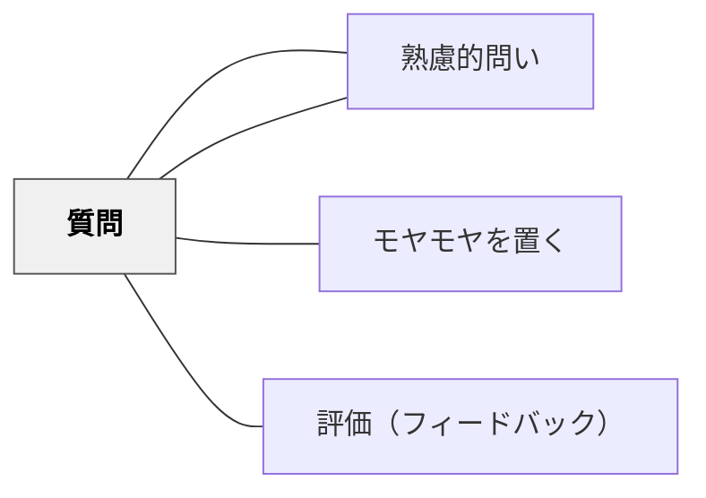

# 質問

> 教材の中に問いを組み込むことで、学習者の思考を促し能動的な関与を生む。

## 背景（Context）

教材の内容要素としての「質問」。教師による口頭の問いだけでなく、テキスト・ワークシート・デジタル教材に埋め込まれた問いも含む。問いの種類（収束型・発散型・メタ認知的）によって学習の深さが変わる。

## 問題（Problem）

問いのない教材は一方的な情報提供になり、学習者が受動的になる。

## 力のかたち（Forces）

- 適切な問いが思考を活性化する
- 問いのタイミングと種類が学習効果を左右する
- 答えを急かす問いは深い思考を妨げる

## 解決（Solution）

**教材の節目に問いを組み込み、学習者が立ち止まって考える機会をつくる。答えを要求する前に、考える余白を設ける。**

## 結果（Consequences）

- 学習者の能動的関与が高まる
- 思考の深さと理解が向上する

## 関連パタン

- [[パタン/熟慮的教材教具]] — 親パタン
- [[パタン/熟慮的問い]] — 問いの設計全般
- [[パタン/モヤモヤを置く]] — 問いとしてのモヤモヤ
- [[パタン/評価（フィードバック）]] — 問いへの応答

## クラスター図

## Actionable Insight

- ワークシートや授業の節目に「ここまで学んで気づいたことは？」「なぜそうなると思う？」という問いを1つ埋め込む——立ち止まって考える機会が能動的な関与と深い理解を生む
- 問いを提示した後に答えを急がず「30秒考える時間」を与える——考える余白があることで思考の深さが変わる
- 収束型・発散型・メタ認知的な問いを組み合わせて教材に配置する——問いの種類を意図的に変えることが学習の多面的な深まりを支える

## 出典

- 鈴木克明（2002）『教材設計マニュアル――独学を支援するために』北大路書房
