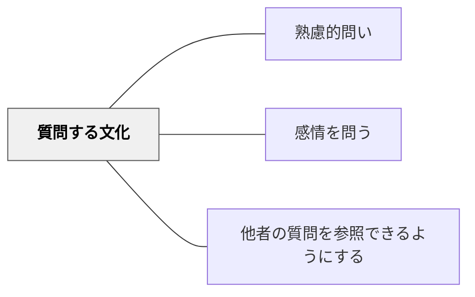

# 質問する文化

> 問うことが当たり前で安心できる学習環境・文化を育てることで、学習者は恐れなく問いを立てられるようになる。

## 背景（Context）
問いを立てるスキルや方法を教えるだけでは十分でない。学習者が実際に問いを立てるかどうかは、「問うことが安全か」という環境的・文化的な条件に大きく左右される。問うことが「知らないことの露呈」や「授業の妨害」と見なされる環境では、最も重要な問いは沈黙の中に消えてしまう。

## 問題（Problem）
問うことへの恐れ——間違いを笑われる、先生に怒られる、時間を取りすぎる——がある環境では、学習者は問いを内側に抱えたまま動けなくなる。表面的には授業が順調に進んでいるように見えても、学習者の疑問は放置される。問いが歓迎されない文化は、探究的学習・主体的学習の土台を崩す。

## 力のかたち（Forces）
- 心理的安全性は、問いを発することの前提条件である
- 教師の反応（問いへの歓迎・賞賛）が文化を形成する最大の要因になる
- 「良い問い」が称賛される文化が問いの質を高める
- 個人で問いにくい学習者も、ペアやグループでなら問いやすいことがある

## 解決（Solution）
「どんな質問でも歓迎する」というメッセージを言葉と行動で示す。学習者の問いを肯定的に受け止め、「良い質問だ」と声に出して認める。問いを書いて提出する（匿名のメモやデジタルツール）など、声に出すことへの不安を回避する仕組みを作る。「今日のベストクエスチョン」を選んで共有するなど、問いを価値あるものとして可視化する。教師自身が「私も分からないことがあります」と問いを発する姿を見せる。

## 結果（Consequences）
- 学習者が問いを持つことを「当然のこと」として内面化し、自発的に問いを立てるようになる
- 多様な疑問や視点が教室に生まれ、学習の豊かさと深さが増す
- 学習者同士が互いの問いを尊重する協働的・探究的な学習文化が醸成される

## 関連パタン
- [[パタン/熟慮的問い]] — 親パタン
- [[パタン/感情を問う]] — 感情的安全性と問う文化は相互に支え合う
- [[パタン/他者の質問を参照できるようにする]] — 問いを共有する文化的実践

## クラスター図

## Actionable Insight

- 学習者が質問したとき「いい質問だ」と口に出して認める習慣をクラス全体に定着させる——問いを歓迎・称賛する教師の反応が「問うことが安全」という文化を形成する
- 匿名で質問を書いて提出する仕組み（付箋・フォームなど）を用意する——声に出すことへの不安を回避する仕組みが問いを持つ全員の参加を促す
- 教師自身が「私も分からないことがあります」と問いを発する姿を見せる——教師の問いが「問うことは誰でもすること」というモデルになり文化の土台を育てる

## 出典
- [[文献/熟慮的問いのパターンリスト（動画記録）]]
