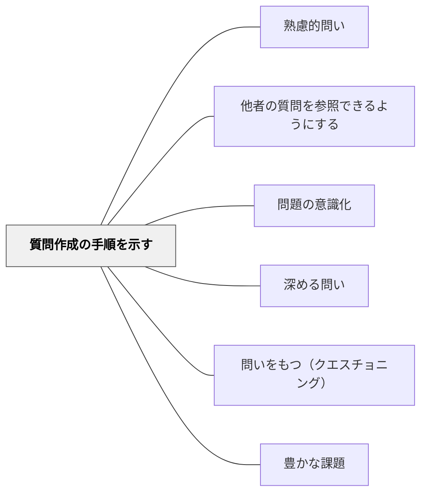

# 質問作成の手順を示す

> 質問語幹リストと手順を提示することで、学習者は自ら質問を生成できるようになる。

## 背景（Context）
「自由に質問してみよう」と言われても、問いを立てることに慣れていない学習者には、何をどう問えばよいか分からず沈黙が続くことがある。質問を作る能力は教えられうるスキルであり、具体的な手順と語幹（スターター）の提示は、その足場として機能する。

## 問題（Problem）
問いを立てる手順が分からない学習者は、問いを作ることを「特別な人にしかできないこと」と感じてしまう。問いを求められてもどこから始めればよいか分からず、表面的な確認質問（「〜ですか？」）しか出てこないことが多い。また、視点や問いの種類のレパートリーが少ないと、一面的な問いにとどまる。

## 力のかたち（Forces）
- 問いを作るスキルには、明示的な足場（語幹・手順）が有効
- 語幹が多様であるほど、異なる視点や深さの問いが生まれやすい
- 手順の提示は自律性を損なうこともあるため、徐々に足場を外す段階的支援が必要
- 問いの量を先に重視し、質は後から育てるアプローチが有効なことが多い

## 解決（Solution）
「いつ・どこで・だれが・なぜ・どのように・もし〜したら・〜と〜の違いは何か」などの質問語幹リストを提示し、学習者が語幹を選んで問いを作る活動を設ける。例えば「この単元について、語幹リストを使って5つ質問を作ってみよう」と指示する。最初は語幹を全て提示し、慣れてきたら語幹なしで問いを作れるよう段階的に支援を外す（スキャフォールディング）。

## 結果（Consequences）
- 問いを作ることへの心理的ハードルが下がり、全員が問いを生成できるようになる
- 多様な語幹を使うことで、問いの種類と深さのレパートリーが広がる
- 問いを作るプロセスが可視化され、「良い問い」について学級で議論できるようになる

## 関連パタン
- [[パタン/熟慮的問い]] — 親パタン
- [[パタン/他者の質問を参照できるようにする]] — 語幹と問いのモデルを組み合わせると効果的
- [[パタン/問題の意識化]] — 問いを作る前段階として何が分からないかを明確にする

- [[パタン/深める問い]] — 質問作成の手順が深い探究の問いを生む
- [[パタン/問いをもつ（クエスチョニング）]] — 質問作成力を育てる上位パタン
- [[パタン/豊かな課題]] — 質問作成プロセスが豊かな課題の骨格になる
- [[メタパタン/足場は消えるために組む（フェードアウト）]] — 質問語幹リストは外すために与える
## クラスター図

## Actionable Insight

- 「いつ・どこで・誰が・なぜ・どのように・もし〜したら」の質問語幹リストを提示し「この単元について5つ質問を作ろう」と指示する——語幹が足場となりすべての学習者が問いを生成できるようになる
- 最初は語幹付きで始め、慣れてきたら語幹なしで問いを作れるよう段階的に足場を外す——スキャフォールディングの段階的削減が自律的な問い生成を育てる
- 学習者が作った問いを「最もよい問いを1つ選んで」共有させる——問いの選択・評価のプロセスが「良い問いとは何か」への気づきを生む

## 出典
- [[文献/熟慮的問いのパターンリスト（動画記録）]]
