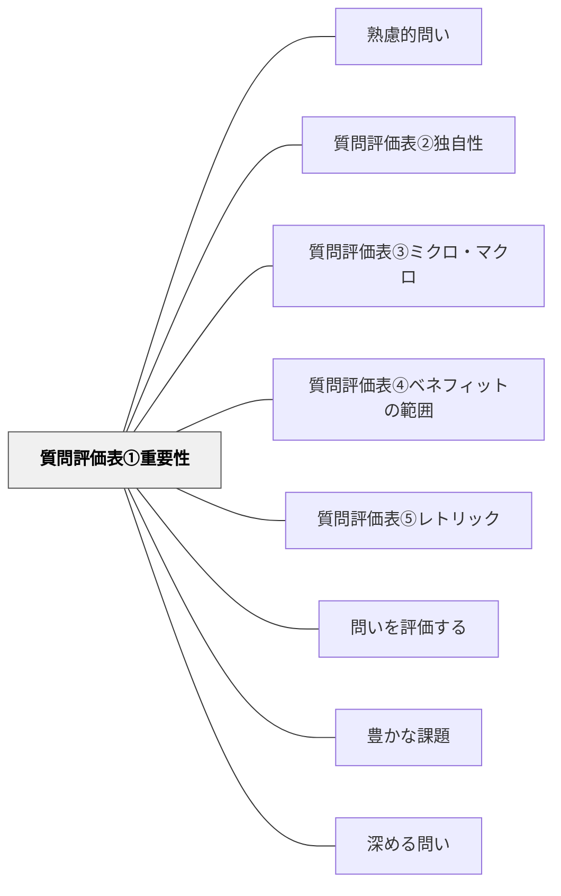

# 質問評価表①重要性

> この問いは、答える価値があるほど重要か・本質的かを問い直す。

## 背景（Context）
問いの設計において、「面白そうな問い」と「本当に重要な問い」は必ずしも一致しない。
質問評価表は、設計した問いを多角的な観点から見直すためのフレームワークである。
第1評価軸「重要性」は、問いが学習・実践・社会にとってどれほど意義深いかを測る。
重要性を問うことで、問いが本質的な課題を捉えているかを確認できる。

## 問題（Problem）
問いを作ること自体に熱中するあまり、その問いが本当に重要かどうかを見失いやすい。
「答えが出ても誰も得しない問い」や「表面的な疑問に留まる問い」は、探究のエネルギーを無駄にする。
重要性を評価する観点がないと、問いの取捨選択ができない。

## 力のかたち（Forces）
- 重要性は「誰にとって」によって変わる。学習者・教師・社会によって重要性の基準が異なる。
- あまりに自明な問いは重要性が低く、あまりに難解な問いは答えにたどり着けない。
- 重要性と興味関心は相関することも多いが、必ずしも一致しない。
- 時代・文脈によって重要性の評価は変わるため、固定的な基準だけでは測れない。

## 解決（Solution）
「この問いに答えることで、誰にどんな変化・気づき・価値が生まれるか？」を明示する。
「この問いを問わなかった場合、何が失われるか？」という逆説的な問いで重要性を確認する。
重要性を5段階などのスケールで評価し、理由を言語化する習慣をつける。
重要性の低い問いは棄却するか、より本質的な問いへ再構成する。

## 結果（Consequences）
問いの質が向上し、探究・授業・対話に投資するエネルギーが有効に使われる。
「なぜこの問いを問うのか」を説明できるようになり、問いの説得力が増す。
一方、重要性の評価が主観的になりやすいため、複数の視点から評価することが望ましい。

## 関連パタン
- [[パタン/熟慮的問い]] — 親パタン
- [[パタン/質問評価表②独自性]] — 重要性と並ぶ評価軸
- [[パタン/質問評価表③ミクロ・マクロ]] — 問いのスケールを評価する軸
- [[パタン/質問評価表④ベネフィットの範囲]] — 問いの利益・価値の広がりを評価する軸
- [[パタン/質問評価表⑤レトリック]] — 問いの修辞的強さを評価する軸
- [[パタン/問いを評価する]] — 質問評価表の上位パタン
- [[パタン/豊かな課題]] — 評価基準を満たす問いが豊かな課題の核心をつくる
- [[パタン/深める問い]] — 質の高い問いを育てる上位パタン

## クラスター図

## Actionable Insight

- 問いを設計したら「この問いに答えると誰にどんな変化・価値が生まれるか？」を1文で書く——重要性の言語化が問いを磨く起点となる
- 「この問いを問わなかったら何が失われるか？」という逆説的な問いで重要性を確認する——失われるものの大きさが問いの重要性の別の測り方になる
- 重要性が低いと感じた問いは棄却するか「より本質的な問いは何か？」に問い直す——問いの取捨選択の習慣が探究のエネルギーを有効に使えるようにする

## 出典
- [[文献/熟慮的問いのパターンリスト（動画記録）]]
