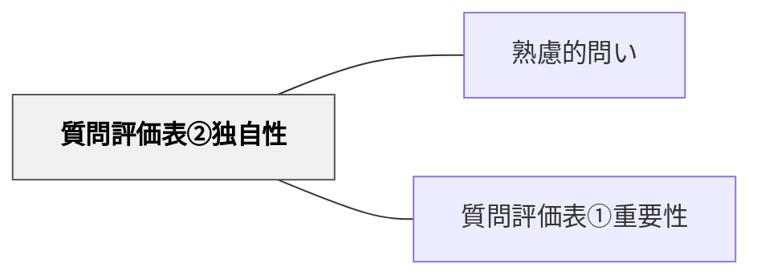

# 質問評価表②独自性

> 意外性・新鮮さ・ユニークさがあるかで、問いの刺激力を評価する。

## 背景（Context）
問いが重要であっても、すでに誰もが知っていることを問うだけでは探究が深まらない。
質問評価表の第2軸「独自性」は、問いが持つ新鮮さ・驚き・ユニークさを評価する。
独自性の高い問いは、聞いた瞬間に「あ、そういう見方があるのか」という感覚を呼び起こす。
教育の文脈では、独自性は学習者の好奇心と内発的動機を刺激する重要な要因となる。

## 問題（Problem）
「よくある問い」ばかりでは、学習者の思考が活性化されない。
「〇〇とは何か？」のような定番の問いは重要でも、それだけでは新鮮な探究を生まない。
独自性を意識しないと、問いが教科書の目次と変わらなくなる。

## 力のかたち（Forces）
- 独自性は「誰も問いたことがない」という絶対的な新しさだけでなく、「その文脈では意外」という相対的な新鮮さでもよい。
- 独自性が高すぎると、聴衆が問いの意味を理解できなくなる。
- 独自性と重要性のバランスが崩れると、「面白いが軽い問い」や「重要だが退屈な問い」になる。
- 既存の問いをひねる・組み合わせる・逆にするだけでも独自性が生まれる。

## 解決（Solution）
「この問いは、一般的に想定されない角度から物事を見ているか？」を自問する。
既存の似た問いと並べて、「何が違うか」「どこがユニークか」を言語化する。
逆転・比較・視点変換などの操作を加えて問いに独自性を付与する。
独自性を5段階で評価し、低い場合は問いを再設計する。

## 結果（Consequences）
独自性の高い問いは学習者の注意を引きつけ、探究への参加意欲を高める。
「なるほど、そういう問い方があるのか」という感覚が生まれると、思考の枠組み自体が広がる。
一方、独自性を追求しすぎると問いが難解になり、アクセスしにくくなるリスクがある。

## 関連パタン
- [[パタン/熟慮的問い]] — 親パタン
- [[パタン/質問評価表①重要性]] — 独自性と並ぶ評価軸

## クラスター図

## Actionable Insight

- 設計した問いを教科書の目次や問い集と並べて「どこが違うか」を確認する——差異の言語化が問いの独自性を意識させる
- 問いに「逆転・比較・視点変換」の操作を加えて別バージョンを作り、どちらが新鮮かを比べる——変形操作が独自性を付与する具体的な手段になる
- 「この問いを見て誰かが『あ、そういう見方があるのか』と感じるか？」を自問する——意外性の感覚が独自性評価の直感的な基準になる

## 出典
- [[文献/熟慮的問いのパターンリスト（動画記録）]]
