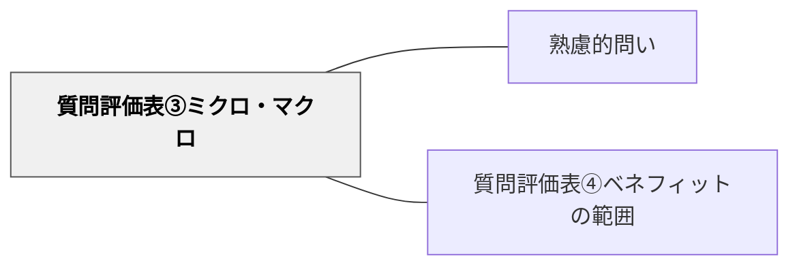

# 質問評価表③ミクロ・マクロ

> 問いの視野のスケールが、目的に対して適切かを評価する。

## 背景（Context）
問いには「細部を扱うミクロな問い」と「全体を俯瞰するマクロな問い」がある。
どちらが良い・悪いということはなく、目的や文脈に応じて適切なスケールが異なる。
質問評価表の第3軸「ミクロ・マクロ」は、問いのスケール感の適切さを評価する。
スケールがずれた問いは、探究が表面的になったり、逆に焦点を失ったりする。

## 問題（Problem）
ミクロすぎる問いは個別事例に閉じてしまい、一般化・応用が難しくなる。
マクロすぎる問いは漠然として、具体的な探究のとっかかりを見つけにくい。
問いの設計者が無意識のうちに特定のスケールに偏ることが多い。

## 力のかたち（Forces）
- 深い理解にはミクロとマクロの両方が必要であり、どちらかに偏ると片面的になる。
- 学習者の発達段階・経験によって、適切なスケールは変わる。
- ミクロな問いとマクロな問いを往来させると思考が豊かになる。
- 問いのスケールは、探究の方法論（実験・フィールドワーク・文献調査など）とも連動する。

## 解決（Solution）
設計した問いを「ミクロ↔マクロ」の軸に位置づけ、目的との整合性を確認する。
「この問いの答えは、より大きな文脈にどうつながるか？」（ミクロ→マクロ）を問う。
「この問いの答えを得るために、どんな具体的な事例を見ればよいか？」（マクロ→ミクロ）を問う。
必要に応じてスケールを調整し、ミクロとマクロをつなぐ問いの連鎖を設計する。

## 結果（Consequences）
問いのスケール感が目的と一致することで、探究の深さと広さのバランスが取れる。
ミクロ・マクロの往来を意識することで、思考の柔軟性が育まれる。
一方、スケールの判断は難しく、評価者の視点によって「適切なスケール」の認識が異なることがある。

## 関連パタン
- [[パタン/熟慮的問い]] — 親パタン
- [[パタン/質問評価表④ベネフィットの範囲]] — スケールと関連する評価軸

## クラスター図

## Actionable Insight

- 学習者の問いを「これはクローズアップ（ミクロ）な問いか、俯瞰（マクロ）な問いか？」と分類させる——スケールへの意識化が問いの設計精度を高める
- ミクロな問いには「この答えはより大きな問いにどうつながるか？」と問い返す——個別から全体へのつながりが問いの視野を広げる
- マクロな問いには「探究を始めるためにどんな具体的な事例を見ればよいか？」と問い返す——大きな問いを具体的な探究の入り口に変換することで調査が進みやすくなる

## 出典
- [[文献/熟慮的問いのパターンリスト（動画記録）]]
