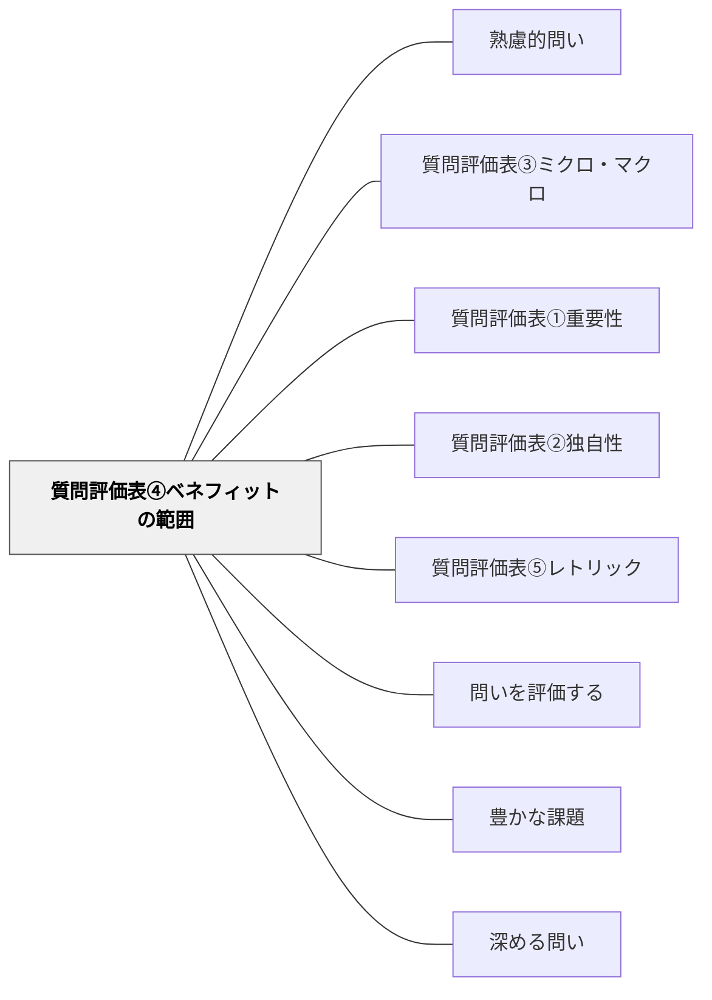

# 質問評価表④ベネフィットの範囲

> この問いは誰にどんな益・価値をもたらすかを評価する。

## 背景（Context）
問いに答えることで生まれる恩恵（ベネフィット）の範囲は、問いの社会的価値を決める。
質問評価表の第4軸「ベネフィットの範囲」は、問いへの答えが誰に・どの程度広く役立つかを問う。
個人的な関心に留まる問いと、クラス・学校・社会全体に関わる問いでは、価値の広がりが異なる。
教育的な問いは、学習者だけでなく教師・保護者・地域社会にも影響を与えうる。

## 問題（Problem）
問いの設計者が自分の関心に偏り、恩恵の受益者が極めて限定的になることがある。
逆に「全人類に関わる問い」を設定しすぎると、誰のためのものかが曖昧になる。
ベネフィットの範囲を意識しないと、問いの意義づけが難しくなる。

## 力のかたち（Forces）
- 恩恵の範囲が広いほど問いの社会的意義は高まるが、具体性が失われやすい。
- 恩恵の範囲が狭くても、深くその人に届く問いには大きな価値がある。
- ベネフィットは知識・スキル・意識変容・関係性の変化など多様な形をとる。
- 直接的な受益者と間接的な受益者を区別して考えることで評価が精緻になる。

## 解決（Solution）
「この問いに答えることで、誰がどんな恩恵を受けるか？」を具体的に書き出す。
受益者を「個人→グループ→組織→社会」の同心円で整理する。
恩恵の種類（知識・態度・行動・関係性など）も合わせて言語化する。
ベネフィットの範囲が狭すぎる場合は、問いを一段抽象化・汎化することを検討する。

## 結果（Consequences）
問いの社会的意義が明確になり、探究を外部に説明・正当化しやすくなる。
受益者を意識することで、問いの設計がより利他的・公共的な方向に向かう。
一方、ベネフィットの評価は将来的なものも含むため、不確実性が残ることを認識しておく必要がある。

## 関連パタン
- [[パタン/熟慮的問い]] — 親パタン
- [[パタン/質問評価表③ミクロ・マクロ]] — 範囲のスケールに関連する評価軸
- [[パタン/質問評価表①重要性]] — 問いの重要性を評価する軸
- [[パタン/質問評価表②独自性]] — 問いの独自性を評価する軸
- [[パタン/質問評価表⑤レトリック]] — 問いの修辞的強さを評価する軸
- [[パタン/問いを評価する]] — 質問評価表の上位パタン
- [[パタン/豊かな課題]] — 評価基準を満たす問いが豊かな課題の核心をつくる
- [[パタン/深める問い]] — 質の高い問いを育てる上位パタン

## クラスター図

## Actionable Insight

- 学習者が設計した問いに「この問いに答えることで、誰が恩恵を受けるか？」と問い返す——受益者を意識することで問いの社会的意義が明確になる
- 問いの受益者を「個人→グループ→学校→社会」の同心円で位置づけさせる——スケールの可視化が問いをより公共的・利他的な方向に洗練させる
- 「もっと多くの人に役立つ問いにするとしたら、どう変える？」と一段抽象化を促す——問いの射程を広げることが探究の社会的意義の深まりにつながる

## 出典
- [[文献/熟慮的問いのパターンリスト（動画記録）]]
